# TextffCut 基本設計書 v2.0

## 1. はじめに

### 1.1 文書の目的
本文書は、TextffCut要件定義書に基づき、システムの基本的な設計方針と処理の流れを定義します。実装に依存しない概念レベルでの設計を示し、開発チーム全体で共通の理解を持つことを目的とします。

### 1.2 対象読者
- プロジェクトマネージャー
- システムアーキテクト
- 開発者
- テストエンジニア

### 1.3 参照文書
- TextffCut要件定義書

## 2. システム概要

### 2.1 システムの全体像

TextffCutは、YouTube動画のダウンロードから文字起こし、切り抜きを効率化するWebアプリケーションです。長時間動画から必要な部分を効率的に抽出し、無音部分を自動削除してタイトな編集素材を作成します。

#### 入力
- **YouTube URL**: 動画URLの直接入力
- **動画ファイル**: MP4、MOV、AVI、MKV、WebM形式
- **編集テキスト**: 切り抜き対象を指定するテキスト
- **処理設定**: 文字起こし設定、無音検出パラメータ、エクスポート設定

#### 処理
1. **動画取得**: YouTube URLからの動画ダウンロード
2. **文字起こし**: 音声認識エンジンによる単語レベルの精密なタイムスタンプ生成（GPU対応により高速処理可能）
3. **テキスト編集**: diffライクなUIでの直感的な編集
4. **タイムライン編集**: リアルタイム波形表示と6段階調整ボタンによるミリ秒精度の精密な調整
5. **動画処理**: 無音削除、セグメント抽出、結合
6. **エクスポート**: 各種形式での出力

#### 出力
- **編集済み動画**: MP4形式（切り抜きのみ/無音削除付き）
- **プロジェクトファイル**: FCPXML、Premiere XML
- **字幕ファイル**: SRT形式
- **キャッシュデータ**: 文字起こし結果の永続保存

### 2.2 システム構成

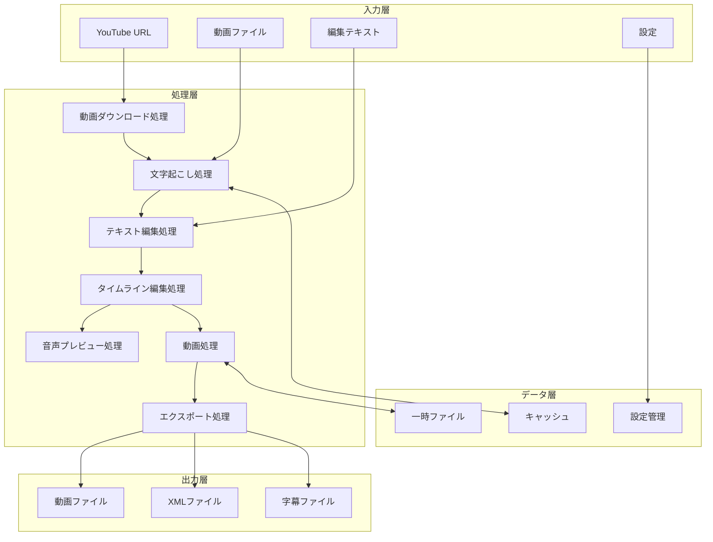

## 3. 処理フロー設計

### 3.1 メイン処理フロー

```mermaid
flowchart TD
    Start([開始]) --> FileSelect[動画ファイル選択画面]
    
    %% 動画ファイル選択画面でのオプション
    FileSelect --> SelectMethod{選択方法}
    SelectMethod -->|既存ファイル| LocalFile[ローカルファイル選択]
    SelectMethod -->|YouTubeから取得| URLInput[YouTube URL入力]
    
    %% YouTube ダウンロードは独立した処理
    URLInput --> Download[動画ダウンロード]
    Download --> SaveLocal[ローカルフォルダに保存]
    SaveLocal --> LocalFile
    
    %% メインフロー継続
    LocalFile --> CacheCheck{キャッシュ<br/>存在？}
    
    CacheCheck -->|Yes| CacheUse{キャッシュを<br/>使用する？}
    CacheCheck -->|No| TransSettings[文字起こし設定]
    
    CacheUse -->|Yes| LoadCache[キャッシュ読込]
    CacheUse -->|No| TransSettings
    
    TransSettings --> TransMode{処理方式}
    TransMode -->|API| CostEstimate[料金見積もり表示]
    TransMode -->|ローカル| LocalTrans[ローカル文字起こし]
    
    CostEstimate --> CostConfirm{料金確認}
    CostConfirm -->|続行| APITrans[API文字起こし]
    CostConfirm -->|キャンセル| TransSettings
    
    APITrans --> Alignment[アライメント処理]
    LocalTrans --> Alignment[アライメント処理]
    Alignment --> SaveCache[キャッシュ保存]
    LoadCache --> EditText[テキスト編集]
    SaveCache --> EditText
    
    EditText --> DiffDetect[差分検出]
    DiffDetect --> TimeRange[時間範囲計算]
    
    %% タイムライン編集はオプショナル
    TimeRange --> TimelineDecision{タイムライン<br/>編集する？}
    TimelineDecision -->|Yes| Timeline[タイムライン編集]
    TimelineDecision -->|No| ProcessOpt
    
    Timeline --> Preview{音声プレビュー}
    Preview -->|確認| Timeline
    Preview -->|完了| ProcessOpt[処理オプション]
    
    ProcessOpt --> SilenceOpt{無音削除？}
    
    SilenceOpt -->|Yes| SilenceDetect[無音検出]
    SilenceOpt -->|No| ExportSelect
    
    SilenceDetect --> SegmentAdjust[セグメント調整]
    SegmentAdjust --> ExportSelect{出力形式}
    
    ExportSelect -->|動画| VideoExport[動画出力]
    ExportSelect -->|FCPXML| FCPXMLExport[FCPXML出力]
    ExportSelect -->|Premiere| PremiereExport[Premiere XML出力]
    ExportSelect -->|字幕| SRTExport[SRT出力]
    
    VideoExport --> End([完了])
    FCPXMLExport --> End
    PremiereExport --> End
    SRTExport --> End
```

### 3.2 動画取得処理

#### 3.2.1 YouTube動画ダウンロード（独立処理）

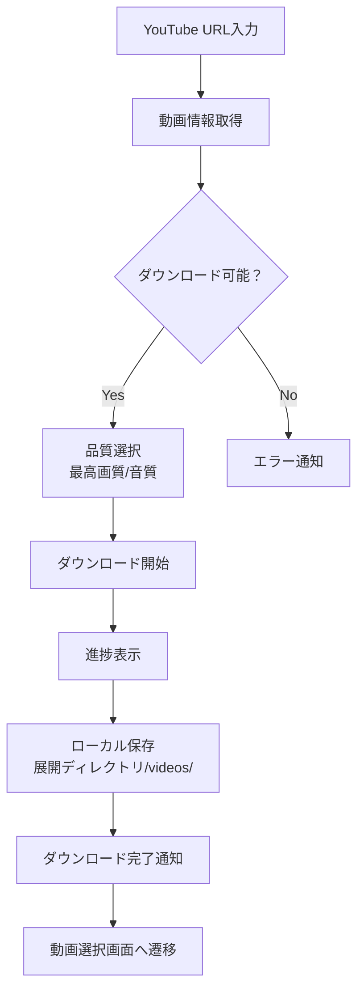

**処理方針：**
- **独立した前処理として実行**：ダウンロード完了後、通常のローカルファイル処理フローへ移行
- URLから動画情報を取得し、利用可能な品質を確認
- 最適な品質（画質・音質）を自動選択
- ダウンロード進捗をリアルタイム表示
- アプリケーション展開ディレクトリ内のvideosフォルダに保存
- ダウンロード完了後、自動的にローカルファイル選択画面に遷移

### 3.3 文字起こし処理

#### 3.2.1 音声抽出処理

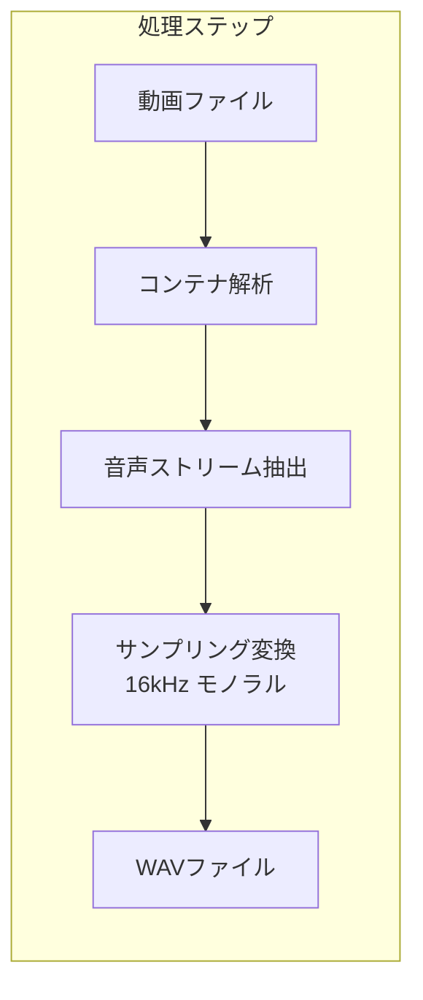

**処理方針：**
- 動画ファイルから音声トラックを識別・抽出
- 音声認識に最適な形式（16kHz、モノラル、PCM）に変換
- 品質劣化を最小限に抑える

#### 3.2.2 並列文字起こし処理

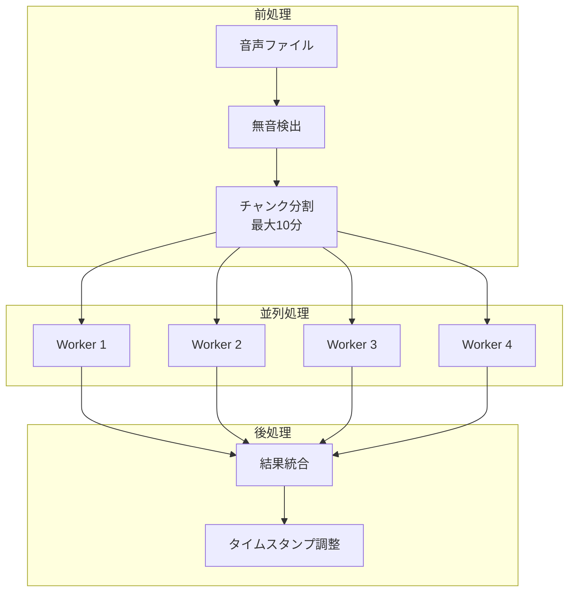

**処理方針：**
- 無音部分で自然に分割し、文字起こし精度を向上
- 最大4ワーカーでの並列処理により高速化
- チャンク境界でのタイムスタンプの整合性を保証

#### 3.2.3 アライメント処理

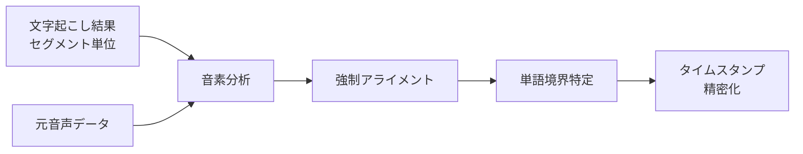

**処理方針：**
- **ローカル版・API版共通**：単語レベルのアライメント処理を実行
- ローカル版：音声認識結果に対してアライメント処理
- API版：セグメント単位の結果を単語レベルに精密化
- 音素分析による正確な単語境界の特定
- 前後の文脈を考慮した調整

### 3.4 テキスト編集処理

#### 3.4.1 差分検出処理

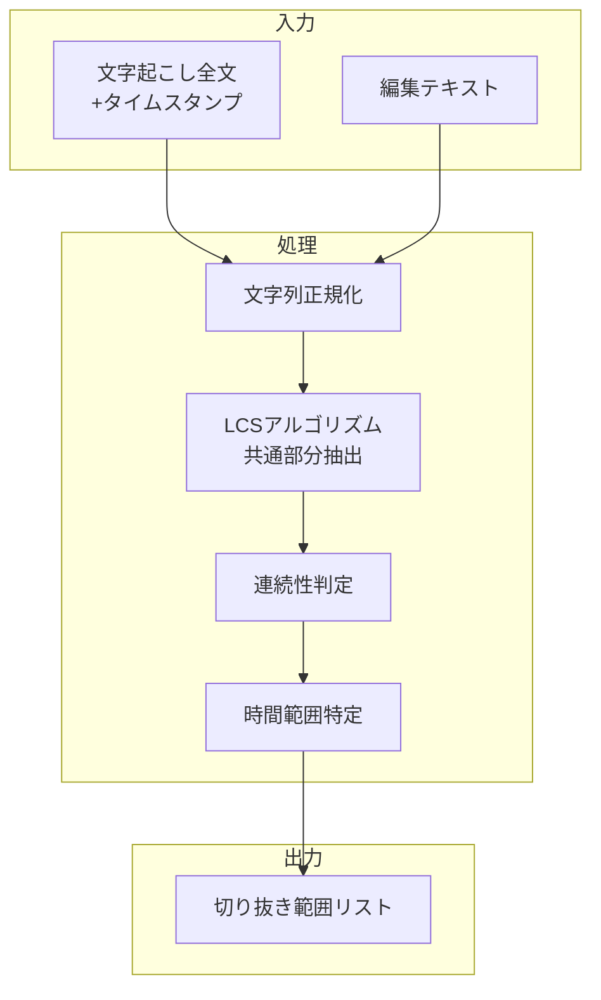

**処理方針：**

1. **文字列の正規化**
   - 全角・半角の統一（数字、英字、記号）
   - 空白文字の統一（全角スペース→半角スペース、連続スペース→単一スペース）
   - 改行コードの除去または統一
   - 句読点の表記揺れ吸収（。．、，など）

2. **共通部分の抽出（LCSアルゴリズム）**
   - 文字起こし全文と編集テキストの最長共通部分列を検出
   - 完全一致する連続した文字列を識別
   - 部分一致の場合は閾値（例：80%以上の一致率）で判定

3. **連続性の判定**
   - 検出された共通部分が時系列的に連続しているか確認
   - 飛び飛びの部分は別セグメントとして分割
   - 短すぎる断片（例：3文字未満）は除外

4. **時間範囲の特定**
   - 各共通部分の開始文字と終了文字の位置を特定
   - 単語レベルのタイムスタンプから対応する時間を取得
   - 開始時刻は最初の単語の開始時刻、終了時刻は最後の単語の終了時刻

**処理例：**
```
文字起こし全文（タイムスタンプ付き）:
"今日は[0.5-1.0] とても[1.0-1.5] いい[1.5-2.0] 天気[2.0-2.5] です[2.5-3.0]。
明日は[5.0-5.5] 雨が[5.5-6.0] 降る[6.0-6.5] かも[6.5-7.0]"

編集テキスト:
"とてもいい天気です"

処理結果:
- 正規化後マッチング: "とてもいい天気です"
- 時間範囲: 1.0秒 - 3.0秒
- 切り抜き範囲リスト: [{start: 1.0, end: 3.0}]
```

### 3.5 動画処理

#### 3.5.1 無音削除処理

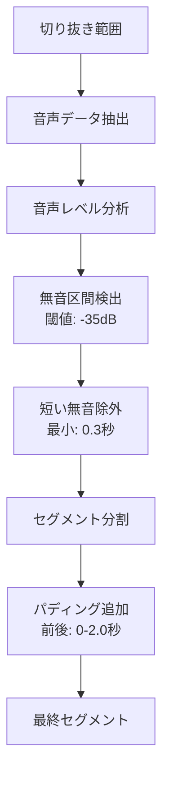

**処理方針：**
- 指定範囲の音声のみを処理（効率化）
- 閾値以下の音声レベルが継続する区間を無音と判定
- 短すぎるセグメントは前後と結合
- パディングにより自然な切り替わりを実現

#### 3.5.2 動画結合処理

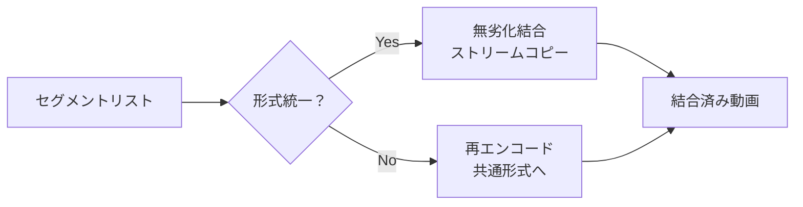

**処理方針：**
- 形式が統一されている場合は無劣化・高速結合
- 形式が異なる場合のみ再エンコード
- メタデータの適切な処理

### 3.6 UIセクション表示制御

#### 3.6.1 セクション表示フロー

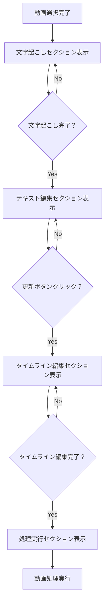

**セクション表示条件：**
1. **文字起こしセクション**: 常時表示
2. **テキスト編集セクション**: `transcription_result`が存在する場合
3. **タイムライン編集セクション**: `show_timeline_section`がTrueの場合（インライン表示）
4. **処理実行セクション**: `timeline_completed`がTrueの場合（タイムライン編集完了後）

**タイムライン編集の特徴：**
- インライン表示のため、キャンセル操作は不要
- 編集を中止したい場合は、単に「編集を完了」ボタンを押さない
- リセットボタンで初期状態に戻すことが可能

**セッション状態管理：**
```python
# セクション表示制御
st.session_state.show_timeline_section  # タイムライン編集セクション表示フラグ
st.session_state.timeline_completed     # タイムライン編集完了フラグ
st.session_state.time_ranges_calculated # 時間範囲計算済みフラグ
st.session_state.adjusted_time_ranges  # タイムライン編集で調整された時間範囲

# タイムライン編集結果の保持
# 処理オプション（切り抜きのみ/無音削除、出力形式等）の変更は
# タイムライン編集結果に影響しないため、リセットしない
```

### 3.7 タイムライン編集処理

#### 3.6.1 全体処理フロー

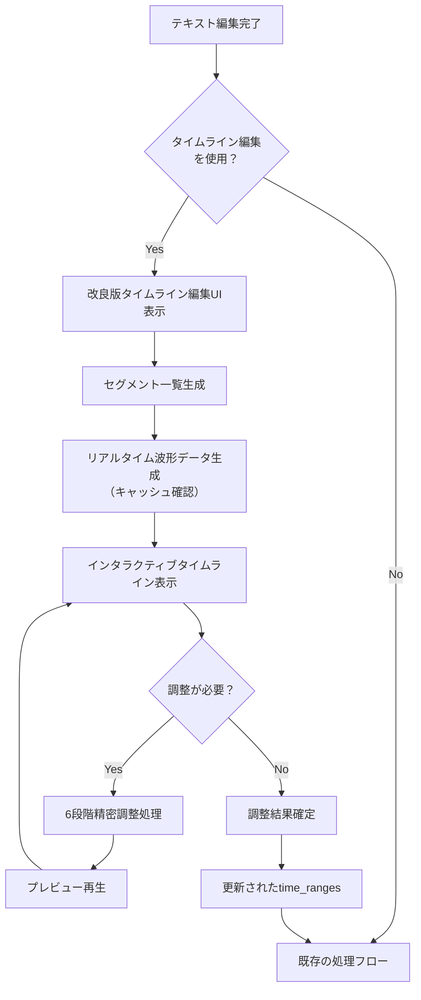

#### 3.6.2 タイムライン表示処理

```mermaid
flowchart TD
    subgraph "入力データ"
        A1[time_ranges<br/>[(start, end), ...]]
        A2[transcription_result]
        A3[video_path]
    end
    
    subgraph "データ変換"
        B1[TimelineSegment生成]
        B2[対応テキスト抽出]
        B3[波形データ取得]
    end
    
    subgraph "UI表示"
        C1[全体タイムライン<br/>（俯瞰図）]
        C2[セグメント一覧<br/>（リスト表示）]
        C3[選択セグメント詳細<br/>（波形付き）]
    end
    
    A1 & A2 & A3 --> B1 & B2 & B3
    B1 & B2 & B3 --> C1 & C2 & C3
```

**処理方針：**
- 既存のtime_rangesを基にTimelineSegmentオブジェクトを生成
- 各セグメントに対応するテキストを文字起こし結果から抽出
- 波形データはキャッシュを優先し、なければ生成
- 3つのビューで多角的に表示（全体俯瞰、リスト、詳細）

#### 3.6.3 波形データ生成処理

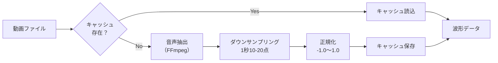

**処理方針：**
- 低解像度（1秒あたり10-20サンプル）で十分
- 大きなファイルでも高速処理可能
- キャッシュにより2回目以降は即座に表示

#### 3.6.4 微調整機能

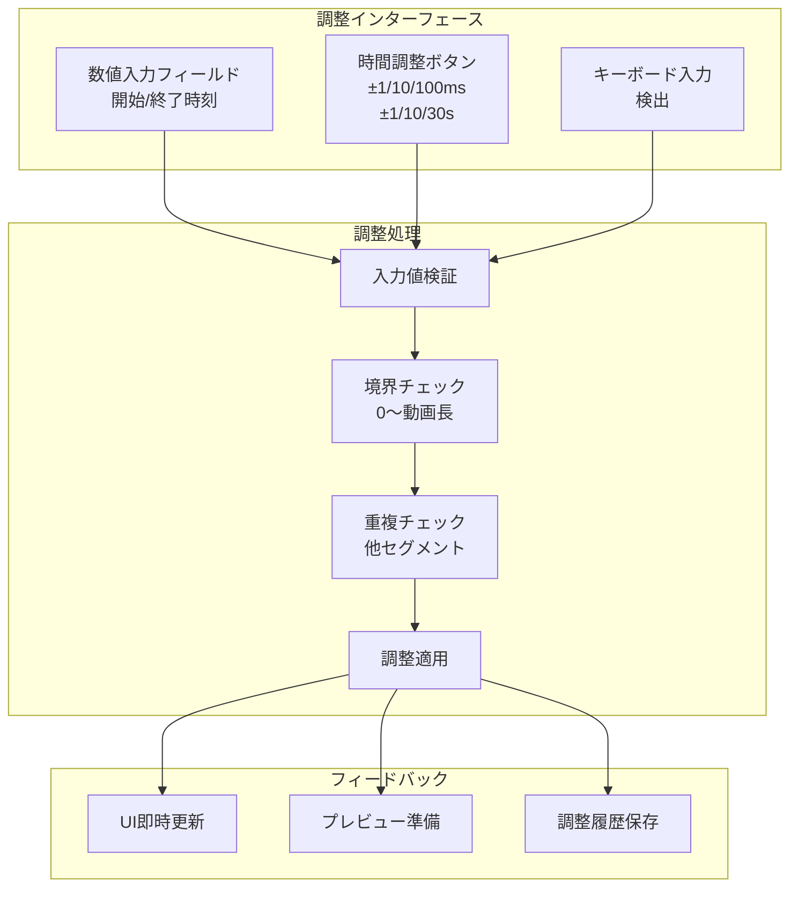

**処理方針：**
- 3種類の調整方法を提供（数値、ボタン、キーボード）
- 6段階の精密調整（±1/10/100ms、±1/10/30s）
- リアルタイムで境界チェックと重複チェック
- 調整結果は即座にUIに反映
- Undo/Redo用に調整履歴を保持

#### 3.6.5 プレビュー再生処理

```mermaid
flowchart LR
    A[選択セグメント] --> B[音声範囲抽出<br/>FFmpeg]
    B --> C[一時ファイル生成<br/>MP3/AAC]
    C --> D[HTML5 Audio<br/>要素生成]
    D --> E[Streamlit<br/>st.audio()]
    E --> F[再生制御<br/>開始/停止/速度]
```

**処理方針：**
- 選択範囲のみの音声を抽出（軽量化）
- HTML5 Audioで再生（Streamlit標準機能）
- 再生速度調整可能（1.0x/1.5x/2.0x）

### 3.7 音声プレビュー処理

#### 3.7.1 高速再生機能

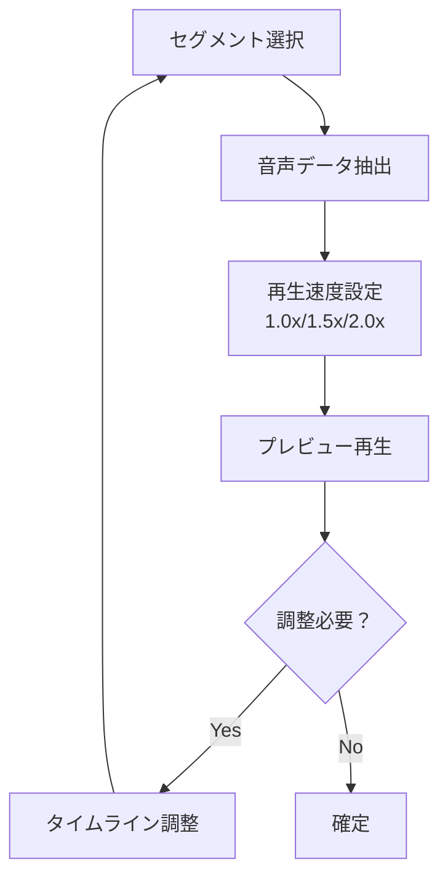

**処理方針：**
- 切り抜き箇所の音声を高速再生で確認
- 再生速度を調整可能（1.0倍、1.5倍、2.0倍）
- プレビュー結果に基づいて即座に調整
- ループ再生機能で繰り返し確認

### 3.8 エクスポート処理

#### 3.8.1 FCPXML生成

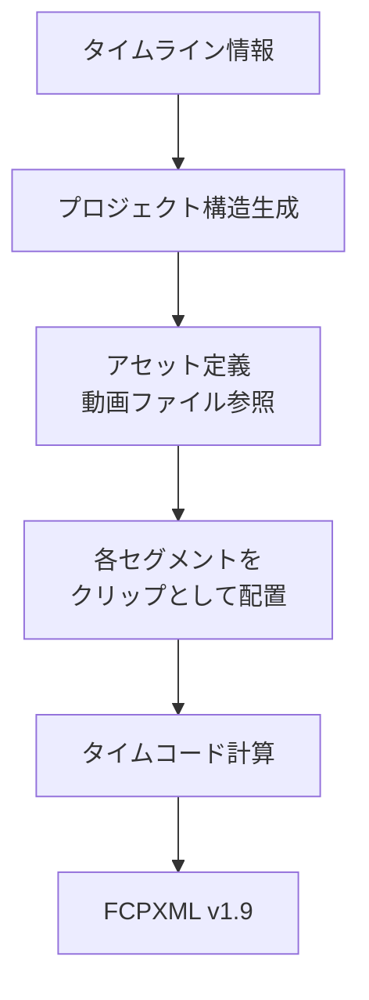

**処理方針：**
- 動画ファイルを単一アセットとして定義
- 各クリップから同じアセットを参照（重複回避）
- フレーム単位の正確なタイムコード

#### 3.8.2 字幕生成

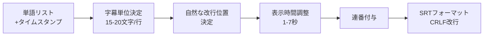

**処理方針：**
- 読みやすい文字数での分割
- 適切な表示時間の確保
- 文の区切りを考慮した改行（日本語禁則処理対応）
- **単語境界を考慮した自然な改行（形態素解析の活用）**
- **単語レベルのタイムスタンプを活用した正確なタイミング**
- **DaVinci Resolve互換性（CRLF改行、`<b>`タグ）**

**改行処理の詳細：**
1. **即時対応（Phase 1）**
   - 助詞（は、が、を、に、で、と、も）での優先分割
   - 最小文字数制約（3文字以上）
   - 前方向のみの探索（1行あたりの文字数を最優先）

2. **中期対応（Phase 2）**
   - 形態素解析による単語境界の認識
   - 一般的な単語（曜日、ございます等）の分割防止

**タイミング処理の詳細：**
1. **現在の問題**
   - テキスト分割後に時間を均等配分（不自然）
   - 単語レベルのタイムスタンプが未活用

2. **改善方針**
   - WhisperXが提供する単語タイムスタンプを直接使用
   - 改行位置決定後、対応する単語の時間範囲を字幕時間に設定
   - 最小表示時間（1秒）の保証

**設計思想：**
- 字幕は文字起こしで得たタイムスタンプを基準に生成
- 動画のクリップ数と字幕数は独立（一致は不要）
- 字幕全体が動画全体の時間範囲内に収まることが重要
- 無音削除時は時間マッピングにより字幕位置を適切に調整

**自然なSRTエントリ分割（Phase 2b）：**
1. **無音位置ベースの分割**
   - 無音削除により分かれたセグメントを独立したSRTエントリとして扱う
   - 例：「6月5日の木曜日かな｜木曜日｜はい8時でございます」（｜は無音位置）

2. **意味的な分割ルール**
   - 終助詞（かな、ね、よ等）の後で優先的に分割
   - 同じ単語の繰り返しは独立したセグメントとして扱う
   - 応答詞（はい、ええ、うん等）の前で分割

3. **ハイブリッドアプローチ**
   - 無音位置での物理的な分割を優先
   - 各セグメント内で意味的な調整を加える
   - 単語タイムスタンプを活用して正確なタイミングを維持

## 4. データ設計

### 4.1 主要データ構造

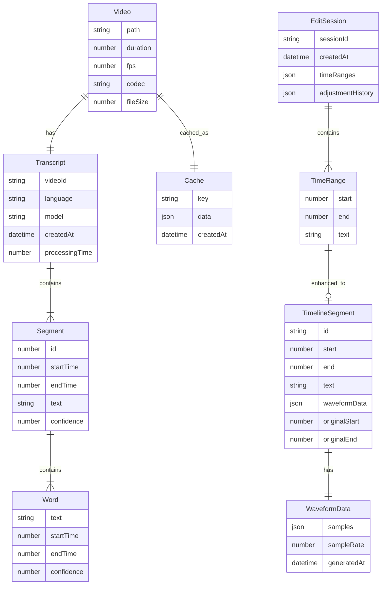

### 4.2 ファイル構成

```
TextffCut/
├── videos/                    # 入力動画ファイル
├── cache/                     # キャッシュデータ
│   └── {video_hash}/
│       ├── transcription.json # 文字起こし結果
│       └── metadata.json      # 動画メタデータ
├── temp/                      # 一時ファイル
│   ├── audio/                 # 音声ファイル
│   ├── segments/              # 動画セグメント
│   ├── waveforms/             # 波形データキャッシュ
│   └── previews/              # プレビュー音声
├── output/                    # 出力ファイル
│   ├── {name}_edited.mp4      # 編集済み動画
│   ├── {name}.fcpxml          # FCPXML
│   └── {name}.srt             # 字幕
└── config/                    # 設定ファイル
    ├── user_settings.json     # ユーザー設定
    └── api_keys.encrypted     # 暗号化APIキー
```

## 5. インターフェース設計

### 5.1 画面構成

#### アプリケーション全体構造

```
TextffCut アプリケーション
├── ヘッダーエリア
│   └── アプリケーションタイトル "TextffCut"
├── メインコンテナ
│   ├── サイドバー (幅: 20%)
│   │   ├── 手順ナビゲーション
│   │   │   ├── 1. 動画選択
│   │   │   ├── 2. 文字起こし
│   │   │   ├── 3. テキスト編集
│   │   │   ├── 4. タイムライン編集（オプション）
│   │   │   └── 5. エクスポート
│   │   └── 設定パネル
│   │       ├── API設定
│   │       ├── 処理設定
│   │       └── 出力設定
│   └── メインエリア (幅: 80%)
│       ├── 作業エリア
│       │   └── [選択した手順により動的に変化]
│       └── ステータスエリア
│           ├── プログレスバー
│           └── ステータスメッセージ
└── フッターエリア（オプション）
```

#### カスタムコンポーネントアーキテクチャ

タイムライン編集機能では、高度なインタラクティブ性を実現するため、Streamlitカスタムコンポーネントを採用：

```
ui/components/timeline/
├── __init__.py              # Pythonインターフェース
├── frontend/
│   ├── main.js             # JavaScriptエントリーポイント
│   ├── index.html          # HTMLテンプレート
│   └── build/              # ビルド成果物
│       └── main.js         # 本番用ビルド
```

**通信フロー：**
1. **Python → JavaScript**: 
   - クリップデータ（時間範囲、波形サンプル）をJSON形式で送信
   - Streamlit Component APIを使用

2. **JavaScript → Python**: 
   - ユーザー操作結果（調整後の時間範囲）を返送
   - `setComponentValue()`でPython側に通知

3. **レンダリング**:
   - Canvas APIを使用した波形描画
   - クリック・ドラッグイベントの処理
   - リアルタイムUI更新

#### レイアウト仕様

| エリア | 幅/高さ | 説明 | 背景色 |
|--------|---------|------|--------|
| ヘッダー | 100% × 60px | アプリケーションタイトル表示 | プライマリカラー |
| サイドバー | 20% × 可変 | ナビゲーションと設定 | 背景より少し暗め |
| メインエリア | 80% × 可変 | 主要な作業領域 | 標準背景色 |
| ステータスエリア | 100% × 80px | 進捗とステータス表示 | 背景と同色 |

### 5.2 画面遷移

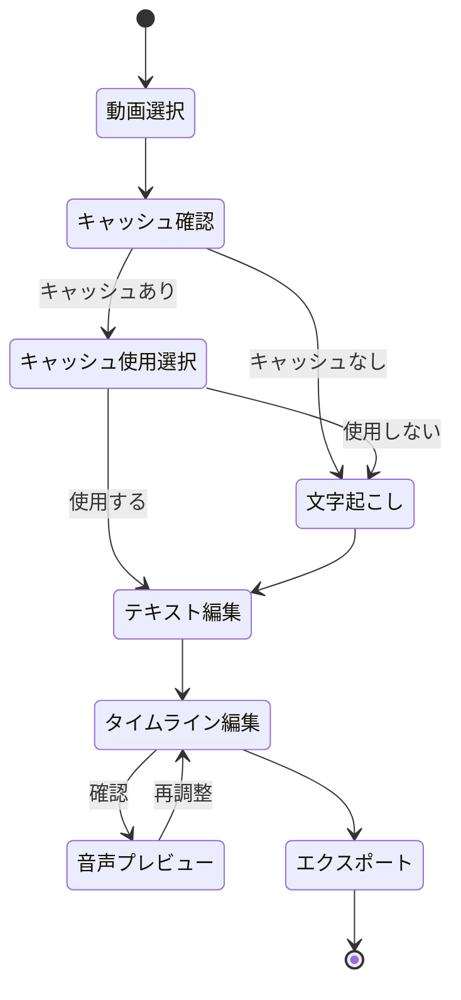

### 5.3 主要画面

#### 5.3.1 動画ファイル選択画面

```
┌─────────────────────────────────────────────────────────────┐
│                      動画ファイル選択                          │
├─────────────────────────────────────────────────────────────┤
│                                                             │
│  処理する動画を選択してください                                │
│                                                             │
│  ┌─────────────────────────────────────────────────────┐   │
│  │ ■ ローカルファイルから選択                           │   │
│  │                                                     │   │
│  │   [動画ファイル選択ドロップダウン▼] [🔄 更新]       │   │
│  │                                                     │   │
│  │   📁 動画フォルダのパス:                            │   │
│  │   [/Users/username/myProject/TextffCut/videos]      │   │
│  │                                                     │   │
│  │   対応形式: MP4, MOV, AVI, MKV, WebM                │   │
│  └─────────────────────────────────────────────────────┘   │
│                                                             │
│                         または                               │
│                                                             │
│  ┌─────────────────────────────────────────────────────┐   │
│  │ ■ YouTubeからダウンロード                           │   │
│  │                                                     │   │
│  │   [https://youtube.com/watch?v=...] [ダウンロード]  │   │
│  │                                                     │   │
│  │   YouTube URLを入力してダウンロード後、              │   │
│  │   自動的に処理を開始します                          │   │
│  └─────────────────────────────────────────────────────┘   │
│                                                             │
│                                              [次へ →]       │
└─────────────────────────────────────────────────────────────┘
```

**UI要素の説明:**
- `[___]`: 入力フィールド
- `[ボタン]`: クリック可能なボタン
- `■`: セクションヘッダー
- 枠線: コンテナやグループの境界
- 動画フォルダのパス: フルパス（絶対パス）で表示

#### 5.3.3 テキスト編集画面

```
┌─────────────────────────────────────────────────────────────┐
│                        テキスト編集                           │
├─────────────────────────┬───────────────────────────────────┤
│     文字起こし結果      │         編集テキスト              │
├─────────────────────────┼───────────────────────────────────┤
│┌───────────────────────┐│┌─────────────────────────────────┐│
││                       │││                                 ││
││  今日はとてもいい天気  │││  とてもいい天気です              ││
││  です。明日は雨が降る  │││                                 ││
││  かもしれません。      │││                                 ││
││                       │││                                 ││
││  ※ハイライト表示対応  │││  ※編集可能エリア                ││
│└───────────────────────┘│└─────────────────────────────────┘│
├─────────────────────────┼───────────────────────────────────┤
│ 文字数: 1,234 時間:12:34│ 文字数: 567  推定: 5:43          │
├─────────────────────────┴───────────────────────────────────┤
│     [差分検出] [プレビュー] [不一致削除]      [次へ →]      │
└─────────────────────────────────────────────────────────────┘
```

**画面仕様詳細**

| コンポーネント | 説明 | 機能 |
|---------------|------|------|
| 文字起こし結果エリア | 読み取り専用のテキスト表示 | • スクロール同期<br>• ハイライト表示<br>• 検索機能 |
| 編集テキストエリア | ユーザーが編集可能なテキストエディタ | • テキスト編集<br>• 元に戻す/やり直し<br>• カット&ペースト |
| ステータスバー | 文字数と時間の表示 | • リアルタイム更新<br>• 推定時間自動計算 |
| アクションボタン | 各種操作ボタン | • 差分検出：変更箇所の特定<br>• プレビュー：音声再生<br>• 不一致削除：存在しない文字の削除 |

#### 5.3.4 タイムライン編集画面（統合波形セレクター）

```
┌─────────────────────────────────────────────────────────────┐
│                    タイムライン編集                          │
├─────────────────────────────────────────────────────────────┤
│ 統合波形セレクター（クリックでセグメント選択）                │
│┌───────────────────────────────────────────────────────────┐│
││                                                           ││
││    ▓▓▓▓▓▓        ▓▓▓▓▓▓▓▓▓▓       ▓▓▓▓▓▓▓        ▓▓▓▓▓ ││
││                                                           ││
││  0:00-1:23      1:30-2:45      3:00-4:12     4:20-5:00  ││
││                                                           ││
││ ※セグメント数に応じて動的にカラムレイアウトを調整           ││
││ ※選択中のセグメントは青色でハイライト表示                  ││
│└───────────────────────────────────────────────────────────┘│
│                                                             │
│ 選択セグメント詳細: セグメント1                             │
│┌───────────────────────────────────────────────────────────┐│
││ 開始時間: [00:00:00.000]      終了時間: [00:01:23.000]   ││
││                                                           ││
││ 時間調整:                                                 ││
││ 開始: [-100ms][-10ms][-1ms][+1ms][+10ms][+100ms]         ││
││      [-30s][-10s][-1s][+1s][+10s][+30s]                  ││
││                                                           ││
││ 終了: [-100ms][-10ms][-1ms][+1ms][+10ms][+100ms]         ││
││      [-30s][-10s][-1s][+1s][+10s][+30s]                  ││
││                                                           ││
││ テキスト: "今日はとてもいい天気です..."                     ││
│└───────────────────────────────────────────────────────────┘│
│                                                             │
│ プレビュー再生                                               │
│┌───────────────────────────────────────────────────────────┐│
││ [▶ このセグメントを再生]  [▶ 全体を再生]                  ││
││ 再生速度: [1.0x ▼]                                        ││
│└───────────────────────────────────────────────────────────┘│
│                                                             │
├─────────────────────────────────────────────────────────────┤
│                              [キャンセル]  [確定]           │
└─────────────────────────────────────────────────────────────┘
```

#### 5.3.2 キャッシュ使用選択画面

```
┌─────────────────────────────────────────────────────────────┐
│                      キャッシュ確認                           │
├─────────────────────────────────────────────────────────────┤
│                                                             │
│      この動画の文字起こし結果が保存されています。               │
│                                                             │
│  ┌─────────────────────────────────────────────────────┐   │
│  │ ファイル:     sample_video.mp4                      │   │
│  │ 作成日時:     2025-06-22 14:30                      │   │
│  │ 使用モデル:   whisper-medium                        │   │
│  │ 言語:         日本語                                │   │
│  │ 処理時間:     15分32秒                              │   │
│  └─────────────────────────────────────────────────────┘   │
│                                                             │
│              キャッシュを使用しますか？                        │
│                                                             │
│       [キャッシュを使用]    [再度文字起こしを実行]             │
│                                                             │
└─────────────────────────────────────────────────────────────┘
```

#### 5.3.3 API料金見積もり画面

```
┌─────────────────────────────────────────────────────────────┐
│                   API使用料金見積もり                         │
├─────────────────────────────────────────────────────────────┤
│                                                             │
│         文字起こしにAPIを使用する場合の料金目安               │
│                                                             │
│  ┌─────────────────────────────────────────────────────┐   │
│  │ 動画情報:                                            │   │
│  │ ・ファイル名: sample_video.mp4                       │   │
│  │ ・動画時間:   90分30秒                              │   │
│  │ ・音声言語:   日本語（自動検出）                      │   │
│  └─────────────────────────────────────────────────────┘   │
│                                                             │
│  ┌─────────────────────────────────────────────────────┐   │
│  │ 料金計算:                                            │   │
│  │ ・API料金:    $0.006/分                              │   │
│  │ ・処理時間:   90.5分                                 │   │
│  │ ・推定料金:   $0.543 (約81円)                        │   │
│  │                                                      │   │
│  │ ※料金は2025年6月時点の情報です                        │   │
│  │ ※為替レート: 1USD = 150円で計算                      │   │
│  └─────────────────────────────────────────────────────┘   │
│                                                             │
│  ⚠️ この料金は目安です。実際の請求額と異なる場合があります。    │
│                                                             │
│         [キャンセル]           [料金を確認して続行]           │
│                                                             │
└─────────────────────────────────────────────────────────────┘
```

#### 5.3.4 テキスト編集画面

```
┌─────────────────────────────────────────────────────────────┐
│                        テキスト編集                           │
├─────────────────────────┬───────────────────────────────────┤
│     文字起こし結果      │         編集テキスト              │
├─────────────────────────┼───────────────────────────────────┤
│┌───────────────────────┐│┌─────────────────────────────────┐│
││                       │││                                 ││
││  今日はとてもいい天気  │││  とてもいい天気です              ││
││  です。明日は雨が降る  │││                                 ││
││  かもしれません。      │││                                 ││
││                       │││                                 ││
││  ※ハイライト表示対応  │││  ※編集可能エリア                ││
│└───────────────────────┘│└─────────────────────────────────┘│
├─────────────────────────┼───────────────────────────────────┤
│ 文字数: 1,234 時間:12:34│ 文字数: 567  推定: 5:43          │
├─────────────────────────┴───────────────────────────────────┤
│     [差分検出] [プレビュー] [不一致削除]      [次へ →]      │
└─────────────────────────────────────────────────────────────┘
```

#### 5.3.5 統合タイムライン編集の特徴

**主要機能:**
1. **統合波形セレクター**: 波形表示とセグメント選択を一体化
2. **動的レイアウト**: セグメント数に応じて自動的に列数を調整（1-8列）
3. **6段階精密調整**: ±1/10/100ms、±1/10/30秒の調整ボタン
4. **個別セグメントプレビュー**: 選択中のセグメントのみを再生
5. **全体プレビュー**: 調整後の全セグメントを通しで再生
6. **シンプルなUI**: 重複情報を排除し、必要な情報のみ表示

**セグメント数に応じたレイアウト:**
- 1-4個: 1行4列
- 5-8個: 2行4列
- 9-12個: 3行4列
- 13個以上: 必要に応じて行を追加

**波形表示の特徴:**
- シミュレートされた波形データを使用（実音声データが不要）
- 選択中のセグメントは青色でハイライト
- 各セグメントの時間範囲を明確に表示
│        開始時間: [00:00:00.000]  終了時間: [00:01:23.000]   │
│                                                             │
│ フレーム調整:                                               │
│   [◀◀ -30f] [◀ -5f] [◀ -1f] [▶ +1f] [▶ +5f] [▶▶ +30f]  │
│                                                             │
├─────────────────────────────────────────────────────────────┤
│ [プレビュー再生]  速度: [1.0x ▼]  [ループ]  [停止]         │
│                                                             │
│ ショートカット: ←/→(±1f) Shift+←/→(±5f) Ctrl+←/→(±30f)  │
├─────────────────────────────────────────────────────────────┤
│                                    [← 戻る]  [次へ →]       │
└─────────────────────────────────────────────────────────────┘
```

#### 5.3.6 エクスポート設定画面

```
┌─────────────────────────────────────────────────────────────┐
│                      エクスポート設定                         │
├─────────────────────────────────────────────────────────────┤
│                                                             │
│ ■ 動画エクスポート                                          │
│ ┌─────────────────────────────────────────────────────┐   │
│ │ ☑ 編集済み動画を出力 (MP4)                          │   │
│ │   ○ 切り抜きのみ                                   │   │
│ │   ● 切り抜き＋無音削除                              │   │
│ └─────────────────────────────────────────────────────┘   │
│                                                             │
│ ■ プロジェクトファイル                                      │
│ ┌─────────────────────────────────────────────────────┐   │
│ │ ☑ FCPXML (DaVinci Resolve/Final Cut Pro)          │   │
│ │ ☐ Premiere XML                                    │   │
│ └─────────────────────────────────────────────────────┘   │
│                                                             │
│ ■ 字幕ファイル                                              │
│ ┌─────────────────────────────────────────────────────┐   │
│ │ ☑ SRT字幕を生成                                    │   │
│ │                                                     │   │
│ │   字幕設定:                                         │   │
│ │   最大文字数/行: [20] (10-40)                       │   │
│ │   最大行数:     [2]  (1-4)                         │   │
│ │   同期モード:   [バランス ▼]                       │   │
│ │                                                     │   │
│ │   ┌─────────────────────────────────────────┐     │   │
│ │   │ 同期モード説明:                          │     │   │
│ │   │ • 厳密: 単語単位で正確に同期             │     │   │
│ │   │ • バランス: 読みやすさと同期を両立       │     │   │
│ │   │ • 読みやすさ優先: 自然な文章区切り       │     │   │
│ │   └─────────────────────────────────────────┘     │   │
│ │                                                     │   │
│ │ ☐ XMLに字幕を埋め込む                              │   │
│ │   (FCPXML/Premiere XMLのテキストトラック)           │   │
│ └─────────────────────────────────────────────────────┘   │
│                                                             │
│ 出力先: [./videos/output/]                                  │
│                                                             │
├─────────────────────────────────────────────────────────────┤
│                              [← 戻る]  [エクスポート]        │
└─────────────────────────────────────────────────────────────┘
```

## 6. 外部インターフェース

### 6.1 外部システム連携

```mermaid
graph LR
    subgraph "TextffCut"
        Core[システムコア]
    end
    
    subgraph "外部API"
        OpenAI[OpenAI Whisper API]
    end
    
    subgraph "外部ツール"
        FFmpeg[FFmpeg]
        WhisperX[WhisperX]
        YTDownload[YouTube Downloader]
    end
    
    subgraph "編集ソフト"
        DaVinci[DaVinci Resolve]
        FCP[Final Cut Pro]
        Premiere[Premiere Pro]
    end
    
    Core <-->|HTTPS| OpenAI
    Core <-->|プロセス| FFmpeg
    Core <-->|プロセス| WhisperX
    Core <-->|プロセス| YTDownload
    Core -->|FCPXML| DaVinci & FCP
    Core -->|XML| Premiere
```

### 6.2 ファイル入出力仕様

| 種別 | 形式 | 説明 |
|------|------|------|
| 入力 | MP4, MOV, AVI, MKV, WebM | 対応動画形式 |
| 出力 | MP4 | H.264/AAC形式 |
| 出力 | FCPXML | Final Cut Pro XML v1.9 |
| 出力 | XML | Adobe Premiere Pro XMEML |
| 出力 | SRT | SubRip字幕形式 |
| 内部 | JSON | キャッシュ、設定 |
| 内部 | WAV | 音声処理用（16kHz, モノラル） |

## 7. 非機能要件の実現

### 7.1 性能要件

#### 7.1.1 処理時間目標

| 処理 | 条件 | 目標時間 |
|------|------|----------|
| YouTube動画ダウンロード | 90分動画、1080p | 5-10分 |
| 文字起こし（ローカル） | 90分動画、medium | 15-30分 |
| 文字起こし（API） | 90分動画 | 5-10分 |
| 無音検出 | 90分動画 | 1-2分 |
| 動画結合 | 10セグメント | 30秒以内 |
| UI応答 | すべての操作 | 100ms以内 |

#### 7.1.2 並列処理による最適化

```mermaid
graph LR
    A[システムリソース監視] --> B[動的パラメータ調整]
    B --> C[ワーカー数: 1-4]
    B --> D[チャンクサイズ: 5-10分]
    B --> E[メモリ上限: Docker80%]
```

### 7.2 信頼性

#### 7.2.1 エラー処理方針

```mermaid
flowchart TD
    A[エラー発生] --> B{種別判定}
    B -->|一時的| C[リトライ<br/>最大3回]
    B -->|API| D[ローカル<br/>フォールバック]
    B -->|リソース| E[パラメータ<br/>自動調整]
    B -->|致命的| F[エラー通知]
    
    C --> G{成功？}
    G -->|No| F
    G -->|Yes| H[処理継続]
    D --> H
    E --> H
```

#### 7.2.2 データ保護

- 処理中データの定期保存
- キャッシュによる処理結果の永続化
- 設定の自動バックアップ

### 7.3 セキュリティ

#### 7.3.1 データ保護方針

```mermaid
flowchart LR
    A[APIキー] --> B[暗号化<br/>cryptography]
    B --> C[暗号化保存]
    
    D[入力ファイル] --> E[検証処理]
    E --> F[形式確認]
    E --> G[サイズ確認]
    E --> H[内容検証]
    
    I[Docker環境] --> J[ファイルアクセス<br/>制限]
```

### 7.4 保守性

- モジュール化による単一責任の原則
- 依存性注入によるテスタビリティ
- 構造化ログによるデバッグ支援
- 90%以上のテストカバレッジ

## 8. 制約事項

### 8.1 技術的制約
- Docker Desktop必須（Windows/Mac）
- ファイルサイズ上限: 2GB
- メモリ要件: 最小8GB、推奨16GB以上
- GPU要件（オプション）: 
  - NVIDIA GPU (CUDA 11.8以上)
  - 4GB以上のVRAM推奨
  - GPUなしでもCPUで動作可能（処理速度低下）

### 8.2 外部ツールバージョン要件
- FFmpeg: >=5.0, <7.0
- WhisperX: >=3.0.0
- yt-dlp: >=2023.07.06（YouTube動画ダウンロード用）
- CUDA Toolkit: 11.8以上（GPU使用時）
- Python: 3.8 - 3.11

### 8.3 運用制約
- 同時実行: 単一ユーザー前提
- ストレージ: 最小20GB空き容量

## 10. 処理仕様

### 10.1 YouTube動画ダウンロード処理仕様

#### 処理概要
YouTube URLから動画をダウンロードし、ローカルに保存する独立した処理。最適な画質・音質を自動選択する。ダウンロード完了後は自動的にローカルファイル選択フローに移行し、通常の動画処理と同じ流れで文字起こし以降の処理を行う。

#### 入力仕様

| 項目名 | 変数名 | 型 | 説明 | 制約・備考 |
|--------|--------|-----|------|------------|
| YouTube URL | url | string | ダウンロード対象の動画URL | ・形式: https://youtube.com/watch?v=... <br/>・短縮URL（youtu.be）も対応 |
| 品質設定 | quality | string | ダウンロード品質 | ・"best": 最高品質（デフォルト）<br/>・"1080p": 1080p以下<br/>・"720p": 720p以下 |
| 保存先ディレクトリ | output_dir | string | 動画の保存先パス | ・デフォルト: "/videos/"<br/>・存在確認と作成権限が必要 |

#### 出力仕様

| 項目名 | 変数名 | 型 | 説明 | 形式・内容 |
|--------|--------|-----|------|------------|
| 動画ファイルパス | video_path | string | 保存された動画の絶対パス | 例: "/videos/sample_video.mp4" |
| ダウンロード統計 | stats | object | ダウンロード処理の統計 | ・download_time: 所要時間（秒）<br/>・file_size: ファイルサイズ（MB） |

#### 処理フロー

```mermaid
flowchart TD
    Start([開始]) --> A[URL検証]
    A --> B{有効なURL？}
    B -->|No| Error[エラー通知]
    B -->|Yes| C[動画情報取得]
    C --> D[利用可能品質確認]
    D --> E[最適品質選択]
    E --> F[ダウンロード開始]
    F --> G[進捗表示]
    G --> H{完了？}
    H -->|No| G
    H -->|Yes| End([完了])
```

#### 処理詳細

1. **URL検証**
   - YouTube動画ダウンロードツールを使用
   - 動画の存在確認
   - 地域制限や年齢制限の確認

2. **品質選択処理**
   - 利用可能な画質・音質の組み合わせを取得
   - 指定された品質設定に基づいて最適な組み合わせを選択
   - 映像と音声が分離している場合は両方ダウンロード

3. **ダウンロードと進捗管理**
   - チャンク単位でのダウンロード
   - リアルタイムでの進捗率計算と表示
   - 中断時の再開機能

4. **後処理**
   - 映像と音声の結合（必要な場合）
   - ファイル名の正規化（特殊文字の除去）
   - **ローカル動画フォルダ（/app/videos/）への保存**
   - **ダウンロード完了通知の表示**
   - **動画ファイル選択画面への自動遷移**

### 10.2 文字起こし処理仕様

#### 処理概要
動画ファイルから音声を抽出し、文字起こしを行う。ローカル版では音声認識エンジンとアライメント処理、API版ではクラウドAPIとアライメント処理を組み合わせ、両方式とも単語レベルの精密なタイムスタンプを生成する。

#### 入力仕様

| 項目名 | 変数名 | 型 | 説明 | 制約・備考 |
|--------|--------|-----|------|------------|
| 動画ファイルパス | video_path | string | 文字起こし対象の動画ファイル | ・形式: MP4/MOV/AVI/MKV/WebM<br/>・最大: 2GB<br/>・存在確認必須 |
| 処理モード | mode | string | 処理方式の選択 | ・"local": ローカル処理<br/>・"api": クラウドAPI使用 |
| モデル設定 | model | string | 音声認識モデルの種類 | ・ローカル版: 中程度の精度モデル<br/>・API版: クラウドサービス指定のモデル |
| 言語設定 | language | string\|null | 文字起こし対象言語 | ・"ja": 日本語<br/>・"en": 英語<br/>・null: 自動検出（デフォルト） |
| 並列ワーカー数 | workers | integer | 並列処理のワーカー数 | ・範囲: 1-4<br/>・デフォルト: CPU数に応じて自動 |
| キャッシュ利用 | use_cache | boolean | キャッシュの利用有無 | ・true: キャッシュを使用<br/>・false: 強制再処理<br/>・キャッシュ存在時にユーザーが選択可能 |

#### 出力仕様

| 項目名 | 変数名 | 型 | 説明 | 形式・内容 |
|--------|--------|-----|------|------------|
| 文字起こし結果 | transcript | object | 完全な文字起こしデータ | 下記Transcript型参照 |
| 処理統計 | stats | object | 処理に関する統計情報 | ・processing_time: 処理時間（秒）<br/>・chunk_count: チャンク数<br/>・total_duration: 音声長（秒） |

**Transcript型の構造：**

| 項目名 | 変数名 | 型 | 説明 |
|--------|--------|-----|------|
| 動画ID | video_id | string | 動画の一意識別子（ハッシュ値） |
| 検出言語 | language | string | 検出された言語コード（ISO 639-1） |
| モデル情報 | model | string | 使用したモデル名 |
| セグメントリスト | segments | array | 文字起こしセグメントの配列 |
| 作成日時 | created_at | datetime | 処理完了日時 |

**Segment型の構造：**

| 項目名 | 変数名 | 型 | 説明 |
|--------|--------|-----|------|
| セグメントID | id | integer | セグメントの連番（1から開始） |
| 開始時間 | start | float | セグメント開始時間（秒、小数第2位まで） |
| 終了時間 | end | float | セグメント終了時間（秒、小数第2位まで） |
| テキスト | text | string | 認識されたテキスト |
| 単語リスト | words | array | Word型の配列 |
| 信頼度 | confidence | float | セグメント全体の平均信頼度（0.0-1.0） |

**Word型の構造：**

| 項目名 | 変数名 | 型 | 説明 |
|--------|--------|-----|------|
| 単語 | word | string | 認識された単語 |
| 開始時間 | start | float | 単語の開始時間（秒） |
| 終了時間 | end | float | 単語の終了時間（秒） |
| 信頼度 | confidence | float | 単語の認識信頼度（0.0-1.0） |

#### 処理フロー

```mermaid
flowchart TD
    Start([開始]) --> Cache{キャッシュ\n存在？}
    Cache -->|Yes| LoadCache[キャッシュ読込]
    Cache -->|No| Extract[音声抽出]
    Extract --> Convert[WAV変換\n16kHz/モノラル]
    Convert --> Detect[無音検出]
    Detect --> Split[チャンク分割\n最大10分]
    Split --> Mode{処理モード}
    Mode -->|Local| Parallel[並列処理]
    Mode -->|API| APICall[API呼び出し]
    Parallel --> Workers{ワーカー\n振り分け}
    Workers --> W1[Worker1]
    Workers --> W2[Worker2]
    Workers --> W3[Worker3]
    Workers --> W4[Worker4]
    W1 & W2 & W3 & W4 --> LocalAlign[アライメント処理<br/>WhisperX]
    LocalAlign --> Merge[結果統合]
    APICall --> APIAlign[アライメント処理<br/>WhisperX]
    APIAlign --> Merge
    Merge --> Adjust[タイムスタンプ調整]
    Adjust --> SaveCache[キャッシュ保存]
    LoadCache --> End([完了])
    SaveCache --> End
```

#### 処理詳細

1. **キャッシュ確認**
   - 動画ファイルのハッシュ値をキーとしてキャッシュを検索
   - キャッシュが存在し、動画ファイルが変更されていない場合は即座に返却

2. **音声抽出とフォーマット変換**
   - 動画から音声トラックを抽出
   - 音声認識に最適な形式（16kHz、モノラル、PCM）に変換
   - 一時ファイルは `/temp/audio/{video_id}.wav` に保存

3. **無音検出とチャンク分割**
   - 音声レベルが-35dB以下で0.3秒以上続く部分を無音と判定
   - 無音部分を境界として最大10分のチャンクに分割
   - 文章の途中で切れないよう前後0.5秒のマージンを確保

4. **文字起こし処理（ローカル）**
   - 各チャンクを独立したワーカープロセスで並列処理
   - 中程度の精度モデルで文字起こし（セグメント単位のタイムスタンプ）
   - **単語レベルのアライメント処理を実行**
   - 音素解析により各単語の正確な開始・終了時間を特定

5. **文字起こし処理（API）**
   - チャンクごとにクラウドAPIを呼び出し
   - レート制限を考慮した順次処理
   - APIはセグメント単位のタイムスタンプのみ提供するため、ローカルでアライメント処理

6. **結果統合とタイムスタンプ調整**
   - チャンク境界でのタイムスタンプの連続性を保証
   - 重複する部分の除去と調整
   - 全体の信頼度スコアの計算

### 10.3 テキスト編集処理仕様

#### 処理概要
文字起こし結果と編集テキストを比較し、差分を検出して切り抜き対象の時間範囲を特定する。diffライクなUIで視覚的に編集箇所を確認できる。

#### 入力仕様

| 項目名 | 変数名 | 型 | 説明 | 制約・備考 |
|--------|--------|-----|------|------------|
| 文字起こし結果 | transcript | object | 完全な文字起こしデータ | ・Transcript型（10.2参照）<br/>・必須：words情報を含むこと |
| 編集テキスト | edited_text | string | ユーザーが編集したテキスト | ・最大: 100万文字<br/>・改行・空白を含む |
| 編集オプション | options | object | 編集処理のオプション | 下記オプション型参照 |

**編集オプション型の構造：**

| 項目名 | 変数名 | 型 | 説明 |
|--------|--------|-----|------|
| 正規化モード | normalize | boolean | テキスト正規化の有無（デフォルト: true） |
| 大文字小文字区別 | case_sensitive | boolean | 大文字小文字の区別（デフォルト: false） |
| 最小マッチ長 | min_match_length | integer | 最小マッチ文字数（デフォルト: 5） |

#### 出力仕様

| 項目名 | 変数名 | 型 | 説明 | 形式・内容 |
|--------|--------|-----|------|------------|
| 差分結果 | diff_result | object | 差分検出の結果 | 下記DiffResult型参照 |
| 時間範囲リスト | time_ranges | array | 切り抜き対象の時間範囲 | TimeRange型の配列 |
| 編集統計 | edit_stats | object | 編集に関する統計 | ・total_duration: 総時間（秒）<br/>・segment_count: セグメント数<br/>・coverage: カバー率（%） |

**DiffResult型の構造：**

| 項目名 | 変数名 | 型 | 説明 |
|--------|--------|-----|------|
| マッチ部分 | matches | array | マッチした部分のリスト |
| 削除部分 | deletions | array | 削除された部分のリスト |
| 追加部分 | additions | array | 追加された部分のリスト |
| マッチ率 | match_rate | float | 全体のマッチ率（0.0-1.0） |

**TimeRange型の構造：**

| 項目名 | 変数名 | 型 | 説明 |
|--------|--------|-----|------|
| 開始時間 | start | float | 範囲の開始時間（秒） |
| 終了時間 | end | float | 範囲の終了時間（秒） |
| 対応テキスト | text | string | この範囲に対応するテキスト |
| セグメントID | segment_ids | array | 含まれるセグメントのID配列 |

#### 処理フロー

```mermaid
flowchart TD
    Start([開始]) --> A[テキスト正規化]
    A --> B[LCSアルゴリズム\n適用]
    B --> C[差分検出]
    C --> D{マッチ\n発見？}
    D -->|No| E[エラー通知]
    D -->|Yes| F[連続性判定]
    F --> G[時間範囲特定]
    G --> H[マージ処理]
    H --> I[統計計算]
    I --> End([完了])
```

#### 処理詳細

1. **テキスト正規化**
   - 全角・半角の統一
   - 改行コードの統一（LF）
   - 連続する空白の単一化
   - 句読点の統一（。、→．，）

2. **差分検出（LCSアルゴリズム）**
   - 最長共通部分列（LCS）アルゴリズムを使用
   - 文字単位での比較を実行
   - 動的計画法による効率的な実装

3. **連続性判定とマッチング**
   - マッチした文字列を元の文字起こし結果と照合
   - 単語境界を考慮した正確なマッチング
   - 時系列的な連続性の確認

4. **時間範囲の特定**
   - マッチした部分の最初と最後の単語から時間範囲を計算
   - 単語のタイムスタンプを使用して精密な範囲指定
   - 前後0.1秒のバッファを追加

5. **マージ処理**
   - 隣接する時間範囲（間隔1秒以内）を結合
   - 短すぎるセグメント（1秒未満）の除外オプション
   - 重複する範囲の統合

### 10.4 タイムライン編集処理仕様

#### 処理概要
切り抜きセグメントをリアルタイム波形表示と共にタイムライン上に配置し、6段階の調整ボタンによるミリ秒単位での精密な調整を可能にする。改良版UIでは、セグメント選択時に波形が即座に更新され、より直感的な編集が可能。

#### 入力仕様

| 項目名 | 変数名 | 型 | 説明 | 制約・備考 |
|--------|--------|-----|------|------------|
| セグメントリスト | segments | array | 編集対象のセグメント | TimelineSegment型の配列 |
| 動画情報 | video_info | object | 元動画の情報 | ・fps: フレームレート<br/>・duration: 総時間 |
| 調整パラメータ | adjustment | object | 調整操作の内容 | 下記Adjustment型参照 |

**TimelineSegment型の構造：**

| 項目名 | 変数名 | 型 | 説明 |
|--------|--------|-----|------|
| セグメントID | id | string | セグメントの一意識別子 |
| 開始時間 | start_time | float | セグメント開始時間（秒） |
| 終了時間 | end_time | float | セグメント終了時間（秒） |
| 波形データ | waveform | array | 音声レベルデータ（省略可） |
| ロック状態 | locked | boolean | 編集ロックの有無 |

**Adjustment型の構造：**

| 項目名 | 変数名 | 型 | 説明 |
|--------|--------|-----|------|
| 対象セグメントID | segment_id | string | 調整対象のセグメントID |
| 調整タイプ | type | string | "start"または"end" |
| 調整量 | delta | float | 調整量（秒、負値も可） |
| 単位 | unit | string | "seconds"または"frames" |

#### 出力仕様

| 項目名 | 変数名 | 型 | 説明 | 形式・内容 |
|--------|--------|-----|------|------------|
| 更新セグメント | updated_segments | array | 調整後のセグメントリスト | TimelineSegment型の配列 |
| 変更履歴 | changes | array | 実行された変更の記録 | Change型の配列 |
| タイムライン情報 | timeline_info | object | タイムライン全体の情報 | ・total_duration: 総時間<br/>・segment_count: セグメント数 |

#### 処理フロー

```mermaid
flowchart TD
    Start([開始]) --> A[セグメント検証]
    A --> B{ロック\n確認}
    B -->|Locked| C[編集拒否]
    B -->|Unlocked| D[調整値計算]
    D --> E{フレーム\n単位？}
    E -->|Yes| F[フレーム→秒変換]
    E -->|No| G[秒単位処理]
    F --> H[境界チェック]
    G --> H
    H --> I{有効な\n調整？}
    I -->|No| J[エラー通知]
    I -->|Yes| K[セグメント更新]
    K --> L[重複チェック]
    L --> M[波形再計算]
    M --> N[履歴記録]
    N --> End([完了])
```

#### 処理詳細

1. **セグメント検証**
   - 指定されたセグメントIDの存在確認
   - ロック状態の確認
   - 現在の時間範囲の取得

2. **調整値の計算**
   - 6段階の調整ボタン：
     - ±1ミリ秒：最小単位の微調整
     - ±10ミリ秒：細かい調整
     - ±100ミリ秒：標準的な調整
     - ±1秒：大きな調整
     - ±10秒：セクション単位の調整
     - ±30秒：大幅な調整
   - 時間入力：ミリ秒精度での直接入力

3. **境界チェックと制約**
   - 開始時間は0以上
   - 終了時間は動画の総時間以下
   - 開始時間 < 終了時間の保証
   - 最小セグメント長：0.1秒

4. **重複と隣接の処理**
   - 他のセグメントとの重複を検出
   - 隣接セグメント（間隔0.1秒以内）の警告
   - 必要に応じて自動マージの提案

5. **波形データの更新**
   - 調整後の時間範囲に対応する波形データを再計算
   - サンプリングレート：100Hz（0.01秒単位）
   - 表示用に正規化（0-1の範囲）

### 10.5 音声プレビュー処理仕様

#### 処理概要
選択したセグメントの音声を様々な速度で再生し、内容を確認できるようにする。

#### 入力仕様

| 項目名 | 変数名 | 型 | 説明 | 制約・備考 |
|--------|--------|-----|------|------------|
| 動画ファイルパス | video_path | string | 音声抽出元の動画 | 存在確認必須 |
| プレビュー範囲 | preview_range | object | 再生する時間範囲 | TimeRange型（10.3参照） |
| 再生設定 | playback_settings | object | 再生に関する設定 | 下記PlaybackSettings型参照 |

**PlaybackSettings型の構造：**

| 項目名 | 変数名 | 型 | 説明 |
|--------|--------|-----|------|
| 再生速度 | speed | float | 再生速度倍率（0.5-2.0） |
| ループ再生 | loop | boolean | ループ再生の有無 |
| フェード | fade | boolean | 開始/終了時のフェード有無 |

#### 出力仕様

| 項目名 | 変数名 | 型 | 説明 | 形式・内容 |
|--------|--------|-----|------|------------|
| 音声ストリーム | audio_stream | stream | 再生用音声データ | PCM形式、44.1kHz |
| 再生情報 | playback_info | object | 再生に関する情報 | ・actual_duration: 実際の再生時間<br/>・sample_rate: サンプリングレート |

#### 処理フロー

```mermaid
flowchart TD
    Start([開始]) --> A[範囲検証]
    A --> B[音声抽出]
    B --> C{速度変更\n必要？}
    C -->|Yes| D[ピッチ保持\n速度変換]
    C -->|No| E[そのまま使用]
    D --> F{フェード\n設定？}
    E --> F
    F -->|Yes| G[フェード処理]
    F -->|No| H[ストリーム生成]
    G --> H
    H --> I{ループ\n設定？}
    I -->|Yes| J[ループ設定]
    I -->|No| K[単発再生]
    J --> End([ストリーム出力])
    K --> End
```

#### 処理詳細

1. **音声抽出**
   - FFmpegで指定範囲の音声を抽出
   - `ffmpeg -ss {start} -i {video} -t {duration} -vn -c:a pcm_s16le -`
   - メモリ上で処理（ファイル出力なし）

2. **速度変換処理**
   - ピッチを保持したまま速度変更
   - FFmpegのatempo/asetrate/aresambleフィルタ使用
   - 1.5倍速：`-af atempo=1.5`
   - 2.0倍速：`-af atempo=2.0`

3. **フェード処理**
   - 開始0.1秒、終了0.1秒のフェードイン/アウト
   - 急な音の変化を防ぐ

4. **ストリーミング処理**
   - チャンク単位（4096バイト）でのストリーミング
   - バッファリングによる途切れ防止
   - 再生位置のリアルタイム追跡

### 10.6 無音削除処理仕様

#### 処理概要
指定された時間範囲から無音部分を検出し、音声がある部分のみを残す時間範囲リストを生成する。

#### 入力仕様

| 項目名 | 変数名 | 型 | 説明 | 制約・備考 |
|--------|--------|-----|------|------------|
| 動画ファイルパス | video_path | string | 処理対象の動画 | 存在確認必須 |
| 処理範囲リスト | target_ranges | array | 無音検出する時間範囲 | TimeRange型の配列 |
| 検出パラメータ | silence_params | object | 無音検出の設定 | 下記SilenceParams型参照 |

**SilenceParams型の構造：**

| 項目名 | 変数名 | 型 | 説明 |
|--------|--------|-----|------|
| 閾値 | threshold | float | 無音判定の音量閾値（dB）（-60〜-20） |
| 最小無音時間 | min_silence_duration | float | 無音と判定する最小時間（0.1〜2.0秒） |
| 最小セグメント時間 | min_segment_duration | float | 残すセグメントの最小時間（0.1〜5.0秒） |
| パディング | padding | object | セグメント前後の余白 |

**Padding型の構造：**

| 項目名 | 変数名 | 型 | 説明 |
|--------|--------|-----|------|
| 開始パディング | start | float | セグメント開始前の余白（0〜2.0秒） |
| 終了パディング | end | float | セグメント終了後の余白（0〜2.0秒） |

#### 出力仕様

| 項目名 | 変数名 | 型 | 説明 | 形式・内容 |
|--------|--------|-----|------|------------|
| 音声範囲リスト | keep_ranges | array | 音声がある範囲 | TimeRange型の配列 |
| 無音範囲リスト | silence_ranges | array | 無音と判定された範囲 | TimeRange型の配列 |
| 削除統計 | removal_stats | object | 削除に関する統計 | ・original_duration: 元の総時間<br/>・kept_duration: 残った時間<br/>・removed_duration: 削除時間<br/>・removal_rate: 削除率（%） |

#### 処理フロー

```mermaid
flowchart TD
    Start([開始]) --> A[WAV抽出]
    A --> B[音声レベル分析]
    B --> C[無音区間検出]
    C --> D[短い無音除外]
    D --> E[音声区間特定]
    E --> F[短いセグメント結合]
    F --> G[パディング追加]
    G --> H[範囲検証]
    H --> I[統計計算]
    I --> End([完了])
```

#### 処理詳細

1. **音声データ抽出**
   - 各target_rangeに対してWAVファイルを抽出
   - モノラル、16ビット、適切なサンプリングレート
   - 複数範囲は並列処理で効率化

2. **無音検出アルゴリズム**
   - FFmpegのsilencedetectフィルタを使用
   - `ffmpeg -i input.wav -af silencedetect=n={threshold}dB:d={duration} -f null -`
   - 検出結果をパースして時間範囲リスト化

3. **セグメント処理**
   - 最小無音時間より短い無音は無視
   - 最小セグメント時間より短い音声部分は隣接部分と結合
   - 結合時は間の無音も含める

4. **パディング処理**
   - 各音声セグメントの開始時間から指定秒数を引く
   - 終了時間に指定秒数を足す
   - 元の範囲を超えないようクリッピング
   - 隣接セグメントとの重複は結合

5. **最終調整**
   - 重複する範囲の結合
   - 元のtarget_rangesの境界でクリッピング
   - 時系列順にソート

### 10.7 動画結合処理仕様

#### 処理概要
複数の動画セグメントを一つの動画ファイルに結合する。可能な限り再エンコードを避けて高速・高品質な結合を行う。

#### 入力仕様

| 項目名 | 変数名 | 型 | 説明 | 制約・備考 |
|--------|--------|-----|------|------------|
| セグメントリスト | segments | array | 結合する動画セグメント | VideoSegment型の配列 |
| 出力設定 | output_settings | object | 出力ファイルの設定 | 下記OutputSettings型参照 |

**VideoSegment型の構造：**

| 項目名 | 変数名 | 型 | 説明 |
|--------|--------|-----|------|
| ソースパス | source_path | string | 元動画ファイルのパス |
| 開始時間 | start_time | float | 切り出し開始時間（秒） |
| 終了時間 | end_time | float | 切り出し終了時間（秒） |
| セグメントID | id | string | セグメントの識別子 |

**OutputSettings型の構造：**

| 項目名 | 変数名 | 型 | 説明 |
|--------|--------|-----|------|
| 出力パス | output_path | string | 出力ファイルのパス |
| 形式 | format | string | 出力形式（"mp4"、"mov"） |
| 品質設定 | quality | string | "copy"（無劣化）または"high"（再エンコード） |

#### 出力仕様

| 項目名 | 変数名 | 型 | 説明 | 形式・内容 |
|--------|--------|-----|------|------------|
| 出力ファイルパス | output_path | string | 生成された動画ファイル | 指定されたパス |
| 処理情報 | process_info | object | 処理に関する情報 | ・duration: 総時間<br/>・file_size: ファイルサイズ（MB）<br/>・encoding_time: 処理時間（秒）<br/>・method: "copy"または"encode" |

#### 処理フロー

```mermaid
flowchart TD
    Start([開始]) --> A[セグメント検証]
    A --> B{同一ソース？}
    B -->|Yes| C[形式確認]
    B -->|No| D[複数ソース処理]
    C --> E{形式統一？}
    E -->|Yes| F[無劣化結合]
    E -->|No| G[再エンコード]
    D --> H[個別切り出し]
    H --> G
    F --> I[メタデータ処理]
    G --> I
    I --> J[最終検証]
    J --> End([完了])
```

#### 処理詳細

1. **セグメント検証**
   - 各セグメントのソースファイル存在確認
   - 時間範囲の妥当性確認
   - コーデック情報の取得（ffprobe使用）

2. **同一ソースの最適化**
   - 全セグメントが同じソースファイルの場合
   - 連続するセグメントは一度に切り出し
   - 不連続な部分のみ個別処理

3. **無劣化結合（concat demuxer）**
   ```bash
   # セグメントリスト作成
   for segment in segments:
       ffmpeg -i source -ss start -to end -c copy segment_n.mp4
   
   # concat用リストファイル生成
   echo "file 'segment_1.mp4'" > concat_list.txt
   echo "file 'segment_2.mp4'" >> concat_list.txt
   
   # 結合
   ffmpeg -f concat -safe 0 -i concat_list.txt -c copy output.mp4
   ```

4. **再エンコード結合**
   - 形式が異なる場合やcodecが異なる場合
   - 統一フォーマット：H.264/AAC
   - 品質設定：`-crf 18 -preset fast`
   - フィルタグラフで一度に処理

5. **メタデータ処理**
   - タイトル、作成日時の設定
   - チャプター情報の追加（各セグメントの開始位置）
   - 言語情報の保持

### 10.8 FCPXML生成処理仕様

#### 処理概要
タイムライン情報からFinal Cut Pro/DaVinci Resolve互換のFCPXML（Final Cut Pro XML）ファイルを生成する。

#### 入力仕様

| 項目名 | 変数名 | 型 | 説明 | 制約・備考 |
|--------|--------|-----|------|------------|
| プロジェクト情報 | project_info | object | プロジェクトの基本情報 | 下記ProjectInfo型参照 |
| タイムライン | timeline | object | タイムライン情報 | Timeline型参照 |
| エクスポート設定 | export_settings | object | エクスポートの詳細設定 | ExportSettings型参照 |

**ProjectInfo型の構造：**

| 項目名 | 変数名 | 型 | 説明 |
|--------|--------|-----|------|
| プロジェクト名 | name | string | プロジェクトの名前 |
| フレームレート | fps | float | タイムラインのFPS（23.976/24/25/29.97/30/60） |
| 解像度 | resolution | object | 幅(width)と高さ(height) |
| 作成日時 | created_at | datetime | プロジェクト作成日時 |

**Timeline型の構造：**

| 項目名 | 変数名 | 型 | 説明 |
|--------|--------|-----|------|
| タイムライン名 | name | string | タイムラインの名前 |
| 総時間 | duration | float | タイムラインの総時間（秒） |
| クリップリスト | clips | array | Clip型の配列 |

**Clip型の構造：**

| 項目名 | 変数名 | 型 | 説明 |
|--------|--------|-----|------|
| ソースファイル | source_path | string | 参照する動画ファイル |
| ソース開始時間 | source_in | float | ソース内の開始時間（秒） |
| ソース終了時間 | source_out | float | ソース内の終了時間（秒） |
| タイムライン開始 | timeline_start | float | タイムライン上の配置位置（秒） |
| クリップ名 | name | string | クリップの表示名（省略可） |

#### 出力仕様

| 項目名 | 変数名 | 型 | 説明 | 形式・内容 |
|--------|--------|-----|------|------------|
| FCPXMLファイル | fcpxml_path | string | 生成されたXMLファイルパス | FCPXML v1.9形式 |
| 生成情報 | generation_info | object | 生成に関する情報 | ・clip_count: クリップ数<br/>・asset_count: アセット数<br/>・file_size: ファイルサイズ（KB） |

#### 出力フォーマット例

```xml
<?xml version="1.0" encoding="UTF-8"?>
<!DOCTYPE fcpxml>
<fcpxml version="1.9">
  <resources>
    <format id="r1" name="FFVideoFormat1080p30">
      <timecode base="30" source="media"/>
    </format>
    <asset id="r2" name="sample_video" start="0s" duration="5400s" format="r1">
      <media-rep kind="original-media" src="file:///videos/sample_video.mp4"/>
    </asset>
  </resources>
  <library>
    <event name="TextffCut Export">
      <project name="{project_name}">
        <sequence format="r1" duration="{duration}s">
          <spine>
            <clip name="Clip 1" ref="r2" offset="0s" start="10s" duration="30s"/>
            <clip name="Clip 2" ref="r2" offset="30s" start="120s" duration="45s"/>
          </spine>
          <!-- 字幕トラック（オプション） -->
          <title name="字幕 1" offset="0s" duration="3.5s" role="subtitle">
            <text>こんにちは、今日は
晴れています</text>
          </title>
          <title name="字幕 2" offset="3.5s" duration="3.7s" role="subtitle">
            <text>気温は25度で
とても過ごしやすい天気です</text>
          </title>
        </sequence>
      </project>
    </event>
  </library>
</fcpxml>
```

#### 処理フロー

```mermaid
flowchart TD
    Start([開始]) --> A[入力検証]
    A --> B[アセット収集]
    B --> C[フォーマット定義]
    C --> D[リソース生成]
    D --> E[タイムライン構築]
    E --> F[クリップ配置]
    F --> G[タイムコード計算]
    G --> H[XML生成]
    H --> I[検証]
    I --> End([完了])
```

#### 処理詳細

1. **アセット管理**
   - 重複するソースファイルは単一アセットとして定義
   - 各アセットに一意のID（r1, r2...）を割り当て
   - ファイルパスは絶対パスまたはfile://形式

2. **タイムコード計算**
   - 秒単位の時間をフレーム単位に変換
   - フレームレート基準：
     - 23.976fps: 24000/1001
     - 29.97fps: 30000/1001
   - 丸め処理：最も近いフレームに丸める

3. **フォーマット定義**
   - 解像度とフレームレートからフォーマットIDを生成
   - 標準フォーマット：
     - FFVideoFormat1080p30
     - FFVideoFormat1080p2398
     - FFVideoFormat4K2398

4. **クリップ配置**
   - offset: タイムライン上の開始位置
   - start: ソースメディア内の開始位置  
   - duration: クリップの長さ
   - すべて秒単位で指定（"s"サフィックス付き）

5. **XML生成と検証**
   - 適切なインデントと改行
   - UTF-8エンコーディング
   - XMLスキーマ検証（オプション）

6. **字幕トラックの埋め込み**（オプション）
   - 字幕をテキストジェネレータークリップとして追加
   - タイムライン上の別トラックに配置
   - FCPXMLでの字幕表現：
     ```xml
     <title name="字幕 1" offset="0s" duration="3.5s">
       <text>こんにちは、今日は
晴れています</text>
       <text-style ref="ts1"/>
     </title>
     ```
   - 字幕スタイル定義（フォント、サイズ、位置）も含む

### 10.9 字幕生成処理仕様

#### 処理概要
ユーザーが編集したテキストと文字起こし結果のタイムスタンプを組み合わせ、SRT（SubRip）形式の字幕ファイルを生成する。読みやすさを考慮した適切な分割と表示時間の調整を行い、動画とぴったり合うように同期する。

#### 入力仕様

| 項目名 | 変数名 | 型 | 説明 | 制約・備考 |
|--------|--------|-----|------|------------|
| 文字起こし結果 | transcript | object | タイムスタンプ付き文字起こし | Transcript型（10.2参照） |
| 編集済みテキスト | edited_text | string | ユーザーが編集したテキスト | ・字幕に使用する実際のテキスト<br/>・文字起こし結果とのマッピングが必要 |
| 字幕設定 | subtitle_settings | object | 字幕生成の設定 | 下記SubtitleSettings型参照 |
| 対象範囲 | target_ranges | array | 字幕を生成する時間範囲 | TimeRange型の配列（省略時は全体） |

**SubtitleSettings型の構造：**

| 項目名 | 変数名 | 型 | 説明 |
|--------|--------|-----|------|
| 最大文字数/行 | max_chars_per_line | integer | 1行の最大文字数（**ユーザー指定**、10-40、デフォルト: 20） |
| 最大行数 | max_lines | integer | 1字幕の最大行数（**ユーザー指定**、1-4、デフォルト: 2） |
| 最小表示時間 | min_duration | float | 最小表示時間（0.5-2.0秒、デフォルト: 1.0） |
| 最大表示時間 | max_duration | float | 最大表示時間（3.0-10.0秒、デフォルト: 7.0） |
| 文字/秒 | chars_per_second | float | 読み速度（4-20文字/秒、デフォルト: 10） |
| 同期モード | sync_mode | string | タイミング同期方式 | ・"tight": 単語単位で厳密に同期<br/>・"balanced": 読みやすさと同期のバランス<br/>・"readable": 読みやすさ優先 |
| フォーマット | format | string | 出力形式 | ・"srt": 標準SRT形式<br/>・"embedded": XMLに埋め込み（FCPXML/Premiere） |

#### 出力仕様

| 項目名 | 変数名 | 型 | 説明 | 形式・内容 |
|--------|--------|-----|------|------------|
| 字幕ファイルパス | subtitle_path | string | 生成されたSRTファイル | UTF-8エンコーディング |
| 字幕エントリ | subtitles | array | 生成された字幕のリスト | Subtitle型の配列 |
| 生成統計 | generation_stats | object | 生成に関する統計 | ・subtitle_count: 字幕数<br/>・average_duration: 平均表示時間<br/>・coverage_rate: カバー率（%） |

**Subtitle型の構造：**

| 項目名 | 変数名 | 型 | 説明 |
|--------|--------|-----|------|
| 番号 | index | integer | 字幕の連番（1から開始） |
| 開始時間 | start_time | string | 表示開始時間（SRT形式） |
| 終了時間 | end_time | string | 表示終了時間（SRT形式） |
| テキスト | text | string | 字幕テキスト（改行含む） |

#### 出力フォーマット例

```srt
1
00:00:00,000 --> 00:00:03,500
こんにちは、今日は
晴れています

2  
00:00:03,500 --> 00:00:07,200
気温は25度で
とても過ごしやすい天気です

3
00:00:07,500 --> 00:00:11,000
公園を散歩するのに
最適な日和ですね
```

#### 処理フロー

```mermaid
flowchart TD
    Start([開始]) --> A[単語グループ化]
    A --> B[文節分割]
    B --> C[字幕単位決定]
    C --> D[表示時間計算]
    D --> E{時間調整\n必要？}
    E -->|Yes| F[分割/結合]
    E -->|No| G[改行位置決定]
    F --> G
    G --> H[連番付与]
    H --> I[SRT形式化]
    I --> J[ファイル出力]
    J --> End([完了])
```

#### 処理詳細

1. **編集テキストとタイムスタンプのマッピング**
   - 編集済みテキストと文字起こし結果の対応関係を特定
   - diffアルゴリズムによる最適なマッチング
   - **ユーザーが指定した文字を字幕に使用**
   - 削除された部分のタイムスタンプは除外

2. **単語グループ化**
   - 連続する単語を意味のある単位にグループ化
   - 句読点を考慮した自然な区切り
   - 助詞や接続詞での分割を避ける
   - **ユーザー指定の行あたり文字数を厳守**

3. **字幕単位の決定**
   - **ユーザー指定の最大文字数/行と最大行数の制約内**で単語グループを結合
   - 意味的なまとまりを優先
   - 話者の息継ぎや間を考慮
   - **同期モードに応じた分割戦略**：
     - "tight": 単語の開始・終了時間に厳密に合わせる
     - "balanced": 読みやすさを保ちつつ同期を重視
     - "readable": 自然な文章区切りを優先

4. **表示時間の計算**
   - **動画とぴったり合うタイミング調整**
   - 同期モードに応じた計算：
     - "tight": 単語の実際の発話時間に完全準拠
     - "balanced": 読み速度を考慮しつつ実時間に近づける
     - "readable": 読みやすい表示時間を確保
   - 最小・最大表示時間でクリッピング
   - 次の字幕との間隔を確保（最小0.1秒）

5. **改行位置の最適化**
   - **ユーザー指定の行数内**で各行の文字数をバランス良く配分
   - 文節の途中での改行を避ける
   - 読みやすい改行位置の選択
   - **日本語禁則処理**：
     - 行頭禁則文字: 、。」）】〉》』】〕｝］）,.!?;:ぁぃぅぇぉゃゅょゎァィゥェォャュョヮヵヶっッ
     - 行末禁則文字: 「（【〈《『【〔｛［（
     - 分離禁止文字: ——……
     - 全角・半角混在時の視覚的文字幅を考慮（全角2文字分、半角1文字分）
   - **改行位置の探索ロジック（2025-06-25更新）**：
     - 指定文字数で改行できない場合は**前方向のみ**探索（最大5文字）
     - 1行あたりの文字数を最優先（指定文字数を超えない）
     - 改行位置が見つからない場合は句読点を探す（20文字前まで）
     - 2行目以降で収まらないテキストは次の字幕エントリに分割

6. **出力形式の生成**
   - **SRT形式**：
     - タイムコード形式：HH:MM:SS,mmm
     - 各字幕エントリ間に空行（SRT仕様準拠）
     - 改行コード：**CRLF（Windows形式）** - DaVinci Resolveとの互換性確保
     - BOMなしUTF-8エンコーディング
     - 各エントリの構造：
       ```
       [番号]
       [開始時刻] --> [終了時刻]
       [字幕テキスト（改行含む）]
       [空行]
       ```
   - **XML埋め込み形式**（FCPXML/Premiere XML）：
     - タイムライントラックとして字幕を埋め込み
     - テキストレイヤーとしてエクスポート
     - フォント・サイズ情報も含む（オプション）

#### DaVinci Resolveとの互換性

**2025-06-25の調査で判明した問題**：
- TextffCutが出力するSRTファイルが、字幕エントリ間の空行を含んでいない（SRT仕様違反）
- この仕様違反により、DaVinci Resolveで改行が正しく認識されない

**対応策**：
1. **SRT仕様準拠（実装済み）**：
   - 各字幕エントリ間に空行を追加 ✓

2. **DaVinci Resolve互換性（実装済み）**：
   - 字幕テキストを`<b>`タグで囲む（改行認識のため必須） ✓
   - 改行コードをCRLF（Windows形式）に統一 ✓
   - 連番付きファイル名で出力（動画・XML・SRTで統一） ✓

3. **改行位置の自然化**：
   - **Phase 1（実装済み）**：
     - 助詞での優先分割 ✓
     - 前方向のみの探索（1行あたりの文字数を最優先） ✓
     - 最小文字数制約（3文字以上） ✓
   - **Phase 1.5（計画中）**：
     - 文字種（ひらがな・カタカナ・漢字）の変化を利用した改行位置決定
     - 改行位置が見つからない場合の探索範囲拡大
   - **Phase 2（計画中）**：
     - 形態素解析による単語境界認識（最も確実な解決策）

4. **タイミング精度の向上（実装済み）**：
   - 単語レベルのタイムスタンプ活用 ✓
   - 均等配分ではなく実際の発話タイミングに基づく字幕表示 ✓

## 11. トラブルシューティング

### 11.1 Docker環境の確認

#### GPU認識確認（NVIDIA GPU搭載環境のみ）
```bash
# Dockerコンテナ内でGPUが認識されているか確認
docker run --rm --gpus all nvidia/cuda:12.4.0-base-ubuntu22.04 nvidia-smi
```

正常な出力例：
```
+-----------------------------------------------------------------------------+
| NVIDIA-SMI 535.86.10    Driver Version: 535.86.10    CUDA Version: 12.4    |
|-------------------------------+----------------------+----------------------+
| GPU  Name        Persistence-M| Bus-Id        Disp.A | Volatile Uncorr. ECC |
| Fan  Temp  Perf  Pwr:Usage/Cap|         Memory-Usage | GPU-Util  Compute M. |
|                               |                      |               MIG M. |
|===============================+======================+======================|
|   0  NVIDIA RTX 3060     Off  | 00000000:01:00.0  On |                  N/A |
|  0%   43C    P8    12W / 170W |    461MiB / 12288MiB |      0%      Default |
|                               |                      |                  N/A |
+-------------------------------+----------------------+----------------------+
```

#### Docker Desktop設定確認
```bash
# Docker Desktopのメモリ割り当て確認
docker system info | grep -E "Total Memory|CPUs"
```

推奨設定：
- メモリ: 物理メモリの50%以上を割り当て
- CPU: 利用可能コア数の50%以上を割り当て

#### 環境別の注意事項

**macOS (Apple Silicon)**
- GPU対応なし（CPUのみで動作）
- Rosetta 2経由でx86_64イメージが動作可能
- ARM64ネイティブイメージ推奨

**Windows (WSL2)**
- WSL2バックエンドを使用
- GPU使用にはWSL2でのCUDAサポートが必要
- Windows 11 または Windows 10 21H2以降推奨

**Linux**
- nvidia-docker2パッケージのインストールが必要
- dockerグループへのユーザー追加が必要

### 11.2 よくある問題と解決方法

#### 問題: メモリ不足エラー
症状：処理中に「out of memory」エラーが発生
```
解決方法：
1. Docker Desktopのメモリ割り当てを増やす
2. バッチサイズを小さくする（設定画面から調整）
3. 同時実行ワーカー数を減らす
```

#### 問題: FFmpegエラー
症状：動画処理時に「ffmpeg not found」または処理失敗
```
解決方法：
1. Dockerイメージを最新版に更新
   docker pull textffcut:latest
2. コンテナを再起動
3. 動画ファイルの形式を確認（対応形式: MP4, MOV, AVI, MKV, WebM）
```

#### 問題: 文字起こし精度が低い
症状：文字起こし結果に誤認識が多い
```
解決方法：
1. より高精度なモデルサイズを選択（large-v3推奨）
2. 音声品質を確認（ノイズが多い場合は前処理を検討）
3. 言語設定を明示的に指定
```

#### 問題: YouTube動画ダウンロード失敗
症状：URLを入力してもダウンロードが開始されない
```
解決方法：
1. URLの形式を確認
   - 正: https://youtube.com/watch?v=xxxxx
   - 正: https://youtu.be/xxxxx
2. 動画の公開設定を確認（非公開/削除済みは不可）
3. ネットワーク接続を確認
```

### 11.3 パフォーマンスチューニング

#### GPU使用時の最適化
```bash
# CUDAバージョン確認
nvcc --version

# 推奨設定
export CUDA_VISIBLE_DEVICES=0  # 使用するGPUを指定
export TF_FORCE_GPU_ALLOW_GROWTH=true  # メモリを段階的に確保
```

#### CPU使用時の最適化
- ワーカー数: CPUコア数の50-75%に設定
- バッチサイズ: メモリ容量に応じて調整（8-16推奨）
- 同時処理: 1つの動画を処理中は他の処理を避ける

## 12. まとめ

本基本設計書では、TextffCutシステムの全体像、処理フロー、データ設計、インターフェース設計を定義しました。この設計により、要件定義書で定められた以下の主要機能を実現します：

1. **YouTube動画ダウンロード**: URLからの直接動画取得
2. **高精度な文字起こし**: 単語レベルのタイムスタンプ
3. **直感的な編集**: diffライクなUI
4. **タイムライン編集**: リアルタイム波形表示とミリ秒精度調整（改良版UI実装済み）
5. **音声プレビュー**: 切り抜き箇所の高速再生確認
6. **効率的な動画処理**: 無音自動削除
7. **プロツール連携**: FCPXML/Premiere XML出力
8. **字幕出力**: SRT形式での字幕ファイル生成

## 8. 環境統一設計

### 8.1 設計方針

本システムは、Docker環境とローカル環境で完全に同一の動作を保証する設計とします。これによりテスト環境と本番環境の一貫性を確保し、環境差異によるバグを未然に防ぎます。

#### 基本原則
1. **UI/UXの完全統一**: 環境による表示や操作の違いを排除
2. **パス管理の抽象化**: 環境差異を内部で吸収
3. **自動環境判定**: ユーザーによる環境設定を不要化
4. **テストの信頼性向上**: ローカル環境でのテストがDocker環境の動作を保証

### 8.2 環境判定と抽象化

#### 環境判定メカニズム
```python
# 環境の自動判定（/.dockerenvファイルの存在確認）
is_docker = os.path.exists('/.dockerenv')
```

#### パス管理の統一
| パス種別 | Docker環境 | ローカル環境 |
|---------|-----------|-------------|
| 動画フォルダ | /app/videos | ./videos |
| 出力フォルダ | /app/videos | ./videos |
| 一時フォルダ | /app/temp | ./temp |
| ログフォルダ | /app/logs | ./logs |
| キャッシュフォルダ | /app/cache | ./cache |

### 8.3 ファイル入力の統一仕様

両環境で同一の動作を実現：
- **ファイル選択方式**: videosフォルダからのドロップダウン選択
- **更新ボタン**: ファイルリストの動的更新
- **フォルダ自動作成**: videosフォルダが存在しない場合は自動作成
- **エラーハンドリング**: 統一されたエラーメッセージ

### 8.4 実装方針

1. **環境依存コードの集約**
   - utils/environment.py: 環境に応じたパス定数の管理
   - 他のモジュールは環境を意識しない実装

2. **パス解決の一元化**
   - 相対パスは常に環境に応じた基準パスからの相対として解決
   - 絶対パスの使用は環境判定後のみ

3. **UI表示の統一**
   - 環境による条件分岐をUIレイヤーから排除

## 9. リファクタリング設計

### 9.1 設計目的

本セクションは、main.pyの巨大化に対応するためのリファクタリング方針を定義します。現在2000行を超えるmain.pyを、責任ごとに分割し、保守性と拡張性を向上させることを目的とします。

### 9.2 現状の課題

1. **コードの巨大化**: main.py が2072行に到達し、可読性が低下
2. **責任の混在**: UI表示、ビジネスロジック、状態管理が混在
3. **テストの困難性**: 巨大な関数のため単体テストが困難
4. **並行開発の制約**: 複数人での開発時にコンフリクトが発生しやすい

### 9.3 リファクタリング方針

#### 9.3.1 基本原則

1. **単一責任の原則 (SRP)**: 各モジュールは単一の責任を持つ
2. **関心の分離**: UI、ビジネスロジック、データ管理を明確に分離
3. **段階的実施**: 機能を維持しながら小さなステップで実施
4. **後方互換性**: 既存の処理フローを変更せず、コードの配置のみ変更

#### 9.3.2 モジュール分割設計

```mermaid
graph TB
    subgraph "現在の構造"
        Main[main.py<br/>2072行]
    end
    
    subgraph "新しい構造"
        NewMain[main.py<br/>~200行]
        
        subgraph "UIページ層"
            TransPage[transcription_page.py]
            EditPage[text_editing_page.py]
            ProcPage[processing_page.py]
        end
        
        subgraph "状態管理層"
            StateManager[session_state_manager.py]
            Constants[ui/constants.py]
        end
        
        subgraph "既存サービス層"
            Services[services/*]
        end
        
        NewMain --> TransPage & EditPage & ProcPage
        TransPage & EditPage & ProcPage --> StateManager
        TransPage & EditPage & ProcPage --> Services
        StateManager --> Constants
    end
```

### 9.4 実装フェーズ

#### フェーズ1: UIコントローラーの分離
- **目的**: 画面単位での責任分離
- **対象**: 文字起こし画面、テキスト編集画面、処理実行画面
- **効果**: 各ファイル500行以下に削減

#### フェーズ2: 状態管理の整理
- **目的**: セッション状態の一元管理
- **対象**: Streamlitセッション状態、UI定数
- **効果**: 状態変更の追跡が容易に

#### フェーズ3: main.pyの最適化
- **目的**: エントリーポイントの簡素化
- **対象**: main関数、初期設定
- **効果**: 全体フローの把握が容易に

### 9.5 品質保証

1. **段階的テスト**: 各ステップごとに動作確認
2. **リグレッションテスト**: 既存機能の維持を確認
3. **コードレビュー**: プルリクエストによる品質チェック
4. **ドキュメント更新**: 変更に応じた設計書の更新
   - パス表示は常にユーザーフレンドリーな形式

---

**作成日**: 2025-06-21  
**バージョン**: 2.3  
**更新日**: 2025-06-24