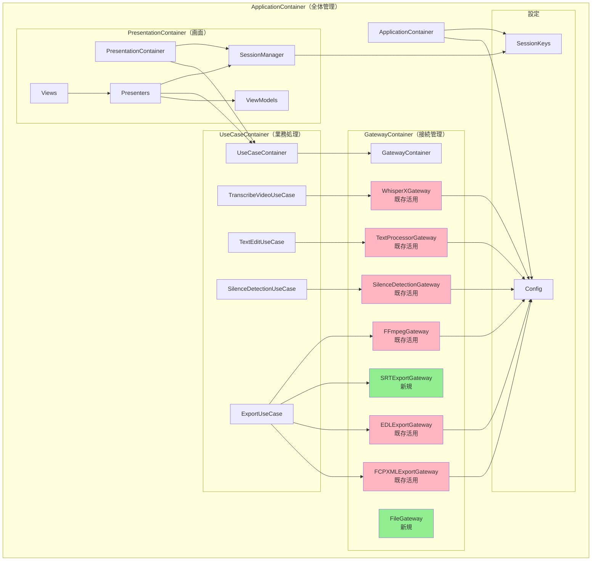
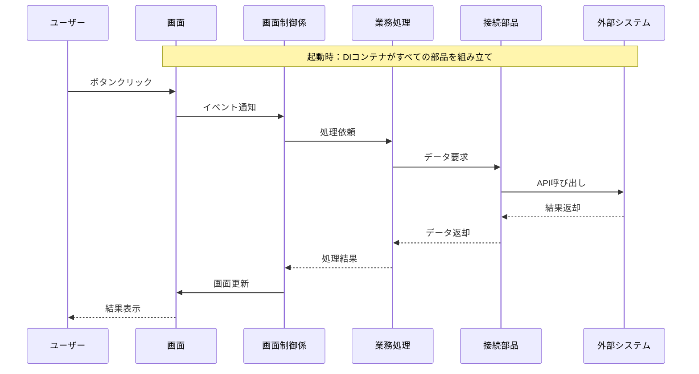
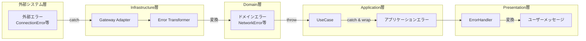
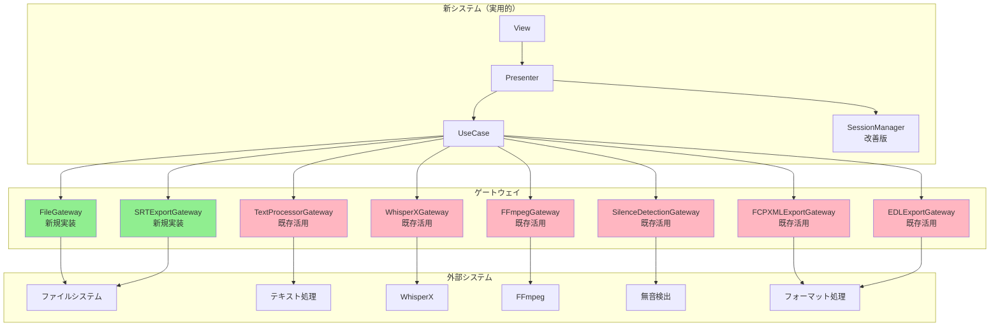
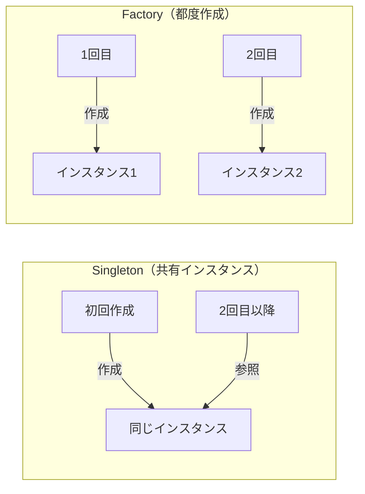
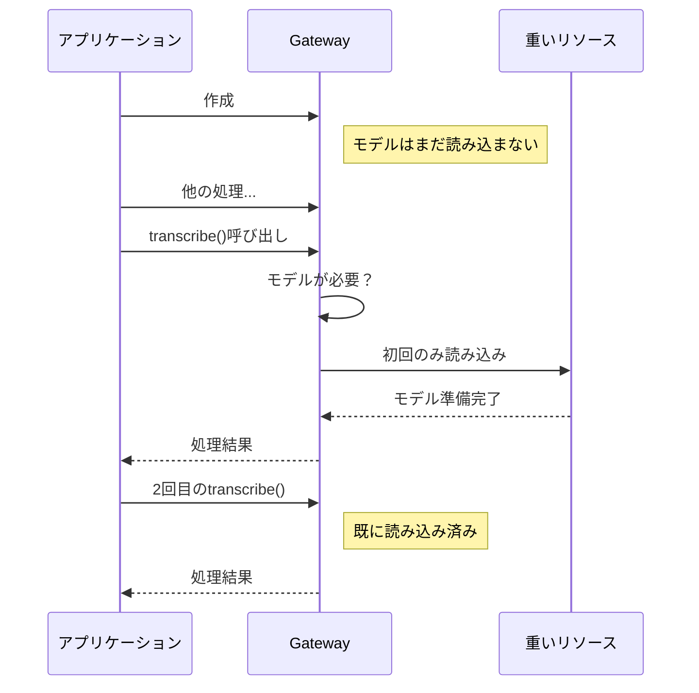
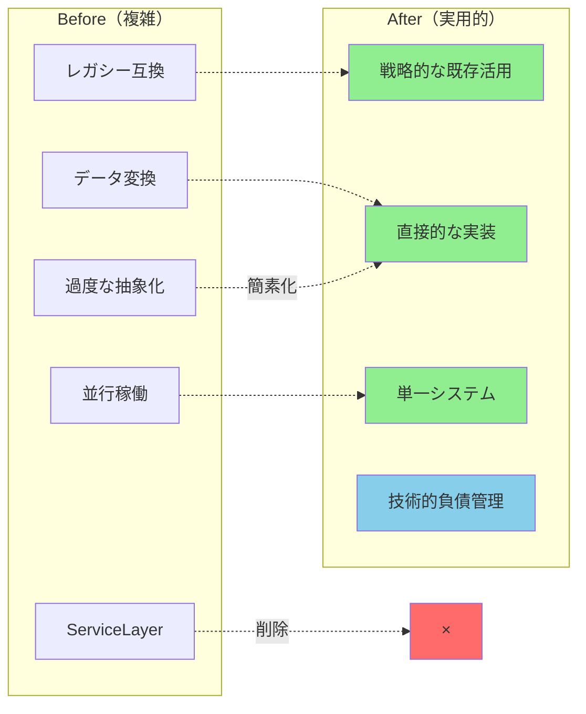
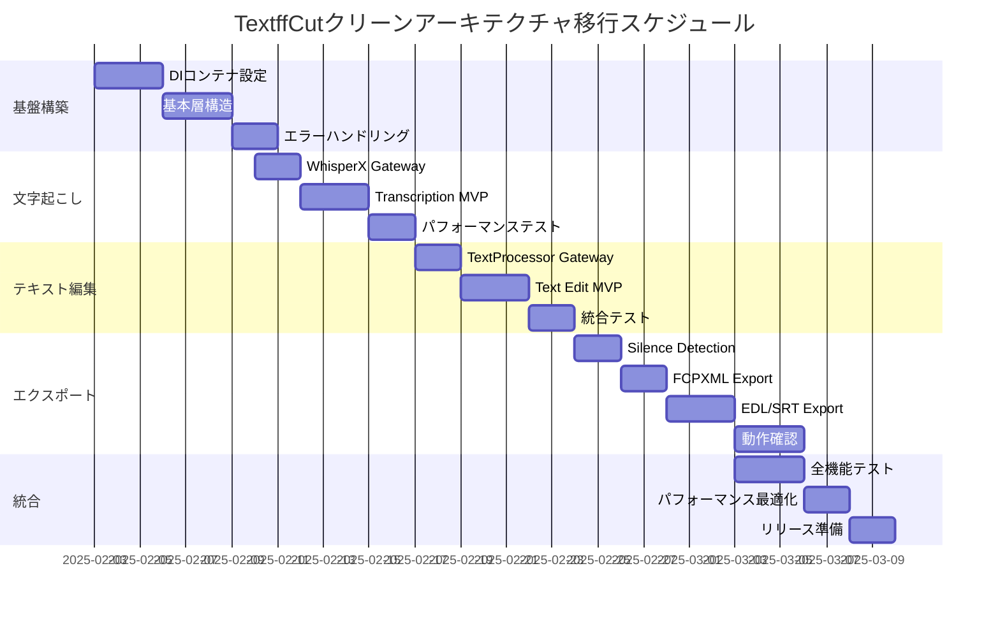

# TextffCut アーキテクチャ図集

## 1. DIコンテナの依存関係図

### 1.1 バランスの取れたコンテナ構造



### 1.2 データフローと依存性注入の関係



## 2. エラー処理フロー

### 2.1 エラーの伝播と変換



### 2.2 エラーメッセージの変換例

```
技術的エラー → ユーザー向けメッセージ

ConnectionError 
  ↓
"ネットワーク接続を確認してください"

FileNotFoundError
  ↓
"指定されたファイルが見つかりません"

PermissionError
  ↓
"ファイルへのアクセス権限がありません"

TimeoutError
  ↓
"処理がタイムアウトしました。もう一度お試しください"
```

## 3. 簡素化されたシステム構成

### 3.1 バランスの取れたデータフロー



### 3.2 戦略的な既存コード活用

```
既存活用（7つ）:
- WhisperX連携: 複雑なAPI連携
- FFmpeg操作: 動画処理の核心
- 無音検出: 複雑なアルゴリズム
- テキスト処理: 細かいノウハウ
- FCPXMLエクスポート: 複雑なフォーマット
- EDLエクスポート: 業界標準フォーマット

新規実装（2つ）:
- ファイル操作: シンプルなため
- SRTエクスポート: シンプルなテキスト形式
- UI/画面: 完全刷新
```

## 4. パフォーマンス最適化の可視化

### 4.1 Singleton vs Factory



### 4.2 遅延初期化のタイミング



## 5. 簡素化前後の比較

### 5.1 バランスの取れたアプローチ



### 5.2 現実的な開発効率

```
最適化された作業:
- 既存コードの活用: +20%（実績ある部分）
- 段階的リリース: +10%（早期フィードバック）
- 技術的負債管理: +5%（長期保守性）

結果:
- 開発期間: 3週間 → 5週間（現実的）
- リスク: 低減（段階的実装）
- 品質: 向上（十分なテスト）
```

## 6. 実装ロードマップ

### 6.1 フェーズ別実装スケジュール



### 6.2 マイルストーンと成果物

| フェーズ | マイルストーン | 成果物 | Go/No-Go基準 |
|---------|---------------|---------|---------------|
| Phase 1 | 基盤完成 | DIコンテナ動作 | テスト通過率 > 90% |
| Phase 2 | 文字起こし動作 | 90分動画処理 | 10分以内で完了 |
| Phase 3 | テキスト編集完成 | 差分検出正確 | 精度 > 95% |
| Phase 4 | エクスポート完成 | 各形式出力 | 互換性確認 |
| Phase 5 | リリース準備 | 完全動作 | ユーザーテスト合格 |

作成日: 2025-01-01  
更新日: 2025-01-30  
バージョン: 2.1（現実的な調整版）