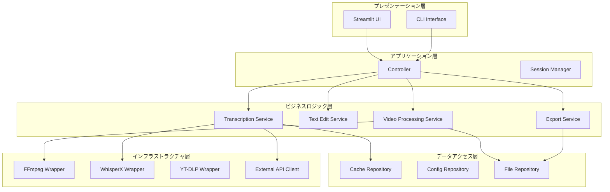
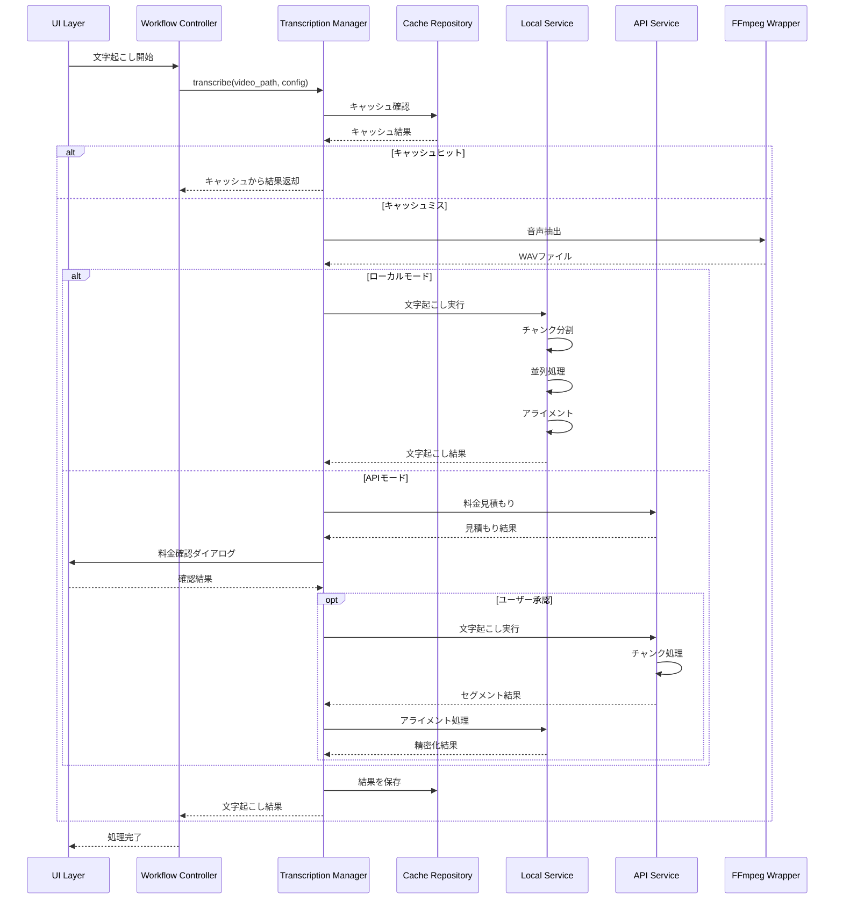
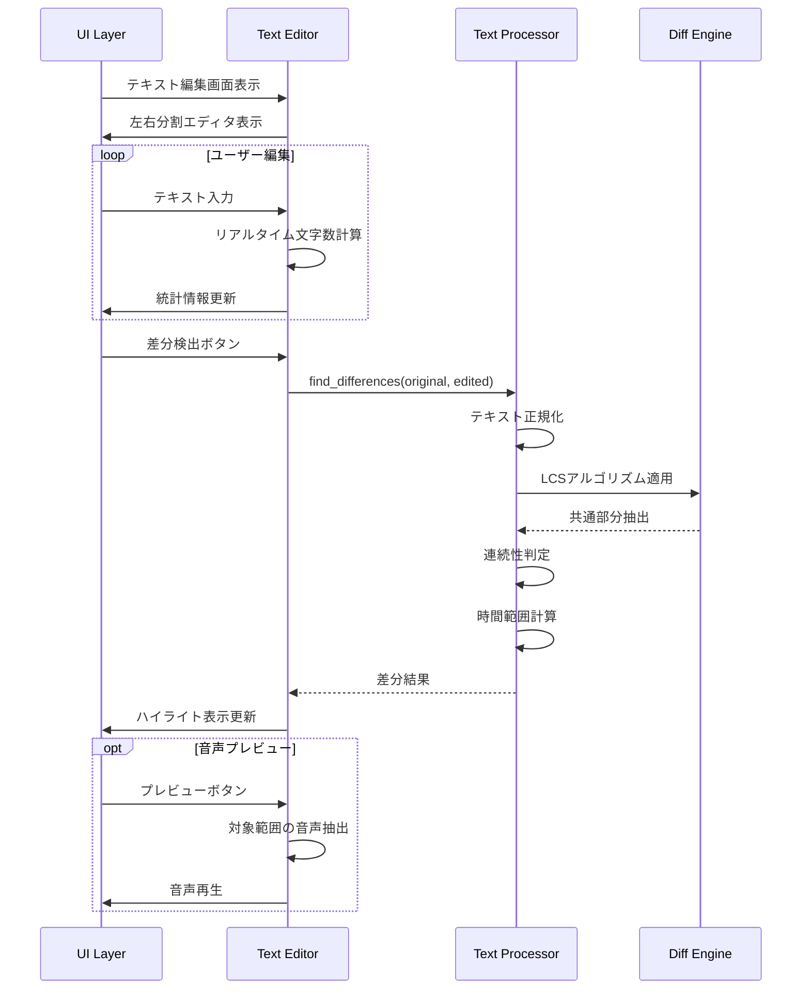
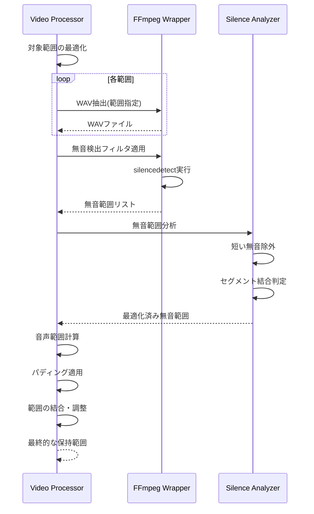

# TextffCut 詳細設計書

## 1. はじめに

### 1.1 文書の目的
本文書は、TextffCut要件定義書および基本設計書v2に基づき、システムの詳細な実装設計を定義します。開発者が実装を行う際の具体的な指針を提供し、モジュール間のインターフェース、クラス構造、処理シーケンスを明確にします。

### 1.2 対象読者
- 開発者
- テストエンジニア
- システムレビュアー

### 1.3 参照文書
- TextffCut要件定義書
- TextffCut基本設計書v2
- CLAUDE.md（プロジェクト固有の実装方針）

### 1.4 技術スタック
- **言語**: Python 3.11
- **フレームワーク**: Streamlit 1.39.0
- **動画処理**: FFmpeg 5.x-6.x
- **音声認識**: WhisperX 3.x / OpenAI Whisper API
- **環境**: Docker 24.x
- **GPU対応**: CUDA 11.8+ (オプション)

## 2. アーキテクチャ設計

### 2.1 レイヤードアーキテクチャ



### 2.2 モジュール構成

```
TextffCut/
├── main.py                    # エントリーポイント
├── config.py                  # 設定管理
├── core/                      # コアビジネスロジック
│   ├── __init__.py
│   ├── transcription.py       # 文字起こし統合
│   ├── transcription_local.py # ローカル版文字起こし
│   ├── transcription_api.py   # API版文字起こし
│   ├── text_processor.py      # テキスト処理
│   ├── video.py              # 動画処理
│   ├── export.py             # エクスポート処理
│   └── models.py             # データモデル定義
├── ui/                       # UI層
│   ├── __init__.py
│   ├── components.py         # UIコンポーネント
│   ├── pages.py              # 画面定義
│   └── file_upload.py        # ファイル入力処理
├── utils/                    # ユーティリティ
│   ├── __init__.py
│   ├── cache.py              # キャッシュ管理
│   ├── ffmpeg.py             # FFmpegラッパー
│   ├── youtube.py            # YouTube動画ダウンロード
│   └── validators.py         # 入力検証
├── services/                 # サービス層
│   ├── __init__.py
│   ├── session.py            # セッション管理
│   └── workflow.py           # ワークフロー制御
└── tests/                    # テスト
    ├── unit/
    ├── integration/
    └── e2e/
```

### 2.3 依存関係管理

```python
# requirements.txt
streamlit==1.39.0
ffmpeg-python==0.2.0
whisperx>=3.0.0  # ローカル版のみ
openai>=1.0.0  # API版のみ
yt-dlp>=2023.07.06
pydantic>=2.0.0
cryptography>=40.0.0
numpy>=1.24.0
pandas>=2.0.0
```

## 3. モジュール設計

### 3.1 コアモジュール

#### 3.1.1 Transcription Service

```python
# core/transcription.py
from abc import ABC, abstractmethod
from typing import Optional, Union, List
from .models import Transcript, TranscriptionConfig

class TranscriptionService(ABC):
    """文字起こしサービスの抽象基底クラス"""
    
    @abstractmethod
    async def transcribe(
        self, 
        audio_path: str, 
        config: TranscriptionConfig
    ) -> Transcript:
        """音声ファイルの文字起こしを実行"""
        pass
    
    @abstractmethod
    def validate_config(self, config: TranscriptionConfig) -> bool:
        """設定の妥当性を検証"""
        pass

class TranscriptionManager:
    """文字起こし処理の統合管理クラス"""
    
    def __init__(self, use_api: bool = False):
        self.use_api = use_api
        self._local_service: Optional[LocalTranscriptionService] = None
        self._api_service: Optional[APITranscriptionService] = None
        self._cache = CacheRepository()
    
    async def transcribe(
        self, 
        video_path: str, 
        config: TranscriptionConfig
    ) -> Transcript:
        """
        動画ファイルの文字起こしを実行
        
        処理フロー:
        1. キャッシュ確認
        2. 音声抽出
        3. 文字起こし実行（ローカル/API）
        4. アライメント処理
        5. キャッシュ保存
        """
        # キャッシュチェック
        cache_key = self._generate_cache_key(video_path, config)
        cached_result = await self._cache.get(cache_key)
        if cached_result and config.use_cache:
            return cached_result
        
        # 音声抽出
        audio_path = await self._extract_audio(video_path)
        
        try:
            # 文字起こし実行
            if self.use_api:
                service = self._get_api_service()
            else:
                service = self._get_local_service()
            
            transcript = await service.transcribe(audio_path, config)
            
            # キャッシュ保存
            await self._cache.set(cache_key, transcript)
            
            return transcript
            
        finally:
            # 一時ファイルクリーンアップ
            await self._cleanup_temp_files(audio_path)
```

#### 3.1.2 Video Processing Service

```python
# core/video.py
from dataclasses import dataclass
from typing import List, Tuple, Optional
import ffmpeg
from .models import TimeRange, VideoInfo, SilenceParams

@dataclass
class VideoSegment:
    """動画セグメント情報"""
    source_path: str
    start_time: float
    end_time: float
    segment_id: str

class VideoProcessor:
    """動画処理を担当するクラス"""
    
    def __init__(self, ffmpeg_wrapper: FFmpegWrapper):
        self.ffmpeg = ffmpeg_wrapper
        self._temp_dir = "/temp/segments/"
    
    async def extract_segments(
        self, 
        video_path: str, 
        time_ranges: List[TimeRange]
    ) -> List[VideoSegment]:
        """
        指定された時間範囲の動画セグメントを抽出
        
        最適化:
        - 連続する範囲は結合して処理
        - 並列処理で高速化
        - ストリームコピーで無劣化
        """
        # 時間範囲の最適化（連続範囲の結合）
        optimized_ranges = self._optimize_ranges(time_ranges)
        
        # 並列セグメント抽出
        segments = await asyncio.gather(*[
            self._extract_single_segment(video_path, range_)
            for range_ in optimized_ranges
        ])
        
        return segments
    
    async def detect_silence(
        self,
        video_path: str,
        target_ranges: List[TimeRange],
        params: SilenceParams
    ) -> Tuple[List[TimeRange], List[TimeRange]]:
        """
        無音部分を検出し、音声がある範囲を返す
        
        処理:
        1. 対象範囲のWAV抽出
        2. FFmpegのsilencedetectフィルタ適用
        3. 結果をパースして時間範囲に変換
        4. パディング適用
        """
        # WAVファイル抽出（並列処理）
        wav_files = await self._extract_wav_for_ranges(
            video_path, target_ranges
        )
        
        # 無音検出
        silence_ranges = []
        for wav_file in wav_files:
            detected = await self._detect_silence_from_wav(
                wav_file, params
            )
            silence_ranges.extend(detected)
        
        # 音声範囲の計算
        keep_ranges = self._calculate_keep_ranges(
            target_ranges, silence_ranges, params.padding
        )
        
        return keep_ranges, silence_ranges
    
    async def merge_segments(
        self,
        segments: List[VideoSegment],
        output_path: str,
        quality: str = "copy"
    ) -> VideoInfo:
        """
        複数のセグメントを結合
        
        最適化:
        - 同一コーデックの場合は無劣化結合
        - 異なる場合のみ再エンコード
        """
        if quality == "copy" and self._can_use_stream_copy(segments):
            return await self._merge_with_concat_demuxer(
                segments, output_path
            )
        else:
            return await self._merge_with_reencode(
                segments, output_path
            )
```

### 3.2 UIモジュール

#### 3.2.1 Component Design

```python
# ui/components.py
import streamlit as st
from typing import Optional, Callable, Dict, Any
from dataclasses import dataclass

@dataclass
class ComponentState:
    """コンポーネントの状態管理"""
    key: str
    value: Any
    on_change: Optional[Callable] = None

class UIComponentFactory:
    """UIコンポーネントのファクトリークラス"""
    
    @staticmethod
    def create_file_selector(is_docker: bool) -> st.container:
        """環境に応じたファイル選択UIを生成"""
        container = st.container()
        
        with container:
            if is_docker:
                # Dockerモード：ドロップダウン選択
                files = FileRepository.list_video_files("/app/videos/")
                selected = st.selectbox(
                    "動画ファイルを選択",
                    options=files,
                    format_func=lambda x: Path(x).name
                )
            else:
                # ローカルモード：テキスト入力
                selected = st.text_input(
                    "動画ファイルのフルパス",
                    placeholder="/path/to/video.mp4"
                )
            
            # YouTube URL入力セクション
            with st.expander("YouTubeからダウンロード"):
                url = st.text_input("YouTube URL")
                if st.button("ダウンロード開始"):
                    return {"type": "youtube", "url": url}
            
            return {"type": "local", "path": selected}
    
    @staticmethod
    def create_timeline_editor(
        segments: List[TimelineSegment],
        video_info: VideoInfo
    ) -> Dict[str, Any]:
        """タイムライン編集UIを生成"""
        # 波形表示エリア
        waveform_container = st.container()
        with waveform_container:
            st.plotly_chart(
                create_waveform_plot(segments),
                use_container_width=True
            )
        
        # セグメント選択
        selected_segment = st.selectbox(
            "編集するセグメント",
            options=segments,
            format_func=lambda s: f"#{s.id} ({s.start_time:.1f}s - {s.end_time:.1f}s)"
        )
        
        # 微調整コントロール
        col1, col2 = st.columns(2)
        with col1:
            new_start = st.number_input(
                "開始時間（秒）",
                value=selected_segment.start_time,
                min_value=0.0,
                max_value=video_info.duration,
                step=1/video_info.fps  # フレーム単位
            )
        
        with col2:
            new_end = st.number_input(
                "終了時間（秒）",
                value=selected_segment.end_time,
                min_value=0.0,
                max_value=video_info.duration,
                step=1/video_info.fps
            )
        
        # フレーム単位調整ボタン
        button_cols = st.columns(6)
        adjustments = [-30, -5, -1, 1, 5, 30]
        
        for idx, (col, adj) in enumerate(zip(button_cols, adjustments)):
            with col:
                if st.button(f"{adj:+d}f"):
                    return {
                        "action": "adjust",
                        "segment_id": selected_segment.id,
                        "adjustment": adj / video_info.fps
                    }
        
        return {
            "action": "update",
            "segment_id": selected_segment.id,
            "start": new_start,
            "end": new_end
        }
```

### 3.3 サービス層

#### 3.3.1 Session Management

```python
# services/session.py
from typing import Dict, Any, Optional
import streamlit as st
from datetime import datetime
import json

class SessionManager:
    """セッション状態の管理"""
    
    def __init__(self):
        self._initialize_session_state()
    
    def _initialize_session_state(self):
        """セッション状態の初期化"""
        defaults = {
            'current_step': 'file_selection',
            'video_path': None,
            'transcript': None,
            'edited_text': '',
            'time_ranges': [],
            'export_settings': {
                'format': 'mp4',
                'include_subtitles': False,
                'silence_removal': False
            },
            'processing_status': {
                'is_processing': False,
                'current_task': None,
                'progress': 0.0
            }
        }
        
        for key, value in defaults.items():
            if key not in st.session_state:
                st.session_state[key] = value
    
    def get(self, key: str, default: Any = None) -> Any:
        """セッション状態から値を取得"""
        return st.session_state.get(key, default)
    
    def set(self, key: str, value: Any):
        """セッション状態に値を設定"""
        st.session_state[key] = value
    
    def update_progress(
        self, 
        task: str, 
        progress: float, 
        status: Optional[str] = None
    ):
        """処理進捗の更新"""
        st.session_state.processing_status = {
            'is_processing': progress < 1.0,
            'current_task': task,
            'progress': progress,
            'status': status or f"{task} ({progress*100:.0f}%)"
        }
    
    def save_state(self, filepath: str):
        """セッション状態をファイルに保存"""
        state_data = {
            k: v for k, v in st.session_state.items()
            if k not in ['transcript', 'processing_status']  # 大きなデータは除外
        }
        
        with open(filepath, 'w', encoding='utf-8') as f:
            json.dump(state_data, f, ensure_ascii=False, indent=2)
    
    def load_state(self, filepath: str):
        """ファイルからセッション状態を復元"""
        with open(filepath, 'r', encoding='utf-8') as f:
            state_data = json.load(f)
        
        for key, value in state_data.items():
            st.session_state[key] = value
```

#### 3.3.2 Workflow Controller

```python
# services/workflow.py
from enum import Enum
from typing import Optional, Dict, Any
import asyncio

class WorkflowStep(Enum):
    """ワークフローのステップ定義"""
    FILE_SELECTION = "file_selection"
    CACHE_CHECK = "cache_check" 
    TRANSCRIPTION = "transcription"
    TEXT_EDITING = "text_editing"
    TIMELINE_EDITING = "timeline_editing"
    EXPORT = "export"
    COMPLETED = "completed"

class WorkflowController:
    """ワークフロー制御"""
    
    def __init__(self, session_manager: SessionManager):
        self.session = session_manager
        self.steps = [step for step in WorkflowStep]
        self._services = self._initialize_services()
    
    def _initialize_services(self) -> Dict[str, Any]:
        """サービスの初期化"""
        return {
            'transcription': TranscriptionManager(),
            'video': VideoProcessor(FFmpegWrapper()),
            'export': ExportService(),
            'youtube': YouTubeDownloader()
        }
    
    async def execute_step(self, step: WorkflowStep) -> Optional[WorkflowStep]:
        """
        ワークフローステップを実行し、次のステップを返す
        """
        try:
            self.session.update_progress(step.value, 0.0)
            
            if step == WorkflowStep.FILE_SELECTION:
                return await self._handle_file_selection()
            
            elif step == WorkflowStep.CACHE_CHECK:
                return await self._handle_cache_check()
            
            elif step == WorkflowStep.TRANSCRIPTION:
                return await self._handle_transcription()
            
            elif step == WorkflowStep.TEXT_EDITING:
                return await self._handle_text_editing()
            
            elif step == WorkflowStep.TIMELINE_EDITING:
                return await self._handle_timeline_editing()
            
            elif step == WorkflowStep.EXPORT:
                return await self._handle_export()
            
            else:
                return None
                
        except Exception as e:
            st.error(f"エラーが発生しました: {str(e)}")
            return None
        
        finally:
            self.session.update_progress(step.value, 1.0)
    
    async def _handle_file_selection(self) -> WorkflowStep:
        """ファイル選択処理"""
        file_info = self.session.get('selected_file')
        
        if file_info['type'] == 'youtube':
            # YouTube動画ダウンロード
            downloader = self._services['youtube']
            video_path = await downloader.download(
                file_info['url'],
                progress_callback=lambda p: self.session.update_progress(
                    "YouTube動画ダウンロード", p
                )
            )
            self.session.set('video_path', video_path)
        else:
            self.session.set('video_path', file_info['path'])
        
        return WorkflowStep.CACHE_CHECK
    
    async def _handle_transcription(self) -> WorkflowStep:
        """文字起こし処理"""
        video_path = self.session.get('video_path')
        config = TranscriptionConfig(
            language=self.session.get('language'),
            model_size=self.session.get('model_size', 'medium'),
            use_cache=True,
            workers=self.session.get('workers', 4)
        )
        
        transcriber = self._services['transcription']
        transcript = await transcriber.transcribe(
            video_path,
            config,
            progress_callback=lambda p, s: self.session.update_progress(
                "文字起こし処理", p, s
            )
        )
        
        self.session.set('transcript', transcript)
        return WorkflowStep.TEXT_EDITING
```

## 4. クラス設計

### 4.1 データモデル

```python
# core/models.py
from pydantic import BaseModel, Field, validator
from typing import List, Optional, Dict, Any
from datetime import datetime
from enum import Enum

class ProcessingMode(str, Enum):
    """処理モード"""
    LOCAL = "local"
    API = "api"

class SyncMode(str, Enum):
    """字幕同期モード"""
    TIGHT = "tight"
    BALANCED = "balanced" 
    READABLE = "readable"

class Word(BaseModel):
    """単語情報"""
    word: str = Field(..., description="単語テキスト")
    start: float = Field(..., ge=0, description="開始時間（秒）")
    end: float = Field(..., ge=0, description="終了時間（秒）")
    confidence: float = Field(default=1.0, ge=0, le=1, description="信頼度")
    
    @validator('end')
    def end_after_start(cls, v, values):
        if 'start' in values and v <= values['start']:
            raise ValueError('終了時間は開始時間より後である必要があります')
        return v

class Segment(BaseModel):
    """文字起こしセグメント"""
    id: int = Field(..., description="セグメントID")
    start: float = Field(..., ge=0, description="開始時間")
    end: float = Field(..., ge=0, description="終了時間")
    text: str = Field(..., description="テキスト")
    words: List[Word] = Field(default_factory=list, description="単語リスト")
    confidence: float = Field(default=1.0, ge=0, le=1, description="平均信頼度")
    
    def get_duration(self) -> float:
        """セグメントの長さを取得"""
        return self.end - self.start

class Transcript(BaseModel):
    """文字起こし結果"""
    video_id: str = Field(..., description="動画ID（ハッシュ値）")
    language: str = Field(..., description="検出言語")
    model: str = Field(..., description="使用モデル")
    segments: List[Segment] = Field(default_factory=list)
    created_at: datetime = Field(default_factory=datetime.now)
    processing_time: float = Field(..., description="処理時間（秒）")
    metadata: Dict[str, Any] = Field(default_factory=dict)
    
    def get_full_text(self) -> str:
        """全文テキストを取得"""
        return " ".join(segment.text for segment in self.segments)
    
    def get_words_with_timing(self) -> List[Word]:
        """全単語をタイミング付きで取得"""
        words = []
        for segment in self.segments:
            words.extend(segment.words)
        return words

class TimeRange(BaseModel):
    """時間範囲"""
    start: float = Field(..., ge=0, description="開始時間")
    end: float = Field(..., ge=0, description="終了時間")
    text: Optional[str] = Field(None, description="対応テキスト")
    segment_ids: List[int] = Field(default_factory=list)
    
    def overlaps_with(self, other: 'TimeRange') -> bool:
        """他の範囲と重複するか判定"""
        return not (self.end <= other.start or self.start >= other.end)
    
    def merge_with(self, other: 'TimeRange') -> 'TimeRange':
        """他の範囲と結合"""
        return TimeRange(
            start=min(self.start, other.start),
            end=max(self.end, other.end),
            text=f"{self.text or ''} {other.text or ''}".strip(),
            segment_ids=self.segment_ids + other.segment_ids
        )

class SilenceParams(BaseModel):
    """無音検出パラメータ"""
    threshold: float = Field(default=-35, ge=-60, le=-20, description="閾値（dB）")
    min_silence_duration: float = Field(default=0.3, ge=0.1, le=2.0)
    min_segment_duration: float = Field(default=0.3, ge=0.1, le=5.0)
    padding: 'Padding' = Field(default_factory=lambda: Padding())

class Padding(BaseModel):
    """パディング設定"""
    start: float = Field(default=0.0, ge=0.0, le=2.0)
    end: float = Field(default=0.0, ge=0.0, le=2.0)

class TranscriptionConfig(BaseModel):
    """文字起こし設定"""
    mode: ProcessingMode = Field(default=ProcessingMode.LOCAL)
    language: Optional[str] = Field(None)
    model_size: str = Field(default="medium")
    use_cache: bool = Field(default=True)
    workers: int = Field(default=4, ge=1, le=8)
    batch_size: int = Field(default=16, ge=1, le=64)
    api_key: Optional[str] = Field(None)

class SubtitleSettings(BaseModel):
    """字幕設定"""
    max_chars_per_line: int = Field(default=20, ge=10, le=40)
    max_lines: int = Field(default=2, ge=1, le=4)
    min_duration: float = Field(default=1.0, ge=0.5, le=2.0)
    max_duration: float = Field(default=7.0, ge=3.0, le=10.0)
    chars_per_second: float = Field(default=10, ge=4, le=20)
    sync_mode: SyncMode = Field(default=SyncMode.BALANCED)
    format: str = Field(default="srt")
```

### 4.2 例外クラス

```python
# core/exceptions.py
class TextffCutException(Exception):
    """基底例外クラス"""
    pass

class VideoProcessingError(TextffCutException):
    """動画処理エラー"""
    pass

class TranscriptionError(TextffCutException):
    """文字起こしエラー"""
    pass

class APIError(TextffCutException):
    """API関連エラー"""
    def __init__(self, message: str, status_code: Optional[int] = None):
        super().__init__(message)
        self.status_code = status_code

class CacheError(TextffCutException):
    """キャッシュ関連エラー"""
    pass

class ValidationError(TextffCutException):
    """入力検証エラー"""
    pass
```

## 5. API設計

### 5.1 内部API

#### 5.1.1 Cache Repository API

```python
# utils/cache.py
from typing import Optional, Any, Dict
import hashlib
import json
from pathlib import Path

class CacheRepository:
    """キャッシュ管理リポジトリ"""
    
    def __init__(self, cache_dir: str = "/app/cache"):
        self.cache_dir = Path(cache_dir)
        self.cache_dir.mkdir(parents=True, exist_ok=True)
    
    def generate_key(self, *args) -> str:
        """キャッシュキーを生成"""
        key_source = json.dumps(args, sort_keys=True)
        return hashlib.sha256(key_source.encode()).hexdigest()
    
    async def get(self, key: str) -> Optional[Any]:
        """キャッシュから取得"""
        cache_file = self.cache_dir / f"{key}.json"
        if not cache_file.exists():
            return None
        
        try:
            with open(cache_file, 'r', encoding='utf-8') as f:
                data = json.load(f)
            
            # 有効期限チェック
            if self._is_expired(data):
                cache_file.unlink()
                return None
            
            return data['value']
        
        except Exception as e:
            logger.error(f"キャッシュ読み込みエラー: {e}")
            return None
    
    async def set(
        self, 
        key: str, 
        value: Any, 
        ttl: Optional[int] = None
    ) -> bool:
        """キャッシュに保存"""
        cache_file = self.cache_dir / f"{key}.json"
        
        try:
            data = {
                'value': value,
                'created_at': datetime.now().isoformat(),
                'ttl': ttl
            }
            
            with open(cache_file, 'w', encoding='utf-8') as f:
                json.dump(data, f, ensure_ascii=False, indent=2)
            
            return True
        
        except Exception as e:
            logger.error(f"キャッシュ書き込みエラー: {e}")
            return False
    
    async def delete(self, key: str) -> bool:
        """キャッシュから削除"""
        cache_file = self.cache_dir / f"{key}.json"
        if cache_file.exists():
            cache_file.unlink()
            return True
        return False
    
    async def clear(self) -> int:
        """全キャッシュをクリア"""
        count = 0
        for cache_file in self.cache_dir.glob("*.json"):
            cache_file.unlink()
            count += 1
        return count
```

#### 5.1.2 FFmpeg Wrapper API

```python
# utils/ffmpeg.py
import ffmpeg
import asyncio
from typing import List, Dict, Any, Optional, Callable
import subprocess

class FFmpegWrapper:
    """FFmpegコマンドのラッパー"""
    
    def __init__(self):
        self._check_ffmpeg_available()
    
    def _check_ffmpeg_available(self):
        """FFmpegの利用可能性をチェック"""
        try:
            ffmpeg.probe("dummy", cmd='ffmpeg')
        except ffmpeg.Error:
            raise RuntimeError("FFmpegが見つかりません")
    
    async def probe(self, file_path: str) -> Dict[str, Any]:
        """動画ファイルの情報を取得"""
        try:
            probe_data = ffmpeg.probe(file_path)
            return {
                'duration': float(probe_data['format']['duration']),
                'bit_rate': int(probe_data['format']['bit_rate']),
                'streams': probe_data['streams'],
                'format': probe_data['format']['format_name'],
                'size': int(probe_data['format']['size'])
            }
        except ffmpeg.Error as e:
            raise VideoProcessingError(f"プローブエラー: {e.stderr}")
    
    async def extract_audio(
        self,
        input_path: str,
        output_path: str,
        start_time: Optional[float] = None,
        duration: Optional[float] = None,
        sample_rate: int = 16000
    ) -> str:
        """音声を抽出"""
        input_kwargs = {}
        if start_time is not None:
            input_kwargs['ss'] = start_time
        if duration is not None:
            input_kwargs['t'] = duration
        
        stream = ffmpeg.input(input_path, **input_kwargs)
        stream = ffmpeg.output(
            stream,
            output_path,
            acodec='pcm_s16le',
            ar=sample_rate,
            ac=1,  # モノラル
            loglevel='error'
        )
        
        await self._run_async(stream)
        return output_path
    
    async def detect_silence(
        self,
        input_path: str,
        threshold: float = -35,
        min_duration: float = 0.3
    ) -> List[Dict[str, float]]:
        """無音部分を検出"""
        cmd = [
            'ffmpeg',
            '-i', input_path,
            '-af', f'silencedetect=noise={threshold}dB:d={min_duration}',
            '-f', 'null',
            '-'
        ]
        
        process = await asyncio.create_subprocess_exec(
            *cmd,
            stderr=asyncio.subprocess.PIPE,
            stdout=asyncio.subprocess.PIPE
        )
        
        _, stderr = await process.communicate()
        
        # 結果をパース
        silence_ranges = []
        lines = stderr.decode().split('\n')
        
        current_silence = {}
        for line in lines:
            if 'silence_start:' in line:
                start = float(line.split('silence_start:')[1].strip())
                current_silence['start'] = start
            elif 'silence_end:' in line:
                parts = line.split('silence_end:')[1].strip().split('|')
                end = float(parts[0].strip())
                if 'start' in current_silence:
                    current_silence['end'] = end
                    silence_ranges.append(current_silence.copy())
                    current_silence = {}
        
        return silence_ranges
    
    async def concat_videos(
        self,
        input_files: List[str],
        output_path: str,
        method: str = 'concat'
    ) -> str:
        """動画を結合"""
        if method == 'concat':
            # concat demuxerを使用（無劣化）
            list_file = output_path + '.txt'
            with open(list_file, 'w') as f:
                for file in input_files:
                    f.write(f"file '{file}'\n")
            
            stream = ffmpeg.input(list_file, format='concat', safe=0)
            stream = ffmpeg.output(stream, output_path, c='copy')
            
            try:
                await self._run_async(stream)
            finally:
                Path(list_file).unlink(missing_ok=True)
        
        else:
            # フィルタグラフを使用（再エンコード）
            inputs = [ffmpeg.input(f) for f in input_files]
            stream = ffmpeg.concat(*inputs, v=1, a=1)
            stream = ffmpeg.output(
                stream,
                output_path,
                vcodec='libx264',
                acodec='aac',
                crf=18,
                preset='fast'
            )
            await self._run_async(stream)
        
        return output_path
    
    async def _run_async(
        self,
        stream,
        progress_callback: Optional[Callable] = None
    ):
        """非同期でFFmpegコマンドを実行"""
        cmd = ffmpeg.compile(stream)
        
        process = await asyncio.create_subprocess_exec(
            *cmd,
            stderr=asyncio.subprocess.PIPE,
            stdout=asyncio.subprocess.PIPE
        )
        
        # プログレス監視
        if progress_callback:
            asyncio.create_task(
                self._monitor_progress(process, progress_callback)
            )
        
        stdout, stderr = await process.communicate()
        
        if process.returncode != 0:
            raise VideoProcessingError(
                f"FFmpegエラー: {stderr.decode()}"
            )
```

### 5.2 外部API連携

#### 5.2.1 OpenAI Whisper API Client

```python
# utils/api_client.py
from openai import AsyncOpenAI
from typing import Optional, Dict, Any, List
import aiohttp
import asyncio

class WhisperAPIClient:
    """OpenAI Whisper APIクライアント"""
    
    def __init__(self, api_key: str):
        self.client = AsyncOpenAI(api_key=api_key)
        self.max_file_size = 25 * 1024 * 1024  # 25MB
    
    async def transcribe(
        self,
        audio_file: str,
        language: Optional[str] = None,
        prompt: Optional[str] = None
    ) -> Dict[str, Any]:
        """音声ファイルを文字起こし"""
        file_size = Path(audio_file).stat().st_size
        
        if file_size > self.max_file_size:
            # ファイルサイズが大きい場合は分割
            return await self._transcribe_large_file(
                audio_file, language, prompt
            )
        
        with open(audio_file, 'rb') as f:
            response = await self.client.audio.transcriptions.create(
                model="whisper-1",
                file=f,
                language=language,
                response_format="verbose_json",
                prompt=prompt
            )
        
        return response.dict()
    
    async def _transcribe_large_file(
        self,
        audio_file: str,
        language: Optional[str],
        prompt: Optional[str]
    ) -> Dict[str, Any]:
        """大きなファイルを分割して文字起こし"""
        # チャンクに分割
        chunks = await self._split_audio_file(audio_file)
        
        # 並行して文字起こし
        tasks = []
        for i, chunk in enumerate(chunks):
            # 前のチャンクの最後の文をプロンプトとして使用
            chunk_prompt = prompt if i == 0 else None
            tasks.append(
                self.transcribe(chunk, language, chunk_prompt)
            )
        
        results = await asyncio.gather(*tasks)
        
        # 結果を結合
        return self._merge_transcription_results(results)
    
    def estimate_cost(self, duration_seconds: float) -> Dict[str, float]:
        """料金を推定"""
        duration_minutes = duration_seconds / 60
        cost_per_minute = 0.006  # $0.006/分
        
        return {
            'duration_minutes': duration_minutes,
            'cost_usd': duration_minutes * cost_per_minute,
            'cost_jpy': duration_minutes * cost_per_minute * 150  # 1USD=150円で計算
        }
```

#### 5.2.2 YouTube Downloader

```python
# utils/youtube.py
import yt_dlp
from typing import Optional, Dict, Any, Callable
import asyncio
from pathlib import Path

class YouTubeDownloader:
    """YouTube動画ダウンローダー"""
    
    def __init__(self, output_dir: str = "/app/videos"):
        self.output_dir = Path(output_dir)
        self.output_dir.mkdir(parents=True, exist_ok=True)
    
    async def download(
        self,
        url: str,
        quality: str = "best",
        progress_callback: Optional[Callable] = None
    ) -> str:
        """YouTube動画をダウンロード"""
        # ダウンロードオプション
        ydl_opts = {
            'format': self._get_format_string(quality),
            'outtmpl': str(self.output_dir / '%(title)s.%(ext)s'),
            'quiet': True,
            'no_warnings': True,
            'progress_hooks': []
        }
        
        if progress_callback:
            ydl_opts['progress_hooks'].append(
                self._create_progress_hook(progress_callback)
            )
        
        # 非同期実行
        loop = asyncio.get_event_loop()
        output_path = await loop.run_in_executor(
            None,
            self._download_sync,
            url,
            ydl_opts
        )
        
        return output_path
    
    def _download_sync(self, url: str, ydl_opts: Dict) -> str:
        """同期的にダウンロード実行"""
        with yt_dlp.YoutubeDL(ydl_opts) as ydl:
            info = ydl.extract_info(url, download=True)
            filename = ydl.prepare_filename(info)
            
            # 拡張子を修正（マージ後）
            if not Path(filename).exists():
                filename = filename.rsplit('.', 1)[0] + '.mp4'
            
            return filename
    
    def _get_format_string(self, quality: str) -> str:
        """品質設定から形式文字列を生成"""
        format_map = {
            'best': 'bestvideo[ext=mp4]+bestaudio[ext=m4a]/best[ext=mp4]/best',
            '1080p': 'bestvideo[height<=1080][ext=mp4]+bestaudio[ext=m4a]/best[height<=1080][ext=mp4]/best',
            '720p': 'bestvideo[height<=720][ext=mp4]+bestaudio[ext=m4a]/best[height<=720][ext=mp4]/best'
        }
        return format_map.get(quality, format_map['best'])
    
    def _create_progress_hook(self, callback: Callable) -> Callable:
        """進捗フックを作成"""
        def hook(d):
            if d['status'] == 'downloading':
                total = d.get('total_bytes') or d.get('total_bytes_estimate', 0)
                downloaded = d.get('downloaded_bytes', 0)
                
                if total > 0:
                    progress = downloaded / total
                    callback(progress)
            
            elif d['status'] == 'finished':
                callback(1.0)
        
        return hook
    
    async def get_video_info(self, url: str) -> Dict[str, Any]:
        """動画情報を取得"""
        ydl_opts = {
            'quiet': True,
            'no_warnings': True,
            'extract_flat': False
        }
        
        loop = asyncio.get_event_loop()
        info = await loop.run_in_executor(
            None,
            self._get_info_sync,
            url,
            ydl_opts
        )
        
        return {
            'title': info.get('title'),
            'duration': info.get('duration'),
            'uploader': info.get('uploader'),
            'upload_date': info.get('upload_date'),
            'description': info.get('description'),
            'thumbnail': info.get('thumbnail'),
            'formats': self._extract_format_info(info.get('formats', []))
        }
    
    def _extract_format_info(self, formats: List[Dict]) -> List[Dict]:
        """利用可能な形式情報を抽出"""
        format_info = []
        
        for fmt in formats:
            if fmt.get('vcodec') != 'none':  # 動画形式のみ
                format_info.append({
                    'format_id': fmt.get('format_id'),
                    'resolution': fmt.get('resolution', 'unknown'),
                    'fps': fmt.get('fps'),
                    'filesize': fmt.get('filesize'),
                    'ext': fmt.get('ext')
                })
        
        return format_info
```

## 6. 処理シーケンス詳細設計

### 6.1 文字起こし処理シーケンス



### 6.2 テキスト編集処理シーケンス



### 6.3 無音削除処理シーケンス



## 7. エラー処理設計

### 7.1 エラー処理方針

```python
# core/error_handler.py
from functools import wraps
from typing import Callable, TypeVar, Optional
import logging
import traceback

logger = logging.getLogger(__name__)

T = TypeVar('T')

class ErrorHandler:
    """統一的なエラーハンドリング"""
    
    @staticmethod
    def safe_execute(
        func: Callable[..., T],
        default: Optional[T] = None,
        error_message: str = "処理中にエラーが発生しました"
    ) -> Callable[..., T]:
        """エラーセーフな実行デコレータ"""
        @wraps(func)
        async def wrapper(*args, **kwargs):
            try:
                return await func(*args, **kwargs)
            
            except ValidationError as e:
                # 入力検証エラーはユーザーに通知
                st.error(f"入力エラー: {str(e)}")
                return default
            
            except APIError as e:
                # APIエラーは詳細情報と共に通知
                if e.status_code == 401:
                    st.error("APIキーが無効です")
                elif e.status_code == 429:
                    st.error("API利用制限に達しました")
                else:
                    st.error(f"API エラー: {str(e)}")
                return default
            
            except VideoProcessingError as e:
                # 動画処理エラー
                st.error(f"動画処理エラー: {str(e)}")
                logger.error(f"Video processing error: {traceback.format_exc()}")
                return default
            
            except Exception as e:
                # 予期しないエラー
                st.error(error_message)
                logger.critical(f"Unexpected error: {traceback.format_exc()}")
                
                # 開発環境では詳細表示
                if os.getenv('DEBUG', 'false').lower() == 'true':
                    st.exception(e)
                
                return default
        
        return wrapper
    
    @staticmethod
    def retry(
        max_attempts: int = 3,
        delay: float = 1.0,
        backoff: float = 2.0,
        exceptions: tuple = (Exception,)
    ):
        """リトライデコレータ"""
        def decorator(func):
            @wraps(func)
            async def wrapper(*args, **kwargs):
                attempt = 0
                current_delay = delay
                
                while attempt < max_attempts:
                    try:
                        return await func(*args, **kwargs)
                    
                    except exceptions as e:
                        attempt += 1
                        
                        if attempt >= max_attempts:
                            logger.error(
                                f"Max retry attempts reached for {func.__name__}"
                            )
                            raise
                        
                        logger.warning(
                            f"Retry {attempt}/{max_attempts} for {func.__name__}: {e}"
                        )
                        
                        await asyncio.sleep(current_delay)
                        current_delay *= backoff
                
                return None
            
            return wrapper
        return decorator
```

### 7.2 エラーリカバリー戦略

```python
# services/recovery.py
class RecoveryService:
    """エラーリカバリーサービス"""
    
    def __init__(self, session_manager: SessionManager):
        self.session = session_manager
        self.recovery_dir = Path("/app/recovery")
        self.recovery_dir.mkdir(exist_ok=True)
    
    async def save_checkpoint(self, step: str, data: Dict[str, Any]):
        """処理チェックポイントを保存"""
        checkpoint = {
            'step': step,
            'timestamp': datetime.now().isoformat(),
            'data': data,
            'session_state': self.session.get_all()
        }
        
        checkpoint_file = self.recovery_dir / f"checkpoint_{step}.json"
        with open(checkpoint_file, 'w') as f:
            json.dump(checkpoint, f)
    
    async def recover_from_checkpoint(self, step: str) -> Optional[Dict]:
        """チェックポイントから復旧"""
        checkpoint_file = self.recovery_dir / f"checkpoint_{step}.json"
        
        if not checkpoint_file.exists():
            return None
        
        with open(checkpoint_file, 'r') as f:
            checkpoint = json.load(f)
        
        # セッション状態を復元
        for key, value in checkpoint['session_state'].items():
            self.session.set(key, value)
        
        return checkpoint['data']
    
    async def cleanup_old_checkpoints(self, max_age_hours: int = 24):
        """古いチェックポイントをクリーンアップ"""
        cutoff_time = datetime.now() - timedelta(hours=max_age_hours)
        
        for checkpoint_file in self.recovery_dir.glob("checkpoint_*.json"):
            try:
                with open(checkpoint_file, 'r') as f:
                    data = json.load(f)
                
                timestamp = datetime.fromisoformat(data['timestamp'])
                if timestamp < cutoff_time:
                    checkpoint_file.unlink()
            
            except Exception as e:
                logger.error(f"Checkpoint cleanup error: {e}")
```

## 8. セキュリティ設計

### 8.1 APIキー管理

```python
# utils/security.py
from cryptography.fernet import Fernet
from typing import Optional
import os
import base64

class SecureStorage:
    """セキュアな設定保存"""
    
    def __init__(self):
        self._key = self._get_or_create_key()
        self._cipher = Fernet(self._key)
    
    def _get_or_create_key(self) -> bytes:
        """暗号化キーを取得または生成"""
        key_file = Path.home() / '.textffcut' / 'key.bin'
        key_file.parent.mkdir(exist_ok=True)
        
        if key_file.exists():
            with open(key_file, 'rb') as f:
                return f.read()
        else:
            key = Fernet.generate_key()
            with open(key_file, 'wb') as f:
                f.write(key)
            
            # ファイル権限を制限
            os.chmod(key_file, 0o600)
            
            return key
    
    def encrypt(self, data: str) -> str:
        """データを暗号化"""
        encrypted = self._cipher.encrypt(data.encode())
        return base64.b64encode(encrypted).decode()
    
    def decrypt(self, encrypted_data: str) -> str:
        """データを復号化"""
        try:
            encrypted = base64.b64decode(encrypted_data.encode())
            decrypted = self._cipher.decrypt(encrypted)
            return decrypted.decode()
        except Exception:
            raise ValueError("復号化に失敗しました")
    
    def save_api_key(self, service: str, api_key: str):
        """APIキーを安全に保存"""
        config_file = Path.home() / '.textffcut' / 'api_keys.json'
        
        # 既存の設定を読み込み
        if config_file.exists():
            with open(config_file, 'r') as f:
                config = json.load(f)
        else:
            config = {}
        
        # APIキーを暗号化して保存
        config[service] = self.encrypt(api_key)
        
        with open(config_file, 'w') as f:
            json.dump(config, f)
        
        # ファイル権限を制限
        os.chmod(config_file, 0o600)
    
    def get_api_key(self, service: str) -> Optional[str]:
        """APIキーを取得"""
        config_file = Path.home() / '.textffcut' / 'api_keys.json'
        
        if not config_file.exists():
            return None
        
        with open(config_file, 'r') as f:
            config = json.load(f)
        
        encrypted_key = config.get(service)
        if encrypted_key:
            return self.decrypt(encrypted_key)
        
        return None
```

### 8.2 入力検証

```python
# utils/validators.py
from pathlib import Path
import re
from typing import List
import magic

class InputValidator:
    """入力検証クラス"""
    
    # 許可する動画形式
    ALLOWED_VIDEO_FORMATS = {
        'video/mp4', 'video/quicktime', 'video/x-msvideo',
        'video/x-matroska', 'video/webm'
    }
    
    # 許可する拡張子
    ALLOWED_EXTENSIONS = {'.mp4', '.mov', '.avi', '.mkv', '.webm'}
    
    # 最大ファイルサイズ（2GB）
    MAX_FILE_SIZE = 2 * 1024 * 1024 * 1024
    
    @classmethod
    def validate_video_file(cls, file_path: str) -> bool:
        """動画ファイルの検証"""
        path = Path(file_path)
        
        # 存在確認
        if not path.exists():
            raise ValidationError("ファイルが存在しません")
        
        # 拡張子確認
        if path.suffix.lower() not in cls.ALLOWED_EXTENSIONS:
            raise ValidationError(
                f"サポートされていない拡張子です: {path.suffix}"
            )
        
        # ファイルサイズ確認
        if path.stat().st_size > cls.MAX_FILE_SIZE:
            raise ValidationError("ファイルサイズが2GBを超えています")
        
        # MIMEタイプ確認
        mime = magic.from_file(str(path), mime=True)
        if mime not in cls.ALLOWED_VIDEO_FORMATS:
            raise ValidationError(
                f"サポートされていないファイル形式です: {mime}"
            )
        
        return True
    
    @staticmethod
    def validate_youtube_url(url: str) -> bool:
        """YouTube URLの検証"""
        patterns = [
            r'^https?://(?:www\.)?youtube\.com/watch\?v=[\w-]+',
            r'^https?://youtu\.be/[\w-]+',
            r'^https?://(?:www\.)?youtube\.com/embed/[\w-]+',
        ]
        
        for pattern in patterns:
            if re.match(pattern, url):
                return True
        
        raise ValidationError("無効なYouTube URLです")
    
    @staticmethod
    def sanitize_filename(filename: str) -> str:
        """ファイル名のサニタイズ"""
        # 危険な文字を除去
        filename = re.sub(r'[<>:"/\\|?*]', '', filename)
        
        # 制御文字を除去
        filename = ''.join(char for char in filename if ord(char) >= 32)
        
        # 長さ制限
        max_length = 255
        if len(filename) > max_length:
            name, ext = os.path.splitext(filename)
            filename = name[:max_length-len(ext)] + ext
        
        return filename
```

## 9. テスト設計

### 9.1 単体テスト

```python
# tests/unit/test_text_processor.py
import pytest
from core.text_processor import TextProcessor
from core.models import Transcript, Segment, Word

class TestTextProcessor:
    """TextProcessorの単体テスト"""
    
    @pytest.fixture
    def sample_transcript(self):
        """サンプル文字起こしデータ"""
        return Transcript(
            video_id="test123",
            language="ja",
            model="test",
            segments=[
                Segment(
                    id=1,
                    start=0.0,
                    end=3.0,
                    text="今日はとてもいい天気です",
                    words=[
                        Word(word="今日は", start=0.0, end=1.0),
                        Word(word="とても", start=1.0, end=1.5),
                        Word(word="いい", start=1.5, end=2.0),
                        Word(word="天気", start=2.0, end=2.5),
                        Word(word="です", start=2.5, end=3.0)
                    ]
                )
            ],
            processing_time=10.0
        )
    
    def test_find_differences_exact_match(self, sample_transcript):
        """完全一致の場合のテスト"""
        processor = TextProcessor()
        edited_text = "今日はとてもいい天気です"
        
        result = processor.find_differences(
            sample_transcript, edited_text
        )
        
        assert len(result.time_ranges) == 1
        assert result.time_ranges[0].start == 0.0
        assert result.time_ranges[0].end == 3.0
    
    def test_find_differences_partial_match(self, sample_transcript):
        """部分一致の場合のテスト"""
        processor = TextProcessor()
        edited_text = "とてもいい天気"
        
        result = processor.find_differences(
            sample_transcript, edited_text
        )
        
        assert len(result.time_ranges) == 1
        assert result.time_ranges[0].start == 1.0
        assert result.time_ranges[0].end == 2.5
    
    def test_normalize_text(self):
        """テキスト正規化のテスト"""
        processor = TextProcessor()
        
        # 全角半角混在
        assert processor._normalize_text("１２３ＡＢＣ") == "123ABC"
        
        # 空白の統一
        assert processor._normalize_text("a  b　　c") == "a b c"
        
        # 改行の除去
        assert processor._normalize_text("a\nb\r\nc") == "a b c"
```

### 9.2 統合テスト

```python
# tests/integration/test_video_processing.py
import pytest
import asyncio
from core.video import VideoProcessor
from utils.ffmpeg import FFmpegWrapper

class TestVideoProcessing:
    """動画処理の統合テスト"""
    
    @pytest.fixture
    async def video_processor(self):
        """VideoProcessorのインスタンス"""
        ffmpeg = FFmpegWrapper()
        return VideoProcessor(ffmpeg)
    
    @pytest.mark.asyncio
    async def test_extract_segments(self, video_processor, sample_video):
        """セグメント抽出のテスト"""
        time_ranges = [
            TimeRange(start=10.0, end=20.0),
            TimeRange(start=30.0, end=40.0)
        ]
        
        segments = await video_processor.extract_segments(
            sample_video, time_ranges
        )
        
        assert len(segments) == 2
        assert all(Path(s.source_path).exists() for s in segments)
    
    @pytest.mark.asyncio
    async def test_detect_silence(self, video_processor, sample_video):
        """無音検出のテスト"""
        params = SilenceParams(
            threshold=-35,
            min_silence_duration=0.3,
            min_segment_duration=0.3
        )
        
        keep_ranges, silence_ranges = await video_processor.detect_silence(
            sample_video,
            [TimeRange(start=0, end=60)],
            params
        )
        
        # 音声範囲と無音範囲が重複していないことを確認
        for keep in keep_ranges:
            for silence in silence_ranges:
                assert not keep.overlaps_with(silence)
```

### 9.3 E2Eテスト

```python
# tests/e2e/test_full_workflow.py
import pytest
from selenium import webdriver
from selenium.webdriver.common.by import By
from selenium.webdriver.support.ui import WebDriverWait
from selenium.webdriver.support import expected_conditions as EC

class TestFullWorkflow:
    """完全なワークフローのE2Eテスト"""
    
    @pytest.fixture
    def driver(self):
        """Seleniumドライバー"""
        options = webdriver.ChromeOptions()
        options.add_argument('--headless')
        driver = webdriver.Chrome(options=options)
        driver.get("http://localhost:8501")
        yield driver
        driver.quit()
    
    def test_complete_workflow(self, driver, sample_video_path):
        """動画選択から出力までの完全なテスト"""
        wait = WebDriverWait(driver, 10)
        
        # 1. ファイル選択
        file_input = wait.until(
            EC.presence_of_element_located((By.ID, "file-input"))
        )
        file_input.send_keys(sample_video_path)
        
        # 2. 文字起こし実行
        transcribe_btn = driver.find_element(By.ID, "transcribe-button")
        transcribe_btn.click()
        
        # 進捗バーが完了するまで待機
        wait.until(
            EC.text_to_be_present_in_element(
                (By.CLASS_NAME, "progress-text"),
                "100%"
            )
        )
        
        # 3. テキスト編集
        edit_area = driver.find_element(By.ID, "edit-textarea")
        edit_area.clear()
        edit_area.send_keys("編集されたテキスト")
        
        # 4. エクスポート
        export_btn = driver.find_element(By.ID, "export-button")
        export_btn.click()
        
        # 出力ファイルの確認
        success_msg = wait.until(
            EC.presence_of_element_located((By.CLASS_NAME, "success-message"))
        )
        
        assert "エクスポートが完了しました" in success_msg.text
```

## 10. パフォーマンス最適化

### 10.1 並列処理の実装

```python
# utils/parallel.py
import asyncio
from concurrent.futures import ProcessPoolExecutor, ThreadPoolExecutor
from typing import List, Callable, Any
import multiprocessing as mp

class ParallelProcessor:
    """並列処理マネージャー"""
    
    def __init__(self, max_workers: Optional[int] = None):
        if max_workers is None:
            # CPU数の75%を使用
            max_workers = max(1, int(mp.cpu_count() * 0.75))
        
        self.max_workers = max_workers
        self._process_pool = None
        self._thread_pool = None
    
    @property
    def process_pool(self) -> ProcessPoolExecutor:
        """プロセスプールを取得（遅延初期化）"""
        if self._process_pool is None:
            self._process_pool = ProcessPoolExecutor(
                max_workers=self.max_workers
            )
        return self._process_pool
    
    @property
    def thread_pool(self) -> ThreadPoolExecutor:
        """スレッドプールを取得（遅延初期化）"""
        if self._thread_pool is None:
            self._thread_pool = ThreadPoolExecutor(
                max_workers=self.max_workers * 2  # I/Oバウンドタスク用
            )
        return self._thread_pool
    
    async def map_async(
        self,
        func: Callable,
        items: List[Any],
        use_process: bool = True
    ) -> List[Any]:
        """非同期で並列マップ処理"""
        loop = asyncio.get_event_loop()
        
        if use_process:
            # CPUバウンドタスク
            futures = [
                loop.run_in_executor(self.process_pool, func, item)
                for item in items
            ]
        else:
            # I/Oバウンドタスク
            futures = [
                loop.run_in_executor(self.thread_pool, func, item)
                for item in items
            ]
        
        return await asyncio.gather(*futures)
    
    def __del__(self):
        """リソースのクリーンアップ"""
        if self._process_pool:
            self._process_pool.shutdown(wait=True)
        if self._thread_pool:
            self._thread_pool.shutdown(wait=True)
```

### 10.2 メモリ管理

```python
# utils/memory.py
import psutil
import gc
from functools import wraps
from typing import Callable

class MemoryManager:
    """メモリ管理ユーティリティ"""
    
    @staticmethod
    def get_memory_info() -> Dict[str, float]:
        """現在のメモリ使用状況を取得"""
        process = psutil.Process()
        memory_info = process.memory_info()
        
        return {
            'rss_mb': memory_info.rss / 1024 / 1024,
            'vms_mb': memory_info.vms / 1024 / 1024,
            'percent': process.memory_percent(),
            'available_mb': psutil.virtual_memory().available / 1024 / 1024
        }
    
    @staticmethod
    def check_memory_available(required_mb: float) -> bool:
        """必要なメモリが利用可能か確認"""
        available = psutil.virtual_memory().available / 1024 / 1024
        return available >= required_mb
    
    @staticmethod
    def memory_limit(max_mb: float):
        """メモリ使用量制限デコレータ"""
        def decorator(func: Callable) -> Callable:
            @wraps(func)
            async def wrapper(*args, **kwargs):
                # 実行前のメモリ確認
                if not MemoryManager.check_memory_available(max_mb):
                    raise MemoryError(
                        f"利用可能メモリが不足しています（必要: {max_mb}MB）"
                    )
                
                try:
                    result = await func(*args, **kwargs)
                    return result
                
                finally:
                    # ガベージコレクション実行
                    gc.collect()
            
            return wrapper
        return decorator
    
    @staticmethod
    def estimate_video_memory(duration_seconds: float, fps: float) -> float:
        """動画処理に必要なメモリを推定"""
        # 経験的な係数
        # 1秒あたり約10MBのメモリを使用（WAV変換時）
        audio_memory = duration_seconds * 10
        
        # 動画処理用バッファ（フレーム数に依存）
        video_memory = duration_seconds * fps * 0.1
        
        # 余裕を持たせる（1.5倍）
        total_memory = (audio_memory + video_memory) * 1.5
        
        return total_memory
```

## 11. 実装上の注意事項

### 11.1 Docker環境での考慮事項

1. **ファイルパス**
   - Docker内部では `/app/` をベースパスとして使用
   - ボリュームマウント: `/app/videos/` に動画ファイルを配置
   - 一時ファイル: `/app/temp/` を使用（自動クリーンアップ）

2. **メモリ制限**
   - Docker Desktopのメモリ割り当ての80%を上限として使用
   - 大容量ファイル処理時は自動的にチャンク処理

3. **GPU対応**
   - NVIDIA GPUがある場合は自動的に使用
   - `--gpus all` オプションでコンテナ起動
   - GPUがない場合はCPUフォールバック

### 11.2 プラットフォーム別の注意

1. **Windows (WSL2)**
   - ファイルパスの変換に注意（WSLパス ↔ Windowsパス）
   - 改行コードの自動変換を無効化

2. **macOS (Apple Silicon)**
   - ARM64ネイティブイメージを使用
   - GPU非対応のためCPU処理のみ

3. **Linux**
   - ファイル権限の適切な設定
   - SELinuxやAppArmorとの互換性確認

### 11.3 既知の制限事項

1. **ファイルサイズ**
   - 最大2GBまでの動画ファイルをサポート
   - それ以上は分割処理が必要

2. **同時実行**
   - 単一ユーザーでの使用を前提
   - 複数の処理を同時実行すると不安定になる可能性

3. **ブラウザ互換性**
   - Chrome/Edge: 完全サポート
   - Firefox: 一部の音声再生機能に制限
   - Safari: ファイルアップロードサイズに制限

### 11.4 デバッグとログ

```python
# config.py
import logging
from logging.handlers import RotatingFileHandler

def setup_logging():
    """ログ設定のセットアップ"""
    log_format = '%(asctime)s - %(name)s - %(levelname)s - %(message)s'
    
    # ルートロガー設定
    logging.basicConfig(
        level=logging.INFO,
        format=log_format
    )
    
    # ファイルハンドラ（ローテーション付き）
    file_handler = RotatingFileHandler(
        '/app/logs/textffcut.log',
        maxBytes=10*1024*1024,  # 10MB
        backupCount=5
    )
    file_handler.setFormatter(logging.Formatter(log_format))
    
    # 各モジュールのログレベル設定
    loggers = {
        'core': logging.DEBUG,
        'ui': logging.INFO,
        'utils': logging.WARNING,
        'services': logging.INFO
    }
    
    for name, level in loggers.items():
        logger = logging.getLogger(name)
        logger.setLevel(level)
        logger.addHandler(file_handler)
```

## 12. まとめ

本詳細設計書では、TextffCutシステムの実装レベルでの設計を定義しました。主な設計ポイント：

1. **モジュール化**: 責任の分離と高い保守性
2. **非同期処理**: 高速な動画処理の実現
3. **エラーハンドリング**: 堅牢性とユーザビリティの両立
4. **セキュリティ**: APIキーの安全な管理
5. **テスト**: 包括的なテストカバレッジ
6. **最適化**: メモリとCPUの効率的な使用

開発者はこの設計書に従って実装を進めることで、要件定義書および基本設計書で定められた機能を確実に実現できます。

---

**作成日**: 2025-06-22  
**バージョン**: 1.0  
**次回レビュー予定**: 実装フェーズ開始時