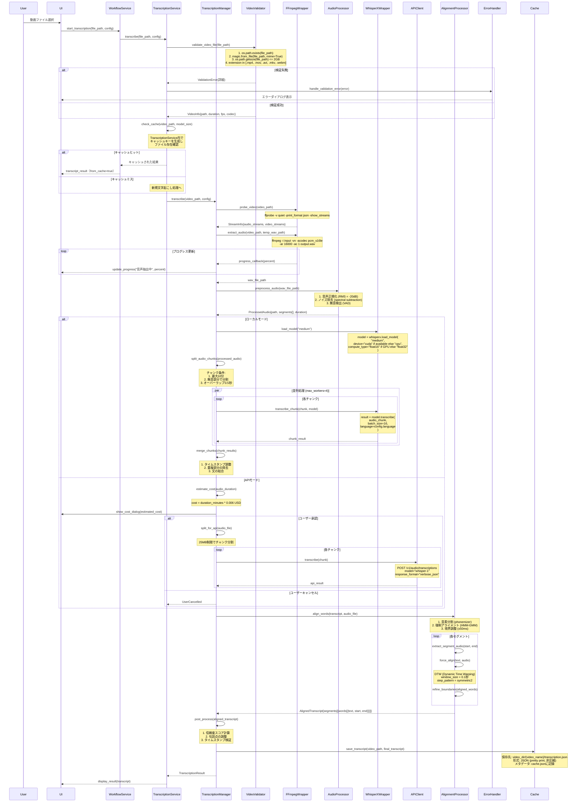
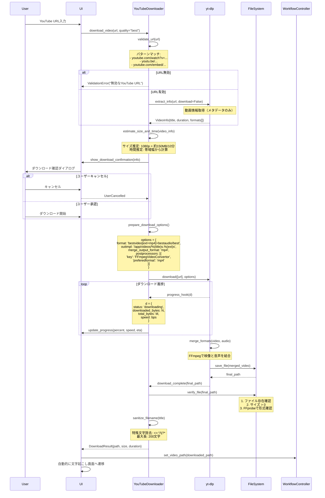
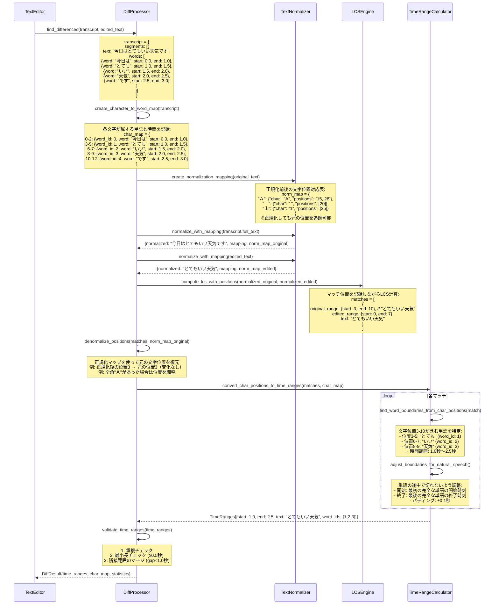
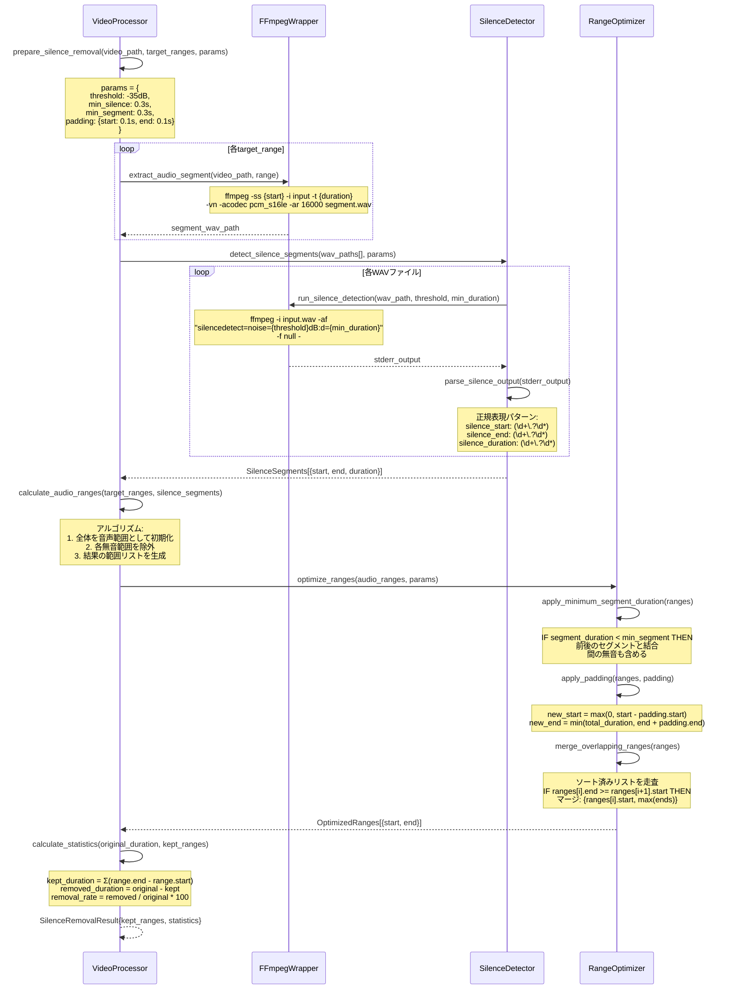

# TextffCut 詳細設計書 v3

## 1. はじめに

### 1.1 文書の目的
本文書は、TextffCutシステムの詳細設計を定義します。この設計書の通りに実装すれば、確実に動作するシステムが構築できるレベルの具体性を提供します。

### 1.2 対象読者
- 開発者（実装担当者）
- テストエンジニア
- システムアーキテクト
- 技術レビュアー

### 1.3 参照文書
- TextffCut要件定義書
- TextffCut基本設計書v2
- FFmpeg公式ドキュメント
- WhisperX技術仕様書

## 2. 要件トレーサビリティマトリクス

### 2.1 要件からモジュールへの対応表

| 要件ID | 要件概要 | 対応モジュール | テストケースID |
|--------|----------|----------------|----------------|
| REQ-001 | YouTube動画ダウンロード | 未実装 | - |
| REQ-002 | ローカル版文字起こし | core.transcription.UnifiedTranscriber | TC-004〜TC-008 |
| REQ-003 | API版文字起こし | core.transcription_api.APITranscriber | TC-009〜TC-012 |
| REQ-004 | テキスト編集（diff表示） | services.text_editing_service | TC-013〜TC-015 |
| REQ-005 | タイムライン編集（境界調整） | core.text_processor.BoundaryMarkerParser | TC-016〜TC-020 |
| REQ-006 | 無音検出・削除 | core.video.VideoProcessor | TC-021〜TC-025 |
| REQ-007 | 動画切り出し・結合 | core.video.VideoProcessor | TC-026〜TC-030 |
| REQ-008 | FCPXMLエクスポート | core.export.FCPXMLExporter | TC-031〜TC-033 |
| REQ-009 | Premiere XMLエクスポート | core.export.PremiereExporter | TC-034〜TC-036 |
| REQ-010 | SRT字幕エクスポート | core.export.SRTExporter | TC-037〜TC-038 |
| REQ-011 | キャッシュ管理 | core.transcription（内蔵） | TC-039〜TC-042 |
| REQ-012 | 設定管理（永続化） | config.ConfigManager | TC-043〜TC-045 |

### 2.2 モジュール間依存関係と影響分析

| 変更対象モジュール | 影響を受けるモジュール | 影響内容 |
|-------------------|---------------------|----------|
| core.transcription | services.text_editing_service | 文字起こし結果形式変更 |
| core.video | core.export.* | セグメント情報の変更 |
| core.transcription | services.transcription_service | キャッシュAPIの変更 |
| config.py | 全モジュール | 設定項目の追加/変更 |
| services/* | UI層 | サービスAPIの変更 |
| core.alignment_processor | core.transcription | アライメント処理のインターフェース |

### 2.3 テストケース分類

| 分類 | テストケースID範囲 | カバレッジ目標 |
|------|-------------------|---------------|
| 単体テスト | TC-001〜TC-050 | 90% |
| 統合テスト | TC-051〜TC-070 | 主要フロー100% |
| E2Eテスト | TC-071〜TC-080 | ユーザーシナリオ100% |
| 境界値テスト | TC-081〜TC-090 | エッジケース網羅 |
| エラーテスト | TC-091〜TC-100 | 異常系100% |

## 3. システムアーキテクチャ詳細

### 3.1 レイヤー構成と責務

```
┌─────────────────────────────────────────────┐
│        プレゼンテーション層                    │
│  - Streamlit Components                     │
│  - セッション状態管理                          │
│  - イベントハンドリング                        │
├─────────────────────────────────────────────┤
│              サービス層                       │
│  - ワークフロー統合                           │
│  - ビジネスロジックの調整                      │
│  - エラーハンドリングの統一                    │
│  - 進捗管理                                  │
├─────────────────────────────────────────────┤
│        ビジネスロジック層                      │
│  - 文字起こし処理                            │
│  - 動画処理                                  │
│  - テキスト処理                              │
│  - アライメント処理                          │
│  - ワーカープロセス管理（orchestrator）        │
├─────────────────────────────────────────────┤
│         データアクセス層                       │
│  - ファイルI/O                               │
│  - キャッシュ管理                            │
│  - 設定管理                                  │
├─────────────────────────────────────────────┤
│         インフラストラクチャ層                 │
│  - FFmpegラッパー                            │
│  - WhisperXラッパー                          │
│  - 外部API通信                               │
└─────────────────────────────────────────────┘
```

### 3.2 モジュール間通信

| 通信元 | 通信先 | インターフェース | データ形式 |
|--------|--------|-----------------|------------|
| UI層 | サービス層 | サービスメソッド | Pythonオブジェクト |
| サービス層 | ビジネス層 | 直接呼び出し | ドメインモデル |
| ビジネス層（文字起こし） | orchestrator | サブプロセス起動 | 辞書/JSON |
| ビジネス層 | データ層 | ファイルI/O | 辞書/JSON |
| データ層 | インフラ層 | Wrapper関数 | プリミティブ型 |

## 4. 主要処理の詳細シーケンス

### 4.1 文字起こし処理完全シーケンス



### 3.2 YouTube動画ダウンロード処理



### 3.3 テキスト差分検出の詳細処理（正規化とタイムスタンプ整合性）



#### 差分検出の重要ポイント：正規化とタイムスタンプの整合性

**問題**: テキストを正規化（全角→半角変換など）すると、文字位置がずれてタイムスタンプとの対応が失われる

**解決策**: 
1. **文字単位のインデックスマップ**: 各文字がどの単語に属し、その単語の時間情報を保持
2. **正規化マッピングテーブル**: 正規化前後の文字位置の対応関係を記録
3. **逆変換処理**: LCS計算後、正規化前の位置に戻してからタイムスタンプを取得

**具体例**:
```
元テキスト: "今日は　とても　いい天気です"  # 全角スペース
正規化後:   "今日は とても いい天気です"    # 半角スペース

正規化マップ:
- 位置3の全角スペース → 半角スペースに変換
- 位置9の全角スペース → 半角スペースに変換

文字→単語マップ:
- "今日は"（位置0-2） → word_id:0, time:0.0-1.0
- "とても"（位置4-6） → word_id:1, time:1.0-1.5  # 正規化前の位置で管理
```

### 3.4 無音削除処理の詳細



## 4. データ構造とアルゴリズム詳細

### 4.1 主要データ構造の完全定義

#### 4.1.1 Transcript構造体

```
Transcript:
  video_id: str          # SHA256ハッシュ (64文字)
  language: str          # ISO 639-1 (例: "ja", "en")
  model: str             # モデル名 (固定: "medium")
  segments: Segment[]    # セグメント配列
  created_at: datetime   # ISO 8601形式
  processing_time: float # 秒単位、小数第2位まで
  metadata: dict         # 追加情報
    - audio_duration: float
    - total_words: int
    - confidence_avg: float

Segment:
  id: int               # 1から始まる連番
  start: float          # 開始時間（秒、小数第3位まで）
  end: float            # 終了時間（秒、小数第3位まで）
  text: str             # セグメントのテキスト
  words: Word[]         # 単語配列
  confidence: float     # 0.0-1.0

Word:
  word: str             # 単語テキスト
  start: float          # 開始時間（秒、小数第3位まで）
  end: float            # 終了時間（秒、小数第3位まで）
  confidence: float     # 0.0-1.0
  phonemes: str[]       # 音素配列（オプション）
```

#### 4.1.2 時間範囲の表現

```
TimeRange:
  start: float          # 開始時間（秒）
  end: float            # 終了時間（秒）
  text: str             # 対応するテキスト（オプション）
  segment_ids: int[]    # 含まれるセグメントID
  confidence: float     # マッチ信頼度
  
  検証条件:
  - 0 <= start < end
  - end <= video_duration
  - end - start >= 0.1 (最小長)
```

### 4.2 重要アルゴリズムの詳細

#### 4.2.1 LCS（最長共通部分列）アルゴリズム

**目的**: 原文と編集文の共通部分を効率的に検出し、削除された文字の位置を特定する。

**処理概要**:
1️⃣ **動的計画法テーブルの構築**
   - 原文（長さm）と編集文（長さn）に対して(m+1)×(n+1)のテーブルを作成
   - 各セルに「その位置までの最長共通部分列の長さ」を記録
   - 文字が一致する場合は左上セルの値+1、不一致の場合は上か左の最大値を採用

2️⃣ **バックトラッキングによるマッチ位置の特定**
   - テーブルの右下から左上に向かって逆算
   - 文字が一致している箇所を連続的なマッチ区間として記録
   - マッチ区間の境界で区切り、削除された部分を特定

3️⃣ **性能特性**
   - 時間計算量：文字数の積に比例（10,000文字同士なら約1億回の計算）
   - 空間効率化：Hirschberg法により、メモリ使用量を最小文字数に比例する量まで削減可能
   - 実用上の制限：20,000文字を超える場合は分割処理を推奨

#### 4.2.2 音声レベル計算（RMS）

**目的**: 音声データから無音区間を検出するため、時間窓ごとの音量レベルを計算する。

**処理概要**:
1️⃣ **音声データの窓分割**
   - 16kHzサンプリングの音声を20ミリ秒の窓（320サンプル）に分割
   - 10ミリ秒ずつスライド（50%オーバーラップ）して詳細な変化を捉える
   - 90分の動画では約54万個の窓が生成される

2️⃣ **RMS（二乗平均平方根）による音量計算**
   - 各窓内の音声サンプルを二乗して平均を取り、平方根を計算
   - これにより瞬間的なノイズの影響を抑えた安定した音量値を取得
   - 16ビット音声の最大値（32768）で正規化

3️⃣ **デシベル変換と無音判定**
   - 線形スケールの音量値を人間の聴覚に近い対数スケール（dB）に変換
   - -35dB以下を無音と判定（調整可能：-60〜-20dB）
   - 完全無音の場合は負の無限大として処理

**パラメータの意味**:
- 窓サイズ20ms：音声の基本周波数（50-400Hz）を捉えるのに十分な長さ
- オーバーラップ50%：急激な音量変化を見逃さないための安全マージン

#### 4.2.3 時間マッピング（TimeMapper）

**目的**: 無音削除により分割・移動した時間範囲を正確に追跡し、元動画の時間と処理後の時間を対応付ける。

**処理概要**:
1️⃣ **基本的な時間マッピング**
   - 元動画の時間範囲（original_ranges）と保持される範囲（kept_ranges）の対応を管理
   - 各範囲の開始・終了時間を記録し、線形補間で中間点も計算可能
   
2️⃣ **範囲分割の検出（map_range_to_segments）**
   - 単一の時間範囲が無音削除により複数のセグメントに分割される場合を検出
   - 元の範囲と重なるすべての保持範囲を抽出し、それぞれの時間を計算
   - 例：[35.5-40.8秒]が[0.0-1.5秒]、[1.6-2.5秒]、[2.6-4.3秒]の3つに分割
   
3️⃣ **実装の詳細**
   ```python
   def map_range_to_segments(self, start: float, end: float) -> list[tuple[float, float]]:
       segments = []
       for mapping in self.mappings:
           # 重なる部分を計算
           overlap_start = max(start, mapping.original_start)
           overlap_end = min(end, mapping.original_end)
           
           if overlap_start < overlap_end:
               # 相対位置を計算してマッピング
               segments.append((mapped_start, mapped_end))
       return segments
   ```

#### 4.2.4 セグメント結合アルゴリズム

**目的**: 細切れになった音声セグメントを適切に結合し、自然な編集結果を生成する。

**処理概要**:
1️⃣ **結合判定の3条件**
   - **間隔条件**: セグメント間の無音が0.3秒以下なら結合（短い息継ぎは残す）
   - **最小長条件**: 0.3秒未満の短いセグメントは前後と結合（言い淀みの除去）
   - **コンテキスト保持**: 短いセグメントでも重要な単語なら独立させる

2️⃣ **結合処理の実行**
   - 時系列順にセグメントを走査し、条件を満たす隣接セグメントを統合
   - テキストは空白で連結し、セグメントIDリストも統合
   - 結合により新たに短いセグメントが生まれた場合は再評価

3️⃣ **品質保証**
   - 結合後も元の音声タイミング情報は保持（後で分割可能）
   - 過度な結合を防ぐため、5秒を超える結合は警告
   - ユーザーが後から結合パラメータを調整できるよう設計

4️⃣ **最終処理と再評価**
   - 走査完了後、最後のセグメントを結果リストに追加
   - 結合後も0.3秒未満のセグメントが残っている場合は、再度結合処理を実行
   - 無限ループを防ぐため、再結合は最大3回までに制限
   - 各反復で結合条件を緩和（間隔を0.5秒、1.0秒と段階的に拡大）

## 5. エラー処理とリカバリー詳細

### 5.1 エラー分類と処理戦略

| エラー種別 | 検出方法 | リカバリー戦略 | ユーザー通知 |
|-----------|---------|---------------|-------------|
| **ファイル読み取りエラー** | OSError, IOError | 3回リトライ後、エラー通知 | 「ファイルにアクセスできません。他のアプリで開いていないか確認してください。」 |
| **メモリ不足** | MemoryError, psutil監視 | チャンクサイズを50%削減して再試行 | 「メモリが不足しています。設定を調整して再実行します。」 |
| **FFmpegエラー** | returncode != 0 | コーデック変更して再試行 | 「動画の処理に失敗しました。形式: {format}」 |
| **API接続エラー** | ConnectionError, Timeout | 指数バックオフでリトライ（1s, 2s, 4s） | 「APIに接続できません。ローカルモードに切り替えますか？」 |
| **APIレート制限** | HTTP 429 | 待機時間後に自動再試行 | 「API利用制限に達しました。{wait_time}秒後に再開します。」 |
| **文字起こし失敗** | 信頼度 < 0.3 | 音声前処理を強化して再試行 | 「音声認識の精度が低いです。ノイズ除去を適用しますか？」 |

### 5.2 エラーハンドリングフロー

**エラー種別に応じた段階的な処理戦略**:

1️⃣ **入力検証エラー（ValidationError）**
   - リトライ不要のエラーとして即座にユーザーに通知
   - 警告レベルのログに記録し、詳細なエラー情報をダイアログで表示
   - 処理を中断してNoneを返し、ユーザーの修正を待つ

2️⃣ **メモリ不足エラー（MemoryError）**
   - 最大3回まで自動的にパラメータを調整して再試行
   - チャンクサイズやバッチサイズを段階的に削減
   - 3回失敗したら重大エラーとしてユーザーに通知

3️⃣ **API関連エラー（APIError）**
   - レート制限（429）の場合：Retry-Afterヘッダーの時間だけ待機後に自動再試行
   - 接続エラーの場合：ローカル処理へのフォールバックを試みる
   - フォールバック不可の場合：APIエラー専用のダイアログを表示

4️⃣ **予期しないエラー（Exception）**
   - 重大エラーとしてスタックトレース付きでログ記録
   - クラッシュレポートを生成して後の分析用に保存
   - ユーザーには分かりやすいエラーメッセージとレポートパスを表示

5️⃣ **必須クリーンアップ処理（finally）**
   - エラーの有無に関わらず必ず実行
   - 一時ファイルの削除とシステムリソースの解放
   - クリーンアップ失敗時もアプリケーションは継続

### 5.3 チェックポイントとリカバリー

```
チェックポイント保存タイミング:
1. 音声抽出完了時
   - 保存内容: WAVファイルパス、メタデータ
   
2. 文字起こし各チャンク完了時
   - 保存内容: 完了チャンク、部分的な結果
   
3. アライメント完了時
   - 保存内容: アライメント済みトランスクリプト
   
4. 各編集操作後
   - 保存内容: 編集状態、時間範囲

リカバリー処理:
1. アプリ起動時にリカバリーファイル確認
2. 未完了の処理を検出
3. ユーザーに再開オプションを提示
4. 承認されたら最後のチェックポイントから再開
```

### 5.4 ローカル環境特有のエラー処理

#### 5.4.1 Docker環境エラーメッセージ

**Docker環境固有のエラーハンドリング**:

1️⃣ **容量不足エラー** ("no space left on device")
   - Dockerの不要なイメージやコンテナを削除するコマンドを案内
   - Docker Desktopのディスク割り当て設定へのナビゲーションを提供

2️⃣ **メモリ不足エラー** ("cannot allocate memory")
   - Docker Desktopのメモリ設定画面への具体的なパスを表示
   - 推奨メモリサイズ（8GB以上）を明記
   - 設定変更後のDocker再起動をリマインド

3️⃣ **ファイルアクセス権限エラー** ("permission denied")
   - Windows/Mac別のFile Sharing設定手順を表示
   - 共有すべきフォルダの具体例を提示

4️⃣ **ポート競合エラー** ("port is already allocated")
   - 他のStreamlitインスタンスの終了方法を案内
   - docker-compose.ymlでのポート変更方法を提示

これらのエラーは自動的に検出され、ユーザーに分かりやすい日本語の解決策を表示します。

#### 5.4.2 ファイル操作の競合防止

**ファイルロック機構の実装**:

1️⃣ **ロックファイルの管理**
   - 動画ファイルと同じディレクトリに隠しファイル（.{filename}.lock）を作成
   - ロックファイルにはプロセスID、タイムスタンプ、ファイルパスを記録
   - FileLockライブラリを使用してOSレベルの排他制御を実現

2️⃣ **ロック取得の試行**
   - デフォルト1秒間ロック取得を試みる
   - 取得成功時はTrue、タイムアウト時はFalseを返す
   - 他のプロセスが使用中の場合は待機

3️⃣ **古いロックの自動解除**
   - 10分以上古いロックファイルは異常終了と判断
   - 自動的に削除して新しいロックを許可
   - クラッシュや強制終了時のデッドロックを防止

4️⃣ **コンテキストマネージャー対応**
   - with文での使用をサポート
   - ロック取得失敗時は分かりやすいエラーメッセージを表示
   - 処理終了時は確実にロックを解放

#### 5.4.3 メモリ管理とチェック

**インテリジェントなメモリ管理システム**:

1️⃣ **リアルタイムメモリ監視**
   - psutilライブラリでシステムのメモリ情報を取得
   - 使用中メモリ、利用可能メモリ、使用率をMB単位で返す
   - Docker内でもコンテナに割り当てられたメモリを正確に取得

2️⃣ **処理前のメモリ要件計算**
   - 動画サイズ×3（入力、処理、出力用）
   - モデルサイズ（medium固定：3GB）
   - 作業用バッファ500MBを加算
   - 不足時は具体的な対処法を3つ提案

3️⃣ **メモリベースの自動パラメータ調整**
   - 4GB未満：エラー（mediumモデル（3GB）＋作業用メモリが必要）
   - 4-8GB：最小構成（バッチ4、チャンク5分、ワーカー1）  
   - 8GB以上：最適構成（バッチ16、チャンク15分、ワーカー4）

4️⃣ **Docker環境の特別対応**
   - `/.dockerenv`ファイルの存在でDocker環境を判定
   - メモリ不足時はDocker Desktopの設定変更を案内
   - コンテナ内でのメモリ制限を考慮したアドバイス

#### 5.4.4 一時ファイルの確実なクリーンアップ

**一時ファイル管理システム**:

1️⃣ **コンテキストマネージャーによる安全な管理**
   - with文を使用して一時ディレクトリを作成
   - プレフィックス＋UUID（16進数）で一意なディレクトリ名を生成
   - 処理が正常終了・異常終了に関わらず必ずクリーンアップを実行
   - 作成したディレクトリを内部リストで追跡

2️⃣ **確実なクリーンアップ処理**
   - ディレクトリが存在する場合のみ削除を試行
   - shutil.rmtreeでディレクトリを再帰的に削除
   - エラーが発生しても無視して処理を継続（ignore_errors=True）
   - クリーンアップ失敗は警告ログに記録するが例外は投げない

3️⃣ **古い一時ファイルの自動削除**
   - デフォルトで24時間以上古いファイルを削除
   - アプリケーション起動時に自動実行
   - textffcut_プレフィックスを持つディレクトリのみ対象
   - 削除成功・失敗をログに記録

4️⃣ **使用状況の監視**
   - 一時ディレクトリ内の総ファイルサイズを計算
   - ファイル数とディレクトリ数をカウント
   - MB単位でサイズを返し、ディスク使用量を可視化
   - 定期的な監視で容量不足を事前に検知

### 5.5 処理キャンセルとグレースフルシャットダウン

**安全な処理中断メカニズム**:

1️⃣ **シグナルハンドリング**
   - Ctrl+C（SIGINT）やDockerの停止シグナル（SIGTERM）を適切に処理
   - シグナル受信時は処理中のタスクを安全に停止してからクリーンアップ
   - 強制終了ではなく、適切なタイミングでの停止を保証

2️⃣ **キャンセル状態の管理**
   - スレッドセーフな状態管理でマルチスレッド環境でも安全
   - 現在実行中のタスク名を記録して、何が中断されたか明確化
   - キャンセル要求後も進行中の処理は完了まで待機

3️⃣ **クリーンアップ処理の登録と実行**
   - 一時ファイルの削除、メモリ解放、ログのフラッシュなどを自動実行
   - 複数のクリーンアップ処理を登録可能で、エラー時も全て実行
   - クリーンアップ中のエラーもログに記録して見逃さない

4️⃣ **定期的なチェックポイント**
   - 長時間処理では5チャンクごとに進捗を保存
   - 中断時も最後のチェックポイントから再開可能
   - 各処理ループの開始時にキャンセル状態を確認

**実装のポイント**:
- 処理の各段階でキャンセルチェックを挿入し、応答性を確保
- クリーンアップは逆順で実行し、依存関係を適切に処理
- エラーとキャンセルを区別して、適切なメッセージを表示

## 6. パフォーマンス最適化詳細

### 6.1 並列処理の実装

### 6.1 並列処理最適化

**プラットフォーム別のワーカー数決定ロジック**:

1️⃣ **macOS (Apple Silicon)**
   - CPUコア数の半分をPerformance coreとみなして使用
   - 最大4ワーカーに制限（電力効率とパフォーマンスのバランス）
   - Efficiency coreはシステムタスク用に予約

2️⃣ **macOS (Intel) / Windows**
   - 全CPUコア数から1コアをOS用に予約
   - システムの快適性を保つためUIの応答性を優先

3️⃣ **Linux (Docker内)**
   - 最大4ワーカーに制限（コンテナの安定性を重視）
   - 他のコンテナとのリソース競合を回避

**メモリ基準のチャンクサイズ自動調整**:
- 2GB未満：5分チャンク（安全マージンを最大化）
- 2-4GB：10分チャンク（バランス重視）
- 4GB以上：15分チャンク（パフォーマンス優先）

**非同期チャンク処理の実行フロー**:
1️⃣ 動画を指定サイズ（既定600秒）のチャンクに分割
2️⃣ 各チャンクをプロセスプールに非同期投入
3️⃣ 各タスクは最大5分でタイムアウトし、失敗時は全体を中断
4️⃣ 正常終了したチャンク結果を元の順序でマージ
5️⃣ キャンセルチェックは各チャンク投入前に実施

### 6.2 メモリ管理戦略

**メモリ使用量の事前計算**:
1️⃣ **音声データのサイズ推定**
   - 16kHzモノラル16ビット音声：1秒あたり32KB
   - 90分動画の場合：約170MBの音声データ

2️⃣ **文字起こしモデルのメモリ要件**
   - mediumモデル固定: 3GB（要件定義書に基づく中程度の精度モデル）
   - 作業用バッファとして追加で500MB確保

**Docker環境でのメモリ制限実装**:
1️⃣ Docker Desktopの割り当てメモリの80%を上限に設定
2️⃣ 処理開始前に必要メモリを計算してチェック
3️⃣ メモリ不足時の段階的パラメータ調整：
   - 第1段階：バッチサイズを半減（16→48→4）
   - 第2段階：チャンクサイズを半減（10分→5分→2.5分）
   - 第3段階：並列数を減らす（4→2→1）

**メモリ効率化の工夫**:
- 大きなオブジェクト（動画ファイル、モデル等）の解放後にPythonのガベージコレクションを明示的に実行
- 循環参照を避ける設計でメモリリークを防止
- 大きなデータはweakrefを使用して必要時のみ保持

### 6.3 キャッシュ戦略

**キャッシュキーの生成ロジック**:
1️⃣ 動画ファイルの先頭1MBからSHA256ハッシュを計算
2️⃣ ファイルの最終更新時刻とサイズを追加
3️⃣ 使用モデル名と言語コードを結合
4️⃣ これらを組み合わせて一意なキャッシュキーを生成

**ファイル構成と命名規則**:
```
video_folder_TextffCut/              # 動画名_TextffCutフォルダ
├── transcriptions/                  # 文字起こし結果フォルダ
│   ├── medium.json                  # ローカル版結果（モデル名）
│   └── whisper-1_api.json          # API版結果
├── performance/                     # パフォーマンス記録
│   └── history.json                # 処理履歴
├── {base}_TextffCut_NoSilence_01.mp4   # 切り抜き＋無音削除
├── {base}_TextffCut_NoSilence_01.fcpxml # FCPXMLエクスポート
├── {base}_TextffCut_NoSilence_01.xml    # Premiere XMLエクスポート
└── {base}_TextffCut_NoSilence_01.srt    # SRT字幕エクスポート（同じ連番を使用）
```

**キャッシュ管理の実装**:
キャッシュ管理は2層構造で実装されています：

1. **TranscriptionService層**（services/transcription_service.py）
   - キャッシュキーの生成（ハッシュベース）
   - キャッシュの有効性判定
   - キャッシュの読み書き制御

2. **UnifiedTranscriber層**（core/transcription.py）
   - 実際のファイルパス管理
   - JSONファイルの読み書き
   - 利用可能なキャッシュの列挙

**キャッシュの有効性チェック**:
1️⃣ ファイルの変更検出：最終更新時刻とサイズで高速判定
2️⃣ 整合性確認：SHA256チェックサムでファイルの同一性を保証
3️⃣ バージョン管理：スキーマバージョンでフォーマット互換性を維持

## 7. プラットフォーム別実装詳細

### 7.1 Docker環境

```
ディレクトリ構造:
/app/
├── videos/              # 入力動画（ホストとマウント）
│   ├── sample_video.mp4
│   └── sample_video/    # 動画と同名のフォルダで関連データを管理
│       ├── transcription.json       # 文字起こし結果
│       ├── cache.json               # キャッシュメタデータ
│       ├── sample_video_cut_001.mp4 # 切り抜き（連番）
│       ├── sample_video_cut_ns_001.mp4 # 切り抜き＋無音削除
│       ├── sample_video_001.fcpxml  # FCPXML出力
│       └── sample_video_001.srt     # 字幕ファイル
├── temp/        # 一時ファイル（tmpfs推奨）
└── config/      # 設定ファイル（永続化）

環境変数:
DOCKER_ENV=true
PYTHONUNBUFFERED=1
CUDA_VISIBLE_DEVICES=0 (GPU使用時)

メモリ設定:
- 推奨: 8GB以上
- 最小: 4GB（機能制限あり）
```

### 7.2 OS別の注意事項

| OS | パス処理 | 改行コード | 特殊考慮 |
|----|---------|-----------|---------|
| **Windows** | Path.as_posix() | CRLF→LF変換 | WSL2推奨、UAC確認 |
| **macOS** | UTF-8正規化 | LF | Apple Silicon対応 |
| **Linux** | そのまま | LF | SELinux/AppArmor |

### 7.3 ファイル出力の連番管理

**連番付き出力ファイル名の生成ロジック**:

1️⃣ **ファイル名パターンの構築**
   - 基本形式：`{動画名}{タイプ}_{連番:03d}.{拡張子}`
   - タイプ：`_cut`（切り抜きのみ）、`_cut_ns`（切り抜き＋無音削除）、または空（その他）
   - 連番：001から始まる3桁のゼロパディング

2️⃣ **既存ファイルの連番検索**
   - 指定パターンに一致する既存ファイルをディレクトリから検索
   - ファイル名の最後の部分から連番を抽出
   - 数値以外の文字列は無視してスキップ

3️⃣ **次の連番の決定**
   - 既存ファイルがない場合：001から開始
   - 既存ファイルがある場合：最大値＋1を使用
   - 欠番があっても最大値の次を使用（例：001, 003がある場合→004）

4️⃣ **出力ファイルパスの例**
   ```
   切り抜きのみ: sample_video_cut_001.mp4
   切り抜き＋無音削除: sample_video_cut_ns_001.mp4  
   FCPXML: sample_video_001.fcpxml
   Premiere XML: sample_video_001.xml
   字幕: sample_video_001.srt
   ```

### 7.4 SRT字幕エクスポート

**SRTエクスポート機能の実装**:

1️⃣ **コアモジュール**
   - `core/srt_exporter.py`: SRT形式のエクスポート処理（セグメントベース）
   - `core/srt_timing_adjuster.py`: 字幕タイミングの最適化
   - `core/srt_diff_exporter.py`: 差分検出結果を利用したSRTエクスポート
   
   **重要な実装詳細**:
   - SRTEntryクラスの`to_srt`メソッドは、各エントリの最後に空行を含める必要がある
   - DaVinci Resolve互換性のため、字幕テキストを`<b>`タグで囲む
   ```python
   def to_srt(self) -> str:
       """SRT形式の文字列に変換"""
       # DaVinci Resolveで改行を認識させるため<b>タグで囲む
       formatted_text = f"<b>{text}</b>"
       return f"{self.index}\n{start_str} --> {end_str}\n{formatted_text}\n\n"
   ```

2️⃣ **スマートセグメント結合（_smart_segment_merge）**
   - 無音削除により分割されたセグメントを、ユーザー設定の文字数制限内で賢く結合
   - 結合ロジック：
     ```python
     def _smart_segment_merge(self, segments: list[dict]) -> list[dict]:
         # 現在のセグメントと次のセグメントの合計文字数を計算
         combined_text = current['text'] + seg['text']
         
         # max_line_length * max_lines以内なら結合
         if len(combined_text) <= self.max_line_length * self.max_lines:
             current['text'] = combined_text
             current['end_time'] = seg['end_time']
     ```
   - 例：「6月5日の木曜日かな」（10文字）＋「木曜日」（3文字）= 13文字 ≤ 22文字（11×2）→ 結合

3️⃣ **改行位置の最適化（_apply_natural_line_breaks）**
   - ユーザー設定の文字数制限を最大限活用する改行処理
   - 改善点：
     ```python
     # 旧：テキストの中央で分割しようとする
     target_split = len(text) // 2
     
     # 新：1行目はmax_line_lengthまで使い切る
     target_split = min(self.max_line_length, len(text) - 1)
     ```
   - 例：「6月5日の木曜日かな木曜日」（13文字）を11文字制限で改行
     - 旧：「6月5日の／木曜日かな木曜日」（6文字目で改行）
     - 新：「6月5日の木曜日かな／木曜日」（10文字目で改行）

4️⃣ **タイミング調整アルゴリズム**
   - 最小/最大表示時間の制約
   - 読取速度に基づく表示時間計算
   - 字幕間のギャップ調整
   - 長いセグメントの自動分割
   - ショット変更へのスナップ（オプション）

3️⃣ **UI設定**
   - サイドバーに「SRT字幕」タブを追加
   - タイミング自動調整のON/OFF
   - 1行の最大文字数（デフォルト: 42文字、最小: 10文字）
   - 最大行数（デフォルト: 2行）
   - 最小/最大表示時間
   - 読取速度（文字/秒）
   - 文字エンコーディング選択

4️⃣ **差分検出結果を利用した字幕生成**
   - TextProcessorの差分検出で特定した共通部分（切り抜き箇所の文字）を使用
   - 共通部分ごとに時間情報を持つ字幕エントリを作成
   - 適切な長さで字幕を分割（文の区切り、読みやすさを考慮）
   - 元の文字起こしセグメントの境界に依存しない
   - ユーザーが指定した文字のみが確実に字幕化される

5️⃣ **無音削除時のタイミング調整**
   - **問題**: 無音削除により動画の時間が詰まるが、字幕は元動画の時間を使用するためずれる
   - **解決策**: TimeMapperクラスによる時間マッピング
   
   **TimeMapperクラスの設計**:
   ```python
   class TimeMapper:
       """無音削除による時間マッピングを管理"""
       
       def __init__(self, original_ranges: list[tuple[float, float]], 
                    kept_ranges: list[tuple[float, float]]):
           # original_ranges: 差分検出で取得した時間範囲
           # kept_ranges: 無音削除後の時間範囲
           
       def map_time(self, original_time: float) -> float | None:
           """元動画の時間を無音削除後の時間に変換"""
           
       def map_range(self, start: float, end: float) -> tuple[float, float] | None:
           """時間範囲をマッピング"""
   ```
   
   **処理フロー**:
   - 無音削除なし: 従来のexport_from_diffメソッドを使用
   - 無音削除あり: TimeMapperで時間を変換してからSRTを生成
   - 各字幕エントリの開始・終了時間を無音削除後の時間に調整

6️⃣ **自然なSRTエントリ分割（Phase 2b）**
   - **実装方針**: 無音位置での物理的な分割を優先し、意味的な調整を加える

7️⃣ **動画クリップと字幕エントリの分離（2025-06-25実装）**
   - **問題**: タイムライン編集機能使用時、字幕エントリが動画クリップと1対1対応になる
   - **解決策**: 全ての場合で`_smart_segment_merge`を適用
   
   **修正内容**:
   ```python
   # export_from_diffメソッドの修正
   # 旧：各common_posごとに独立してSRTエントリを作成
   for common_pos in diff.common_positions:
       entries = self._create_entries_from_text(...)
       srt_entries.extend(entries)
   
   # 新：セグメント候補を収集してから結合
   segment_entries = []
   for common_pos in diff.common_positions:
       segment_entries.append({
           "text": common_pos.text.strip(),
           "start_time": start_time,
           "end_time": end_time,
           "words": words
       })
   
   # 短いセグメントを結合
   merged_entries = self._smart_segment_merge_with_words(segment_entries)
   
   # 結合後にSRTエントリを作成
   for merged in merged_entries:
       # 改行処理と単語情報を考慮してエントリ作成
   ```
   
   **効果**:
   - 動画クリップ数に関係なく、適切な長さの字幕エントリが生成される
   - 短い字幕（例：「木曜日」3文字）は前後と結合される
   - ユーザー設定の文字数制限（max_line_length × max_lines）内で最適化
   
   **分割アルゴリズム**:
   ```python
   def create_natural_srt_entries(
       text: str,
       time_ranges: list[tuple[float, float]],
       words_with_timing: list[dict]
   ) -> list[SRTEntry]:
       """無音位置と意味的な単位を考慮した自然なSRTエントリ生成"""
       
       if len(time_ranges) > 1:
           # 無音削除で複数セグメントに分かれた場合
           text_segments = distribute_text_to_segments(
               text, time_ranges, words_with_timing
           )
           
           entries = []
           for i, (text_seg, (start, end)) in enumerate(zip(text_segments, time_ranges)):
               entries.append(SRTEntry(
                   index=i+1,
                   start_time=start,
                   end_time=end,
                   text=apply_line_breaks(text_seg)
               ))
           return entries
       else:
           # 単一セグメントの場合、意味的に分割
           return split_single_segment_semantically(
               text, time_ranges[0], words_with_timing
           )
   ```
   
   **意味的な分割ルール**:
   - 終助詞（かな、ね、よ、な等）の後で優先的に分割
   - 同じ単語の繰り返しは独立セグメント化（例：「木曜日」の繰り返し）
   - 応答詞（はい、ええ、うん等）の前で分割
   - 形態素解析の品詞情報を活用
   
   **テキスト分配アルゴリズム**:
   ```python
   def distribute_text_to_segments(
       text: str,
       time_ranges: list[tuple[float, float]],
       words_with_timing: list[dict]
   ) -> list[str]:
       """時間範囲に基づいてテキストを各セグメントに分配"""
       
       segments = []
       for start, end in time_ranges:
           # この時間範囲に含まれる単語を抽出
           words_in_range = extract_words_in_time_range(
               words_with_timing, start, end
           )
           
           if words_in_range:
               segment_text = ''.join(w['text'] for w in words_in_range)
               segments.append(segment_text)
           else:
               # フォールバック：文字数で分配
               segments.append("")
       
       return segments
   ```

7️⃣ **シンプルで高品質な自動分割（最終設計）**
   
   **設計思想**: ユーザーに複雑な設定を要求せず、内部で賢く処理
   
   **実装方針**:
   ```python
   class AutoSubtitleSplitter:
       """内部で賢く処理する字幕分割器"""
       
       def __init__(self):
           # 固定の内部ルール（ユーザー設定なし）
           self.min_segment_chars = 5
           self.max_total_chars = 22  # 11文字×2行
       
       def split_automatically(
           self, 
           text: str, 
           silence_ranges: list[tuple[float, float]] = None,
           words_with_timing: list[dict] = None
       ) -> list[dict]:
           """完全自動の分割処理"""
           
           # 1. 無音位置がある場合は最優先
           if silence_ranges and len(silence_ranges) > 1:
               segments = self.split_by_silence(text, silence_ranges, words_with_timing)
               return self.optimize_segments(segments)
           
           # 2. なければ意味的な分割
           segments = self.split_by_semantics(text, words_with_timing)
           return self.optimize_segments(segments)
       
       def split_by_semantics(self, text: str, words: list[dict]) -> list[dict]:
           """意味的な単位で分割（内部処理）"""
           split_positions = []
           
           # シンプルなルールベース
           for i, word in enumerate(words):
               # 終助詞の後
               if word.get('pos') == '助詞-終助詞' and word['surface'] in ['かな', 'ね', 'よ']:
                   split_positions.append(word['end'])
               
               # 応答詞の前
               elif word['surface'] in ['はい', 'ええ'] and i > 0:
                   split_positions.append(word['start'])
               
               # 同じ単語の繰り返し（3文字以上）
               elif i > 0 and word['surface'] == words[i-1]['surface'] and len(word['surface']) >= 3:
                   split_positions.append(word['start'])
           
           return self.create_segments_from_positions(text, split_positions)
       
       def optimize_segments(self, segments: list[dict]) -> list[dict]:
           """短すぎるセグメントを自動調整"""
           optimized = []
           buffer = None
           
           for seg in segments:
               text_len = len(seg['text'].replace('\n', ''))
               
               # 5文字未満は結合を検討
               if text_len < self.min_segment_chars:
                   if buffer and len(buffer['text']) + text_len <= self.max_total_chars:
                       # 前と結合
                       buffer['text'] = self.merge_texts(buffer['text'], seg['text'])
                       buffer['end_time'] = seg['end_time']
                       continue
                   else:
                       buffer = seg
                       continue
               
               # バッファ確定
               if buffer:
                   optimized.append(buffer)
                   buffer = None
               
               # 改行位置を自動調整
               seg['text'] = self.apply_line_breaks(seg['text'])
               optimized.append(seg)
           
           if buffer:
               optimized.append(buffer)
           
           return optimized
   ```
   
   **ユーザーインターフェース（超シンプル）**:
   ```python
   # main.pyでの実装
   # SRT設定エリア（既存のUI内）
   st.subheader("SRT字幕設定")
   col1, col2 = st.columns(2)
   
   with col1:
       max_line_length = st.number_input(
           "1行の最大文字数",
           min_value=10,
           max_value=42,
           value=11
       )
   
   with col2:
       max_lines = st.number_input(
           "最大行数",
           min_value=1,
           max_value=3,
           value=2
       )
   
   # これだけ！パラメータ地獄なし！
   
   # 内部処理（ユーザーは知らない）
   if st.button("SRT生成"):
       # 無音位置情報を自動で活用
       silence_info = get_silence_ranges() if has_silence_removal else None
       
       # 単語タイミングを自動で活用
       word_timing = transcription.get_word_timing() if available else None
       
       # あとは全自動
       exporter = SRTDiffExporter(config)
       exporter.export_from_diff(
           diff=diff_result,
           transcription_result=transcription,
           output_path=output_path,
           srt_settings={
               'max_line_length': max_line_length,
               'max_lines': max_lines
               # 他の複雑な設定は一切なし！
           }
       )
   ```
   
   **内部最適化（見せない部分）**:
   ```python
   # 形態素解析の軽量化
   _tokenizer = None
   
   def get_tokenizer():
       """シングルトンパターンで初期化コスト削減"""
       global _tokenizer
       if _tokenizer is None:
           from janome.tokenizer import Tokenizer
           _tokenizer = Tokenizer()
       return _tokenizer
   
   # よくあるパターンのキャッシュ
   _pattern_cache = {}
   
   def check_pattern(text: str, pattern_type: str) -> bool:
       """パターンマッチングの結果をキャッシュ"""
       cache_key = f"{pattern_type}:{text}"
       if cache_key in _pattern_cache:
           return _pattern_cache[cache_key]
       
       result = _check_pattern_internal(text, pattern_type)
       _pattern_cache[cache_key] = result
       return result
   ```

## 8. 外部ツールインターフェース

### 8.1 FFmpeg実行詳細

```
基本的な実行パターン:

1. プローブ実行
   ffprobe -v quiet -print_format json -show_format -show_streams {input}

2. 音声抽出
   ffmpeg -i {input} -vn -acodec pcm_s16le -ar 16000 -ac 1 {output}

3. 無音検出
   ffmpeg -i {input} -af "silencedetect=n=-35dB:d=0.3" -f null -

4. セグメント抽出
   ffmpeg -ss {start} -i {input} -t {duration} -c copy {output}

5. 動画結合
   ffmpeg -f concat -safe 0 -i {list.txt} -c copy {output}

エラーハンドリング:
- returncode確認
- stderrのパース
- プログレス情報の抽出（正規表現）
```

### 8.2 WhisperX実行詳細

**WhisperXの利用パターン**:

1️⃣ **モデルのロード**
   - GPUが利用可能な場合はCUDAを使用、そうでない場合はCPU
   - GPUではfloat16で高速化、CPUではfloat32で精度保持
   - 言語コードを指定して特定言語に最適化
   - mediumモデルを固定使用（要件定義書に基づく）

2️⃣ **文字起こしの実行**
   - 音声ファイルパスを指定
   - バッチサイズをメモリに応じて調整（4/8/16）
   - 言語とタスク（transcribe）を指定
   - 30秒ごとのチャンクで処理してメモリ効率化
   - プログレス表示は無効化（Streamlitで別途管理）

3️⃣ **アライメントの実行**
   - 言語別のアライメントモデルをロード
   - 文字起こし結果のセグメントを入力
   - 音声ファイルと照合して単語レベルのタイムスタンプを生成
   - メタデータとデバイス情報を渡して最適化

## 9. セッション管理詳細

### 9.1 Streamlitセッション状態

**セッション状態の管理**:

1️⃣ **初期化処理**
   - アプリケーション起動時に一度だけ実行
   - 必要なすべての状態変数をセッションに登録
   - ユーザー設定をファイルから読み込んで反映
   - 初期ステップは「ファイル選択」に設定

2️⃣ **状態遷移フロー**
   - ファイル選択 → 文字起こし → テキスト編集
   - → タイムライン編集 → エクスポート → 完了
   - 各ステップが完了したら次のステップに自動遷移

3️⃣ **状態検証ロジック**
   - 前のステップが正常に完了しているか確認
   - 必要なデータ（動画パス、文字起こし結果等）が存在するか検証
   - エラー状態の場合は遷移をブロック
   - 不正な状態遷移を防ぐためのガード

### 9.2 進捗管理

**リアルタイム進捗更新システム**:

1️⃣ **進捗更新ロジック**
   - タスク名、進捗率（0-1）、詳細情報を受け取る
   - セッション状態に進捗情報を保存
   - パーセンテージ表示と詳細テキストを組み合わせ
   - UIのプログレスバーとステータステキストを同時更新

2️⃣ **フェーズごとの進捗配分**
   - 音声抽出：0-10%（高速処理）
   - 文字起こし：10-70%（最も時間がかかるフェーズ）
   - アライメント：70-90%（精密な調整）
   - 後処理：90-100%（最終仕上げ）

3️⃣ **チャンク単位の細かい進捗管理**
   - 大きな処理を小さなチャンクに分割
   - 各チャンク完了時に進捗を更新
   - ユーザーに「動いている」感を与える

## 10. テスト仕様

### 10.1 単体テストケース

| テスト対象 | テストケース | 期待結果 | 境界値 |
|-----------|-------------|---------|--------|
| ファイル検証 | 2GB丁度のファイル | 成功 | 2,147,483,648 bytes |
| ファイル検証 | 2GB+1バイト | エラー | 2,147,483,649 bytes |
| LCS計算 | 10000文字の比較 | 1秒以内 | - |
| 無音検出 | -35dB丁度 | 無音判定 | 閾値境界 |
| 無音検出 | -34.9dB | 音声判定 | 閾値境界 |

### 10.2 統合テストシナリオ

**実使用を想定したテストシナリオ**:

1️⃣ **正常系フローテスト**
   - 10分のMP4動画を選択してローカルモードで文字起こし
   - 生成されたテキストの50%を削除して編集
   - 無音削除オプションを有効にして処理
   - FCPXML形式でエクスポート
   - 期待結果：全工程がエラーなく完了し、出力ファイルが生成される

2️⃣ **エラーリカバリーテスト**
   - 90分の長時間動画で文字起こし処理を開始
   - 進捗が50%に達した時点でプロセスを強制終了
   - アプリケーションを再起動
   - リカバリーダイアログから「再開」を選択
   - 期待結果：中断点から処理が再開され、残りの処理が完了する

3️⃣ **リソース制限環境テスト**
   - Dockerメモリ割り当てを4GBに制限
   - 60分の動画を処理
   - 期待結果：メモリ不足を検出し、パラメータを自動調整して処理完了

## 11. 実装チェックリスト

### 11.1 必須実装項目

- [ ] ファイル検証（形式、サイズ、アクセス権）
- [ ] キャッシュ機能（生成、読込、検証）
- [ ] 音声抽出（FFmpeg統合）
- [ ] 文字起こし（ローカル/API切替）
- [ ] アライメント処理
- [ ] テキスト差分検出（LCS実装）
- [ ] 無音削除
- [ ] 動画結合
- [ ] FCPXML生成
- [ ] SRT字幕エクスポート（差分検出ベース）
- [ ] 無音削除時の字幕タイミング調整（TimeMapper）
- [ ] エラーハンドリング
- [ ] 進捗表示
- [ ] セッション管理

### 11.2 品質基準

| 項目 | 基準 | 測定方法 |
|------|------|----------|
| 処理速度 | 90分動画を30分以内 | 実測 |
| メモリ使用 | Docker割当の80%以下 | psutil監視 |
| エラー率 | 1%以下 | ログ分析 |
| 文字起こし精度 | 85%以上 | WER測定 |

## 12. サービス層とワーカー管理の詳細設計

### 12.1 サービス層アーキテクチャ

サービス層は、UIとビジネスロジックの間を仲介し、複雑な処理フローを管理します。

**主要サービスクラス**:

1. **BaseService** - サービス基底クラス
   - ServiceResult型による統一的な戻り値
   - エラーハンドリングの標準化
   - ロギングとメトリクス収集

2. **ConfigurationService** - 設定管理
   - 設定の読み込み・保存
   - デフォルト値の管理
   - 環境変数との統合

3. **TranscriptionService** - 文字起こしサービス
   - API/ローカルモードの切り替え
   - キャッシュ管理の統合
   - 進捗報告の抽象化

4. **TextEditingService** - テキスト編集サービス
   - diff計算とハイライト処理
   - 切り抜き範囲の管理
   - 検証とエラーチェック

5. **VideoProcessingService** - 動画処理サービス
   - 無音検出の実行管理
   - セグメント切り出しと結合
   - 進捗とキャンセル処理

6. **ExportService** - エクスポートサービス
   - 各種フォーマットへの統一インターフェース
   - ファイル出力の管理
   - メタデータの付与

7. **WorkflowService** - ワークフロー統合
   - 全体の処理フローの調整
   - サービス間の連携
   - 処理状態の管理

### 12.2 Orchestratorによるワーカー管理

**orchestrator/transcription_worker.py**:

ワーカープロセスの管理を独立したモジュールとして実装し、以下を実現：

1. **プロセス分離**
   - メモリリークの防止
   - クラッシュ時の影響局所化
   - リソース使用量の制御

2. **通信プロトコル**
   - JSON形式でのメッセージング
   - 標準入出力による通信
   - タイムアウト処理

3. **エラーハンドリング**
   - ワーカー異常終了の検知
   - 自動リトライ機能
   - 親プロセスへのエラー伝播

4. **スケーラビリティ**
   - 将来的な分散処理への対応
   - 動的なワーカー数調整
   - ロードバランシング

### 12.3 アライメント処理の独立性

**core/alignment_processor.py**:

アライメント処理を独立モジュール化することで：

1. **依存性の管理**
   - WhisperXとtransformersの互換性問題を局所化
   - バージョン固有の処理を隔離
   - 将来的な変更への対応を容易に

2. **再利用性**
   - 他の音声認識エンジンでも利用可能
   - テスト容易性の向上
   - モック化の簡素化

3. **保守性**
   - 単一責任原則の遵守
   - 明確なインターフェース定義
   - ドキュメント化の簡素化

## 13. UI表示制御設計

### 13.1 セクション表示制御

#### 13.1.1 セッション状態設計

```python
# セクション表示制御フラグ
class UISessionState:
    # 基本状態
    transcription_result: TranscriptionResult  # 文字起こし結果
    edited_text: str                          # 編集テキスト
    
    # セクション表示フラグ
    show_timeline_section: bool = False       # タイムライン編集セクション表示
    timeline_completed: bool = False          # タイムライン編集完了
    time_ranges_calculated: bool = False      # 時間範囲計算済み
    
    # タイムライン編集結果
    adjusted_time_ranges: list[tuple[float, float]]  # 調整後の時間範囲
    
    # 出力設定（変更検出用）
    last_export_settings: tuple[str, str, bool]  # (process_type, format, srt)
```

#### 13.1.2 セクション表示ロジック

```python
def should_show_text_edit_section() -> bool:
    """テキスト編集セクションの表示判定"""
    return "transcription_result" in st.session_state

def should_show_timeline_section() -> bool:
    """タイムライン編集セクションの表示判定"""
    return st.session_state.get("show_timeline_section", False)

def should_show_process_section() -> bool:
    """処理実行セクションの表示判定"""
    return st.session_state.get("timeline_completed", False)

def handle_update_button_click():
    """更新ボタンクリック時の処理"""
    # 編集テキストを保存
    st.session_state.edited_text = edited_text
    
    # 時間範囲を計算
    time_ranges = calculate_time_ranges(edited_text)
    st.session_state.time_ranges = time_ranges
    st.session_state.time_ranges_calculated = True
    
    # タイムライン編集セクションを表示
    st.session_state.show_timeline_section = True

def handle_output_settings_change():
    """出力設定変更時の処理"""
    current_settings = (process_type, primary_format, export_srt)
    
    if "last_export_settings" in st.session_state:
        if st.session_state.last_export_settings != current_settings:
            # タイムライン編集結果をクリア
            if "adjusted_time_ranges" in st.session_state:
                del st.session_state.adjusted_time_ranges
            if "timeline_completed" in st.session_state:
                del st.session_state.timeline_completed
    
    st.session_state.last_export_settings = current_settings
```

#### 13.1.3 UI構造

```python
def main():
    # 1. 動画選択・文字起こしセクション（常時表示）
    show_transcription_section()
    
    # 2. テキスト編集セクション（条件付き表示）
    if should_show_text_edit_section():
        show_text_edit_section()
    
    # 3. 境界調整はテキスト編集セクション内で実施（タイムライン編集セクションは廃止）
    
    # 4. 処理実行セクション（条件付き表示）
    if should_show_process_section():
        show_process_execution_section()
```

### 13.2 テキスト内境界調整機能（タイムライン編集の代替）

#### 13.2.1 概要

タイムライン編集UIの代替として、テキスト編集画面で直接クリップ境界を調整する機能を実装します。これにより、テキストを編集しながら同時に時間調整が可能になり、より直感的な操作体験を提供します。

#### 13.2.2 境界調整マーカー仕様

```
マーカー記法：
[数値<] = 前のクリップを左に移動（縮める）
[数値>] = 前のクリップを右に移動（延ばす）
[<数値] = 後のクリップを左に移動（早める）
[>数値] = 後のクリップを右に移動（遅らせる）

例：
今日は[0.5>][<0.3]いい天気ですね[0.2<][>0.1]明日も

解釈：
- 1つ目の境界：前のクリップを0.5秒延長、後のクリップを0.3秒早める
- 2つ目の境界：前のクリップを0.2秒短縮、後のクリップを0.1秒遅らせる
```

#### 13.2.3 UI設計

```python
def show_text_edit_section():
    """テキスト編集セクションの表示（境界調整機能付き）"""
    st.subheader("✏️ テキスト編集")
    
    # 境界調整ボタン
    if st.button("境界を調整", help="切り抜き境界に調整マーカーを挿入"):
        # 現在のカーソル位置または選択位置に [0.0>][<0.0] を挿入
        insert_boundary_markers()
    
    # テキストエディタ
    edited_text = st.text_area(
        "編集テキスト",
        value=st.session_state.get("edited_text", ""),
        height=400
    )
    
    # 境界マーカーの解析と表示
    if has_boundary_markers(edited_text):
        st.info("境界調整マーカーが検出されました")
        show_adjustment_preview(edited_text)
```

#### 13.2.4 境界マーカー解析処理

```python
class BoundaryMarkerParser:
    """境界調整マーカーの解析"""
    
    MARKER_PATTERN = re.compile(r'\[(\d+(?:\.\d+)?)[<>]\]|\[[<>](\d+(?:\.\d+)?)\]')
    
    def parse_markers(self, text: str) -> list[BoundaryAdjustment]:
        """
        テキストから境界調整マーカーを解析
        
        Returns:
            境界調整情報のリスト
        """
        adjustments = []
        
        for match in self.MARKER_PATTERN.finditer(text):
            marker = match.group(0)
            position = match.start()
            
            if marker.startswith('[') and marker.endswith('>]'):
                # [数値>] パターン：前のクリップを延ばす
                value = float(marker[1:-2])
                adjustments.append(BoundaryAdjustment(
                    position=position,
                    target='previous',
                    adjustment=value
                ))
            elif marker.startswith('[') and marker.endswith('<]'):
                # [数値<] パターン：前のクリップを縮める
                value = float(marker[1:-2])
                adjustments.append(BoundaryAdjustment(
                    position=position,
                    target='previous',
                    adjustment=-value
                ))
            elif marker.startswith('[<'):
                # [<数値] パターン：後のクリップを早める
                value = float(marker[2:-1])
                adjustments.append(BoundaryAdjustment(
                    position=position,
                    target='next',
                    adjustment=-value
                ))
            elif marker.startswith('[>'):
                # [>数値] パターン：後のクリップを遅らせる
                value = float(marker[2:-1])
                adjustments.append(BoundaryAdjustment(
                    position=position,
                    target='next',
                    adjustment=value
                ))
        
        return adjustments
```

#### 13.2.5 音声プレビュー機能

既存の `TimelineEditingService.generate_preview_audio` メソッドを活用して、調整前後の音声をプレビューできるようにします。

```python
def show_audio_preview_controls(clip_id: str, start_time: float, end_time: float):
    """音声プレビューコントロールの表示"""
    col1, col2 = st.columns([1, 4])
    
    with col1:
        if st.button(f"▶️ プレビュー", key=f"preview_{clip_id}"):
            # 音声プレビュー生成
            audio_path = timeline_service.generate_preview_audio(clip_id)
            if audio_path:
                st.audio(audio_path, format="audio/wav")
    
    with col2:
        st.text(f"クリップ {clip_id}: {format_time(start_time)} - {format_time(end_time)}")
```

#### 13.2.6 時間調整の適用

```python
def apply_boundary_adjustments(
    time_ranges: list[tuple[float, float]], 
    adjustments: list[BoundaryAdjustment]
) -> list[tuple[float, float]]:
    """
    境界調整を時間範囲に適用
    
    注意：各クリップの時刻は独立して調整され、
    オーバーラップやギャップは考慮しない
    """
    adjusted_ranges = []
    
    for i, (start, end) in enumerate(time_ranges):
        adjusted_start = start
        adjusted_end = end
        
        # 前の境界の調整を適用
        if i > 0:
            prev_adjustments = [a for a in adjustments 
                              if a.boundary_index == i-1 and a.target == 'next']
            for adj in prev_adjustments:
                adjusted_start += adj.adjustment
        
        # 後の境界の調整を適用
        if i < len(time_ranges) - 1:
            next_adjustments = [a for a in adjustments 
                              if a.boundary_index == i and a.target == 'previous']
            for adj in next_adjustments:
                adjusted_end += adj.adjustment
        
        adjusted_ranges.append((adjusted_start, adjusted_end))
    
    return adjusted_ranges
```

## 14. セキュリティ設計

### 13.1 コマンドインジェクション対策

#### FFmpeg/yt-dlp呼び出しの安全な実装

```python
import shlex
import subprocess
from pathlib import Path
from typing import List, Optional

class SecureCommandExecutor:
    """外部コマンドの安全な実行"""
    
    # 許可されたコマンドのホワイトリスト
    ALLOWED_COMMANDS = {
        'ffmpeg', 'ffprobe', 'yt-dlp'
    }
    
    @staticmethod
    def validate_command(command: str) -> bool:
        """コマンドの検証"""
        cmd_name = Path(command).name
        return cmd_name in SecureCommandExecutor.ALLOWED_COMMANDS
    
    @staticmethod
    def sanitize_path(path: str) -> str:
        """パスの安全性チェックとサニタイズ"""
        # パストラバーサル対策
        path = Path(path).resolve()
        
        # 許可されたディレクトリ内かチェック
        allowed_dirs = [
            Path("/app/videos"),
            Path("/tmp"),
            Path.home() / "videos"
        ]
        
        if not any(path.is_relative_to(allowed) for allowed in allowed_dirs):
            raise ValueError(f"Unauthorized path: {path}")
            
        return str(path)
    
    @staticmethod
    def build_ffmpeg_command(
        input_file: str,
        output_file: str,
        options: dict
    ) -> List[str]:
        """FFmpegコマンドの安全な構築"""
        # パスのサニタイズ
        input_file = SecureCommandExecutor.sanitize_path(input_file)
        output_file = SecureCommandExecutor.sanitize_path(output_file)
        
        # 基本コマンド
        cmd = ['ffmpeg', '-i', input_file]
        
        # オプションの安全な追加
        safe_options = {
            'codec': ['-c:v', '-c:a'],
            'bitrate': ['-b:v', '-b:a'],
            'framerate': ['-r'],
            'resolution': ['-s'],
            'duration': ['-t'],
            'start_time': ['-ss']
        }
        
        for key, value in options.items():
            if key in safe_options:
                for flag in safe_options[key]:
                    cmd.extend([flag, str(value)])
        
        cmd.append(output_file)
        return cmd
    
    @staticmethod
    def execute_command(
        command: List[str],
        timeout: int = 3600
    ) -> subprocess.CompletedProcess:
        """コマンドの安全な実行"""
        # コマンド検証
        if not command or not SecureCommandExecutor.validate_command(command[0]):
            raise ValueError("Invalid command")
        
        # 環境変数のクリーンアップ
        env = {
            'PATH': '/usr/local/bin:/usr/bin:/bin',
            'LANG': 'C.UTF-8'
        }
        
        try:
            # シェル展開を無効化して実行
            result = subprocess.run(
                command,
                shell=False,  # 重要: シェル展開を無効化
                env=env,
                capture_output=True,
                text=True,
                timeout=timeout,
                check=True
            )
            return result
        except subprocess.TimeoutExpired:
            raise TimeoutError(f"Command timed out after {timeout} seconds")
        except subprocess.CalledProcessError as e:
            raise RuntimeError(f"Command failed: {e.stderr}")

# 使用例
def extract_audio_secure(video_path: str, output_path: str):
    """音声抽出の安全な実装"""
    executor = SecureCommandExecutor()
    
    # オプションを辞書で管理
    options = {
        'codec': 'pcm_s16le',
        'bitrate': '16k',
        'channels': '1'
    }
    
    # コマンド構築
    command = executor.build_ffmpeg_command(
        video_path,
        output_path,
        options
    )
    
    # 安全に実行
    result = executor.execute_command(command)
    return result
```

### 13.2 APIキー暗号化実装

```python
import os
import json
from pathlib import Path
from cryptography.fernet import Fernet
from cryptography.hazmat.primitives import hashes
from cryptography.hazmat.primitives.kdf.pbkdf2 import PBKDF2HMAC
import base64

class SecureConfigManager:
    """APIキーなど機密情報の安全な管理"""
    
    def __init__(self, config_dir: Path = None):
        self.config_dir = config_dir or Path.home() / ".textffcut"
        self.config_dir.mkdir(exist_ok=True)
        self.key_file = self.config_dir / ".key"
        self.config_file = self.config_dir / "secure_config.enc"
        
    def _get_or_create_key(self) -> bytes:
        """暗号化キーの取得または生成"""
        if self.key_file.exists():
            # 既存のキーを読み込み
            with open(self.key_file, 'rb') as f:
                return f.read()
        else:
            # 新しいキーを生成
            # マシン固有の情報からキーを派生
            machine_id = str(os.environ.get('HOSTNAME', 'default'))
            salt = b'textffcut_salt_v1'  # アプリケーション固有の塩
            
            kdf = PBKDF2HMAC(
                algorithm=hashes.SHA256(),
                length=32,
                salt=salt,
                iterations=100000,
            )
            key = base64.urlsafe_b64encode(
                kdf.derive(machine_id.encode())
            )
            
            # キーを保存（権限600）
            with open(self.key_file, 'wb') as f:
                f.write(key)
            self.key_file.chmod(0o600)
            
            return key
    
    def save_api_key(self, api_key: str, provider: str = 'openai'):
        """APIキーの暗号化保存"""
        # 暗号化オブジェクト生成
        fernet = Fernet(self._get_or_create_key())
        
        # 既存の設定を読み込み
        config = self._load_config()
        
        # APIキーを設定に追加
        if 'api_keys' not in config:
            config['api_keys'] = {}
        config['api_keys'][provider] = api_key
        
        # 設定全体を暗号化して保存
        encrypted_data = fernet.encrypt(
            json.dumps(config).encode()
        )
        
        with open(self.config_file, 'wb') as f:
            f.write(encrypted_data)
        self.config_file.chmod(0o600)
    
    def get_api_key(self, provider: str = 'openai') -> Optional[str]:
        """APIキーの復号化取得"""
        config = self._load_config()
        return config.get('api_keys', {}).get(provider)
    
    def _load_config(self) -> dict:
        """設定の読み込みと復号化"""
        if not self.config_file.exists():
            return {}
            
        fernet = Fernet(self._get_or_create_key())
        
        with open(self.config_file, 'rb') as f:
            encrypted_data = f.read()
            
        try:
            decrypted_data = fernet.decrypt(encrypted_data)
            return json.loads(decrypted_data.decode())
        except Exception as e:
            logger.error(f"Failed to decrypt config: {e}")
            return {}
    
    def rotate_keys(self):
        """暗号化キーの更新"""
        # 既存の設定を読み込み
        config = self._load_config()
        
        # 古いキーを削除
        if self.key_file.exists():
            self.key_file.unlink()
            
        # 新しいキーで再暗号化
        if config:
            # 新しいキーを生成
            new_key = self._get_or_create_key()
            fernet = Fernet(new_key)
            
            # 再暗号化して保存
            encrypted_data = fernet.encrypt(
                json.dumps(config).encode()
            )
            
            with open(self.config_file, 'wb') as f:
                f.write(encrypted_data)

# 使用例
config_manager = SecureConfigManager()

# APIキーの保存
config_manager.save_api_key("sk-xxxxxxxx", "openai")

# APIキーの取得
api_key = config_manager.get_api_key("openai")
```

## 14. エラー処理設計

### 14.1 エラー処理の基本設計

実装では、シンプルで実用的なエラー処理構造を採用しています。過度な複雑性を避け、必要な情報を確実に伝えることに重点を置いています。

**基本構造**:

1️⃣ **TextffCutError基底クラス**
   - すべてのプロジェクト固有エラーの基底
   - error_code: エラー識別子
   - severity: エラーの重要度（ErrorSeverity enum）
   - category: エラーカテゴリ（ErrorCategory enum）
   - user_message: ユーザー向けメッセージ
   - details: 追加の詳細情報（辞書形式）

2️⃣ **エラーカテゴリ**
   - VALIDATION: 入力検証エラー
   - PROCESSING: 処理エラー
   - RESOURCE: リソース不足エラー
   - CONFIGURATION: 設定エラー
   - EXTERNAL: 外部ツール/APIエラー
   - SYSTEM: システムエラー

3️⃣ **エラー重要度**
   - INFO: 情報レベル
   - WARNING: 警告レベル
   - ERROR: エラーレベル
   - CRITICAL: 致命的エラー
    
### 14.2 主要なエラークラス

**具体的なエラークラス**:

1️⃣ **VideoProcessingError**
   - 動画処理に関するエラー
   - FFmpegの実行失敗、形式不正など

2️⃣ **TranscriptionError**
   - 文字起こしに関するエラー
   - WhisperXエラー、メモリ不足など

3️⃣ **ConfigurationError**
   - 設定に関するエラー
   - 無効な設定値、必須項目の欠落など

4️⃣ **FileValidationError**
   - ファイル検証エラー
   - ファイルの存在、アクセス権限、形式を検証

### 14.3 エラー処理のメリット

**シンプルな構造の利点**:

1️⃣ **理解しやすさ**
   - 新規開発者でもすぐに理解可能
   - 過度な抽象化を避ける

2️⃣ **メンテナンス性**
   - エラークラスの追加が容易
   - 既存コードへの影響が最小限

3️⃣ **実用性**
   - 必要な情報は確実に記録
   - ユーザーへの適切なフィードバック

4️⃣ **拡張性**
   - 必要に応じて属性を追加可能
   - 段階的な改善が可能

### 14.4 エラーハンドリングのベストプラクティス

1️⃣ **早期リターン**
   - エラーを検出したら即座に処理を中断
   - ネストを深くしない

2️⃣ **具体的なエラーメッセージ**
   - 何が問題なのかを明確に伝える
   - 可能な対処法を提示

3️⃣ **ログとユーザー通知の分離**
   - 技術的詳細はログに記録
   - ユーザーには分かりやすいメッセージを表示

4️⃣ **リトライ可能性の明示**
   - recoverable属性で再試行可能かを示す
   - 一時的なエラーと恒久的なエラーを区別

## 15. Docker再起動時のステート永続化

### 14.1 処理状態の管理

```python
import json
import pickle
from pathlib import Path
from typing import Optional, Dict, Any
from datetime import datetime
import hashlib

class ProcessingStateManager:
    """処理状態の永続化とリカバリー"""
    
    def __init__(self, state_dir: Path = None):
        self.state_dir = state_dir or Path("/app/state")
        self.state_dir.mkdir(exist_ok=True)
        
    def save_state(
        self,
        video_path: str,
        state: str,  # "transcribing", "processing", "exporting"
        progress: float,
        data: Dict[str, Any]
    ):
        """処理状態の保存"""
        # 動画ファイルから一意のIDを生成
        video_id = self._generate_video_id(video_path)
        state_file = self.state_dir / f"{video_id}.state"
        
        state_data = {
            "video_path": video_path,
            "video_id": video_id,
            "state": state,
            "progress": progress,
            "timestamp": datetime.now().isoformat(),
            "data": data,
            "checksum": self._calculate_checksum(video_path)
        }
        
        # アトミックな書き込み
        temp_file = state_file.with_suffix('.tmp')
        with open(temp_file, 'w') as f:
            json.dump(state_data, f, indent=2)
        temp_file.replace(state_file)
        
    def load_state(self, video_path: str) -> Optional[Dict[str, Any]]:
        """処理状態の読み込み"""
        video_id = self._generate_video_id(video_path)
        state_file = self.state_dir / f"{video_id}.state"
        
        if not state_file.exists():
            return None
            
        try:
            with open(state_file, 'r') as f:
                state_data = json.load(f)
                
            # チェックサムの検証
            if state_data['checksum'] != self._calculate_checksum(video_path):
                logger.warning("Video file has been modified, ignoring saved state")
                return None
                
            return state_data
        except Exception as e:
            logger.error(f"Failed to load state: {e}")
            return None
    
    def clear_state(self, video_path: str):
        """処理状態のクリア"""
        video_id = self._generate_video_id(video_path)
        state_file = self.state_dir / f"{video_id}.state"
        
        if state_file.exists():
            state_file.unlink()
    
    def cleanup_old_states(self, days: int = 7):
        """古い状態ファイルのクリーンアップ"""
        import time
        
        now = time.time()
        cutoff = now - (days * 24 * 60 * 60)
        
        for state_file in self.state_dir.glob("*.state"):
            if state_file.stat().st_mtime < cutoff:
                state_file.unlink()
                logger.info(f"Cleaned up old state file: {state_file}")
    
    def _generate_video_id(self, video_path: str) -> str:
        """動画ファイルパスから一意のIDを生成"""
        return hashlib.md5(video_path.encode()).hexdigest()[:16]
    
    def _calculate_checksum(self, video_path: str) -> str:
        """動画ファイルのチェックサム計算（最初の1MB）"""
        hasher = hashlib.sha256()
        
        with open(video_path, 'rb') as f:
            # 最初の1MBのみ読み込み（パフォーマンス考慮）
            data = f.read(1024 * 1024)
            hasher.update(data)
            
        # ファイルサイズも含める
        file_size = Path(video_path).stat().st_size
        hasher.update(str(file_size).encode())
        
        return hasher.hexdigest()

class TranscriptionRecovery:
    """文字起こし処理のリカバリー"""
    
    def __init__(self, state_manager: ProcessingStateManager):
        self.state_manager = state_manager
        
    def check_recovery(self, video_path: str) -> Optional[Dict[str, Any]]:
        """リカバリー可能な状態があるかチェック"""
        state = self.state_manager.load_state(video_path)
        
        if not state:
            return None
            
        # 24時間以内の状態のみリカバリー対象
        timestamp = datetime.fromisoformat(state['timestamp'])
        if (datetime.now() - timestamp).total_seconds() > 86400:
            return None
            
        return state
    
    def recover_transcription(self, state: Dict[str, Any]):
        """文字起こし処理の再開"""
        video_path = state['video_path']
        progress = state['progress']
        data = state['data']
        
        # 進捗に応じて処理を再開
        if progress < 0.1:
            # 音声抽出から再開
            return self._resume_from_extraction(video_path, data)
        elif progress < 0.7:
            # 文字起こしから再開
            return self._resume_from_transcription(video_path, data)
        elif progress < 0.9:
            # アライメントから再開
            return self._resume_from_alignment(video_path, data)
        else:
            # 後処理から再開
            return self._resume_from_postprocess(video_path, data)
    
    def _resume_from_extraction(self, video_path: str, data: dict):
        """音声抽出からの再開"""
        # 一時ファイルが存在するかチェック
        temp_wav = data.get('temp_wav_path')
        if temp_wav and Path(temp_wav).exists():
            logger.info("Resuming from existing audio file")
            return self._continue_transcription(video_path, temp_wav, data)
        else:
            logger.info("Starting from audio extraction")
            return self._start_fresh_transcription(video_path)
    
    def _resume_from_transcription(self, video_path: str, data: dict):
        """文字起こしからの再開"""
        # 処理済みチャンクを確認
        processed_chunks = data.get('processed_chunks', [])
        total_chunks = data.get('total_chunks', 0)
        
        if processed_chunks:
            logger.info(f"Resuming transcription from chunk {len(processed_chunks)}/{total_chunks}")
            return self._continue_chunk_processing(video_path, data)
        else:
            return self._resume_from_extraction(video_path, data)

# アプリケーション起動時のリカバリーチェック
def check_and_recover_on_startup():
    """Docker再起動時のリカバリー処理"""
    state_manager = ProcessingStateManager()
    recovery = TranscriptionRecovery(state_manager)
    
    # 状態ファイルをスキャン
    recovered_count = 0
    for state_file in Path("/app/state").glob("*.state"):
        try:
            with open(state_file, 'r') as f:
                state = json.load(f)
                
            video_path = state['video_path']
            if Path(video_path).exists():
                logger.info(f"Found recoverable state for: {video_path}")
                
                # UIでリカバリー確認
                if st.button(f"前回の処理を再開しますか？\n{Path(video_path).name}"):
                    recovery.recover_transcription(state)
                    recovered_count += 1
            else:
                # 動画ファイルが存在しない場合は状態を削除
                state_file.unlink()
                
        except Exception as e:
            logger.error(f"Failed to recover state: {e}")
            
    # 古い状態ファイルのクリーンアップ
    state_manager.cleanup_old_states()
    
    return recovered_count
```

## 15. タイムライン編集機能の詳細設計（改良版UI実装済み）

### 15.1 機能概要

タイムライン編集機能は、テキスト編集で指定した切り抜き箇所を視覚的に確認・微調整するための機能です。改良版UIでは、リアルタイム波形更新と6段階の精密調整が可能です。

**主要機能**:
1. セグメントの視覚的表示
2. リアルタイム波形更新（セグメント選択時に即座に更新）
3. 6段階精密調整（±1/10/100ms、±1/10/30秒）
4. ミリ秒精度の時間入力
5. プレビュー再生

### 15.2 モジュール構成

```
timeline_editing/
├── ui/
│   └── timeline_editor.py          # UIコンポーネント
├── services/
│   ├── timeline_editing_service.py # サービス層
│   └── audio_preview_service.py    # 音声プレビュー
├── core/
│   ├── timeline_processor.py       # タイムライン処理
│   └── waveform_generator.py       # 波形生成
└── utils/
    └── time_utils.py               # 時間関連ユーティリティ
```

### 15.3 データモデル

#### 15.3.1 TimelineSegment

```python
@dataclass
class TimelineSegment:
    """タイムラインセグメント"""
    id: str                           # ユニークID
    start: float                      # 開始時間（秒）
    end: float                        # 終了時間（秒）
    text: str                         # 対応テキスト
    waveform_data: Optional[List[float]] # 波形データ
    original_start: float             # オリジナル開始時間
    original_end: float               # オリジナル終了時間
```

#### 15.3.2 WaveformData

```python
@dataclass  
class WaveformData:
    """波形データ"""
    samples: List[float]              # 波形サンプル
    sample_rate: float                # サンプルレート（1秒あたり）
    duration: float                   # 総時間（秒）
    generated_at: datetime            # 生成日時
```

### 15.4 処理フロー

#### 15.4.1 初期化フロー

1. `time_ranges`を受け取り
2. 各範囲に対して`TimelineSegment`を生成
3. 文字起こし結果から対応テキストを抽出
4. 波形データの非同期生成を開始
5. UIをレンダリング

#### 15.4.2 調整フロー

1. ユーザーが調整操作を実行
2. 入力値の検証
3. セグメントの更新
4. UIの即時更新
5. 調整履歴の保存

### 15.5 UI設計

#### 15.5.1 レイアウト構成

```
┌────────────────────────────────────────────────┐
│              タイムライン編集                     │
├────────────────────────────────────────────────┤
│ [全体タイムライン]                            │
├─────────────────────────┬───────────────────────┤
│ [セグメント一覧]          │ [セグメント詳細]         │
│                         │  - 波形表示             │
│                         │  - 時間調整UI          │
│                         │  - プレビューボタン      │
├─────────────────────────┴───────────────────────┤
│ [リセット] [編集を完了]                          │
└────────────────────────────────────────────────┘
```

#### 15.5.2 UIコンポーネント

1. **全体タイムライン**: Plotlyを使用したインタラクティブなバーチャート
2. **セグメント一覧**: ボタン式のリスト
3. **時間入力**: st.text_inputでミリ秒精度のタイムコード形式
4. **精密調整ボタン**: 6つのボタン（±1/10/100ms、±1/10/30秒）
5. **プレビュー**: st.audioコンポーネント

### 15.6 ダークモード対応

#### 15.6.1 カラーテーマ管理

```python
class TimelineColorScheme:
    """タイムライン編集のカラースキーム"""
    
    @staticmethod
    def get_colors(is_dark_mode: bool) -> dict:
        """ダークモード状態に応じたカラースキームを返す"""
        if is_dark_mode:
            return {
                # 波形表示
                "waveform_positive": "#4DB6AC",      # 明るいティール
                "waveform_negative": "#4DB6AC",      # 明るいティール
                "waveform_silence": "#546E7A",       # ブルーグレー
                
                # タイムライン
                "segment_active": "#64B5F6",         # 明るい青
                "segment_inactive": "#37474F",       # ミディアムグレー
                "segment_hover": "#90CAF9",          # より明るい青
                
                # 境界・マーカー
                "boundary_marker": "#FFB74D",        # 明るいオレンジ
                "playhead": "#FF5252",               # 明るい赤
                
                # 背景・グリッド
                "background": "#263238",             # ダークブルーグレー
                "grid_lines": "#37474F",             # ミディアムグレー
                "grid_major": "#455A64",             # より明るいグレー
                
                # テキスト
                "text_primary": "#ECEFF1",           # 明るいグレー
                "text_secondary": "#B0BEC5",         # ミディアムグレー
                
                # ハイライト・選択
                "selection_bg": "rgba(100, 181, 246, 0.2)",  # 半透明の青
                "hover_bg": "rgba(255, 183, 77, 0.1)",       # 半透明のオレンジ
            }
        else:
            # ライトモードのカラースキーム
            return {
                "waveform_positive": "#4CAF50",
                "waveform_negative": "#2196F3",
                "waveform_silence": "#9E9E9E",
                "segment_active": "#2196F3",
                "segment_inactive": "#E0E0E0",
                "segment_hover": "#42A5F5",
                "boundary_marker": "#FF9800",
                "playhead": "#F44336",
                "background": "#FAFAFA",
                "grid_lines": "#E0E0E0",
                "grid_major": "#BDBDBD",
                "text_primary": "#212121",
                "text_secondary": "#757575",
                "selection_bg": "rgba(33, 150, 243, 0.1)",
                "hover_bg": "rgba(255, 152, 0, 0.1)",
            }
```

#### 15.6.2 Plotlyグラフのテーマ適用

```python
def apply_plotly_theme(fig: go.Figure, is_dark_mode: bool) -> go.Figure:
    """Plotlyグラフにダークモードテーマを適用"""
    colors = TimelineColorScheme.get_colors(is_dark_mode)
    
    # レイアウトの更新
    fig.update_layout(
        plot_bgcolor=colors["background"],
        paper_bgcolor=colors["background"],
        font=dict(color=colors["text_primary"]),
        xaxis=dict(
            gridcolor=colors["grid_lines"],
            linecolor=colors["grid_major"],
            tickcolor=colors["text_secondary"]
        ),
        yaxis=dict(
            gridcolor=colors["grid_lines"],
            linecolor=colors["grid_major"],
            tickcolor=colors["text_secondary"]
        )
    )
    
    return fig
```

#### 15.6.3 ダークモード検出

```python
def is_dark_mode() -> bool:
    """現在のテーマがダークモードかどうかを検出"""
    # Streamlitのテーマ設定から検出
    # セッション状態で管理することも可能
    return st.session_state.get("dark_mode", False)
```

### 15.7 パフォーマンス考慮

#### 15.6.1 波形データ生成

- **サンプルレート**: 動画長に応じて動的調整
  - 1分未満: 20サンプル/秒
  - 10分未満: 10サンプル/秒
  - 10分以上: 5サンプル/秒
- **キャッシュ**: 動画ハッシュをキーに保存
- **リアルタイム更新**: セグメント選択時に即座に波形を更新（UIをブロックしない）

#### 15.6.2 プレビュー音声

- **範囲設定**: セグメントの範囲をそのまま再生（余白なし）
  - 実際の切り抜き結果を正確に確認可能
  - 編集結果と完全に一致する内容を再生
- **抽出方式**: FFmpegの`-ss`と`-to`オプションで高速抽出
- **フォーマット**: WAV形式（互換性重視）
- **一時ファイル**: 再生後に自動削除

### 15.7 エラーハンドリング

#### 15.7.1 入力検証

```python
def validate_time_adjustment(segment, endpoint, new_time, video_duration):
    """時間調整の検証"""
    # 1. 範囲チェック
    if new_time < 0:
        return ValidationError("時間は0以上である必要があります")
    if new_time > video_duration:
        return ValidationError(f"動画の長さ({video_duration}秒)を超えています")
        
    # 2. start < endチェック  
    if endpoint == "start" and new_time >= segment.end:
        return ValidationError("開始時間は終了時間より前である必要があります")
    if endpoint == "end" and new_time <= segment.start:
        return ValidationError("終了時間は開始時間より後である必要があります")
        
    # 3. 最小長チェック
    MIN_DURATION = 0.1
    if endpoint == "start" and segment.end - new_time < MIN_DURATION:
        return ValidationError(f"セグメントの最小長は{MIN_DURATION}秒です")
    if endpoint == "end" and new_time - segment.start < MIN_DURATION:
        return ValidationError(f"セグメントの最小長は{MIN_DURATION}秒です")
        
    return ValidationSuccess()
```

#### 15.7.2 エラー表示

- 入力エラー: st.errorで即座に表示
- 処理エラー: ログ出力 + ユーザーへのフィードバック
- リカバリー: セッション状態からの復元

### 15.8 実装上の注意点

#### 15.8.1 セッション状態管理

**重要**: `TimelineProcessor.to_dict()`は`video_path`を含まないため、セッション状態を更新する際は必ず`video_path`を保持する必要があります。

```python
# 正しい実装
current_video_path = st.session_state.timeline_data.get("video_path")
st.session_state.timeline_data = self.timeline_processor.to_dict()
if current_video_path:
    st.session_state.timeline_data["video_path"] = current_video_path
```

**タイムライン編集結果の保持**:
処理オプション（切り抜きのみ/無音削除、出力形式等）の変更はタイムライン編集結果に影響しないため、以下の状態は保持されます：

```python
# 保持されるセッション状態
st.session_state.adjusted_time_ranges  # タイムライン編集で調整された時間範囲
st.session_state.timeline_completed     # タイムライン編集完了フラグ
st.session_state.timeline_data         # タイムライン編集のデータ

# 処理オプション変更時もこれらの状態をリセットしない
# （基本設計書 3.6.4 に準拠）
```

#### 15.8.2 フレーム境界の精度問題（2025-06-25）

**問題1: FCPXMLで動画が3フレーム長くなる**
- 原因: `core/export.py`で`int()`による切り捨てが累積
- 解決策: `round()`を使用、または累積計算で精度を保持

**問題2: プレビューとXML出力の音声位置のずれ**
- 原因: プレビューは浮動小数点、XMLはフレーム境界
- 解決策: 両方をフレーム境界に統一

```python
# フレーム境界への調整
fps = video_info.fps
adjusted_start = round(start_time * fps) / fps
adjusted_end = round(end_time * fps) / fps
```

#### 15.8.3 動画結合処理の実装注意点

**VideoProcessingService.merge_videos()とVideoProcessor.combine_videos()の連携**:

```python
# VideoProcessingServiceでの正しい呼び出し方
# combine_videosメソッドは以下のシグネチャを持つ：
# def combine_videos(
#     input_files: list[str], 
#     output_file: str, 
#     progress_callback: Callable[[float, str], None] | None = None
# ) -> bool

# 正しい実装
success = self.video_processor.combine_videos(
    input_files=video_files,  # list_fileではなくinput_files
    output_file=output_path,  # output_pathではなくoutput_file
    progress_callback=wrapped_callback
)

# 誤った実装（TypeError発生）
# success = self.video_processor.combine_videos(
#     list_file=list_file,    # ❌ 存在しないパラメータ
#     output_path=output_path # ❌ パラメータ名が違う
# )
```

#### 15.8.4 セキュリティ考慮

1. **パストラバーサル対策**: ファイルパスの正規化
2. **コマンドインジェクション対策**: FFmpegコマンドのパラメータ検証
3. **一時ファイル管理**: 予測可能なファイル名と自動削除

#### 15.8.5 改良版UIの実装状態

改良版タイムライン編集UIは実装完了し、以下の機能を提供しています：

1. **リアルタイム波形更新**: 
   - セグメントボタンクリック時に波形を即座に更新
   - 非同期処理でUIの応答性を保つ

2. **6段階精密調整ボタン**: 
   - ±1ms, ±10ms, ±100ms, ±1s, ±10s, ±30s
   - ボタン配置を最適化して使いやすく
   - ミリ秒から秒単位までの柔軟な調整が可能

3. **ミリ秒精度の時間入力**: 
   - 時間入力で精確な値を設定可能
   - 入力とボタン調整の組み合わせで精密な編集が可能

4. **視覚的フィードバック**: 
   - 調整結果が波形表示に即座に反映
   - 直感的な操作性でプロフェッショナルな編集が可能

この改良版UIにより、プロフェッショナルな動画編集に必要な精密なタイミング調整が可能になりました。

### 15.9 テスト計画

#### 15.9.1 単体テスト

| テストID | テスト項目 | 期待結果 |
|---------|----------|----------|
| TC-101 | TimelineSegment生成 | time_rangesから正しく生成 |
| TC-102 | 時間調整検証 | 不正値を拒否 |
| TC-103 | フレーム変換 | 30fpsで正確に変換 |
| TC-104 | 波形ダウンサンプリング | 指定レートで生成 |
| TC-105 | プレビュー音声抽出 | 指定範囲のみ抽出 |

#### 15.9.2 統合テスト

| テストID | テスト項目 | 期待結果 |
|---------|----------|----------|
| TC-106 | タイムライン初期化 | UI表示まで完了 |
| TC-107 | セグメント調整フロー | 調整が即座に反映 |
| TC-108 | プレビュー再生 | 音声が正しく再生 |
| TC-109 | セッション状態管理 | リロードで状態保持 |
| TC-110 | 調整完了処理 | time_rangesが更新 |

### 15.10 UI改善設計（Phase 1実装）

#### 15.10.1 リアルタイム波形更新

**背景**:
現在の実装では、セグメントの開始/終了時間を調整しても波形表示が更新されないため、ユーザーが編集結果を視覚的に確認できない問題があった。

**改善内容**:
1. **波形表示の動的更新**
   - セグメント調整時に該当部分の波形を即座に再描画
   - 調整前後の比較ビュー表示オプション
   
2. **実装詳細**:
   ```python
   def update_waveform_display(self, segment_id: str, start: float, end: float):
       """波形表示をリアルタイムで更新"""
       # 1. 変更されたセグメントの波形データを取得
       waveform_data = self.get_waveform_data(start, end)
       
       # 2. Plotlyグラフを更新
       fig = self.timeline_display.update_segment_waveform(
           segment_id=segment_id,
           waveform_data=waveform_data,
           start=start,
           end=end
       )
       
       # 3. StreamlitのPlotlyコンテナを更新
       self.waveform_container.plotly_chart(fig, use_container_width=True)
   ```

#### 15.10.2 精密な編集コントロール

**改善内容**:
1. **数値入力フィールドの改善**
   - タイムコード形式（HH:MM:SS.FFF）での直接入力
   - 入力値の即時検証とフィードバック
   - Enterキーでの確定

2. **フレーム単位調整ボタンの配置最適化**
   ```
   開始時間: [00:01:23.456] 
   [◀◀ -30f] [◀ -5f] [◀ -1f] | [▶ +1f] [▶ +5f] [▶▶ +30f]
   
   終了時間: [00:01:45.789]
   [◀◀ -30f] [◀ -5f] [◀ -1f] | [▶ +1f] [▶ +5f] [▶▶ +30f]
   ```

3. **実装詳細**:
   ```python
   def create_precise_controls(self, segment: TimelineSegment):
       """精密な編集コントロールを作成"""
       col1, col2 = st.columns([2, 3])
       
       with col1:
           # 数値入力フィールド
           new_start = st.text_input(
               "開始時間",
               value=self.format_timecode(segment.start),
               key=f"start_input_{segment.id}",
               on_change=self.handle_timecode_input
           )
           
       with col2:
           # フレーム調整ボタン
           frame_cols = st.columns(6)
           frame_adjustments = [-30, -5, -1, 1, 5, 30]
           
           for idx, frames in enumerate(frame_adjustments):
               with frame_cols[idx]:
                   if st.button(
                       f"{frames:+d}f",
                       key=f"start_frame_{segment.id}_{frames}",
                       use_container_width=True
                   ):
                       self.adjust_by_frames(segment.id, "start", frames)
   ```

#### 15.10.3 セグメント選択の改善

**改善内容**:
1. **視覚的フィードバック**
   - 選択中のセグメントのハイライト表示
   - ホバー時のプレビュー情報表示
   - 選択状態の明確な表示

2. **セグメントリストの改善**
   ```python
   def render_segment_list(self):
       """改善されたセグメントリスト表示"""
       for idx, segment in enumerate(self.segments):
           # セグメントボタンのスタイリング
           button_style = "primary" if segment.id == self.selected_segment_id else "secondary"
           
           # セグメント情報の表示
           segment_info = f"""
           **セグメント {idx + 1}**
           {self.format_timecode(segment.start)} - {self.format_timecode(segment.end)}
           長さ: {segment.end - segment.start:.2f}秒
           """
           
           if st.button(
               segment_info,
               key=f"segment_btn_{segment.id}",
               type=button_style,
               use_container_width=True
           ):
               self.select_segment(segment.id)
   ```

3. **キーボードナビゲーション**（将来実装）
   - 上下矢印キーでセグメント選択
   - Tabキーでコントロール間の移動

#### 15.10.4 Phase 1実装計画

**実装優先度と順序**:

1. **第1段階（必須）**
   - リアルタイム波形更新機能
   - 基本的な数値入力改善
   - セグメント選択のハイライト

2. **第2段階（推奨）**
   - フレーム単位調整ボタンの最適化
   - タイムコード形式の完全サポート
   - ホバープレビュー

3. **第3段階（オプション）**
   - キーボードショートカット
   - ドラッグ&ドロップ調整
   - 高度な波形ズーム機能

**実装スケジュール**:
- Phase 1-1: 2週間（基本機能）
- Phase 1-2: 1週間（UI最適化）
- Phase 1-3: 1週間（テストと調整）

### 15.11 将来の拡張

1. **高度な波形表示**
   - ズーム機能
   - マルチチャンネル対応
   - スペクトログラム表示

2. **ドラッグ&ドロップ調整**
   - マウス操作での直接調整
   - スナップ機能

3. **キーボードショートカット**
   - JKLキーでの再生制御
   - スペースキーで再生/一時停止

4. **バッチ調整**
   - 複数セグメントの一括調整
   - オフセット適用

## 16. 実装状況

### 16.1 実装済み機能

| 機能カテゴリ | 実装状況 | 備考 |
|------------|---------|------|
| ローカル版文字起こし | ✅ 実装済み | UnifiedTranscriberで統合実装 |
| API版文字起こし | ✅ 実装済み | OpenAI Whisper API対応 |
| テキスト編集（diff表示） | ✅ 実装済み | サービス層で実装 |
| 無音検出・削除 | ✅ 実装済み | VideoProcessorで実装 |
| 動画切り出し・結合 | ✅ 実装済み | FFmpegラッパー使用 |
| FCPXMLエクスポート | ✅ 実装済み | FCPXMLExporterクラス |
| Premiere XMLエクスポート | ✅ 実装済み | PremiereExporterクラス |
| キャッシュ管理 | ✅ 実装済み | 2層構造で実装 |
| 設定管理（永続化） | ✅ 実装済み | ConfigManagerクラス |
| サービス層 | ✅ 実装済み | 7つのサービスクラス |
| エラー処理 | ✅ 実装済み | TextffCutError基底クラス |

### 16.2 未実装機能

| 機能 | 要件ID | 実装予定 | 理由 |
|------|--------|---------|------|
| YouTube動画ダウンロード | REQ-001 | 検討中 | 著作権への配慮 |
| タイムライン編集 | REQ-005 | ✅ 実装済み | 統合波形セレクターで実装完了 |
| SRT字幕エクスポート | REQ-010 | 近日 | 需要に応じて |

### 16.3 設計と実装の差異

| 設計内容 | 実装状況 | 今後の対応 |
|---------|---------|-----------|
| orchestratorのプロセス分離 | 🚧 実装中（プロセス通信基盤完了） | 実装予定：メモリリーク対策として重要 |
| メモリリークの防止機能 | ✅ 実装完了（メモリ監視、自動再起動、GC最適化） | 長時間処理の安定性が大幅に向上 |
| クラッシュ時の影響局所化 | ❌ 未実装 | 実装予定：障害時の復旧性向上 |
| Docker状態永続化 | 🚧 実装中（ProcessingStateManager、リカバリーUI完了） | 状態検証機能の実装待ち |

### 16.4 今後の実装方針

1. **優先度高**
   - orchestratorのプロセス分離実装（✅ 完了）
     - ✅ ProcessCommunicator: プロセス間通信基盤実装完了
     - ✅ ProcessPool: ワーカープール管理実装完了
     - ✅ ProcessTranscriptionWorker: プロセス版ワーカー実装完了
     - ✅ 統合テストと動作確認完了
   - メモリリーク対策の強化（✅ 完了）
     - ✅ EnhancedMemoryMonitor: ワーカーごとのメモリ状態追跡
     - ✅ WorkerLifecycleManager: 自動ワーカー再起動機能
     - ✅ GarbageCollectionOptimizer: 動的GC最適化
   - SRT字幕エクスポート（✅ 実装完了）
     - ✅ 差分検出ベースの字幕生成
     - ✅ 自然な日本語改行処理（禁則処理対応）
     - ✅ 無音削除時の時間マッピング対応
     - ✅ 字幕は文字起こしのタイムスタンプを基準に生成（クリップ数との一致は不要）
     - ✅ 字幕全体が動画全体の時間範囲内に収まることを保証

2. **優先度中**
   - Docker状態永続化の完全実装
   - エラーリカバリーの強化

3. **優先度低**
   - YouTube動画ダウンロード（法的検討が必要）

## 17. 環境統一実装

### 17.1 概要

Docker環境とローカル環境で完全に同一の動作を実現するための詳細実装設計です。

### 17.2 環境判定とパス管理

#### utils/environment.py
```python
import os
from pathlib import Path

# 環境判定
IS_DOCKER = os.path.exists('/.dockerenv')

# 基準パスの設定
if IS_DOCKER:
    # Docker環境の固定パス
    VIDEOS_DIR = "/app/videos"
    OUTPUT_DIR = "/app/videos"
    LOGS_DIR = "/app/logs"
    TEMP_DIR = "/app/temp"
    CACHE_DIR = "/app/cache"
else:
    # ローカル環境の相対パス
    BASE_DIR = os.getcwd()
    VIDEOS_DIR = os.path.join(BASE_DIR, "videos")
    OUTPUT_DIR = os.path.join(BASE_DIR, "videos")
    LOGS_DIR = os.path.join(BASE_DIR, "logs")
    TEMP_DIR = os.path.join(BASE_DIR, "temp")
    CACHE_DIR = os.path.join(BASE_DIR, "cache")

# ディレクトリの自動作成
def ensure_directories():
    """必要なディレクトリを作成"""
    for dir_path in [VIDEOS_DIR, LOGS_DIR, TEMP_DIR, CACHE_DIR]:
        Path(dir_path).mkdir(parents=True, exist_ok=True)
```

### 17.3 ファイル入力UIの統一実装

#### ui/file_upload.py
```python
"""
Docker/ローカル両対応ファイル選択UIコンポーネント
"""

import os
from pathlib import Path
import streamlit as st
from utils.environment import VIDEOS_DIR, ensure_directories

def show_video_input() -> tuple[str, str] | None:
    """
    統一動画選択UI
    
    Returns:
        (動画ファイルパス, 出力ディレクトリパス) のタプル
    """
    st.markdown("### 🎬 動画ファイルの選択")
    
    # 必要なディレクトリを作成
    ensure_directories()
    
    videos_dir = Path(VIDEOS_DIR)
    
    # 動画ファイル一覧を取得
    video_files = []
    for ext in ["*.mp4", "*.mov", "*.avi", "*.mkv", "*.webm"]:
        video_files.extend([f.name for f in videos_dir.glob(ext) if f.is_file()])
    video_files = sorted(video_files)
    
    # 動画選択UI（環境によらず同一）
    col1, col2 = st.columns([5, 1])
    with col1:
        selected_file = st.selectbox(
            "編集する動画を選択してください",
            [""] + video_files if video_files else ["（動画ファイルがありません）"],
            disabled=not video_files,
        )
    with col2:
        st.markdown("<div style='margin-top: 1.875rem;'></div>", unsafe_allow_html=True)
        if st.button("🔄 更新", help="ファイルリストを更新", use_container_width=True):
            st.rerun()
    
    # 動画フォルダのパスを表示（フルパス表示）
    st.caption("📁 動画フォルダのパス:")
    display_path = VIDEOS_DIR
    if not os.path.exists('/.dockerenv'):
        # ローカル環境でもフルパス（絶対パス）で表示
        display_path = str(Path(VIDEOS_DIR).resolve())
    st.code(display_path, language=None)
    
    if video_files and selected_file:
        # フルパスを返す
        video_path = str(videos_dir / selected_file)
        # 動画と同じディレクトリを出力先として返す
        return video_path, str(videos_dir)
    
    return None
```

### 17.4 その他の環境依存処理

#### config.py での環境対応
```python
from utils.environment import LOGS_DIR, CACHE_DIR

class Config:
    def __init__(self):
        # 環境に応じたパスを使用
        self.paths = SimpleNamespace(
            logs_dir=LOGS_DIR,
            cache_dir=CACHE_DIR,
            # ... 他のパス設定
        )
```

### 17.5 テスト方針

1. **環境モック**
   - テスト時に`IS_DOCKER`をモックして両環境をテスト
   
2. **パス検証**
   - 両環境で正しいパスが設定されることを確認
   
3. **UI動作確認**
   - Docker環境とローカル環境で同じUIが表示されることを確認

## 18. タイムライン編集機能詳細

### 18.1 アーキテクチャ概要

タイムライン編集機能は、波形表示とセグメント選択を統合した直感的なUIを提供します。

#### 18.1.1 モジュール構成

```
ui/
├── timeline_editor.py          # メインUI
├── timeline_color_scheme.py    # カラースキーム定義
└── timeline_dark_mode_fix.py   # ダークモード対応
services/
└── timeline_editing_service.py # ビジネスロジック
core/
├── timeline_processor.py       # 時間範囲処理
└── waveform_processor.py       # 波形データ生成
```

### 19.2 統合波形セレクター

#### 19.2.1 動的レイアウト

```python
def calculate_layout(segment_count: int) -> tuple[int, int]:
    """セグメント数に応じた行列数を計算"""
    if segment_count <= 4:
        return 1, min(segment_count, 4)  # 1行、最大4列
    elif segment_count <= 8:
        return 2, 4  # 2行4列
    elif segment_count <= 12:
        return 3, 4  # 3行4列
    else:
        cols = 4
        rows = (segment_count + cols - 1) // cols
        return rows, cols
```

#### 19.2.2 セグメント表示

```python
def render_segment_box(segment: dict, index: int, is_selected: bool) -> None:
    """個別セグメントボックスの描画"""
    # カラー設定
    bg_color = colors["segment_active"] if is_selected else colors["segment_bg"]
    text_color = colors["text_primary"]
    
    # 波形のシミュレート
    waveform_data = generate_simulated_waveform(
        duration=segment['end'] - segment['start'],
        complexity=0.7  # 0-1の範囲で複雑さを指定
    )
    
    # 時間表示
    time_range = f"{format_time(segment['start'])} - {format_time(segment['end'])}"
    
    # クリック可能なボックスとして表示
    if st.button(
        f"セグメント{index + 1}\n{time_range}",
        key=f"segment_{index}",
        use_container_width=True
    ):
        st.session_state.selected_segment_idx = index
```

### 19.3 セグメント詳細編集

#### 19.3.1 時間調整UI

```python
def render_time_adjustment_controls(segment: dict, position: str) -> float:
    """時間調整コントロール（開始/終了）"""
    current_time = segment[position]
    
    # 6段階の調整ボタン
    adjustments = [
        (-100, "ms"), (-10, "ms"), (-1, "ms"),
        (1, "ms"), (10, "ms"), (100, "ms"),
        (-30, "s"), (-10, "s"), (-1, "s"),
        (1, "s"), (10, "s"), (30, "s")
    ]
    
    # 2行に分けて表示（ミリ秒と秒）
    ms_adjustments = adjustments[:6]
    s_adjustments = adjustments[6:]
    
    new_time = current_time
    
    # ミリ秒調整行
    cols = st.columns(6)
    for i, (delta, unit) in enumerate(ms_adjustments):
        with cols[i]:
            if st.button(f"{delta:+d}{unit}", key=f"{position}_ms_{i}"):
                new_time = current_time + (delta / 1000.0)
    
    # 秒調整行
    cols = st.columns(6)
    for i, (delta, unit) in enumerate(s_adjustments):
        with cols[i]:
            if st.button(f"{delta:+d}{unit}", key=f"{position}_s_{i}"):
                new_time = current_time + delta
    
    return new_time
```

#### 19.3.2 境界チェックとバリデーション

```python
def validate_time_adjustment(
    segment_idx: int,
    new_start: float,
    new_end: float,
    all_segments: list[dict],
    video_duration: float
) -> tuple[bool, str]:
    """時間調整の妥当性をチェック"""
    
    # 基本的な範囲チェック
    if new_start < 0:
        return False, "開始時間は0秒以上である必要があります"
    if new_end > video_duration:
        return False, "終了時間が動画の長さを超えています"
    if new_start >= new_end:
        return False, "開始時間は終了時間より前である必要があります"
    
    # 最小セグメント長チェック
    if new_end - new_start < 0.1:  # 0.1秒未満
        return False, "セグメントは最低0.1秒以上必要です"
    
    # 他のセグメントとの重複チェック
    for i, other in enumerate(all_segments):
        if i == segment_idx:
            continue
        if not (new_end <= other['start'] or new_start >= other['end']):
            return False, f"セグメント{i+1}と重複しています"
    
    return True, ""
```

### 19.4 プレビュー機能

#### 19.4.1 個別セグメントプレビュー

```python
def preview_single_segment(video_path: str, start: float, end: float) -> str:
    """単一セグメントのプレビュー音声を生成"""
    temp_audio = tempfile.NamedTemporaryFile(suffix=".mp3", delete=False)
    
    cmd = [
        "ffmpeg", "-i", video_path,
        "-ss", str(start),
        "-to", str(end),
        "-vn",  # 映像なし
        "-acodec", "mp3",
        "-ar", "44100",
        "-ac", "2",
        "-b:a", "128k",
        temp_audio.name
    ]
    
    subprocess.run(cmd, check=True, capture_output=True)
    return temp_audio.name
```

#### 19.4.2 全体プレビュー

```python
def preview_all_segments(video_path: str, segments: list[dict]) -> str:
    """全セグメントを結合したプレビュー音声を生成"""
    # 各セグメントの音声を抽出
    segment_files = []
    for seg in segments:
        audio_file = preview_single_segment(
            video_path, seg['start'], seg['end']
        )
        segment_files.append(audio_file)
    
    # 結合用のリストファイル作成
    list_file = tempfile.NamedTemporaryFile(
        mode='w', suffix='.txt', delete=False
    )
    for f in segment_files:
        list_file.write(f"file '{f}'\n")
    list_file.close()
    
    # FFmpegで結合
    output_file = tempfile.NamedTemporaryFile(suffix=".mp3", delete=False)
    cmd = [
        "ffmpeg", "-f", "concat", "-safe", "0",
        "-i", list_file.name,
        "-c", "copy",
        output_file.name
    ]
    
    subprocess.run(cmd, check=True, capture_output=True)
    
    # 一時ファイルをクリーンアップ
    for f in segment_files:
        os.unlink(f)
    os.unlink(list_file.name)
    
    return output_file.name
```

### 19.5 状態管理

#### 19.5.1 セッション状態

```python
# タイムライン編集の状態管理
st.session_state.timeline_data = {
    "segments": [
        {
            "start": 0.0,
            "end": 83.0,
            "text": "セグメントのテキスト",
            "original_start": 0.0,  # 調整前の値を保持
            "original_end": 83.0
        },
        # ...
    ],
    "video_path": "/path/to/video.mp4",
    "video_duration": 300.0,
    "adjustment_history": []  # Undo/Redo用
}

st.session_state.selected_segment_idx = 0  # 選択中のセグメント
st.session_state.timeline_editing_completed = False  # 完了フラグ
st.session_state.timeline_editing_cancelled = False  # キャンセルフラグ
```

#### 19.5.2 調整履歴管理

```python
def record_adjustment(segment_idx: int, field: str, old_value: float, new_value: float):
    """調整履歴を記録"""
    history = st.session_state.timeline_data.get("adjustment_history", [])
    history.append({
        "timestamp": datetime.now(),
        "segment_idx": segment_idx,
        "field": field,
        "old_value": old_value,
        "new_value": new_value
    })
    st.session_state.timeline_data["adjustment_history"] = history
```

## 19. SRT字幕エクスポート詳細

### 19.1 ファイル形式とエンコーディング

#### 19.1.1 改行コード
DaVinci Resolveとの互換性を確保するため、SRTファイルではCRLF（Windows形式）の改行コードを使用します。

```python
def _write_srt_file(self, srt_entries: list[SRTEntry], output_path: str):
    """SRTファイルの書き込み（CRLF改行）"""
    with open(output_path, 'w', encoding='utf-8', newline='') as f:
        for i, entry in enumerate(srt_entries):
            if i > 0:
                # エントリ間の空行もCRLFで出力
                f.write('\r\n')
            # to_srt()メソッドが返す文字列のLFをCRLFに変換
            srt_text = entry.to_srt().replace('\n', '\r\n')
            # 末尾の改行を除去（重複防止）
            srt_text = srt_text.rstrip('\r\n')
            f.write(srt_text)
```

#### 19.1.2 文字エンコーディング
- UTF-8 with BOMなし
- DaVinci Resolveは両方対応だが、BOMなしが推奨

### 19.2 SRTエントリの形式

```python
class SRTEntry:
    def to_srt(self) -> str:
        """SRT形式の文字列に変換（LF使用、後でCRLFに変換）"""
        start_str = seconds_to_srt_time(self.start_time)
        end_str = seconds_to_srt_time(self.end_time)
        text = self.text.strip()
        
        # DaVinci Resolveで改行を認識させるため<b>タグで囲む
        formatted_text = f"<b>{text}</b>"
        
        # SRT仕様準拠: 各エントリの後に空行が必要（LF使用）
        return f"{self.index}\n{start_str} --> {end_str}\n{formatted_text}\n\n"
```

### 19.3 DaVinci Resolve互換性対策

1. **改行コード**：CRLF（\r\n）を使用
   - LF（\n）では行頭カウントが狂う問題を回避
   
2. **HTMLタグ**：`<b>`タグで全体を囲む
   - DaVinci Resolveが出力するSRTと同じ形式
   
3. **エントリ間の空行**：必須
   - SRT仕様で要求される空行を確実に挿入

### 19.4 ファイル命名規則と連番管理

#### 19.4.1 統一的な連番管理の必要性

**問題点**：
- XMLファイル：`{base}_TextffCut_NoSilence_01.fcpxml`（連番付き）
- SRTファイル：`{base}_TextffCut_NoSilence.srt`（連番なし、上書きされる）
- XMLとSRTの対応関係が不明確

**解決策**：すべての出力ファイルで同じ連番を使用

#### 19.4.2 命名規則

```
{base}_TextffCut_{type}_{number:02d}.{ext}

例：
sample_video_TextffCut_NoSilence_01.mp4
sample_video_TextffCut_NoSilence_01.fcpxml
sample_video_TextffCut_NoSilence_01.srt
```

#### 19.4.3 実装方法

```python
# utils/file_utils.pyの既存の関数を使用
from utils.file_utils import get_unique_path

# 1. XMLファイルのパスを連番付きで生成
xml_path = get_unique_path(project_path / f"{safe_name}_TextffCut_{type_suffix}{xml_ext}")

# 2. XMLファイル名から連番を抽出してSRTに使用
xml_stem = xml_path.stem  # 例: safe_name_TextffCut_NoSilence_01
srt_path = project_path / f"{xml_stem}.srt"

# get_unique_path関数の実装（既存）
def get_unique_path(base_path: Path) -> Path:
    """
    最初から連番を付けてユニークなパスを生成
    
    Args:
        base_path: 基本となるファイルパス
        
    Returns:
        ユニークなファイルパス（最初から_01が付く）
    """
    stem = base_path.stem
    suffix = base_path.suffix
    parent = base_path.parent
    
    # 最初から01を付ける
    counter = 1
    while True:
        new_path = parent / f"{stem}_{counter:02d}{suffix}"
        if not new_path.exists():
            return new_path
        counter += 1
```

### 19.5 日本語改行処理の詳細

#### 19.5.1 禁則処理ルール

```python
class JapaneseLineBreakRules:
    # 行頭禁則文字（行の先頭に来てはいけない）
    LINE_START_NG = set("、。，．・？！゛゜ヽヾゝゞ々ー）］｝」』!),.:;?]}°′″℃％‰")
    
    # 行末禁則文字（行の末尾に来てはいけない）
    LINE_END_NG = set("（［｛「『([{")
    
    # 分割禁止パターン
    NO_BREAK_PATTERNS = [
        re.compile(r"\d+[年月日時分秒]"),  # 10年、5月、3日など
        re.compile(r"\d+[％%]"),         # 50％、100%など
        re.compile(r"[A-Za-z]+\d+"),     # ABC123など
        re.compile(r"\d+\.\d+"),         # 12.34など
    ]
    
    # 一般的な助詞（改行を優先する位置）
    PARTICLES = set("はがをにでとも")
    
    # 形態素解析器（遅延初期化）
    _tokenizer = None
```

#### 19.5.2 形態素解析の活用（Phase 2）

```python
@classmethod
def _get_tokenizer(cls):
    """形態素解析器の取得（シングルトン）"""
    if cls._tokenizer is None:
        try:
            from janome.tokenizer import Tokenizer
            cls._tokenizer = Tokenizer()
        except ImportError:
            logger.warning("janomeがインストールされていません。基本的な改行処理のみ使用します。")
            cls._tokenizer = False
    return cls._tokenizer

@staticmethod
def get_word_boundaries(text: str) -> list[int]:
    """形態素解析による単語境界の取得"""
    tokenizer = JapaneseLineBreakRules._get_tokenizer()
    if not tokenizer:
        return []
    
    boundaries = []
    pos = 0
    for token in tokenizer.tokenize(text):
        pos += len(token.surface)
        boundaries.append(pos)
    return boundaries
```

#### 19.5.3 改行位置探索アルゴリズム（2025-06-25更新）

```python
def find_best_break_point(text: str, max_length: int, search_range: int = 5) -> int:
    """最適な改行位置を見つける（形態素解析対応）"""
    
    # 0. 形態素解析による単語境界を取得
    word_boundaries = JapaneseLineBreakRules.get_word_boundaries(text)
    
    # 1. 単語境界での改行を優先（形態素解析が利用可能な場合）
    if word_boundaries:
        # max_length以下で最も近い単語境界を探す
        best_boundary = None
        for boundary in word_boundaries:
            if boundary <= max_length and boundary > 0:
                if can_break_at(text, boundary):
                    best_boundary = boundary
            else:
                break
        
        if best_boundary:
            return best_boundary
    
    # 2. 指定位置で改行可能かチェック
    if can_break_at(text, max_length):
        # 助詞の前での改行を優先
        if max_length < len(text) and text[max_length] in PARTICLES:
            return max_length
        return max_length
    
    # 3. 前方向のみ探索（1行あたりの文字数を最優先）
    # まず助詞を優先して探す
    for offset in range(1, min(search_range + 1, max_length)):
        pos = max_length - offset
        if pos > 0 and pos < len(text) and text[pos] in PARTICLES:
            if can_break_at(text, pos):
                return pos
    
    # 4. 助詞が見つからない場合は通常の探索
    for offset in range(1, min(search_range + 1, max_length)):
        pos = max_length - offset
        if pos > 0 and can_break_at(text, pos):
            return pos
    
    # 5. 句読点を探す（さらに前方向）
    punctuations = "。、．，！？"
    for i in range(max_length - 1, max(0, max_length - 20), -1):
        if text[i] in punctuations:
            return i + 1  # 句読点の後で改行
    
    # 6. 見つからない場合は元の位置（強制改行）
    return max_length
```

#### 19.5.4 チャンク分割ロジック

2行目以降で収まらないテキストは自動的に次の字幕エントリに分割されます：

```python
def _split_text_into_chunks(self, text: str) -> list[str]:
    """テキストを字幕エントリ単位に分割"""
    chunks = []
    remaining_text = text.strip()
    
    while remaining_text:
        max_chunk_chars = self.max_line_length * self.max_lines
        
        if len(remaining_text) <= max_chunk_chars:
            # 全て収まる場合
            chunk_with_breaks = self._apply_natural_line_breaks(remaining_text)
            chunks.append(chunk_with_breaks)
            break
        
        # 自然な位置でチャンクを分割（次のエントリへ）
        chunk_text, remaining_text = self._extract_natural_chunk(
            remaining_text, self.max_line_length, self.max_lines
        )
        chunks.append(chunk_text)
    
    return chunks
```

---

**作成日**: 2025-06-22  
**バージョン**: 3.3  
**更新日**: 2025-06-25  
**次回更新**: 実装完了時のフィードバック反映