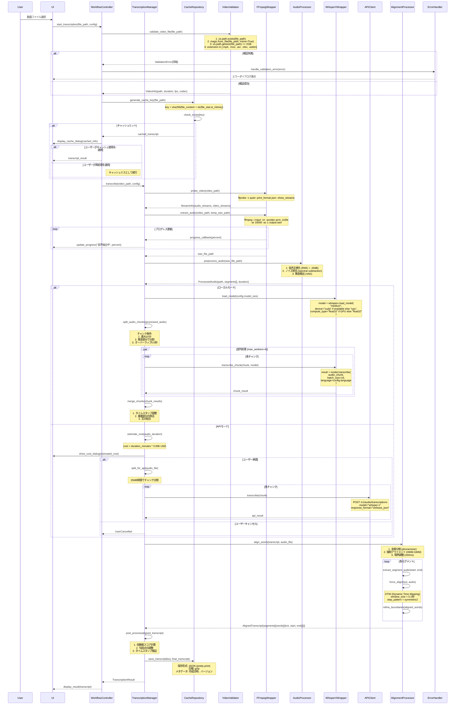
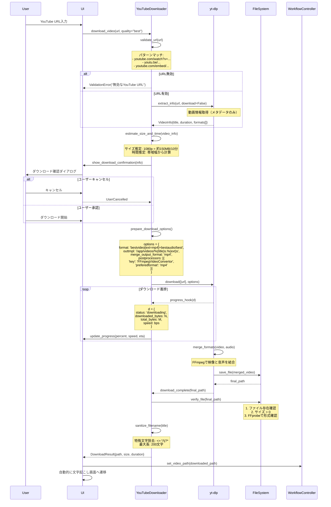
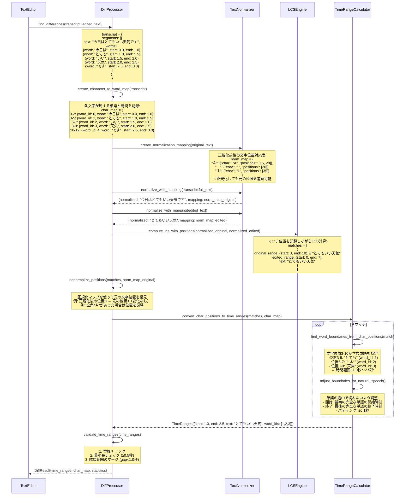
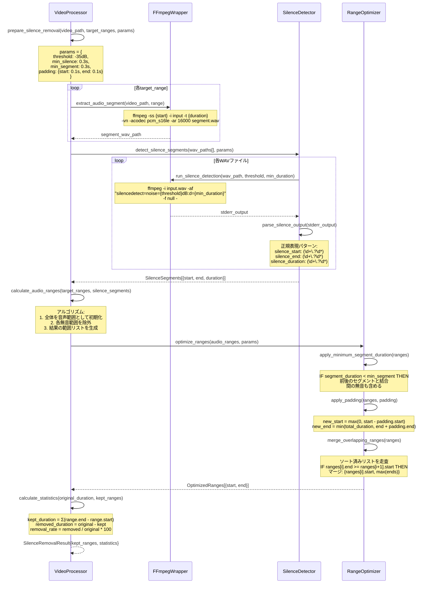

# TextffCut 詳細設計書 v3

## 1. はじめに

### 1.1 文書の目的
本文書は、TextffCutシステムの詳細設計を定義します。この設計書の通りに実装すれば、確実に動作するシステムが構築できるレベルの具体性を提供します。

### 1.2 対象読者
- 開発者（実装担当者）
- テストエンジニア
- システムアーキテクト
- 技術レビュアー

### 1.3 参照文書
- TextffCut要件定義書
- TextffCut基本設計書v2
- FFmpeg公式ドキュメント
- WhisperX技術仕様書

## 2. システムアーキテクチャ詳細

### 2.1 レイヤー構成と責務

```
┌─────────────────────────────────────────────┐
│        プレゼンテーション層                    │
│  - Streamlit Components                     │
│  - セッション状態管理                          │
│  - イベントハンドリング                        │
├─────────────────────────────────────────────┤
│         アプリケーション層                     │
│  - ワークフロー制御                           │
│  - トランザクション管理                        │
│  - 進捗管理                                  │
├─────────────────────────────────────────────┤
│        ビジネスロジック層                      │
│  - 文字起こし処理                            │
│  - 動画処理                                  │
│  - テキスト処理                              │
├─────────────────────────────────────────────┤
│         データアクセス層                       │
│  - ファイルI/O                               │
│  - キャッシュ管理                            │
│  - 設定管理                                  │
├─────────────────────────────────────────────┤
│         インフラストラクチャ層                 │
│  - FFmpegラッパー                            │
│  - WhisperXラッパー                          │
│  - 外部API通信                               │
└─────────────────────────────────────────────┘
```

### 2.2 モジュール間通信

| 通信元 | 通信先 | インターフェース | データ形式 |
|--------|--------|-----------------|------------|
| UI層 | アプリ層 | 関数呼び出し | Pythonオブジェクト |
| アプリ層 | ビジネス層 | 非同期関数 | Pydanticモデル |
| ビジネス層 | データ層 | Repository pattern | 辞書/JSON |
| データ層 | インフラ層 | Wrapper関数 | プリミティブ型 |

## 3. 主要処理の詳細シーケンス

### 3.1 文字起こし処理完全シーケンス



### 3.2 YouTube動画ダウンロード処理



### 3.3 テキスト差分検出の詳細処理（正規化とタイムスタンプ整合性）



#### 差分検出の重要ポイント：正規化とタイムスタンプの整合性

**問題**: テキストを正規化（全角→半角変換など）すると、文字位置がずれてタイムスタンプとの対応が失われる

**解決策**: 
1. **文字単位のインデックスマップ**: 各文字がどの単語に属し、その単語の時間情報を保持
2. **正規化マッピングテーブル**: 正規化前後の文字位置の対応関係を記録
3. **逆変換処理**: LCS計算後、正規化前の位置に戻してからタイムスタンプを取得

**具体例**:
```
元テキスト: "今日は　とても　いい天気です"  # 全角スペース
正規化後:   "今日は とても いい天気です"    # 半角スペース

正規化マップ:
- 位置3の全角スペース → 半角スペースに変換
- 位置9の全角スペース → 半角スペースに変換

文字→単語マップ:
- "今日は"（位置0-2） → word_id:0, time:0.0-1.0
- "とても"（位置4-6） → word_id:1, time:1.0-1.5  # 正規化前の位置で管理
```

### 3.4 無音削除処理の詳細



## 4. データ構造とアルゴリズム詳細

### 4.1 主要データ構造の完全定義

#### 4.1.1 Transcript構造体

```
Transcript:
  video_id: str          # SHA256ハッシュ (64文字)
  language: str          # ISO 639-1 (例: "ja", "en")
  model: str             # モデル名 (例: "whisper-medium")
  segments: Segment[]    # セグメント配列
  created_at: datetime   # ISO 8601形式
  processing_time: float # 秒単位、小数第2位まで
  metadata: dict         # 追加情報
    - audio_duration: float
    - total_words: int
    - confidence_avg: float

Segment:
  id: int               # 1から始まる連番
  start: float          # 開始時間（秒、小数第3位まで）
  end: float            # 終了時間（秒、小数第3位まで）
  text: str             # セグメントのテキスト
  words: Word[]         # 単語配列
  confidence: float     # 0.0-1.0

Word:
  word: str             # 単語テキスト
  start: float          # 開始時間（秒、小数第3位まで）
  end: float            # 終了時間（秒、小数第3位まで）
  confidence: float     # 0.0-1.0
  phonemes: str[]       # 音素配列（オプション）
```

#### 4.1.2 時間範囲の表現

```
TimeRange:
  start: float          # 開始時間（秒）
  end: float            # 終了時間（秒）
  text: str             # 対応するテキスト（オプション）
  segment_ids: int[]    # 含まれるセグメントID
  confidence: float     # マッチ信頼度
  
  検証条件:
  - 0 <= start < end
  - end <= video_duration
  - end - start >= 0.1 (最小長)
```

### 4.2 重要アルゴリズムの詳細

#### 4.2.1 LCS（最長共通部分列）アルゴリズム

```
入力:
  X: 文字列（長さm）
  Y: 文字列（長さn）

出力:
  matches: [(x_start, x_end, y_start, y_end)]

アルゴリズム:
1. DPテーブル初期化
   dp[m+1][n+1] = 0
   
2. DPテーブル構築
   for i = 1 to m:
     for j = 1 to n:
       if X[i-1] == Y[j-1]:
         dp[i][j] = dp[i-1][j-1] + 1
       else:
         dp[i][j] = max(dp[i-1][j], dp[i][j-1])

3. バックトラック
   i = m, j = n
   matches = []
   current_match = null
   
   while i > 0 and j > 0:
     if X[i-1] == Y[j-1]:
       if current_match is null:
         current_match = {x_end: i, y_end: j}
       current_match.x_start = i
       current_match.y_start = j
       i -= 1
       j -= 1
     else:
       if current_match is not null:
         matches.append(current_match)
         current_match = null
       if dp[i-1][j] > dp[i][j-1]:
         i -= 1
       else:
         j -= 1

計算量:
  時間: O(mn)
  空間: O(mn) → Hirschberg法で O(min(m,n))
```

#### 4.2.2 音声レベル計算（RMS）

```
入力:
  samples: int16[]     # 音声サンプル配列
  frame_size: int      # フレームサイズ（サンプル数）
  hop_size: int        # ホップサイズ（サンプル数）

出力:
  rms_values: float[]  # 各フレームのRMS値（dB）

アルゴリズム:
1. フレーム分割
   num_frames = (len(samples) - frame_size) // hop_size + 1
   
2. 各フレームのRMS計算
   for i in range(num_frames):
     start = i * hop_size
     end = start + frame_size
     frame = samples[start:end]
     
     # RMS計算
     sum_squares = sum(s^2 for s in frame)
     rms_linear = sqrt(sum_squares / frame_size)
     
     # dB変換（16bitの最大値で正規化）
     if rms_linear > 0:
       rms_db = 20 * log10(rms_linear / 32768)
     else:
       rms_db = -inf
     
     rms_values[i] = rms_db

パラメータ設定:
  frame_size = 320     # 20ms @ 16kHz
  hop_size = 160       # 10ms @ 16kHz
```

#### 4.2.3 セグメント結合アルゴリズム

```
入力:
  segments: TimeRange[]     # ソート済みセグメント
  min_gap: float           # 結合する最小間隔（秒）
  min_duration: float      # 最小セグメント長（秒）

出力:
  merged: TimeRange[]      # 結合後のセグメント

アルゴリズム:
1. 初期化
   merged = []
   current = segments[0]
   
2. 結合処理
   for i = 1 to len(segments)-1:
     next = segments[i]
     gap = next.start - current.end
     
     # 結合条件判定
     should_merge = (
       gap <= min_gap OR
       current.duration < min_duration OR
       next.duration < min_duration
     )
     
     if should_merge:
       # 結合
       current.end = next.end
       current.text += " " + next.text
       current.segment_ids.extend(next.segment_ids)
     else:
       # 現在のセグメントを確定
       merged.append(current)
       current = next
   
   # 最後のセグメント追加
   merged.append(current)

3. 最小長の再確認
   # 結合後も短いセグメントがある場合の処理
   再度結合処理を実行（最大3回まで）
```

## 5. エラー処理とリカバリー詳細

### 5.1 エラー分類と処理戦略

| エラー種別 | 検出方法 | リカバリー戦略 | ユーザー通知 |
|-----------|---------|---------------|-------------|
| **ファイル読み取りエラー** | OSError, IOError | 3回リトライ後、エラー通知 | 「ファイルにアクセスできません。他のアプリで開いていないか確認してください。」 |
| **メモリ不足** | MemoryError, psutil監視 | チャンクサイズを50%削減して再試行 | 「メモリが不足しています。設定を調整して再実行します。」 |
| **FFmpegエラー** | returncode != 0 | コーデック変更して再試行 | 「動画の処理に失敗しました。形式: {format}」 |
| **API接続エラー** | ConnectionError, Timeout | 指数バックオフでリトライ（1s, 2s, 4s） | 「APIに接続できません。ローカルモードに切り替えますか？」 |
| **APIレート制限** | HTTP 429 | 待機時間後に自動再試行 | 「API利用制限に達しました。{wait_time}秒後に再開します。」 |
| **文字起こし失敗** | 信頼度 < 0.3 | 音声前処理を強化して再試行 | 「音声認識の精度が低いです。ノイズ除去を適用しますか？」 |

### 5.2 エラーハンドリングフロー

```
try:
    # メイン処理
    result = process()
    
except ValidationError as e:
    # 入力検証エラー（リトライ不要）
    log.warning(f"Validation failed: {e}")
    show_error_dialog(
        title="入力エラー",
        message=str(e),
        details=e.details
    )
    return None
    
except MemoryError as e:
    # メモリエラー（パラメータ調整して再試行）
    log.error(f"Memory error: {e}")
    if retry_count < 3:
        adjust_memory_parameters()
        return retry_with_adjusted_params()
    else:
        show_critical_error("メモリ不足で処理を継続できません")
        
except APIError as e:
    # APIエラー（フォールバック可能）
    log.error(f"API error: {e.status_code} - {e.message}")
    if e.status_code == 429:  # Rate limit
        wait_time = int(e.headers.get('Retry-After', 60))
        return retry_after_wait(wait_time)
    elif can_fallback_to_local():
        return fallback_to_local_processing()
    else:
        show_api_error_dialog(e)
        
except Exception as e:
    # 予期しないエラー
    log.critical(f"Unexpected error: {e}", exc_info=True)
    
    # クラッシュレポート生成
    crash_report = generate_crash_report(e)
    save_crash_report(crash_report)
    
    # ユーザー通知
    show_unexpected_error_dialog(
        message="予期しないエラーが発生しました",
        report_path=crash_report.path
    )
    
finally:
    # クリーンアップ
    cleanup_temp_files()
    release_resources()
```

### 5.3 チェックポイントとリカバリー

```
チェックポイント保存タイミング:
1. 音声抽出完了時
   - 保存内容: WAVファイルパス、メタデータ
   
2. 文字起こし各チャンク完了時
   - 保存内容: 完了チャンク、部分的な結果
   
3. アライメント完了時
   - 保存内容: アライメント済みトランスクリプト
   
4. 各編集操作後
   - 保存内容: 編集状態、時間範囲

リカバリー処理:
1. アプリ起動時にリカバリーファイル確認
2. 未完了の処理を検出
3. ユーザーに再開オプションを提示
4. 承認されたら最後のチェックポイントから再開
```

## 6. パフォーマンス最適化詳細

### 6.1 並列処理の実装

```
並列化可能な処理:
1. 音声チャンクの文字起こし
   - 最大ワーカー数: min(4, CPU数 * 0.75)
   - チャンクサイズ: 10分（600秒）
   - オーバーラップ: 0.5秒

2. 動画セグメントの抽出
   - 最大同時処理: 3
   - I/Oバウンドのため制限

3. 無音検出
   - セグメントごとに並列実行
   - CPU数に応じて自動調整

実装方法:
- CPUバウンド: ProcessPoolExecutor
- I/Oバウンド: ThreadPoolExecutor
- 非同期処理: asyncio
```

### 6.2 メモリ管理戦略

```
メモリ使用量の推定:
- 音声データ: duration_sec * 16000 * 2 bytes
- 文字起こしモデル: 1.5GB (medium)
- 作業用バッファ: 500MB
- 合計: model_size + audio_size + buffer

メモリ制限の実装:
1. Docker割り当ての80%を上限に設定
2. 処理前にメモリチェック
3. 不足時は以下を調整:
   - バッチサイズ: 16 → 8 → 4
   - チャンクサイズ: 600秒 → 300秒 → 150秒
   - ワーカー数: 4 → 2 → 1

ガベージコレクション:
- 大きなオブジェクト解放後に明示的にGC実行
- 循環参照の回避
- weakrefの活用
```

### 6.3 キャッシュ戦略

```
キャッシュキー生成:
key = sha256(
    file_content_hash +
    str(file_mtime) +
    model_name +
    language_code
).hexdigest()

キャッシュ構造:
cache/
├── {key}/
│   ├── manifest.json      # メタデータ
│   ├── transcript.json.gz # 圧縮済み結果
│   └── checksum.txt       # 整合性確認用

キャッシュ有効性:
- ファイル変更検出: mtime + size
- 整合性確認: SHA256チェックサム
- バージョン管理: スキーマバージョン
```

## 7. プラットフォーム別実装詳細

### 7.1 Docker環境

```
ディレクトリ構造:
/app/
├── videos/      # 入力動画（ホストとマウント）
├── cache/       # キャッシュ（永続化）
├── temp/        # 一時ファイル（tmpfs推奨）
├── output/      # 出力ファイル（ホストとマウント）
└── config/      # 設定ファイル（永続化）

環境変数:
DOCKER_ENV=true
PYTHONUNBUFFERED=1
CUDA_VISIBLE_DEVICES=0 (GPU使用時)

メモリ設定:
- 推奨: 8GB以上
- 最小: 4GB（機能制限あり）
```

### 7.2 OS別の注意事項

| OS | パス処理 | 改行コード | 特殊考慮 |
|----|---------|-----------|---------|
| **Windows** | Path.as_posix() | CRLF→LF変換 | WSL2推奨、UAC確認 |
| **macOS** | UTF-8正規化 | LF | Apple Silicon対応 |
| **Linux** | そのまま | LF | SELinux/AppArmor |

## 8. 外部ツールインターフェース

### 8.1 FFmpeg実行詳細

```
基本的な実行パターン:

1. プローブ実行
   ffprobe -v quiet -print_format json -show_format -show_streams {input}

2. 音声抽出
   ffmpeg -i {input} -vn -acodec pcm_s16le -ar 16000 -ac 1 {output}

3. 無音検出
   ffmpeg -i {input} -af "silencedetect=n=-35dB:d=0.3" -f null -

4. セグメント抽出
   ffmpeg -ss {start} -i {input} -t {duration} -c copy {output}

5. 動画結合
   ffmpeg -f concat -safe 0 -i {list.txt} -c copy {output}

エラーハンドリング:
- returncode確認
- stderrのパース
- プログレス情報の抽出（正規表現）
```

### 8.2 WhisperX実行詳細

```
モデルロード:
model = whisperx.load_model(
    model_size,
    device="cuda" if torch.cuda.is_available() else "cpu",
    compute_type="float16" if device=="cuda" else "float32",
    language=language_code
)

文字起こし実行:
result = model.transcribe(
    audio_path,
    batch_size=batch_size,
    language=language,
    task="transcribe",
    chunk_length=30,
    print_progress=False
)

アライメント実行:
model_a, metadata = whisperx.load_align_model(
    language_code=language,
    device=device
)

result_aligned = whisperx.align(
    result["segments"],
    model_a,
    metadata,
    audio_path,
    device
)
```

## 9. セッション管理詳細

### 9.1 Streamlitセッション状態

```
初期化:
if 'initialized' not in st.session_state:
    st.session_state.update({
        'initialized': True,
        'current_step': 'file_selection',
        'video_path': None,
        'video_info': None,
        'transcript': None,
        'edited_text': '',
        'time_ranges': [],
        'processing': False,
        'progress': 0.0,
        'progress_text': '',
        'error': None,
        'settings': load_user_settings()
    })

状態遷移:
file_selection → transcription → text_editing → 
timeline_editing → export → completed

各状態での検証:
- 前の状態が完了していること
- 必要なデータが存在すること
- エラー状態でないこと
```

### 9.2 進捗管理

```
進捗更新の実装:
def update_progress(task: str, progress: float, detail: str = ""):
    st.session_state.progress = progress
    st.session_state.progress_text = f"{task}: {progress*100:.0f}%"
    if detail:
        st.session_state.progress_text += f" - {detail}"
    
    # UIの更新
    progress_bar.progress(progress)
    status_text.text(st.session_state.progress_text)

進捗計算:
- 音声抽出: 0-10%
- 文字起こし: 10-70%
- アライメント: 70-90%
- 後処理: 90-100%
```

## 10. テスト仕様

### 10.1 単体テストケース

| テスト対象 | テストケース | 期待結果 | 境界値 |
|-----------|-------------|---------|--------|
| ファイル検証 | 2GB丁度のファイル | 成功 | 2,147,483,648 bytes |
| ファイル検証 | 2GB+1バイト | エラー | 2,147,483,649 bytes |
| LCS計算 | 10000文字の比較 | 1秒以内 | - |
| 無音検出 | -35dB丁度 | 無音判定 | 閾値境界 |
| 無音検出 | -34.9dB | 音声判定 | 閾値境界 |

### 10.2 統合テストシナリオ

```
シナリオ1: 正常系フロー
1. 10分のMP4動画を選択
2. ローカルモードで文字起こし
3. テキストの50%を編集
4. 無音削除を適用
5. FCPXMLでエクスポート
期待: 全工程がエラーなく完了

シナリオ2: エラーリカバリー
1. 90分の動画で処理開始
2. 50%でプロセスを強制終了
3. アプリを再起動
4. リカバリーダイアログから再開
期待: 中断点から正常に再開

シナリオ3: リソース制限
1. メモリ4GB環境で実行
2. 60分動画を処理
期待: 自動的にパラメータ調整して完了
```

## 11. 実装チェックリスト

### 11.1 必須実装項目

- [ ] ファイル検証（形式、サイズ、アクセス権）
- [ ] キャッシュ機能（生成、読込、検証）
- [ ] 音声抽出（FFmpeg統合）
- [ ] 文字起こし（ローカル/API切替）
- [ ] アライメント処理
- [ ] テキスト差分検出（LCS実装）
- [ ] 無音削除
- [ ] 動画結合
- [ ] FCPXML生成
- [ ] エラーハンドリング
- [ ] 進捗表示
- [ ] セッション管理

### 11.2 品質基準

| 項目 | 基準 | 測定方法 |
|------|------|----------|
| 処理速度 | 90分動画を30分以内 | 実測 |
| メモリ使用 | Docker割当の80%以下 | psutil監視 |
| エラー率 | 1%以下 | ログ分析 |
| 文字起こし精度 | 85%以上 | WER測定 |

---

**作成日**: 2025-06-22  
**バージョン**: 3.0  
**次回更新**: 実装完了時のフィードバック反映