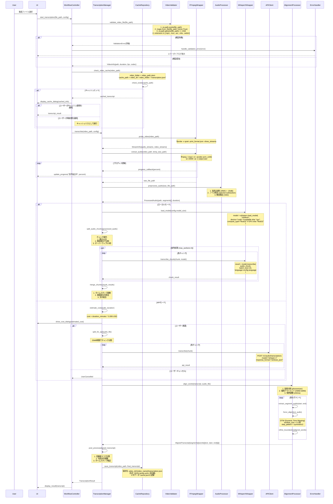
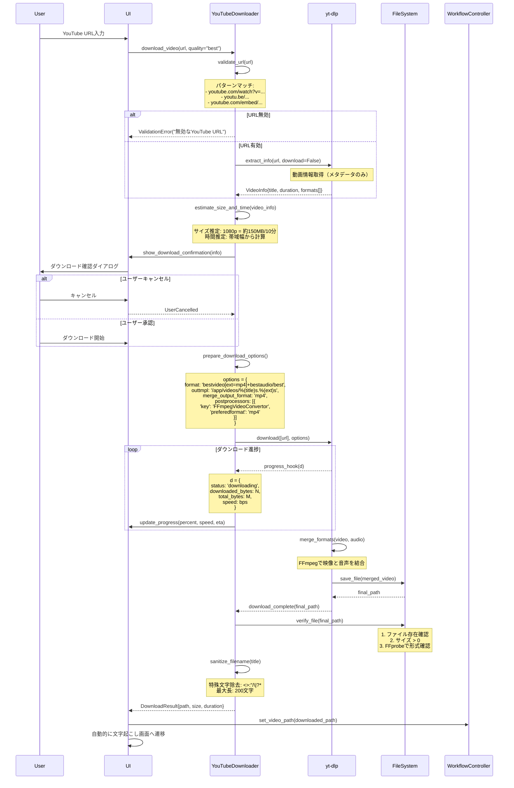
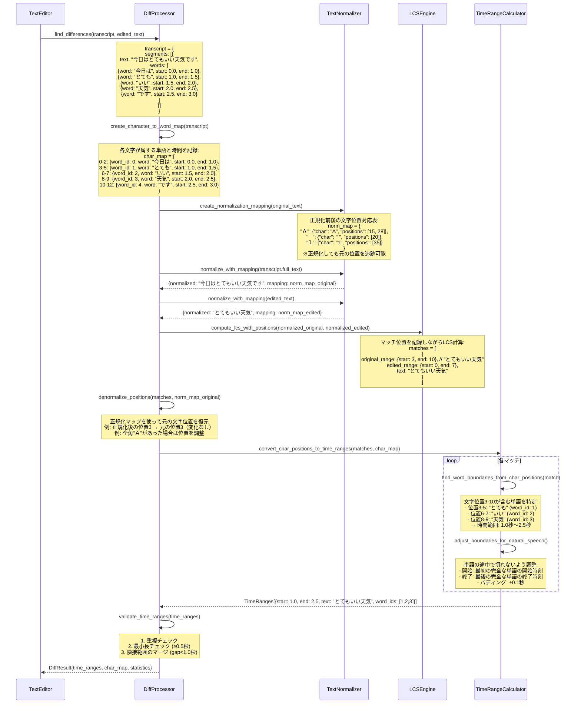
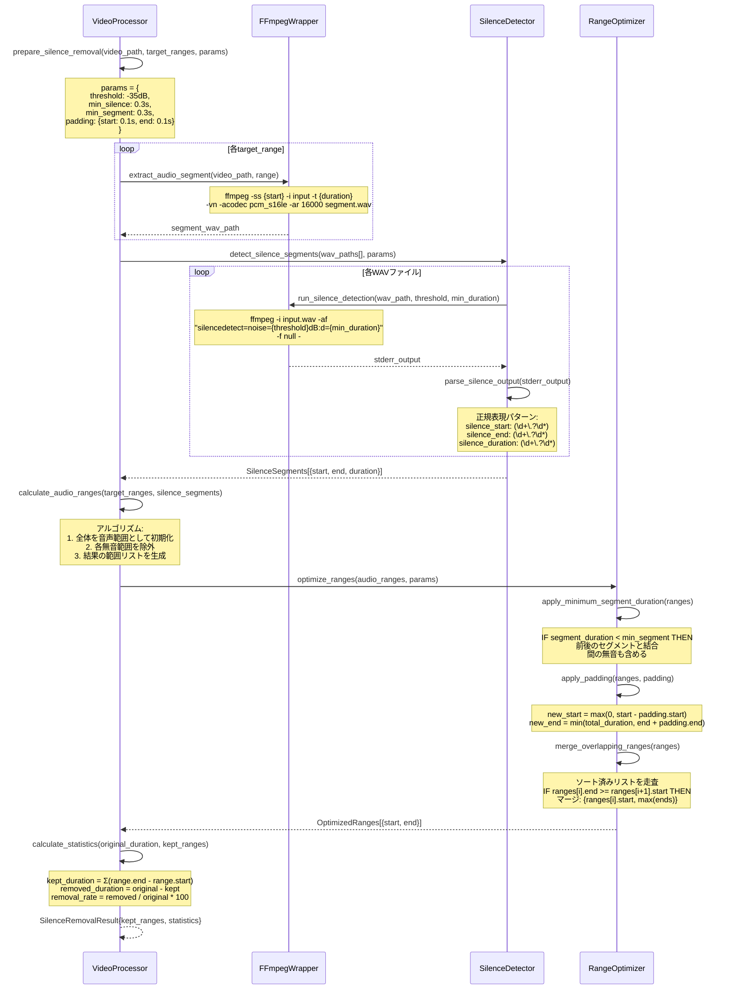

# TextffCut 詳細設計書 v3

## 1. はじめに

### 1.1 文書の目的
本文書は、TextffCutシステムの詳細設計を定義します。この設計書の通りに実装すれば、確実に動作するシステムが構築できるレベルの具体性を提供します。

### 1.2 対象読者
- 開発者（実装担当者）
- テストエンジニア
- システムアーキテクト
- 技術レビュアー

### 1.3 参照文書
- TextffCut要件定義書
- TextffCut基本設計書v2
- FFmpeg公式ドキュメント
- WhisperX技術仕様書

## 2. 要件トレーサビリティマトリクス

### 2.1 要件からモジュールへの対応表

| 要件ID | 要件概要 | 対応モジュール | テストケースID |
|--------|----------|----------------|----------------|
| REQ-001 | YouTube動画ダウンロード | core.youtube_downloader | TC-001〜TC-003 |
| REQ-002 | ローカル版文字起こし | core.transcription.LocalTranscriber | TC-004〜TC-008 |
| REQ-003 | API版文字起こし | core.transcription_api.APITranscriber | TC-009〜TC-012 |
| REQ-004 | テキスト編集（diff表示） | ui.components.text_editor | TC-013〜TC-015 |
| REQ-005 | タイムライン編集 | ui.components.timeline_editor | TC-016〜TC-020 |
| REQ-006 | 無音検出・削除 | core.video.VideoProcessor | TC-021〜TC-025 |
| REQ-007 | 動画切り出し・結合 | core.video.VideoProcessor | TC-026〜TC-030 |
| REQ-008 | FCPXMLエクスポート | core.export.FCPXMLExporter | TC-031〜TC-033 |
| REQ-009 | Premiere XMLエクスポート | core.export.PremiereExporter | TC-034〜TC-036 |
| REQ-010 | SRT字幕エクスポート | core.export.SRTExporter | TC-037〜TC-038 |
| REQ-011 | キャッシュ管理 | utils.cache_manager | TC-039〜TC-042 |
| REQ-012 | 設定管理（永続化） | config.ConfigManager | TC-043〜TC-045 |

### 2.2 モジュール間依存関係と影響分析

| 変更対象モジュール | 影響を受けるモジュール | 影響内容 |
|-------------------|---------------------|----------|
| core.transcription | ui.components.text_editor | 文字起こし結果形式変更 |
| core.video | core.export.* | セグメント情報の変更 |
| utils.cache_manager | 全モジュール | キャッシュ形式の変更 |
| config.py | 全モジュール | 設定項目の追加/変更 |

### 2.3 テストケース分類

| 分類 | テストケースID範囲 | カバレッジ目標 |
|------|-------------------|---------------|
| 単体テスト | TC-001〜TC-050 | 90% |
| 統合テスト | TC-051〜TC-070 | 主要フロー100% |
| E2Eテスト | TC-071〜TC-080 | ユーザーシナリオ100% |
| 境界値テスト | TC-081〜TC-090 | エッジケース網羅 |
| エラーテスト | TC-091〜TC-100 | 異常系100% |

## 3. システムアーキテクチャ詳細

### 3.1 レイヤー構成と責務

```
┌─────────────────────────────────────────────┐
│        プレゼンテーション層                    │
│  - Streamlit Components                     │
│  - セッション状態管理                          │
│  - イベントハンドリング                        │
├─────────────────────────────────────────────┤
│         アプリケーション層                     │
│  - ワークフロー制御                           │
│  - トランザクション管理                        │
│  - 進捗管理                                  │
├─────────────────────────────────────────────┤
│        ビジネスロジック層                      │
│  - 文字起こし処理                            │
│  - 動画処理                                  │
│  - テキスト処理                              │
├─────────────────────────────────────────────┤
│         データアクセス層                       │
│  - ファイルI/O                               │
│  - キャッシュ管理                            │
│  - 設定管理                                  │
├─────────────────────────────────────────────┤
│         インフラストラクチャ層                 │
│  - FFmpegラッパー                            │
│  - WhisperXラッパー                          │
│  - 外部API通信                               │
└─────────────────────────────────────────────┘
```

### 3.2 モジュール間通信

| 通信元 | 通信先 | インターフェース | データ形式 |
|--------|--------|-----------------|------------|
| UI層 | アプリ層 | 関数呼び出し | Pythonオブジェクト |
| アプリ層 | ビジネス層 | 非同期関数 | Pydanticモデル |
| ビジネス層 | データ層 | Repository pattern | 辞書/JSON |
| データ層 | インフラ層 | Wrapper関数 | プリミティブ型 |

## 4. 主要処理の詳細シーケンス

### 4.1 文字起こし処理完全シーケンス



### 3.2 YouTube動画ダウンロード処理



### 3.3 テキスト差分検出の詳細処理（正規化とタイムスタンプ整合性）



#### 差分検出の重要ポイント：正規化とタイムスタンプの整合性

**問題**: テキストを正規化（全角→半角変換など）すると、文字位置がずれてタイムスタンプとの対応が失われる

**解決策**: 
1. **文字単位のインデックスマップ**: 各文字がどの単語に属し、その単語の時間情報を保持
2. **正規化マッピングテーブル**: 正規化前後の文字位置の対応関係を記録
3. **逆変換処理**: LCS計算後、正規化前の位置に戻してからタイムスタンプを取得

**具体例**:
```
元テキスト: "今日は　とても　いい天気です"  # 全角スペース
正規化後:   "今日は とても いい天気です"    # 半角スペース

正規化マップ:
- 位置3の全角スペース → 半角スペースに変換
- 位置9の全角スペース → 半角スペースに変換

文字→単語マップ:
- "今日は"（位置0-2） → word_id:0, time:0.0-1.0
- "とても"（位置4-6） → word_id:1, time:1.0-1.5  # 正規化前の位置で管理
```

### 3.4 無音削除処理の詳細



## 4. データ構造とアルゴリズム詳細

### 4.1 主要データ構造の完全定義

#### 4.1.1 Transcript構造体

```
Transcript:
  video_id: str          # SHA256ハッシュ (64文字)
  language: str          # ISO 639-1 (例: "ja", "en")
  model: str             # モデル名 (例: "whisper-medium")
  segments: Segment[]    # セグメント配列
  created_at: datetime   # ISO 8601形式
  processing_time: float # 秒単位、小数第2位まで
  metadata: dict         # 追加情報
    - audio_duration: float
    - total_words: int
    - confidence_avg: float

Segment:
  id: int               # 1から始まる連番
  start: float          # 開始時間（秒、小数第3位まで）
  end: float            # 終了時間（秒、小数第3位まで）
  text: str             # セグメントのテキスト
  words: Word[]         # 単語配列
  confidence: float     # 0.0-1.0

Word:
  word: str             # 単語テキスト
  start: float          # 開始時間（秒、小数第3位まで）
  end: float            # 終了時間（秒、小数第3位まで）
  confidence: float     # 0.0-1.0
  phonemes: str[]       # 音素配列（オプション）
```

#### 4.1.2 時間範囲の表現

```
TimeRange:
  start: float          # 開始時間（秒）
  end: float            # 終了時間（秒）
  text: str             # 対応するテキスト（オプション）
  segment_ids: int[]    # 含まれるセグメントID
  confidence: float     # マッチ信頼度
  
  検証条件:
  - 0 <= start < end
  - end <= video_duration
  - end - start >= 0.1 (最小長)
```

### 4.2 重要アルゴリズムの詳細

#### 4.2.1 LCS（最長共通部分列）アルゴリズム

**目的**: 原文と編集文の共通部分を効率的に検出し、削除された文字の位置を特定する。

**処理概要**:
1️⃣ **動的計画法テーブルの構築**
   - 原文（長さm）と編集文（長さn）に対して(m+1)×(n+1)のテーブルを作成
   - 各セルに「その位置までの最長共通部分列の長さ」を記録
   - 文字が一致する場合は左上セルの値+1、不一致の場合は上か左の最大値を採用

2️⃣ **バックトラッキングによるマッチ位置の特定**
   - テーブルの右下から左上に向かって逆算
   - 文字が一致している箇所を連続的なマッチ区間として記録
   - マッチ区間の境界で区切り、削除された部分を特定

3️⃣ **性能特性**
   - 時間計算量：文字数の積に比例（10,000文字同士なら約1億回の計算）
   - 空間効率化：Hirschberg法により、メモリ使用量を最小文字数に比例する量まで削減可能
   - 実用上の制限：20,000文字を超える場合は分割処理を推奨

#### 4.2.2 音声レベル計算（RMS）

**目的**: 音声データから無音区間を検出するため、時間窓ごとの音量レベルを計算する。

**処理概要**:
1️⃣ **音声データの窓分割**
   - 16kHzサンプリングの音声を20ミリ秒の窓（320サンプル）に分割
   - 10ミリ秒ずつスライド（50%オーバーラップ）して詳細な変化を捉える
   - 90分の動画では約54万個の窓が生成される

2️⃣ **RMS（二乗平均平方根）による音量計算**
   - 各窓内の音声サンプルを二乗して平均を取り、平方根を計算
   - これにより瞬間的なノイズの影響を抑えた安定した音量値を取得
   - 16ビット音声の最大値（32768）で正規化

3️⃣ **デシベル変換と無音判定**
   - 線形スケールの音量値を人間の聴覚に近い対数スケール（dB）に変換
   - -35dB以下を無音と判定（調整可能：-60〜-20dB）
   - 完全無音の場合は負の無限大として処理

**パラメータの意味**:
- 窓サイズ20ms：音声の基本周波数（50-400Hz）を捉えるのに十分な長さ
- オーバーラップ50%：急激な音量変化を見逃さないための安全マージン

#### 4.2.3 セグメント結合アルゴリズム

**目的**: 細切れになった音声セグメントを適切に結合し、自然な編集結果を生成する。

**処理概要**:
1️⃣ **結合判定の3条件**
   - **間隔条件**: セグメント間の無音が0.3秒以下なら結合（短い息継ぎは残す）
   - **最小長条件**: 0.3秒未満の短いセグメントは前後と結合（言い淀みの除去）
   - **コンテキスト保持**: 短いセグメントでも重要な単語なら独立させる

2️⃣ **結合処理の実行**
   - 時系列順にセグメントを走査し、条件を満たす隣接セグメントを統合
   - テキストは空白で連結し、セグメントIDリストも統合
   - 結合により新たに短いセグメントが生まれた場合は再評価

3️⃣ **品質保証**
   - 結合後も元の音声タイミング情報は保持（後で分割可能）
   - 過度な結合を防ぐため、5秒を超える結合は警告
   - ユーザーが後から結合パラメータを調整できるよう設計

4️⃣ **最終処理と再評価**
   - 走査完了後、最後のセグメントを結果リストに追加
   - 結合後も0.3秒未満のセグメントが残っている場合は、再度結合処理を実行
   - 無限ループを防ぐため、再結合は最大3回までに制限
   - 各反復で結合条件を緩和（間隔を0.5秒、1.0秒と段階的に拡大）

## 5. エラー処理とリカバリー詳細

### 5.1 エラー分類と処理戦略

| エラー種別 | 検出方法 | リカバリー戦略 | ユーザー通知 |
|-----------|---------|---------------|-------------|
| **ファイル読み取りエラー** | OSError, IOError | 3回リトライ後、エラー通知 | 「ファイルにアクセスできません。他のアプリで開いていないか確認してください。」 |
| **メモリ不足** | MemoryError, psutil監視 | チャンクサイズを50%削減して再試行 | 「メモリが不足しています。設定を調整して再実行します。」 |
| **FFmpegエラー** | returncode != 0 | コーデック変更して再試行 | 「動画の処理に失敗しました。形式: {format}」 |
| **API接続エラー** | ConnectionError, Timeout | 指数バックオフでリトライ（1s, 2s, 4s） | 「APIに接続できません。ローカルモードに切り替えますか？」 |
| **APIレート制限** | HTTP 429 | 待機時間後に自動再試行 | 「API利用制限に達しました。{wait_time}秒後に再開します。」 |
| **文字起こし失敗** | 信頼度 < 0.3 | 音声前処理を強化して再試行 | 「音声認識の精度が低いです。ノイズ除去を適用しますか？」 |

### 5.2 エラーハンドリングフロー

**エラー種別に応じた段階的な処理戦略**:

1️⃣ **入力検証エラー（ValidationError）**
   - リトライ不要のエラーとして即座にユーザーに通知
   - 警告レベルのログに記録し、詳細なエラー情報をダイアログで表示
   - 処理を中断してNoneを返し、ユーザーの修正を待つ

2️⃣ **メモリ不足エラー（MemoryError）**
   - 最大3回まで自動的にパラメータを調整して再試行
   - チャンクサイズやバッチサイズを段階的に削減
   - 3回失敗したら重大エラーとしてユーザーに通知

3️⃣ **API関連エラー（APIError）**
   - レート制限（429）の場合：Retry-Afterヘッダーの時間だけ待機後に自動再試行
   - 接続エラーの場合：ローカル処理へのフォールバックを試みる
   - フォールバック不可の場合：APIエラー専用のダイアログを表示

4️⃣ **予期しないエラー（Exception）**
   - 重大エラーとしてスタックトレース付きでログ記録
   - クラッシュレポートを生成して後の分析用に保存
   - ユーザーには分かりやすいエラーメッセージとレポートパスを表示

5️⃣ **必須クリーンアップ処理（finally）**
   - エラーの有無に関わらず必ず実行
   - 一時ファイルの削除とシステムリソースの解放
   - クリーンアップ失敗時もアプリケーションは継続

### 5.3 チェックポイントとリカバリー

```
チェックポイント保存タイミング:
1. 音声抽出完了時
   - 保存内容: WAVファイルパス、メタデータ
   
2. 文字起こし各チャンク完了時
   - 保存内容: 完了チャンク、部分的な結果
   
3. アライメント完了時
   - 保存内容: アライメント済みトランスクリプト
   
4. 各編集操作後
   - 保存内容: 編集状態、時間範囲

リカバリー処理:
1. アプリ起動時にリカバリーファイル確認
2. 未完了の処理を検出
3. ユーザーに再開オプションを提示
4. 承認されたら最後のチェックポイントから再開
```

### 5.4 ローカル環境特有のエラー処理

#### 5.4.1 Docker環境エラーメッセージ

**Docker環境固有のエラーハンドリング**:

1️⃣ **容量不足エラー** ("no space left on device")
   - Dockerの不要なイメージやコンテナを削除するコマンドを案内
   - Docker Desktopのディスク割り当て設定へのナビゲーションを提供

2️⃣ **メモリ不足エラー** ("cannot allocate memory")
   - Docker Desktopのメモリ設定画面への具体的なパスを表示
   - 推奨メモリサイズ（8GB以上）を明記
   - 設定変更後のDocker再起動をリマインド

3️⃣ **ファイルアクセス権限エラー** ("permission denied")
   - Windows/Mac別のFile Sharing設定手順を表示
   - 共有すべきフォルダの具体例を提示

4️⃣ **ポート競合エラー** ("port is already allocated")
   - 他のStreamlitインスタンスの終了方法を案内
   - docker-compose.ymlでのポート変更方法を提示

これらのエラーは自動的に検出され、ユーザーに分かりやすい日本語の解決策を表示します。

#### 5.4.2 ファイル操作の競合防止

**ファイルロック機構の実装**:

1️⃣ **ロックファイルの管理**
   - 動画ファイルと同じディレクトリに隠しファイル（.{filename}.lock）を作成
   - ロックファイルにはプロセスID、タイムスタンプ、ファイルパスを記録
   - FileLockライブラリを使用してOSレベルの排他制御を実現

2️⃣ **ロック取得の試行**
   - デフォルト1秒間ロック取得を試みる
   - 取得成功時はTrue、タイムアウト時はFalseを返す
   - 他のプロセスが使用中の場合は待機

3️⃣ **古いロックの自動解除**
   - 10分以上古いロックファイルは異常終了と判断
   - 自動的に削除して新しいロックを許可
   - クラッシュや強制終了時のデッドロックを防止

4️⃣ **コンテキストマネージャー対応**
   - with文での使用をサポート
   - ロック取得失敗時は分かりやすいエラーメッセージを表示
   - 処理終了時は確実にロックを解放

#### 5.4.3 メモリ管理とチェック

**インテリジェントなメモリ管理システム**:

1️⃣ **リアルタイムメモリ監視**
   - psutilライブラリでシステムのメモリ情報を取得
   - 使用中メモリ、利用可能メモリ、使用率をMB単位で返す
   - Docker内でもコンテナに割り当てられたメモリを正確に取得

2️⃣ **処理前のメモリ要件計算**
   - 動画サイズ×3（入力、処理、出力用）
   - モデルサイズ（tiny:500MB、base:1GB、small:2GB、medium:3GB、large:5GB）
   - 作業用バッファ500MBを加算
   - 不足時は具体的な対処法を3つ提案

3️⃣ **メモリベースの自動パラメータ調整**
   - 2GB未満：最小構成（バッチ4、チャンク5分、ワーカー1、tinyモデル）
   - 2-4GB：中間構成（バッチ8、チャンク10分、ワーカー2、baseモデル）  
   - 4GB以上：最適構成（バッチ16、チャンク15分、ワーカー4、mediumモデル）

4️⃣ **Docker環境の特別対応**
   - `/.dockerenv`ファイルの存在でDocker環境を判定
   - メモリ不足時はDocker Desktopの設定変更を案内
   - コンテナ内でのメモリ制限を考慮したアドバイス

#### 5.4.4 一時ファイルの確実なクリーンアップ

**一時ファイル管理システム**:

1️⃣ **コンテキストマネージャーによる安全な管理**
   - with文を使用して一時ディレクトリを作成
   - プレフィックス＋UUID（16進数）で一意なディレクトリ名を生成
   - 処理が正常終了・異常終了に関わらず必ずクリーンアップを実行
   - 作成したディレクトリを内部リストで追跡

2️⃣ **確実なクリーンアップ処理**
   - ディレクトリが存在する場合のみ削除を試行
   - shutil.rmtreeでディレクトリを再帰的に削除
   - エラーが発生しても無視して処理を継続（ignore_errors=True）
   - クリーンアップ失敗は警告ログに記録するが例外は投げない

3️⃣ **古い一時ファイルの自動削除**
   - デフォルトで24時間以上古いファイルを削除
   - アプリケーション起動時に自動実行
   - textffcut_プレフィックスを持つディレクトリのみ対象
   - 削除成功・失敗をログに記録

4️⃣ **使用状況の監視**
   - 一時ディレクトリ内の総ファイルサイズを計算
   - ファイル数とディレクトリ数をカウント
   - MB単位でサイズを返し、ディスク使用量を可視化
   - 定期的な監視で容量不足を事前に検知

### 5.5 処理キャンセルとグレースフルシャットダウン

**安全な処理中断メカニズム**:

1️⃣ **シグナルハンドリング**
   - Ctrl+C（SIGINT）やDockerの停止シグナル（SIGTERM）を適切に処理
   - シグナル受信時は処理中のタスクを安全に停止してからクリーンアップ
   - 強制終了ではなく、適切なタイミングでの停止を保証

2️⃣ **キャンセル状態の管理**
   - スレッドセーフな状態管理でマルチスレッド環境でも安全
   - 現在実行中のタスク名を記録して、何が中断されたか明確化
   - キャンセル要求後も進行中の処理は完了まで待機

3️⃣ **クリーンアップ処理の登録と実行**
   - 一時ファイルの削除、メモリ解放、ログのフラッシュなどを自動実行
   - 複数のクリーンアップ処理を登録可能で、エラー時も全て実行
   - クリーンアップ中のエラーもログに記録して見逃さない

4️⃣ **定期的なチェックポイント**
   - 長時間処理では5チャンクごとに進捗を保存
   - 中断時も最後のチェックポイントから再開可能
   - 各処理ループの開始時にキャンセル状態を確認

**実装のポイント**:
- 処理の各段階でキャンセルチェックを挿入し、応答性を確保
- クリーンアップは逆順で実行し、依存関係を適切に処理
- エラーとキャンセルを区別して、適切なメッセージを表示

## 6. パフォーマンス最適化詳細

### 6.1 並列処理の実装

### 6.1 並列処理最適化

**プラットフォーム別のワーカー数決定ロジック**:

1️⃣ **macOS (Apple Silicon)**
   - CPUコア数の半分をPerformance coreとみなして使用
   - 最大4ワーカーに制限（電力効率とパフォーマンスのバランス）
   - Efficiency coreはシステムタスク用に予約

2️⃣ **macOS (Intel) / Windows**
   - 全CPUコア数から1コアをOS用に予約
   - システムの快適性を保つためUIの応答性を優先

3️⃣ **Linux (Docker内)**
   - 最大4ワーカーに制限（コンテナの安定性を重視）
   - 他のコンテナとのリソース競合を回避

**メモリ基準のチャンクサイズ自動調整**:
- 2GB未満：5分チャンク（安全マージンを最大化）
- 2-4GB：10分チャンク（バランス重視）
- 4GB以上：15分チャンク（パフォーマンス優先）

**非同期チャンク処理の実行フロー**:
1️⃣ 動画を指定サイズ（既定600秒）のチャンクに分割
2️⃣ 各チャンクをプロセスプールに非同期投入
3️⃣ 各タスクは最大5分でタイムアウトし、失敗時は全体を中断
4️⃣ 正常終了したチャンク結果を元の順序でマージ
5️⃣ キャンセルチェックは各チャンク投入前に実施

### 6.2 メモリ管理戦略

**メモリ使用量の事前計算**:
1️⃣ **音声データのサイズ推定**
   - 16kHzモノラル16ビット音声：1秒あたり32KB
   - 90分動画の場合：約170MBの音声データ

2️⃣ **モデルサイズ別のメモリ要件**
   - tiny: 500MB、base: 1GB、small: 2GB、medium: 3GB、large: 5GB
   - 作業用バッファとして追加で500MB確保

**Docker環境でのメモリ制限実装**:
1️⃣ Docker Desktopの割り当てメモリの80%を上限に設定
2️⃣ 処理開始前に必要メモリを計算してチェック
3️⃣ メモリ不足時の段階的パラメータ調整：
   - 第1段階：バッチサイズを半減（16→48→4）
   - 第2段階：チャンクサイズを半減（10分→5分→2.5分）
   - 第3段階：並列数を減らす（4→2→1）

**メモリ効率化の工夫**:
- 大きなオブジェクト（動画ファイル、モデル等）の解放後にPythonのガベージコレクションを明示的に実行
- 循環参照を避ける設計でメモリリークを防止
- 大きなデータはweakrefを使用して必要時のみ保持

### 6.3 キャッシュ戦略

**キャッシュキーの生成ロジック**:
1️⃣ 動画ファイルの先頭1MBからSHA256ハッシュを計算
2️⃣ ファイルの最終更新時刻とサイズを追加
3️⃣ 使用モデル名と言語コードを結合
4️⃣ これらを組み合わせて一意なキャッシュキーを生成

**ファイル構成と命名規則**:
```
video_folder/                        # 動画と同名のフォルダ
├── transcription.json              # 文字起こし結果（整形済みJSON）
├── cache.json                      # キャッシュ情報（作成日時、バージョン等）
├── {base}_cut_001.mp4              # 切り抜きのみ（3桁連番）
├── {base}_cut_ns_001.mp4           # 切り抜き＋無音削除
├── {base}_001.fcpxml               # FCPXMLエクスポート
└── {base}_001.srt                  # 字幕ファイル
```

**キャッシュの有効性チェック**:
1️⃣ ファイルの変更検出：最終更新時刻とサイズで高速判定
2️⃣ 整合性確認：SHA256チェックサムでファイルの同一性を保証
3️⃣ バージョン管理：スキーマバージョンでフォーマット互換性を維持

## 7. プラットフォーム別実装詳細

### 7.1 Docker環境

```
ディレクトリ構造:
/app/
├── videos/              # 入力動画（ホストとマウント）
│   ├── sample_video.mp4
│   └── sample_video/    # 動画と同名のフォルダで関連データを管理
│       ├── transcription.json       # 文字起こし結果
│       ├── cache.json               # キャッシュメタデータ
│       ├── sample_video_cut_001.mp4 # 切り抜き（連番）
│       ├── sample_video_cut_ns_001.mp4 # 切り抜き＋無音削除
│       ├── sample_video_001.fcpxml  # FCPXML出力
│       └── sample_video_001.srt     # 字幕ファイル
├── temp/        # 一時ファイル（tmpfs推奨）
└── config/      # 設定ファイル（永続化）

環境変数:
DOCKER_ENV=true
PYTHONUNBUFFERED=1
CUDA_VISIBLE_DEVICES=0 (GPU使用時)

メモリ設定:
- 推奨: 8GB以上
- 最小: 4GB（機能制限あり）
```

### 7.2 OS別の注意事項

| OS | パス処理 | 改行コード | 特殊考慮 |
|----|---------|-----------|---------|
| **Windows** | Path.as_posix() | CRLF→LF変換 | WSL2推奨、UAC確認 |
| **macOS** | UTF-8正規化 | LF | Apple Silicon対応 |
| **Linux** | そのまま | LF | SELinux/AppArmor |

### 7.3 ファイル出力の連番管理

**連番付き出力ファイル名の生成ロジック**:

1️⃣ **ファイル名パターンの構築**
   - 基本形式：`{動画名}{タイプ}_{連番:03d}.{拡張子}`
   - タイプ：`_cut`（切り抜きのみ）、`_cut_ns`（切り抜き＋無音削除）、または空（その他）
   - 連番：001から始まる3桁のゼロパディング

2️⃣ **既存ファイルの連番検索**
   - 指定パターンに一致する既存ファイルをディレクトリから検索
   - ファイル名の最後の部分から連番を抽出
   - 数値以外の文字列は無視してスキップ

3️⃣ **次の連番の決定**
   - 既存ファイルがない場合：001から開始
   - 既存ファイルがある場合：最大値＋1を使用
   - 欠番があっても最大値の次を使用（例：001, 003がある場合→004）

4️⃣ **出力ファイルパスの例**
   ```
   切り抜きのみ: sample_video_cut_001.mp4
   切り抜き＋無音削除: sample_video_cut_ns_001.mp4  
   FCPXML: sample_video_001.fcpxml
   Premiere XML: sample_video_001.xml
   字幕: sample_video_001.srt
   ```

## 8. 外部ツールインターフェース

### 8.1 FFmpeg実行詳細

```
基本的な実行パターン:

1. プローブ実行
   ffprobe -v quiet -print_format json -show_format -show_streams {input}

2. 音声抽出
   ffmpeg -i {input} -vn -acodec pcm_s16le -ar 16000 -ac 1 {output}

3. 無音検出
   ffmpeg -i {input} -af "silencedetect=n=-35dB:d=0.3" -f null -

4. セグメント抽出
   ffmpeg -ss {start} -i {input} -t {duration} -c copy {output}

5. 動画結合
   ffmpeg -f concat -safe 0 -i {list.txt} -c copy {output}

エラーハンドリング:
- returncode確認
- stderrのパース
- プログレス情報の抽出（正規表現）
```

### 8.2 WhisperX実行詳細

**WhisperXの利用パターン**:

1️⃣ **モデルのロード**
   - GPUが利用可能な場合はCUDAを使用、そうでない場合はCPU
   - GPUではfloat16で高速化、CPUではfloat32で精度保持
   - 言語コードを指定して特定言語に最適化
   - モデルサイズ（tiny/base/small/medium/large）を選択

2️⃣ **文字起こしの実行**
   - 音声ファイルパスを指定
   - バッチサイズをメモリに応じて調整（4/8/16）
   - 言語とタスク（transcribe）を指定
   - 30秒ごとのチャンクで処理してメモリ効率化
   - プログレス表示は無効化（Streamlitで別途管理）

3️⃣ **アライメントの実行**
   - 言語別のアライメントモデルをロード
   - 文字起こし結果のセグメントを入力
   - 音声ファイルと照合して単語レベルのタイムスタンプを生成
   - メタデータとデバイス情報を渡して最適化

## 9. セッション管理詳細

### 9.1 Streamlitセッション状態

**セッション状態の管理**:

1️⃣ **初期化処理**
   - アプリケーション起動時に一度だけ実行
   - 必要なすべての状態変数をセッションに登録
   - ユーザー設定をファイルから読み込んで反映
   - 初期ステップは「ファイル選択」に設定

2️⃣ **状態遷移フロー**
   - ファイル選択 → 文字起こし → テキスト編集
   - → タイムライン編集 → エクスポート → 完了
   - 各ステップが完了したら次のステップに自動遷移

3️⃣ **状態検証ロジック**
   - 前のステップが正常に完了しているか確認
   - 必要なデータ（動画パス、文字起こし結果等）が存在するか検証
   - エラー状態の場合は遷移をブロック
   - 不正な状態遷移を防ぐためのガード

### 9.2 進捗管理

**リアルタイム進捗更新システム**:

1️⃣ **進捗更新ロジック**
   - タスク名、進捗率（0-1）、詳細情報を受け取る
   - セッション状態に進捗情報を保存
   - パーセンテージ表示と詳細テキストを組み合わせ
   - UIのプログレスバーとステータステキストを同時更新

2️⃣ **フェーズごとの進捗配分**
   - 音声抽出：0-10%（高速処理）
   - 文字起こし：10-70%（最も時間がかかるフェーズ）
   - アライメント：70-90%（精密な調整）
   - 後処理：90-100%（最終仕上げ）

3️⃣ **チャンク単位の細かい進捗管理**
   - 大きな処理を小さなチャンクに分割
   - 各チャンク完了時に進捗を更新
   - ユーザーに「動いている」感を与える

## 10. テスト仕様

### 10.1 単体テストケース

| テスト対象 | テストケース | 期待結果 | 境界値 |
|-----------|-------------|---------|--------|
| ファイル検証 | 2GB丁度のファイル | 成功 | 2,147,483,648 bytes |
| ファイル検証 | 2GB+1バイト | エラー | 2,147,483,649 bytes |
| LCS計算 | 10000文字の比較 | 1秒以内 | - |
| 無音検出 | -35dB丁度 | 無音判定 | 閾値境界 |
| 無音検出 | -34.9dB | 音声判定 | 閾値境界 |

### 10.2 統合テストシナリオ

**実使用を想定したテストシナリオ**:

1️⃣ **正常系フローテスト**
   - 10分のMP4動画を選択してローカルモードで文字起こし
   - 生成されたテキストの50%を削除して編集
   - 無音削除オプションを有効にして処理
   - FCPXML形式でエクスポート
   - 期待結果：全工程がエラーなく完了し、出力ファイルが生成される

2️⃣ **エラーリカバリーテスト**
   - 90分の長時間動画で文字起こし処理を開始
   - 進捗が50%に達した時点でプロセスを強制終了
   - アプリケーションを再起動
   - リカバリーダイアログから「再開」を選択
   - 期待結果：中断点から処理が再開され、残りの処理が完了する

3️⃣ **リソース制限環境テスト**
   - Dockerメモリ割り当てを4GBに制限
   - 60分の動画を処理
   - 期待結果：メモリ不足を検出し、パラメータを自動調整して処理完了

## 11. 実装チェックリスト

### 11.1 必須実装項目

- [ ] ファイル検証（形式、サイズ、アクセス権）
- [ ] キャッシュ機能（生成、読込、検証）
- [ ] 音声抽出（FFmpeg統合）
- [ ] 文字起こし（ローカル/API切替）
- [ ] アライメント処理
- [ ] テキスト差分検出（LCS実装）
- [ ] 無音削除
- [ ] 動画結合
- [ ] FCPXML生成
- [ ] エラーハンドリング
- [ ] 進捗表示
- [ ] セッション管理

### 11.2 品質基準

| 項目 | 基準 | 測定方法 |
|------|------|----------|
| 処理速度 | 90分動画を30分以内 | 実測 |
| メモリ使用 | Docker割当の80%以下 | psutil監視 |
| エラー率 | 1%以下 | ログ分析 |
| 文字起こし精度 | 85%以上 | WER測定 |

## 12. セキュリティ設計

### 12.1 コマンドインジェクション対策

#### FFmpeg/yt-dlp呼び出しの安全な実装

```python
import shlex
import subprocess
from pathlib import Path
from typing import List, Optional

class SecureCommandExecutor:
    """外部コマンドの安全な実行"""
    
    # 許可されたコマンドのホワイトリスト
    ALLOWED_COMMANDS = {
        'ffmpeg', 'ffprobe', 'yt-dlp'
    }
    
    @staticmethod
    def validate_command(command: str) -> bool:
        """コマンドの検証"""
        cmd_name = Path(command).name
        return cmd_name in SecureCommandExecutor.ALLOWED_COMMANDS
    
    @staticmethod
    def sanitize_path(path: str) -> str:
        """パスの安全性チェックとサニタイズ"""
        # パストラバーサル対策
        path = Path(path).resolve()
        
        # 許可されたディレクトリ内かチェック
        allowed_dirs = [
            Path("/app/videos"),
            Path("/tmp"),
            Path.home() / "videos"
        ]
        
        if not any(path.is_relative_to(allowed) for allowed in allowed_dirs):
            raise ValueError(f"Unauthorized path: {path}")
            
        return str(path)
    
    @staticmethod
    def build_ffmpeg_command(
        input_file: str,
        output_file: str,
        options: dict
    ) -> List[str]:
        """FFmpegコマンドの安全な構築"""
        # パスのサニタイズ
        input_file = SecureCommandExecutor.sanitize_path(input_file)
        output_file = SecureCommandExecutor.sanitize_path(output_file)
        
        # 基本コマンド
        cmd = ['ffmpeg', '-i', input_file]
        
        # オプションの安全な追加
        safe_options = {
            'codec': ['-c:v', '-c:a'],
            'bitrate': ['-b:v', '-b:a'],
            'framerate': ['-r'],
            'resolution': ['-s'],
            'duration': ['-t'],
            'start_time': ['-ss']
        }
        
        for key, value in options.items():
            if key in safe_options:
                for flag in safe_options[key]:
                    cmd.extend([flag, str(value)])
        
        cmd.append(output_file)
        return cmd
    
    @staticmethod
    def execute_command(
        command: List[str],
        timeout: int = 3600
    ) -> subprocess.CompletedProcess:
        """コマンドの安全な実行"""
        # コマンド検証
        if not command or not SecureCommandExecutor.validate_command(command[0]):
            raise ValueError("Invalid command")
        
        # 環境変数のクリーンアップ
        env = {
            'PATH': '/usr/local/bin:/usr/bin:/bin',
            'LANG': 'C.UTF-8'
        }
        
        try:
            # シェル展開を無効化して実行
            result = subprocess.run(
                command,
                shell=False,  # 重要: シェル展開を無効化
                env=env,
                capture_output=True,
                text=True,
                timeout=timeout,
                check=True
            )
            return result
        except subprocess.TimeoutExpired:
            raise TimeoutError(f"Command timed out after {timeout} seconds")
        except subprocess.CalledProcessError as e:
            raise RuntimeError(f"Command failed: {e.stderr}")

# 使用例
def extract_audio_secure(video_path: str, output_path: str):
    """音声抽出の安全な実装"""
    executor = SecureCommandExecutor()
    
    # オプションを辞書で管理
    options = {
        'codec': 'pcm_s16le',
        'bitrate': '16k',
        'channels': '1'
    }
    
    # コマンド構築
    command = executor.build_ffmpeg_command(
        video_path,
        output_path,
        options
    )
    
    # 安全に実行
    result = executor.execute_command(command)
    return result
```

### 12.2 APIキー暗号化実装

```python
import os
import json
from pathlib import Path
from cryptography.fernet import Fernet
from cryptography.hazmat.primitives import hashes
from cryptography.hazmat.primitives.kdf.pbkdf2 import PBKDF2HMAC
import base64

class SecureConfigManager:
    """APIキーなど機密情報の安全な管理"""
    
    def __init__(self, config_dir: Path = None):
        self.config_dir = config_dir or Path.home() / ".textffcut"
        self.config_dir.mkdir(exist_ok=True)
        self.key_file = self.config_dir / ".key"
        self.config_file = self.config_dir / "secure_config.enc"
        
    def _get_or_create_key(self) -> bytes:
        """暗号化キーの取得または生成"""
        if self.key_file.exists():
            # 既存のキーを読み込み
            with open(self.key_file, 'rb') as f:
                return f.read()
        else:
            # 新しいキーを生成
            # マシン固有の情報からキーを派生
            machine_id = str(os.environ.get('HOSTNAME', 'default'))
            salt = b'textffcut_salt_v1'  # アプリケーション固有の塩
            
            kdf = PBKDF2HMAC(
                algorithm=hashes.SHA256(),
                length=32,
                salt=salt,
                iterations=100000,
            )
            key = base64.urlsafe_b64encode(
                kdf.derive(machine_id.encode())
            )
            
            # キーを保存（権限600）
            with open(self.key_file, 'wb') as f:
                f.write(key)
            self.key_file.chmod(0o600)
            
            return key
    
    def save_api_key(self, api_key: str, provider: str = 'openai'):
        """APIキーの暗号化保存"""
        # 暗号化オブジェクト生成
        fernet = Fernet(self._get_or_create_key())
        
        # 既存の設定を読み込み
        config = self._load_config()
        
        # APIキーを設定に追加
        if 'api_keys' not in config:
            config['api_keys'] = {}
        config['api_keys'][provider] = api_key
        
        # 設定全体を暗号化して保存
        encrypted_data = fernet.encrypt(
            json.dumps(config).encode()
        )
        
        with open(self.config_file, 'wb') as f:
            f.write(encrypted_data)
        self.config_file.chmod(0o600)
    
    def get_api_key(self, provider: str = 'openai') -> Optional[str]:
        """APIキーの復号化取得"""
        config = self._load_config()
        return config.get('api_keys', {}).get(provider)
    
    def _load_config(self) -> dict:
        """設定の読み込みと復号化"""
        if not self.config_file.exists():
            return {}
            
        fernet = Fernet(self._get_or_create_key())
        
        with open(self.config_file, 'rb') as f:
            encrypted_data = f.read()
            
        try:
            decrypted_data = fernet.decrypt(encrypted_data)
            return json.loads(decrypted_data.decode())
        except Exception as e:
            logger.error(f"Failed to decrypt config: {e}")
            return {}
    
    def rotate_keys(self):
        """暗号化キーの更新"""
        # 既存の設定を読み込み
        config = self._load_config()
        
        # 古いキーを削除
        if self.key_file.exists():
            self.key_file.unlink()
            
        # 新しいキーで再暗号化
        if config:
            # 新しいキーを生成
            new_key = self._get_or_create_key()
            fernet = Fernet(new_key)
            
            # 再暗号化して保存
            encrypted_data = fernet.encrypt(
                json.dumps(config).encode()
            )
            
            with open(self.config_file, 'wb') as f:
                f.write(encrypted_data)

# 使用例
config_manager = SecureConfigManager()

# APIキーの保存
config_manager.save_api_key("sk-xxxxxxxx", "openai")

# APIキーの取得
api_key = config_manager.get_api_key("openai")
```

## 13. 共通エラーコンテキスト

### 13.1 ErrorContext定義

```python
from dataclasses import dataclass
from typing import Optional, Dict, Any
from datetime import datetime
import traceback
import json

@dataclass
class ErrorContext:
    """エラー情報の統一的な管理"""
    
    # 基本情報
    error_id: str  # UUID
    timestamp: datetime
    error_type: str  # 例: "ValidationError", "ProcessingError"
    severity: str  # "low", "medium", "high", "critical"
    
    # エラー詳細
    message: str  # ユーザー向けメッセージ
    technical_message: str  # 技術的な詳細
    error_code: str  # アプリケーション固有のエラーコード
    
    # コンテキスト情報
    module: str  # 発生モジュール
    function: str  # 発生関数
    line_number: int  # 発生行番号
    
    # 追加情報
    user_action: Optional[str] = None  # ユーザーが実行していた操作
    recovery_suggestion: Optional[str] = None  # リカバリー方法の提案
    metadata: Optional[Dict[str, Any]] = None  # その他のメタデータ
    stack_trace: Optional[str] = None  # スタックトレース
    
    def to_user_message(self) -> str:
        """ユーザー向けメッセージの生成"""
        msg = f"エラーが発生しました: {self.message}"
        if self.recovery_suggestion:
            msg += f"\n\n対処方法: {self.recovery_suggestion}"
        return msg
    
    def to_log_entry(self) -> dict:
        """ログエントリーの生成"""
        return {
            "error_id": self.error_id,
            "timestamp": self.timestamp.isoformat(),
            "error_type": self.error_type,
            "severity": self.severity,
            "error_code": self.error_code,
            "module": self.module,
            "function": self.function,
            "line_number": self.line_number,
            "message": self.technical_message,
            "user_action": self.user_action,
            "metadata": self.metadata,
            "stack_trace": self.stack_trace
        }

class ErrorContextManager:
    """エラーコンテキストの一元管理"""
    
    def __init__(self):
        self.error_mappings = {
            # エラータイプ -> (ユーザーメッセージ, リカバリー提案)
            "FileNotFoundError": (
                "指定されたファイルが見つかりません",
                "ファイルパスを確認してください"
            ),
            "MemoryError": (
                "メモリが不足しています",
                "他のアプリケーションを終了するか、処理する動画を分割してください"
            ),
            "FFmpegError": (
                "動画処理でエラーが発生しました",
                "動画ファイルが破損していないか確認してください"
            ),
            "WhisperError": (
                "文字起こしでエラーが発生しました",
                "音声トラックが含まれているか確認してください"
            ),
            "APIError": (
                "API通信でエラーが発生しました",
                "インターネット接続とAPIキーを確認してください"
            )
        }
    
    def create_context(
        self,
        exception: Exception,
        user_action: str = None,
        metadata: dict = None
    ) -> ErrorContext:
        """例外からエラーコンテキストを生成"""
        import uuid
        import inspect
        
        # エラーIDの生成
        error_id = str(uuid.uuid4())
        
        # 例外情報の取得
        error_type = type(exception).__name__
        frame = inspect.currentframe().f_back
        
        # マッピングからメッセージ取得
        user_msg, recovery = self.error_mappings.get(
            error_type,
            ("処理中にエラーが発生しました", "アプリケーションを再起動してください")
        )
        
        return ErrorContext(
            error_id=error_id,
            timestamp=datetime.now(),
            error_type=error_type,
            severity=self._determine_severity(error_type),
            message=user_msg,
            technical_message=str(exception),
            error_code=f"ERR_{error_type.upper()}",
            module=frame.f_globals.get('__name__', 'unknown'),
            function=frame.f_code.co_name,
            line_number=frame.f_lineno,
            user_action=user_action,
            recovery_suggestion=recovery,
            metadata=metadata,
            stack_trace=traceback.format_exc()
        )
    
    def _determine_severity(self, error_type: str) -> str:
        """エラータイプから重要度を判定"""
        critical_errors = {"MemoryError", "SystemError"}
        high_errors = {"FFmpegError", "WhisperError", "IOError"}
        medium_errors = {"APIError", "ValidationError"}
        
        if error_type in critical_errors:
            return "critical"
        elif error_type in high_errors:
            return "high"
        elif error_type in medium_errors:
            return "medium"
        else:
            return "low"

# グローバルインスタンス
error_manager = ErrorContextManager()

# 使用例
def process_video(video_path: str):
    try:
        # 処理実行
        result = video_processor.process(video_path)
        return result
    except Exception as e:
        # エラーコンテキストの生成
        context = error_manager.create_context(
            exception=e,
            user_action="動画処理",
            metadata={"video_path": video_path}
        )
        
        # ログ出力
        logger.error(json.dumps(context.to_log_entry()))
        
        # UI表示
        st.error(context.to_user_message())
        
        # エラートラッキング（オプション）
        if st.session_state.get('send_error_reports', False):
            send_error_report(context)
        
        raise
```

## 14. Docker再起動時のステート永続化

### 14.1 処理状態の管理

```python
import json
import pickle
from pathlib import Path
from typing import Optional, Dict, Any
from datetime import datetime
import hashlib

class ProcessingStateManager:
    """処理状態の永続化とリカバリー"""
    
    def __init__(self, state_dir: Path = None):
        self.state_dir = state_dir or Path("/app/state")
        self.state_dir.mkdir(exist_ok=True)
        
    def save_state(
        self,
        video_path: str,
        state: str,  # "transcribing", "processing", "exporting"
        progress: float,
        data: Dict[str, Any]
    ):
        """処理状態の保存"""
        # 動画ファイルから一意のIDを生成
        video_id = self._generate_video_id(video_path)
        state_file = self.state_dir / f"{video_id}.state"
        
        state_data = {
            "video_path": video_path,
            "video_id": video_id,
            "state": state,
            "progress": progress,
            "timestamp": datetime.now().isoformat(),
            "data": data,
            "checksum": self._calculate_checksum(video_path)
        }
        
        # アトミックな書き込み
        temp_file = state_file.with_suffix('.tmp')
        with open(temp_file, 'w') as f:
            json.dump(state_data, f, indent=2)
        temp_file.replace(state_file)
        
    def load_state(self, video_path: str) -> Optional[Dict[str, Any]]:
        """処理状態の読み込み"""
        video_id = self._generate_video_id(video_path)
        state_file = self.state_dir / f"{video_id}.state"
        
        if not state_file.exists():
            return None
            
        try:
            with open(state_file, 'r') as f:
                state_data = json.load(f)
                
            # チェックサムの検証
            if state_data['checksum'] != self._calculate_checksum(video_path):
                logger.warning("Video file has been modified, ignoring saved state")
                return None
                
            return state_data
        except Exception as e:
            logger.error(f"Failed to load state: {e}")
            return None
    
    def clear_state(self, video_path: str):
        """処理状態のクリア"""
        video_id = self._generate_video_id(video_path)
        state_file = self.state_dir / f"{video_id}.state"
        
        if state_file.exists():
            state_file.unlink()
    
    def cleanup_old_states(self, days: int = 7):
        """古い状態ファイルのクリーンアップ"""
        import time
        
        now = time.time()
        cutoff = now - (days * 24 * 60 * 60)
        
        for state_file in self.state_dir.glob("*.state"):
            if state_file.stat().st_mtime < cutoff:
                state_file.unlink()
                logger.info(f"Cleaned up old state file: {state_file}")
    
    def _generate_video_id(self, video_path: str) -> str:
        """動画ファイルパスから一意のIDを生成"""
        return hashlib.md5(video_path.encode()).hexdigest()[:16]
    
    def _calculate_checksum(self, video_path: str) -> str:
        """動画ファイルのチェックサム計算（最初の1MB）"""
        hasher = hashlib.sha256()
        
        with open(video_path, 'rb') as f:
            # 最初の1MBのみ読み込み（パフォーマンス考慮）
            data = f.read(1024 * 1024)
            hasher.update(data)
            
        # ファイルサイズも含める
        file_size = Path(video_path).stat().st_size
        hasher.update(str(file_size).encode())
        
        return hasher.hexdigest()

class TranscriptionRecovery:
    """文字起こし処理のリカバリー"""
    
    def __init__(self, state_manager: ProcessingStateManager):
        self.state_manager = state_manager
        
    def check_recovery(self, video_path: str) -> Optional[Dict[str, Any]]:
        """リカバリー可能な状態があるかチェック"""
        state = self.state_manager.load_state(video_path)
        
        if not state:
            return None
            
        # 24時間以内の状態のみリカバリー対象
        timestamp = datetime.fromisoformat(state['timestamp'])
        if (datetime.now() - timestamp).total_seconds() > 86400:
            return None
            
        return state
    
    def recover_transcription(self, state: Dict[str, Any]):
        """文字起こし処理の再開"""
        video_path = state['video_path']
        progress = state['progress']
        data = state['data']
        
        # 進捗に応じて処理を再開
        if progress < 0.1:
            # 音声抽出から再開
            return self._resume_from_extraction(video_path, data)
        elif progress < 0.7:
            # 文字起こしから再開
            return self._resume_from_transcription(video_path, data)
        elif progress < 0.9:
            # アライメントから再開
            return self._resume_from_alignment(video_path, data)
        else:
            # 後処理から再開
            return self._resume_from_postprocess(video_path, data)
    
    def _resume_from_extraction(self, video_path: str, data: dict):
        """音声抽出からの再開"""
        # 一時ファイルが存在するかチェック
        temp_wav = data.get('temp_wav_path')
        if temp_wav and Path(temp_wav).exists():
            logger.info("Resuming from existing audio file")
            return self._continue_transcription(video_path, temp_wav, data)
        else:
            logger.info("Starting from audio extraction")
            return self._start_fresh_transcription(video_path)
    
    def _resume_from_transcription(self, video_path: str, data: dict):
        """文字起こしからの再開"""
        # 処理済みチャンクを確認
        processed_chunks = data.get('processed_chunks', [])
        total_chunks = data.get('total_chunks', 0)
        
        if processed_chunks:
            logger.info(f"Resuming transcription from chunk {len(processed_chunks)}/{total_chunks}")
            return self._continue_chunk_processing(video_path, data)
        else:
            return self._resume_from_extraction(video_path, data)

# アプリケーション起動時のリカバリーチェック
def check_and_recover_on_startup():
    """Docker再起動時のリカバリー処理"""
    state_manager = ProcessingStateManager()
    recovery = TranscriptionRecovery(state_manager)
    
    # 状態ファイルをスキャン
    recovered_count = 0
    for state_file in Path("/app/state").glob("*.state"):
        try:
            with open(state_file, 'r') as f:
                state = json.load(f)
                
            video_path = state['video_path']
            if Path(video_path).exists():
                logger.info(f"Found recoverable state for: {video_path}")
                
                # UIでリカバリー確認
                if st.button(f"前回の処理を再開しますか？\n{Path(video_path).name}"):
                    recovery.recover_transcription(state)
                    recovered_count += 1
            else:
                # 動画ファイルが存在しない場合は状態を削除
                state_file.unlink()
                
        except Exception as e:
            logger.error(f"Failed to recover state: {e}")
            
    # 古い状態ファイルのクリーンアップ
    state_manager.cleanup_old_states()
    
    return recovered_count
```

---

**作成日**: 2025-06-22  
**バージョン**: 3.1  
**更新日**: 2025-06-23  
**次回更新**: 実装完了時のフィードバック反映