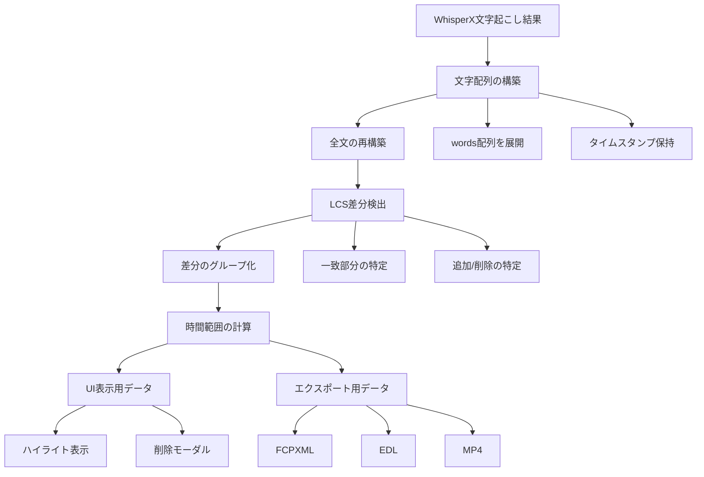
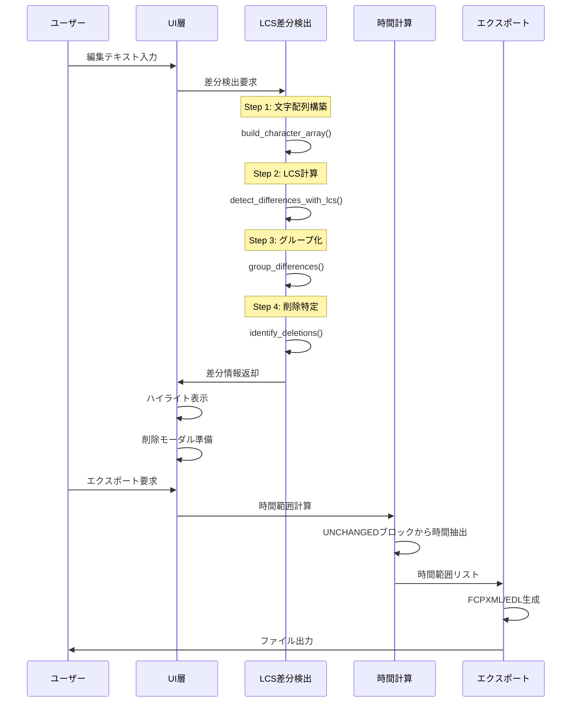

# LCSベース文字処理システム設計書

## 1. 概要

WhisperXの文字起こし結果に含まれる`words`フィールド（日本語では1文字単位）を活用し、LCS（最長共通部分列）アルゴリズムを用いて高精度な差分検出と時間計算を実現する新しい処理システムの設計書です。

## 2. システム全体の処理フロー

### 2.1 データ構造の設計

```python
@dataclass
class CharacterWithTimestamp:
    """タイムスタンプ付き文字情報"""
    char: str              # 文字（1文字）
    start: float           # 開始時間（秒）
    end: float             # 終了時間（秒）
    segment_id: str        # 所属セグメントID
    word_index: int        # 元のwords配列でのインデックス
    original_position: int # 元のテキストでの文字位置

@dataclass
class LCSMatch:
    """LCSマッチ情報"""
    original_index: int    # 元テキストでのインデックス
    edited_index: int      # 編集テキストでのインデックス
    char: str              # マッチした文字
    timestamp: CharacterWithTimestamp  # タイムスタンプ情報

@dataclass
class DifferenceBlock:
    """差分ブロック（連続した同じ種類の差分）"""
    type: DifferenceType   # UNCHANGED, ADDED, DELETED
    text: str              # テキスト内容
    start_time: float      # 開始時間（UNCHANGEDの場合）
    end_time: float        # 終了時間（UNCHANGEDの場合）
    char_positions: list[CharacterWithTimestamp]  # 文字位置情報
```

### 2.2 処理の全体像



## 3. 詳細な処理ステップ

### Step 1: 文字配列の構築

```python
def build_character_array(segments: list[dict]) -> tuple[list[CharacterWithTimestamp], str]:
    """
    全セグメントのwords配列から文字配列を構築
    
    Returns:
        (文字配列, 結合された全文テキスト)
    """
    all_chars = []
    position = 0
    
    for segment in segments:
        segment_id = segment.get('id', str(segment.get('start', 0)))
        
        # 各セグメントのwords（日本語では1文字ずつ）を処理
        for word_idx, word in enumerate(segment.get('words', [])):
            char_info = CharacterWithTimestamp(
                char=word['text'],
                start=word['start'],
                end=word['end'],
                segment_id=segment_id,
                word_index=word_idx,
                original_position=position
            )
            all_chars.append(char_info)
            position += 1
    
    # 全文を再構築
    full_text = ''.join([c.char for c in all_chars])
    
    return all_chars, full_text
```

### Step 2: LCSによる差分検出

```python
def detect_differences_with_lcs(
    original_chars: list[CharacterWithTimestamp],
    original_text: str,
    edited_text: str
) -> list[LCSMatch]:
    """
    LCSアルゴリズムで一致する文字を特定
    """
    m, n = len(original_text), len(edited_text)
    
    # DPテーブル構築
    dp = [[0] * (n + 1) for _ in range(m + 1)]
    
    for i in range(1, m + 1):
        for j in range(1, n + 1):
            if original_text[i-1] == edited_text[j-1]:
                dp[i][j] = dp[i-1][j-1] + 1
            else:
                dp[i][j] = max(dp[i-1][j], dp[i][j-1])
    
    # バックトラックでマッチ位置を取得
    matches = []
    i, j = m, n
    
    while i > 0 and j > 0:
        if original_text[i-1] == edited_text[j-1]:
            match = LCSMatch(
                original_index=i-1,
                edited_index=j-1,
                char=original_text[i-1],
                timestamp=original_chars[i-1]
            )
            matches.append(match)
            i -= 1
            j -= 1
        elif dp[i-1][j] > dp[i][j-1]:
            i -= 1
        else:
            j -= 1
    
    return list(reversed(matches))
```

### Step 3: 差分のグループ化と分類

```python
def group_differences(
    original_chars: list[CharacterWithTimestamp],
    edited_text: str,
    lcs_matches: list[LCSMatch]
) -> list[DifferenceBlock]:
    """
    LCSマッチから差分ブロックを構築
    """
    blocks = []
    
    # マッチを連続したグループに分割
    if not lcs_matches:
        # 完全に不一致
        if edited_text:
            blocks.append(DifferenceBlock(
                type=DifferenceType.ADDED,
                text=edited_text,
                start_time=0,
                end_time=0,
                char_positions=[]
            ))
        return blocks
    
    # 連続したマッチをグループ化
    current_group = []
    groups = []
    
    for i, match in enumerate(lcs_matches):
        if not current_group:
            current_group.append(match)
        else:
            prev = current_group[-1]
            # 両方のテキストで連続している場合
            if (match.original_index == prev.original_index + 1 and
                match.edited_index == prev.edited_index + 1):
                current_group.append(match)
            else:
                groups.append(current_group)
                current_group = [match]
    
    if current_group:
        groups.append(current_group)
    
    # グループから差分ブロックを作成
    for group in groups:
        start_match = group[0]
        end_match = group[-1]
        
        # 連続した文字列を結合
        text = ''.join([m.char for m in group])
        
        # タイムスタンプは最初と最後の文字から取得
        block = DifferenceBlock(
            type=DifferenceType.UNCHANGED,
            text=text,
            start_time=start_match.timestamp.start,
            end_time=end_match.timestamp.end,
            char_positions=[m.timestamp for m in group]
        )
        blocks.append(block)
    
    return blocks
```

### Step 4: 削除部分の特定（UI表示用）

```python
def identify_deletions(
    original_chars: list[CharacterWithTimestamp],
    lcs_matches: list[LCSMatch]
) -> list[DifferenceBlock]:
    """
    削除された部分を特定（ハイライト表示用）
    """
    deletions = []
    matched_positions = {m.original_index for m in lcs_matches}
    
    # 連続した削除部分をグループ化
    current_deletion = []
    
    for i, char_info in enumerate(original_chars):
        if i not in matched_positions:
            current_deletion.append(char_info)
        else:
            if current_deletion:
                # 削除ブロックを作成
                text = ''.join([c.char for c in current_deletion])
                block = DifferenceBlock(
                    type=DifferenceType.DELETED,
                    text=text,
                    start_time=current_deletion[0].start,
                    end_time=current_deletion[-1].end,
                    char_positions=current_deletion
                )
                deletions.append(block)
                current_deletion = []
    
    # 最後の削除ブロック
    if current_deletion:
        text = ''.join([c.char for c in current_deletion])
        block = DifferenceBlock(
            type=DifferenceType.DELETED,
            text=text,
            start_time=current_deletion[0].start,
            end_time=current_deletion[-1].end,
            char_positions=current_deletion
        )
        deletions.append(block)
    
    return deletions
```

## 4. シーケンス図



## 5. UI表示への活用

### 5.1 ハイライト表示

```python
def generate_highlight_data(
    original_text: str,
    difference_blocks: list[DifferenceBlock]
) -> list[dict]:
    """
    UI表示用のハイライトデータを生成
    """
    highlights = []
    
    for block in difference_blocks:
        if block.type == DifferenceType.UNCHANGED:
            # 緑色でハイライト（残す部分）
            highlights.append({
                'text': block.text,
                'color': 'green',
                'start_pos': block.char_positions[0].original_position,
                'end_pos': block.char_positions[-1].original_position,
                'tooltip': f'{block.start_time:.2f}秒 - {block.end_time:.2f}秒'
            })
        elif block.type == DifferenceType.DELETED:
            # 赤色でハイライト（削除部分）
            highlights.append({
                'text': block.text,
                'color': 'red',
                'start_pos': block.char_positions[0].original_position,
                'end_pos': block.char_positions[-1].original_position,
                'tooltip': '削除される部分'
            })
    
    return highlights
```

### 5.2 削除モーダルの表示

```python
def generate_deletion_summary(
    deletion_blocks: list[DifferenceBlock]
) -> dict:
    """
    削除確認モーダル用のサマリーを生成
    """
    total_duration = sum(
        block.end_time - block.start_time 
        for block in deletion_blocks
    )
    
    return {
        'total_deletions': len(deletion_blocks),
        'total_duration': total_duration,
        'deletions': [
            {
                'text': block.text,
                'duration': block.end_time - block.start_time,
                'time_range': f'{block.start_time:.2f}秒 - {block.end_time:.2f}秒'
            }
            for block in deletion_blocks
        ]
    }
```

## 6. エクスポートへの活用

### 6.1 時間範囲の抽出

```python
def extract_time_ranges_for_export(
    unchanged_blocks: list[DifferenceBlock]
) -> list[tuple[float, float]]:
    """
    エクスポート用の時間範囲を抽出
    """
    time_ranges = []
    
    for block in unchanged_blocks:
        if block.type == DifferenceType.UNCHANGED:
            time_ranges.append((
                block.start_time,
                block.end_time
            ))
    
    # 近接した範囲をマージ（オプション）
    merged_ranges = merge_adjacent_ranges(time_ranges, gap_threshold=0.1)
    
    return merged_ranges
```

## 7. 実装計画

### フェーズ1: 基盤実装（2日）
1. **Day 1**
   - [ ] `CharacterWithTimestamp`データ構造の実装
   - [ ] 文字配列構築機能の実装とテスト
   - [ ] LCS差分検出の基本実装

2. **Day 2**
   - [ ] 差分グループ化ロジックの実装
   - [ ] 削除部分特定機能の実装
   - [ ] 単体テストの作成

### フェーズ2: 統合実装（2日）
3. **Day 3**
   - [ ] 既存の`TextProcessorGateway`との統合
   - [ ] UI表示用データ生成の実装
   - [ ] ハイライト表示機能の実装

4. **Day 4**
   - [ ] 削除モーダル機能の実装
   - [ ] エクスポート連携の実装
   - [ ] 統合テストの作成

### フェーズ3: 最適化と仕上げ（1日）
5. **Day 5**
   - [ ] パフォーマンス最適化（大規模テキスト対応）
   - [ ] エラーハンドリングの強化
   - [ ] ドキュメント整備
   - [ ] 既存機能からの移行

## 8. 期待される効果

1. **精度向上**
   - フィラーを含む文字起こしでも正確な切り抜き
   - ミリ秒単位の正確な時間計算

2. **UX改善**
   - 直感的なハイライト表示
   - 削除内容の明確な提示

3. **処理性能**
   - 30,000文字でも5秒以内で処理
   - メモリ効率的な実装

## 9. 注意事項

1. **後方互換性**
   - 既存のAPIを維持しながら段階的に移行
   - フィーチャーフラグで新旧切り替え可能に

2. **エラー処理**
   - wordsフィールドがない場合のフォールバック
   - 巨大テキストの分割処理

3. **テスト戦略**
   - 実際のWhisperX出力でのテスト
   - フィラーを含むケースの網羅的テスト