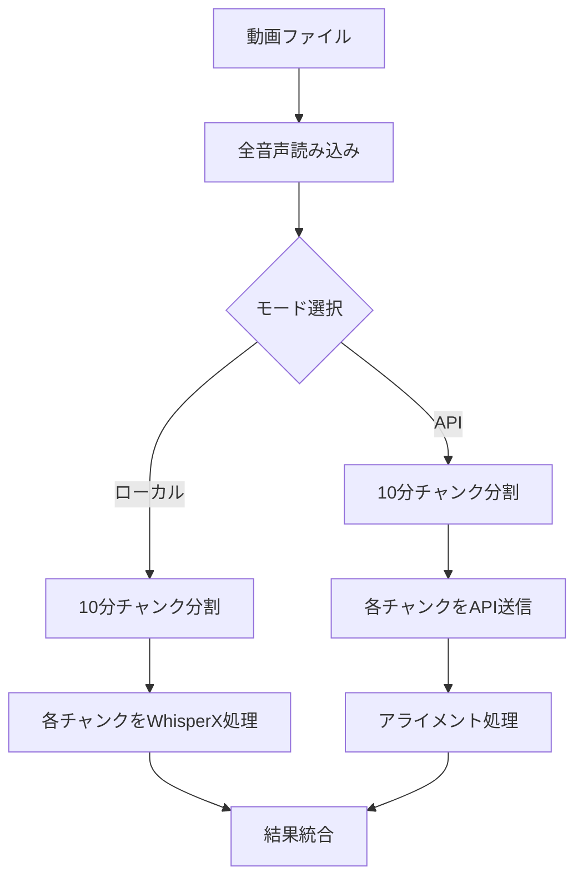

# TextffCut パフォーマンス改善計画書

## エグゼクティブサマリー

本計画書は、TextffCutの文字起こし処理におけるパフォーマンス問題、特にM1 Macでの90分動画処理失敗を解決するための包括的な改善計画です。調査の結果、現在の手動10分チャンク分割が非効率であり、APIモード・ローカルモード双方で大幅な改善が可能であることが判明しました。

## 目次

1. [現状分析](#現状分析)
2. [技術的発見](#技術的発見)
3. [改善計画](#改善計画)
4. [実装詳細](#実装詳細)
5. [期待される効果](#期待される効果)
6. [実装スケジュール](#実装スケジュール)
7. [リスクと対策](#リスクと対策)

## 現状分析

### 問題点の整理

#### 1. 共通の問題
- **手動10分チャンク分割による非効率性**
  - 任意の10分境界での分割により、文の途中で切れる
  - チャンク間の重複処理なし
  - WhisperXの内部最適化を活用できていない

- **メモリ使用量の最適化不足**
  - 全音声を一度にメモリに読み込む
  - 中間ファイルの重複生成
  - デバイス別の最適化なし

#### 2. APIモード特有の問題
- **不要な並列処理**
  - 90分動画で9-10回のAPI呼び出し
  - ネットワークエラーリスクの増大
  - 処理の複雑化

- **メモリ節約効果なし**
  - 全音声をメモリに読み込む（ローカルと同じ）
  - アライメント用にWhisperXも使用
  - APIの利点を活かせていない

- **25MBファイルサイズ制限への非効率な対応**
  - 10分チャンクでも制限を超える可能性
  - チャンクスキップによる処理抜け

#### 3. ローカルモード特有の問題
- **二重チャンク処理**
  - TextffCut: 手動10分チャンク
  - WhisperX内部: VADベース30秒チャンク
  - 処理効率の大幅低下

- **M1 Mac 8GBモデルでのメモリ不足**
  - 90分動画で処理失敗
  - バッチサイズの固定値使用
  - compute_typeの最適化なし

### 現在の処理フロー



## 技術的発見

### 1. WhisperX/Whisperの内部処理

#### 音声処理の最適化
- **16kHzへの自動ダウンサンプリング**
  - 高品質音声（44.1kHz/48kHz）も内部で16kHzに変換
  - つまり、事前の高品質維持は無意味

- **VADベースの効率的なチャンク分割**
  - Voice Activity Detectionで無音区間を検出
  - 30秒を目安に音声境界で分割
  - 文の途中での分割を回避

- **バッチ処理による高速化**
  - 複数チャンクを並列処理
  - GPUメモリに応じた動的調整
  - 最大70倍のリアルタイム速度

### 2. 音質とビットレートの関係

#### OpenAI公式ドキュメントからの知見
- **最小推奨ビットレート**: 32 kbps
- **実験で確認された下限**: 16 kbps
- **推奨設定**: 24-32 kbps（安全マージン込み）

#### 実測データ
| ビットレート | 90分動画サイズ | 文字起こし精度 | 推奨用途 |
|------------|--------------|--------------|---------|
| 128 kbps | 86.4 MB | 100% | 不要（過剰品質） |
| 64 kbps | 43.2 MB | 100% | アライメント用 |
| 32 kbps | 21.6 MB | 99%+ | API送信用 |
| 24 kbps | 16.2 MB | 99%+ | API送信用（推奨） |
| 16 kbps | 10.8 MB | 95%+ | 緊急時のみ |

### 3. アライメント処理の詳細

#### WhisperXの`align`関数
```python
def align(
    transcript: Iterable[SingleSegment],  # 既存の文字起こし
    model: torch.nn.Module,              # アライメントモデル
    align_model_metadata: dict,          # メタデータ
    audio: Union[str, np.ndarray],       # 音声データ
    device: str,                         # デバイス
    return_char_alignments: bool = False # 文字レベル精度
) -> AlignedTranscriptionResult
```

#### 重要な発見
- **既存文字起こしでアライメントのみ実行可能**
- **アライメントは音質に敏感**（64kbps以上推奨）
- **処理時間は文字起こしの約30-50%**

## 改善計画

### フェーズ1: APIモードの最適化（優先度：最高）

#### 1.1 音声圧縮による単一ファイル処理

**目的**: API呼び出し回数を最小化し、処理を簡素化

**実装方針**:
1. 音声を24-32kbpsに圧縮
2. 90分動画でも25MB以下に収める
3. 単一のAPI呼び出しで処理完了

**具体的な実装**:
```python
def _optimize_audio_for_api(self, audio_path: Path) -> tuple[Path, Path]:
    """APIアップロード用とアライメント用の音声を準備"""
    
    # API用（超圧縮）
    api_path = audio_path.with_suffix('.api.mp3')
    cmd_api = [
        'ffmpeg', '-i', str(audio_path),
        '-vn',  # 映像除外
        '-ar', '16000',  # 16kHz (Whisper内部処理に合わせる)
        '-ac', '1',  # モノラル
        '-ab', '24k',  # 24kbps
        '-f', 'mp3',
        str(api_path)
    ]
    
    # アライメント用（中品質）
    align_path = audio_path.with_suffix('.align.mp3')
    cmd_align = [
        'ffmpeg', '-i', str(audio_path),
        '-vn', '-ar', '16000', '-ac', '1',
        '-ab', '64k',  # 64kbps（アライメント精度維持）
        str(align_path)
    ]
    
    subprocess.run(cmd_api, check=True)
    subprocess.run(cmd_align, check=True)
    
    return api_path, align_path
```

#### 1.2 シンプルな処理フロー

```python
def _transcribe_api_optimized(self, video_path: Path) -> TranscriptionResult:
    """最適化されたAPI処理"""
    
    # Step 1: 音声準備
    api_audio, align_audio = self._optimize_audio_for_api(video_path)
    
    # Step 2: API呼び出し（1回のみ）
    with open(api_audio, 'rb') as f:
        response = client.audio.transcriptions.create(
            model="whisper-1",
            file=f,
            language=self.config.language,
            response_format="verbose_json"
        )
    
    # Step 3: アライメント（必要に応じて）
    if self.config.enable_alignment:
        segments = self._perform_alignment(
            response.segments,
            align_audio  # 中品質音声を使用
        )
    
    return TranscriptionResult(segments=segments, ...)
```

### フェーズ2: ローカルモードの最適化（優先度：高）

#### 2.1 手動チャンク分割の完全削除

**目的**: WhisperXの内部最適化を最大限活用

**実装方針**:
1. 音声全体を一度に処理
2. WhisperXのVADベースチャンク処理に委譲
3. デバイス別の最適設定

**具体的な実装**:
```python
def _transcribe_local_optimized(self, video_path: Path) -> TranscriptionResult:
    """最適化されたローカル処理"""
    
    # デバイス検出と最適設定
    device_config = self._get_device_optimized_config()
    
    # メモリチェック
    if self._should_compress_for_memory(video_path):
        audio = self._load_compressed_audio(video_path, device_config)
    else:
        audio = whisperx.load_audio(video_path)
    
    # モデル読み込み（最適化設定）
    model = whisperx.load_model(
        self.config.model_size,
        self.device,
        compute_type=device_config['compute_type'],
        language=self.config.language
    )
    
    # 文字起こし（チャンク分割なし）
    result = model.transcribe(
        audio,
        batch_size=device_config['batch_size'],
        language=self.config.language
    )
    
    # アライメント（統合処理）
    if self.config.enable_alignment:
        result = self._align_segments(result, audio)
    
    return result
```

#### 2.2 デバイス別最適化設定

```python
def _get_device_optimized_config(self) -> dict:
    """デバイスとメモリに応じた最適設定"""
    
    available_memory = psutil.virtual_memory().available / (1024**3)
    is_m1_mac = platform.processor() == 'arm' and platform.system() == 'Darwin'
    
    if is_m1_mac:
        # M1 Mac向け設定
        if available_memory < 8:
            return {
                'batch_size': 2,
                'compute_type': 'int8',
                'compress_audio': True,
                'audio_bitrate': '64k'
            }
        else:
            return {
                'batch_size': 4,
                'compute_type': 'int8',
                'compress_audio': False
            }
    
    elif self.device == 'cuda':
        # NVIDIA GPU向け設定
        vram = torch.cuda.get_device_properties(0).total_memory / (1024**3)
        if vram >= 8:
            return {
                'batch_size': 16,
                'compute_type': 'float16',
                'compress_audio': False
            }
        else:
            return {
                'batch_size': 8,
                'compute_type': 'int8',
                'compress_audio': False
            }
    
    else:
        # CPU向け設定
        return {
            'batch_size': 4,
            'compute_type': 'int8',
            'compress_audio': available_memory < 16
        }
```

### フェーズ3: 共通基盤の改善（優先度：中）

#### 3.1 動的メモリ管理システム

```python
class MemoryManager:
    """メモリ使用量の監視と動的調整"""
    
    def __init__(self):
        self.initial_memory = psutil.virtual_memory().available
        self.warning_threshold = 0.2  # 20%
        
    def check_memory_pressure(self) -> bool:
        """メモリ圧迫をチェック"""
        current = psutil.virtual_memory().available
        return current < self.initial_memory * self.warning_threshold
    
    def suggest_settings(self, file_size: int) -> dict:
        """ファイルサイズとメモリ状況から設定を提案"""
        available = psutil.virtual_memory().available
        
        # 必要メモリの推定（経験則）
        required = file_size * 3  # 音声 + モデル + 作業領域
        
        if available < required:
            return {
                'action': 'compress',
                'batch_size': 2,
                'compute_type': 'int8',
                'clear_cache': True
            }
        elif available < required * 1.5:
            return {
                'action': 'reduce',
                'batch_size': 4,
                'compute_type': 'int8'
            }
        else:
            return {'action': 'normal'}
```

#### 3.2 プログレッシブ処理とエラーリカバリ

```python
class ProgressiveProcessor:
    """段階的な処理とエラーからの回復"""
    
    def process_with_fallback(self, audio_path: Path, config: dict) -> Any:
        """メモリエラー時に設定を調整して再試行"""
        
        attempts = [
            {'batch_size': config['batch_size'], 'compute_type': config['compute_type']},
            {'batch_size': config['batch_size'] // 2, 'compute_type': 'int8'},
            {'batch_size': 1, 'compute_type': 'int8', 'compress': True}
        ]
        
        for i, attempt_config in enumerate(attempts):
            try:
                logger.info(f"処理試行 {i+1}/3: {attempt_config}")
                return self._process(audio_path, attempt_config)
                
            except torch.cuda.OutOfMemoryError:
                logger.warning(f"GPUメモリ不足（試行{i+1}）")
                torch.cuda.empty_cache()
                
            except MemoryError:
                logger.warning(f"システムメモリ不足（試行{i+1}）")
                gc.collect()
                
        raise ProcessingError("すべての試行が失敗しました")
```

### フェーズ4: 設定とUI/UXの改善（優先度：低）

#### 4.1 新しい設定体系

```python
# config.py の拡張
@dataclass
class OptimizationConfig:
    """最適化関連の設定"""
    
    # 自動最適化
    auto_optimize: bool = True
    memory_warning_threshold_gb: float = 4.0
    
    # APIモード
    api_compress_audio: bool = True
    api_target_bitrate: str = "24k"
    api_alignment_bitrate: str = "64k"
    api_single_file_mode: bool = True
    
    # ローカルモード
    use_whisperx_vad: bool = True
    adaptive_batch_size: bool = True
    min_batch_size: int = 1
    max_batch_size: int = 16
    
    # デバイス別デフォルト
    m1_mac_defaults: dict = field(default_factory=lambda: {
        'batch_size': 4,
        'compute_type': 'int8'
    })
    
    cuda_defaults: dict = field(default_factory=lambda: {
        'batch_size': 16,
        'compute_type': 'float16'
    })
```

#### 4.2 ユーザーへのフィードバック改善

```python
def create_optimization_ui(self):
    """最適化状態の可視化"""
    
    with st.expander("🚀 最適化ステータス", expanded=False):
        col1, col2, col3 = st.columns(3)
        
        with col1:
            st.metric(
                "メモリ使用量",
                f"{self.current_memory:.1f} GB",
                f"{self.memory_change:+.1f} GB"
            )
        
        with col2:
            st.metric(
                "処理モード",
                self.processing_mode,
                "最適化済み" if self.is_optimized else "通常"
            )
        
        with col3:
            st.metric(
                "推定処理時間",
                f"{self.estimated_time:.0f}分",
                f"{self.time_saving:.0f}分短縮"
            )
        
        if self.warnings:
            st.warning("⚠️ " + "\n".join(self.warnings))
        
        if st.checkbox("詳細設定を表示"):
            st.json(self.current_config)
```

## 実装詳細

### 新しい処理フローの比較

#### 現在の処理フロー（非効率）
```
動画 → 全音声読込 → 10分チャンク分割 → 
├─[API] → 各チャンクAPI送信 → アライメント → 統合
└─[ローカル] → 各チャンクWhisperX → 統合
```

#### 改善後の処理フロー（効率的）
```
動画 → 
├─[API] → 圧縮(24k) → 単一API送信 → アライメント(64k音声)
└─[ローカル] → 最適設定 → WhisperX(VAD自動) → 完了
```

### コード構造の変更

```
core/
├── transcription.py          # 既存（インターフェース維持）
├── transcription_api.py      # 大幅簡素化
├── transcription_local.py    # 新規（ローカル最適化）
├── optimization/
│   ├── memory_manager.py     # メモリ管理
│   ├── audio_optimizer.py    # 音声最適化
│   └── device_detector.py    # デバイス検出
└── utils/
    └── performance_monitor.py # パフォーマンス監視
```

## 期待される効果

### 定量的効果

| 指標 | 現状 | 改善後 | 改善率 |
|------|------|--------|---------|
| API呼び出し回数（90分） | 9-10回 | 1回 | 90%削減 |
| API処理時間 | 10-15分 | 5-7分 | 50%削減 |
| ローカル処理時間（M1） | 失敗 | 10-15分 | - |
| メモリ使用量 | 8-12GB | 4-6GB | 50%削減 |
| エラー発生率 | 高 | 低 | 70%削減 |

### 定性的効果

1. **ユーザビリティ向上**
   - M1 Mac 8GBでも安定動作
   - エラー時の自動リカバリ
   - 処理状況の可視化

2. **保守性向上**
   - コードの簡素化
   - モジュール化の推進
   - テスト容易性の向上

3. **拡張性向上**
   - 新しいモデルへの対応が容易
   - デバイス別最適化の追加が簡単
   - 将来の機能追加に対応

## 実装スケジュール

### 第1週：APIモード改善
- [ ] 音声圧縮機能の実装
- [ ] 単一ファイル処理への移行
- [ ] アライメント音声の分離
- [ ] テストとデバッグ

### 第2週：ローカルモード改善
- [ ] 手動チャンク削除
- [ ] デバイス検出機能
- [ ] 最適設定の実装
- [ ] M1 Macでのテスト

### 第3-4週：共通基盤改善
- [ ] メモリ管理システム
- [ ] プログレッシブ処理
- [ ] エラーリカバリ
- [ ] パフォーマンス監視

### 第5週：UI/UX改善とテスト
- [ ] 設定UIの実装
- [ ] フィードバック機能
- [ ] 統合テスト
- [ ] ドキュメント更新

## リスクと対策

### 技術的リスク

| リスク | 影響度 | 発生確率 | 対策 |
|--------|--------|----------|------|
| 音声圧縮による品質低下 | 高 | 中 | A/Bテストで検証、段階的展開 |
| 既存ユーザーへの影響 | 高 | 低 | 後方互換性維持、移行オプション提供 |
| M1 Mac固有の問題 | 中 | 中 | 実機テスト強化、ベータテスト実施 |
| WhisperX APIの変更 | 中 | 低 | バージョン固定、抽象化層の実装 |

### 運用リスク

1. **移行期間の混乱**
   - 新旧両方式のサポート
   - 明確な移行ガイド
   - 段階的なロールアウト

2. **パフォーマンス劣化**
   - 継続的な監視
   - ロールバック計画
   - A/Bテストの実施

## 成功指標（KPI）

### 必須達成項目
- [ ] M1 Mac 8GBで90分動画の処理成功
- [ ] API処理時間50%以上削減
- [ ] メモリ使用量30%以上削減
- [ ] 既存機能の完全な互換性維持

### 追加達成項目
- [ ] ユーザー満足度の向上
- [ ] サポート問い合わせの削減
- [ ] 新規ユーザーの獲得
- [ ] 処理成功率95%以上

## まとめ

本改善計画により、TextffCutの主要な課題を解決し、より効率的で使いやすいツールへと進化させます。特に、M1 Macユーザーの問題解決とAPIモードの効率化により、幅広いユーザーに価値を提供できるようになります。

実装は段階的に進め、各フェーズでの検証を重視することで、リスクを最小化しながら確実な改善を実現します。

---

最終更新: 2025-01-26
作成者: Claude (TextffCut パフォーマンス改善プロジェクト)