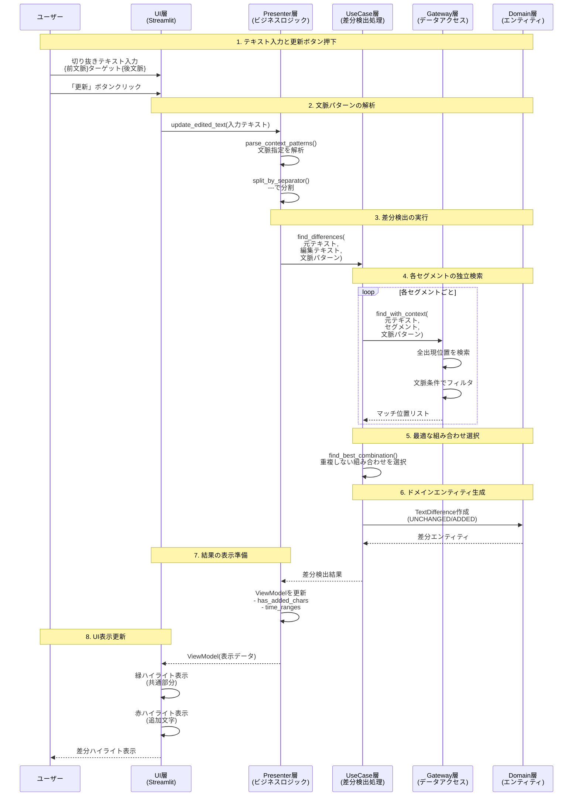
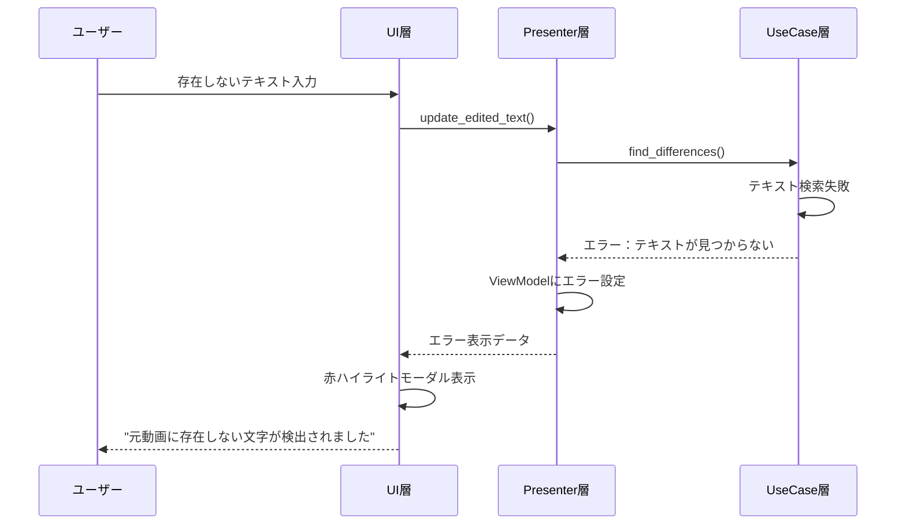

# テキスト差分検出ロジックの設計書

## 1. 概要

TextffCutアプリケーションにおけるテキスト差分検出は、文字起こし結果（元テキスト）と編集されたテキストを比較し、以下を実現する必要があります：

1. **共通部分の特定**: 両方のテキストに存在する部分を正確に特定
2. **追加文字の検出**: 編集テキストにのみ存在する文字を検出
3. **時間範囲の計算**: 共通部分に対応する動画の時間範囲を計算

## 2. 現在の問題点

### 2.1 スペース処理の不整合
- 差分検出時に余分なスペースが追加される
- 元テキストと編集テキストでスペースの扱いが異なる
- 例：`"お金持ち..."` → `" お金持ち..."` (先頭にスペースが追加)

### 2.2 重複する差分
- 同じ文字（例：「。」）がUNCHANGEDとADDEDの両方に含まれる
- 差分の合計長さが実際のテキスト長と一致しない

### 2.3 データ変換時の情報欠落
- レガシー形式からドメインエンティティへの変換で情報が失われる
- `added_chars`フィールドの情報が適切に伝達されない

### 2.4 複数切り抜きの問題
- 細かい切り抜きを増やすと、存在するテキストが見つからないと判定される
- 貪欲マッチングにより最適でない組み合わせが選ばれる

### 2.5 同一文字列の曖昧性
- 同じ文字列が複数回出現する場合、どの箇所を選択するか制御できない
- 常に最初の出現位置が選ばれてしまう

## 3. あるべき差分検出ロジック

### 3.1 基本原則

1. **一貫性**: すべての処理段階で同じ正規化ルールを適用
2. **透明性**: 各文字の状態（UNCHANGED/ADDED）が明確
3. **位置の正確性**: 元テキストと編集テキストの文字位置が正確に対応
4. **独立性**: 複数の切り抜きセグメントは独立して検索される
5. **制御性**: ユーザーが曖昧性を解決できる仕組みを提供

### 3.2 処理フロー

```
1. 入力の受付
   ├─ 元テキスト（文字起こし結果）
   └─ 編集テキスト（ユーザー入力）

2. セグメント分割と文脈解析
   ├─ 区切り文字（---）でセグメント分割
   ├─ 各セグメントの文脈指定を解析
   └─ {前文脈}ターゲット{後文脈} 形式のパース

3. テキストの前処理
   ├─ 改行の統一（\r\n → \n）
   ├─ タブの統一（\t → スペース）
   └─ 連続スペースの正規化（オプション）

4. 差分検出アルゴリズム
   ├─ 各セグメントを独立して検索
   ├─ 文脈指定がある場合は絞り込み
   ├─ 最適な組み合わせを選択
   └─ 差分の分類（UNCHANGED/ADDED）

5. 結果の構築
   ├─ 差分リストの作成
   ├─ 文字位置の記録
   └─ 時間情報の関連付け

6. 検証
   ├─ 差分の合計長さ = 編集テキストの長さ
   ├─ 重複する差分がないこと
   └─ 元テキストを差分から再構築可能
```

### 3.3 差分オブジェクトの構造

```python
@dataclass
class TextDifference:
    """テキスト差分情報"""
    id: str
    original_text: str          # 元のテキスト（変更なし）
    edited_text: str           # 編集後のテキスト（変更なし）
    differences: list[Difference]  # 差分のリスト
    
@dataclass
class Difference:
    """個別の差分"""
    type: DifferenceType       # UNCHANGED/ADDED
    text: str                  # 差分のテキスト
    original_position: Range   # 元テキストでの位置（ADDEDの場合はNone）
    edited_position: Range     # 編集テキストでの位置
    time_range: TimeRange      # 対応する時間範囲（UNCHANGEDのみ）

@dataclass
class Range:
    """テキスト内の位置範囲"""
    start: int  # 開始位置（0ベース）
    end: int    # 終了位置（exclusive）
```

### 3.4 文脈指定機能

#### 3.4.1 文脈指定の記法

```
# 基本形式
{前文脈}ターゲットテキスト{後文脈}

# 前文脈のみ指定
{それでは始めましょう。}はい、分かりました。

# 後文脈のみ指定
はい、分かりました。{これで終了です。}

# 両方指定
{それでは}はい、分かりました。{これで}
```

#### 3.4.2 文脈解析の実装

```python
def parse_context_pattern(self, text: str) -> ContextPattern:
    """
    文脈指定パターンを解析
    
    Returns:
        ContextPattern(before_context, target_text, after_context)
    """
    # パターン: {前文脈}ターゲット{後文脈}
    pattern = r'^(?:\{([^}]*)\})?([^{}]+?)(?:\{([^}]*)\})?$'
    match = re.match(pattern, text.strip())
    
    if match:
        before, target, after = match.groups()
        return ContextPattern(
            before_context=before or None,
            target_text=target,
            after_context=after or None
        )
    
    # 文脈指定なしの場合
    return ContextPattern(
        before_context=None,
        target_text=text,
        after_context=None
    )
```

#### 3.4.3 文脈を考慮した検索

```python
def find_with_context(self, text: str, pattern: ContextPattern) -> list[int]:
    """
    文脈を考慮してテキストを検索
    
    Returns:
        マッチした位置のリスト
    """
    candidates = []
    
    # ターゲットテキストの全出現位置を検索
    pos = 0
    while True:
        idx = text.find(pattern.target_text, pos)
        if idx == -1:
            break
        
        # 文脈チェック
        if self._check_context(text, idx, pattern):
            candidates.append(idx)
        
        pos = idx + 1
    
    return candidates

def _check_context(self, text: str, position: int, pattern: ContextPattern) -> bool:
    """
    指定位置が文脈条件を満たすかチェック
    """
    target_len = len(pattern.target_text)
    
    # 前文脈のチェック
    if pattern.before_context:
        before_start = position - len(pattern.before_context)
        if before_start < 0:
            return False
        if text[before_start:position] != pattern.before_context:
            return False
    
    # 後文脈のチェック
    if pattern.after_context:
        after_start = position + target_len
        after_end = after_start + len(pattern.after_context)
        if after_end > len(text):
            return False
        if text[after_start:after_end] != pattern.after_context:
            return False
    
    return True
```

### 3.5 アルゴリズムの詳細

#### 3.5.1 セグメント独立検索アルゴリズム

```python
def find_differences_with_segments(self, original: str, edited: str) -> TextDifference:
    """
    区切り文字で分割されたセグメントを独立して検索
    """
    # セグメントに分割
    segments = edited.split('---')
    all_differences = []
    
    for segment in segments:
        segment = segment.strip()
        if not segment:
            continue
        
        # 文脈パターンを解析
        pattern = self.parse_context_pattern(segment)
        
        # 文脈を考慮して検索
        candidates = self.find_with_context(original, pattern)
        
        if not candidates:
            # 見つからない場合はADDEDとして扱う
            all_differences.append((
                DifferenceType.ADDED,
                pattern.target_text,
                None
            ))
        else:
            # 最適な候補を選択（現在は最初の候補）
            # TODO: より高度な選択ロジック
            position = candidates[0]
            all_differences.append((
                DifferenceType.UNCHANGED,
                pattern.target_text,
                TimeRange(start=..., end=...)  # 位置から時間を計算
            ))
    
    return TextDifference(
        id=generate_id(),
        original_text=original,
        edited_text=edited,
        differences=all_differences
    )
```

#### 3.5.2 基本的なLCSアルゴリズム（文脈指定なしの場合）

```python
def find_differences(original: str, edited: str) -> TextDifference:
    """
    最長共通部分列（LCS）アルゴリズムを使用した差分検出
    """
    # 1. 動的計画法でLCSテーブルを構築
    lcs_table = build_lcs_table(original, edited)
    
    # 2. バックトラックして差分を抽出
    differences = []
    i, j = len(original), len(edited)
    
    while i > 0 or j > 0:
        if i > 0 and j > 0 and original[i-1] == edited[j-1]:
            # 共通文字
            differences.append(Difference(
                type=DifferenceType.UNCHANGED,
                text=original[i-1],
                original_position=Range(i-1, i),
                edited_position=Range(j-1, j)
            ))
            i -= 1
            j -= 1
        elif j > 0 and (i == 0 or lcs_table[i][j-1] >= lcs_table[i-1][j]):
            # 追加文字
            differences.append(Difference(
                type=DifferenceType.ADDED,
                text=edited[j-1],
                original_position=None,
                edited_position=Range(j-1, j)
            ))
            j -= 1
        elif i > 0:
            # 元テキストにのみ存在する文字はスキップ
            i -= 1
    
    # 3. 逆順になっているので反転
    differences.reverse()
    
    # 4. 連続する同じタイプの差分をマージ
    merged_differences = merge_consecutive_differences(differences)
    
    return TextDifference(
        id=generate_id(),
        original_text=original,
        edited_text=edited,
        differences=merged_differences
    )
```

#### 3.5.3 差分のマージ

```python
def merge_consecutive_differences(differences: list[Difference]) -> list[Difference]:
    """
    連続する同じタイプの差分をマージして可読性を向上
    """
    if not differences:
        return []
    
    merged = []
    current = differences[0]
    
    for diff in differences[1:]:
        if (diff.type == current.type and 
            is_consecutive(current, diff)):
            # マージ
            current = merge_two_differences(current, diff)
        else:
            # 新しい差分グループ
            merged.append(current)
            current = diff
    
    merged.append(current)
    return merged
```

### 3.6 時間範囲の計算

```python
def calculate_time_ranges(
    differences: list[Difference], 
    transcription: TranscriptionResult
) -> None:
    """
    UNCHANGED部分に対応する時間範囲を計算
    """
    for diff in differences:
        if diff.type == DifferenceType.UNCHANGED:
            # 元テキストでの位置から対応するWordを検索
            start_time = find_time_for_position(
                transcription, 
                diff.original_position.start
            )
            end_time = find_time_for_position(
                transcription, 
                diff.original_position.end
            )
            
            if start_time is not None and end_time is not None:
                diff.time_range = TimeRange(start_time, end_time)
```

## 4. 実装上の注意点

### 4.1 パフォーマンス
- 長いテキストに対してはメモリ効率的なアルゴリズムを使用
- 必要に応じてチャンク単位で処理

### 4.2 Unicode対応
- サロゲートペア、結合文字、絵文字を正しく扱う
- 文字単位ではなくグラフェムクラスタ単位で処理

### 4.3 特殊なケース
- 空白文字（スペース、タブ、改行）の扱い
- 見た目が同じだが異なる文字（全角/半角など）
- 正規化オプション（大文字小文字、ひらがな/カタカナなど）

## 5. テストケース

### 5.1 文脈指定のテストケース

```python
# ケース1: 前文脈指定
original = "こんにちは。はい、分かりました。それでは始めましょう。はい、分かりました。これで終了です。"
edited = "{それでは始めましょう。}はい、分かりました。"
# 期待結果:
# - UNCHANGED: "はい、分かりました。" (2番目の出現、位置28-39)

# ケース2: 後文脈指定
original = "こんにちは。はい、分かりました。それでは始めましょう。はい、分かりました。これで終了です。"
edited = "はい、分かりました。{これで終了です。}"
# 期待結果:
# - UNCHANGED: "はい、分かりました。" (2番目の出現、位置28-39)

# ケース3: 複数セグメントと文脈指定の組み合わせ
original = "今日は晴れです。午後から雨です。明日も晴れでしょう。"
edited = "今日は晴れです。\n---\n午後から雨です。\n---\n明日も晴れでしょう。"
# 期待結果:
# - UNCHANGED: "今日は晴れです。" (0-8)
# - UNCHANGED: "午後から雨です。" (8-16) 
# - UNCHANGED: "明日も晴れでしょう。" (16-26)
```

### 5.2 基本的なケース
```python
# ケース1: 末尾に文字追加
original = "これはテストです"
edited = "これはテストです。"
# 期待結果:
# - UNCHANGED: "これはテストです" (0-8)
# - ADDED: "。" (8-9)

# ケース2: 中間に文字追加
original = "私は学生です"
edited = "私は大学生です"
# 期待結果:
# - UNCHANGED: "私は" (0-2)
# - ADDED: "大" (2-3)
# - UNCHANGED: "学生です" (3-7)

# ケース3: 文字削除
original = "とても素晴らしいです"
edited = "素晴らしいです"
# 期待結果:
# - UNCHANGED: "素晴らしいです" (3-10)
```

### 5.2 エッジケース
```python
# ケース4: 空のテキスト
original = ""
edited = "新しいテキスト"
# 期待結果:
# - ADDED: "新しいテキスト" (0-7)

# ケース5: スペースの扱い
original = "お金持ち"
edited = " お金持ち"
# 期待結果:
# - ADDED: " " (0-1)
# - UNCHANGED: "お金持ち" (1-5)
```

## 6. システム全体の処理フロー

### 6.1 クリーンアーキテクチャでの処理シーケンス

以下のシーケンス図は、ユーザーがテキストを入力してから、差分検出結果が表示されるまでの流れを示しています。



### 6.2 データの流れ

#### 入力データ
1. **元テキスト**: 文字起こし結果の全文
2. **編集テキスト**: ユーザーが入力した切り抜きテキスト
   - 通常のテキスト: `今日は晴れです`
   - 文脈指定付き: `{それでは}はい、分かりました{これで終了}`
   - 複数セグメント: `テキスト1\n---\nテキスト2`

#### 中間データ
1. **文脈パターン**: 
   ```
   {
     before_context: "それでは",
     target_text: "はい、分かりました",
     after_context: "これで終了"
   }
   ```

2. **候補位置リスト**: 各セグメントの出現位置
   ```
   [
     {segment: "はい、分かりました", positions: [15, 67, 123]},
     {segment: "今日は晴れ", positions: [34, 89]}
   ]
   ```

#### 出力データ
1. **TextDifference**: 差分情報
   - `differences`: 差分のリスト
     - `type`: UNCHANGED（一致）/ ADDED（追加）
     - `text`: 該当テキスト
     - `time_range`: 対応する時間範囲

2. **ViewModel**: UI表示用データ
   - `has_added_chars`: 追加文字があるか
   - `time_ranges`: 切り抜き時間範囲
   - `error_message`: エラーメッセージ

### 6.3 エラー処理フロー



## 7. 移行計画

### フェーズ1: 新しい差分検出アルゴリズムの実装
1. 上記の設計に基づく新しい実装を作成
2. 包括的なユニットテストを作成
3. パフォーマンステストを実施

### フェーズ2: 既存システムとの統合
1. アダプター層で新旧の形式を変換
2. 段階的に新しい実装に移行
3. UI層の調整

### フェーズ3: レガシーコードの削除
1. 旧実装への依存を完全に除去
2. 不要なアダプター層を削除
3. ドキュメントの更新

## 7. 期待される効果

1. **正確性の向上**: スペース処理や重複の問題が解決
2. **保守性の向上**: シンプルで理解しやすいアルゴリズム
3. **拡張性**: 新しい要件（例：単語単位の差分）に対応しやすい
4. **パフォーマンス**: 効率的なアルゴリズムによる高速化