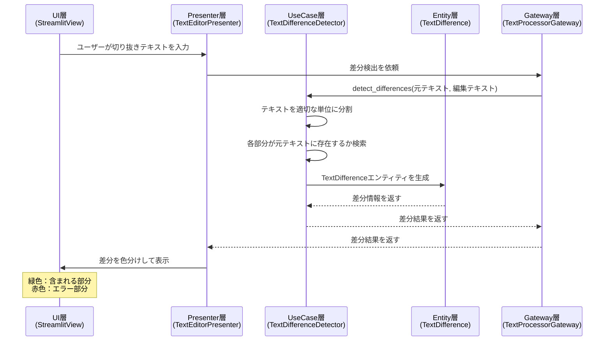

# テキスト差分検出機能 仕様書

## 1. 機能概要

### 目的
ユーザーが指定した切り抜きテキストと元の文字起こし結果の差分を、[difff](https://github.com/meso-cacase/difff)のように文字単位で精密に表示する機能です。

### 基本的な考え方
- **文字起こし結果**：動画全体（例：60分）を文字に起こしたテキスト（ソース）
- **切り抜きテキスト**：ユーザーが「この部分を切り抜きたい」と指定したテキスト
- **差分表示**：difffのように、削除・追加・変更なしを文字単位で色分け表示

## 2. インプット・処理・アウトプット

### インプット
1. **文字起こし結果**（Original Text）
   - 動画全体の文字起こしテキスト
   - 例：60分の会議の全発言内容

2. **切り抜きテキスト**（Edited Text）
   - ユーザーが切り抜きたいと指定したテキスト
   - 例：会議の中の重要な2分間の発言

### 処理
1. **文字単位の差分検出**
   - 切り抜きテキストの各文字が文字起こし結果に存在するか確認
   - 文字単位で精密に比較（difffの差分検出アルゴリズムを参考）
   
2. **判定**
   - **両方に含まれる文字**：切り抜き対象
   - **切り抜きテキストにしかない文字**：ユーザーの入力ミス

### アウトプット
1. **差分情報**（TextDifference）
   - 文字単位の判定結果
   - 判定種別：
     - `UNCHANGED`：両方に含まれる文字（切り抜き対象）
     - `ADDED`：切り抜きテキストにしかない文字（エラー）
   
2. **UI表示**
   - **左側エディタ**：
     - 緑ハイライト：切り抜き対象の文字
     - 通常表示：それ以外
   - **エラー時のモーダル**：
     - 赤ハイライト：入力ミスの文字
     - 削除ボタン：エラー文字を一括削除

## 3. 具体例

### 例1：正常な切り抜き
```
文字起こし結果：「今日は晴れです。明日は雨が降るでしょう。週末は曇りの予報です。」
切り抜きテキスト：「明日は雨が降るでしょう。」

結果：
- 「明日は雨が降るでしょう。」→ 緑色（文字起こしに含まれる）
```

### 例2：一部にエラーがある切り抜き
```
文字起こし結果：「今日は晴れです。明日は雨が降るでしょう。週末は曇りの予報です。」
切り抜きテキスト：「明日は雪が降るでしょう。」

結果：
- 「明日は」→ 緑色（文字起こしに含まれる）
- 「雪」→ 赤色（文字起こしに含まれない）
- 「が降るでしょう。」→ 緑色（文字起こしに含まれる）
```

### 例3：複数部分の切り抜き
```
文字起こし結果：「今日は晴れです。明日は雨が降るでしょう。週末は曇りの予報です。」
切り抜きテキスト：「今日は晴れです。週末は曇りの予報です。」

結果：
- 「今日は晴れです。」→ 緑色（文字起こしに含まれる）
- 「週末は曇りの予報です。」→ 緑色（文字起こしに含まれる）
```

## 4. 処理の詳細仕様

### 4.1 文字単位の差分検出
- **基本単位**：1文字ずつ比較
- **連続性**：連続して一致する文字はまとめて1つのブロックとして扱う

### 4.2 一致判定の基準
- **完全一致**：1文字ずつ完全に一致するかチェック
- **文字の扱い**：
  - スペース、句読点も1文字として扱う
  - 改行は1文字として扱う
  - 全角・半角は区別する（正規化はしない）

### 4.3 検索アルゴリズム
1. 切り抜きテキストの各文字について、文字起こし結果内での出現位置を検索
2. 連続する文字列として最長一致する箇所を特定
3. 一致した部分を「含まれる」として記録
4. どこにも一致しない文字を「エラー」として記録

## 5. クリーンアーキテクチャにおける処理フロー



## 6. エラーケース

### 6.1 空のテキスト
- 切り抜きテキストが空の場合：エラーメッセージを表示

### 6.2 文字起こし結果に全く含まれない
- 全体が赤色表示
- 「指定されたテキストは文字起こし結果に含まれていません」と警告

### 6.3 部分的な不一致
- 一致する部分は緑色
- 不一致部分のみ赤色
- ユーザーは赤色部分を修正可能

## 7. パフォーマンス考慮事項

### 7.1 大規模テキストへの対応
- 60分以上の長時間動画（数万文字）でも高速に処理
- インデックスやキャッシュの活用を検討

### 7.2 リアルタイム性
- ユーザーの入力に対して即座にフィードバック
- 非同期処理やデバウンスの実装

## 8. 今後の拡張可能性

### 8.1 あいまい検索
- 表記ゆれの吸収（「コンピュータ」「コンピューター」など）
- 類似度ベースの判定

### 8.2 時間情報の活用
- 一致した部分の動画内での時間位置を特定
- タイムライン上での視覚化

### 8.3 複数候補の提示
- 部分一致が複数箇所にある場合の候補表示
- ユーザーによる選択機能