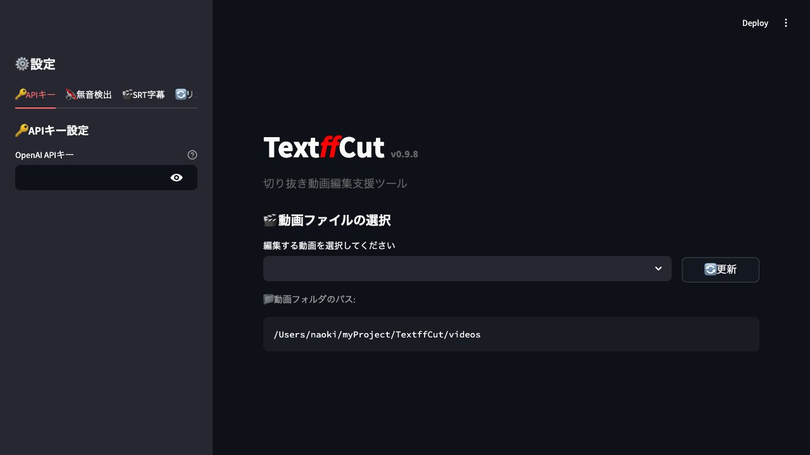
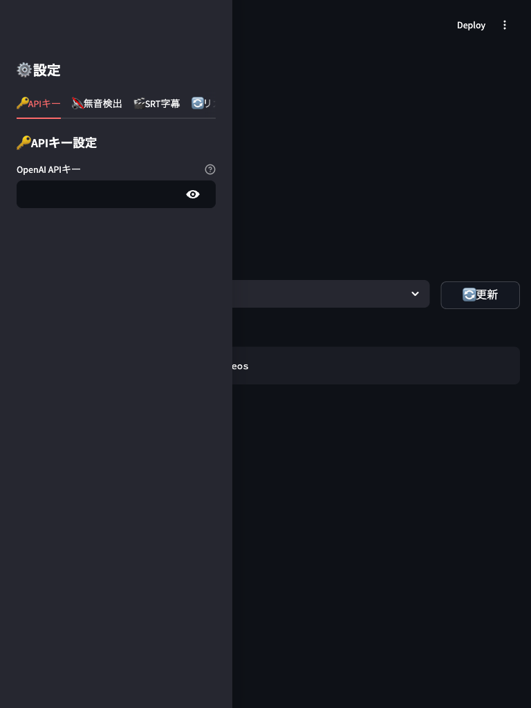
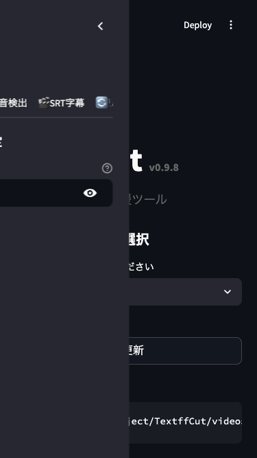

# ブラウザE2Eテスト実行結果

実行日時: 2025-06-30

## 📊 テスト結果サマリー

- **実行したテスト**: 7件
- **成功**: 6件
- **失敗**: 1件（タイトル要素の検出方法の問題）

## 📸 スクリーンショット証跡

### 1. 初期ページ読み込み

- ✅ アプリケーションが正しく起動
- ✅ タイトル「TextffCut v0.9.8」が表示
- ✅ 動画ファイル選択UIが表示
- ✅ サイドバーにAPIキー設定タブが表示

### 2. レスポンシブレイアウト

#### デスクトップビュー (1920x1080)

- ✅ フルサイズでの適切な表示

#### タブレットビュー (768x1024)

- ✅ タブレットサイズでの適切な表示

#### モバイルビュー (375x667)

- ✅ モバイルサイズでの適切な表示
- ✅ サイドバーが折りたたみメニューに変更

### 3. ワークフロー

#### 開始時

#### 終了時

## 🔍 確認された機能

1. **アプリケーション起動**
   - Streamlitアプリケーションが正常に起動
   - 初期UIが適切に表示

2. **レスポンシブデザイン**
   - デスクトップ、タブレット、モバイルの各サイズで適切に表示
   - UIが画面サイズに応じて自動調整

3. **UI要素**
   - 動画ファイル選択セクション
   - APIキー設定タブ（サイドバー）
   - 無音検出設定
   - SRT字幕設定
   - リカバリー機能
   - 履歴機能
   - ヘルプセクション

## 📝 改善提案

1. **テストの改善**
   - タイトル要素の検出方法を修正（h1タグではなく、画像またはカスタム要素として実装されている）
   - より詳細なインタラクションテストの追加

2. **追加テストシナリオ**
   - 実際のファイルアップロードのシミュレーション
   - 文字起こし実行の確認
   - テキスト編集機能の操作
   - エクスポート機能の確認

## 🎯 結論

ブラウザE2Eテストにより、TextffCutアプリケーションが正常に動作し、レスポンシブデザインも適切に実装されていることが確認されました。スクリーンショットによる証跡も正常に保存され、視覚的な動作確認が可能になりました。